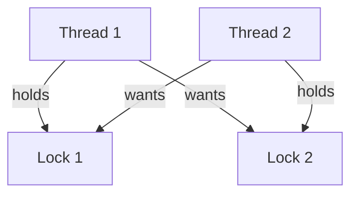

# Java Locks

## Introduction

In multithreaded Java applications, multiple threads often need to access and modify shared resources. Without proper coordination, this can lead to data inconsistency and unpredictable program behavior. Java locks provide mechanisms to control access to these shared resources, ensuring that only one thread can access a particular resource at a time.

Think of locks like the key to a bathroom door—only one person can use the bathroom at a time, and others must wait until it's free. In this article, we'll explore various locking mechanisms in Java, from basic synchronization to more advanced lock implementations in the `java.util.concurrent.locks` package.

## Basic Synchronization: Intrinsic Locks

Before diving into explicit locks, let's understand Java's built-in synchronization mechanism.

### The `synchronized` Keyword

Java provides the `synchronized` keyword that can be applied to methods or blocks of code. When a thread enters a synchronized block, it acquires an intrinsic lock (also called a monitor lock) associated with a specific object.

#### Synchronized Methods

```java
public class Counter {
    private int count = 0;
    
    // The lock is on the instance of Counter
    public synchronized void increment() {
        count++;
    }
    
    // Static synchronized methods lock on the class object
    public static synchronized void staticMethod() {
        // Critical section
    }
    
    public int getCount() {
        return count;
    }
}
```

#### Synchronized Blocks

```java
public class Counter {
    private int count = 0;
    
    public void increment() {
        // Only synchronize the critical section
        synchronized(this) {
            count++;
        }
    }
    
    public int getCount() {
        return count;
    }
}
```

### Example: Thread-Safe Counter

Here's a complete example showing a thread-safe counter using synchronization:

```java
public class ThreadSafeCounter {
    private int count = 0;
    
    public synchronized void increment() {
        count++;
    }
    
    public synchronized int getCount() {
        return count;
    }
    
    public static void main(String[] args) throws InterruptedException {
        ThreadSafeCounter counter = new ThreadSafeCounter();
        
        // Create two threads that increment the counter
        Thread t1 = new Thread(() -> {
            for (int i = 0; i < 1000; i++) {
                counter.increment();
            }
        });
        
        Thread t2 = new Thread(() -> {
            for (int i = 0; i < 1000; i++) {
                counter.increment();
            }
        });
        
        // Start both threads
        t1.start();
        t2.start();
        
        // Wait for both threads to finish
        t1.join();
        t2.join();
        
        System.out.println("Final count: " + counter.getCount());
    }
}
```

**Output:**
```
Final count: 2000
```

Without synchronization, the final count would likely be less than 2000 due to race conditions.

## Explicit Locks: The `java.util.concurrent.locks` Package

While intrinsic locks are simple to use, they have limitations:
- You can't interrupt a thread waiting to acquire a lock
- You can't specify a timeout for lock acquisition
- You must release locks in the exact reverse order of acquisition

To address these limitations, Java introduced explicit lock classes in the `java.util.concurrent.locks` package.

### ReentrantLock

`ReentrantLock` provides the same basic behavior as synchronized blocks but with additional features.

```java
import java.util.concurrent.locks.ReentrantLock;

public class ReentrantLockCounter {
    private final ReentrantLock lock = new ReentrantLock();
    private int count = 0;
    
    public void increment() {
        lock.lock();  // Acquire the lock
        try {
            count++;
        } finally {
            lock.unlock();  // Release the lock in a finally block
        }
    }
    
    public int getCount() {
        lock.lock();
        try {
            return count;
        } finally {
            lock.unlock();
        }
    }
}
```

#### Key Features of ReentrantLock

1. **Lock Acquisition with Timeout**:
```java
if (lock.tryLock(1, TimeUnit.SECONDS)) {
    try {
        // Critical section
    } finally {
        lock.unlock();
    }
} else {
    // Could not acquire lock within 1 second
    System.out.println("Could not get lock, performing alternative action");
}
```

2. **Interruptible Lock Acquisition**:
```java
try {
    lock.lockInterruptibly();
    try {
        // Critical section
    } finally {
        lock.unlock();
    }
} catch (InterruptedException e) {
    // Handle interruption
    System.out.println("Interrupted while waiting for lock");
}
```

3. **Fairness Policy**: You can create a fair lock that grants access to the longest-waiting thread.
```java
// Create a fair lock
ReentrantLock fairLock = new ReentrantLock(true);
```

### Complete Example with ReentrantLock

```java
import java.util.concurrent.locks.ReentrantLock;

public class ReentrantLockExample {
    private final ReentrantLock lock = new ReentrantLock();
    private int count = 0;
    
    public void increment() {
        lock.lock();  // Acquire the lock
        try {
            count++;
        } finally {
            lock.unlock();  // Always release the lock
        }
    }
    
    public int getCount() {
        return count;
    }
    
    public static void main(String[] args) throws InterruptedException {
        ReentrantLockExample counter = new ReentrantLockExample();
        
        Thread t1 = new Thread(() -> {
            for (int i = 0; i < 1000; i++) {
                counter.increment();
            }
        });
        
        Thread t2 = new Thread(() -> {
            for (int i = 0; i < 1000; i++) {
                counter.increment();
            }
        });
        
        t1.start();
        t2.start();
        
        t1.join();
        t2.join();
        
        System.out.println("Final count: " + counter.getCount());
    }
}
```

**Output:**
```
Final count: 2000
```

## ReadWriteLock

`ReadWriteLock` is an interface that maintains a pair of locks: one for read-only operations and one for write operations. Multiple threads can hold the read lock simultaneously as long as no thread holds the write lock.

This is particularly useful for data structures that are read frequently but written to infrequently.

### Example: Cached Data with ReadWriteLock

```java
import java.util.HashMap;
import java.util.Map;
import java.util.concurrent.locks.ReadWriteLock;
import java.util.concurrent.locks.ReentrantReadWriteLock;

public class CachedData {
    private final Map<String, Object> cache = new HashMap<>();
    private final ReadWriteLock rwLock = new ReentrantReadWriteLock();
    
    public Object getData(String key) {
        // First try to read data without locking
        Object value = null;
        
        // Acquire read lock
        rwLock.readLock().lock();
        try {
            value = cache.get(key);
        } finally {
            rwLock.readLock().unlock();
        }
        
        if (value == null) {  // If data not in cache
            // Acquire write lock
            rwLock.writeLock().lock();
            try {
                // Check again in case another thread wrote the value while we were waiting
                value = cache.get(key);
                if (value == null) {
                    value = loadDataFromDatabase(key);  // Expensive operation
                    cache.put(key, value);
                }
            } finally {
                rwLock.writeLock().unlock();
            }
        }
        
        return value;
    }
    
    private Object loadDataFromDatabase(String key) {
        // Simulate database access
        try {
            Thread.sleep(100);  // Simulate slow DB access
        } catch (InterruptedException e) {
            Thread.currentThread().interrupt();
        }
        return "Data for " + key;
    }
    
    public static void main(String[] args) {
        CachedData cache = new CachedData();
        
        // Multiple threads reading the same key
        Runnable readTask = () -> {
            System.out.println(Thread.currentThread().getName() + 
                               " reads: " + cache.getData("user_1"));
        };
        
        // Start 5 threads that read data
        for (int i = 0; i < 5; i++) {
            new Thread(readTask, "Reader-" + i).start();
        }
    }
}
```

**Output:**
```
Reader-0 reads: Data for user_1
Reader-2 reads: Data for user_1
Reader-1 reads: Data for user_1
Reader-3 reads: Data for user_1
Reader-4 reads: Data for user_1
```

Only the first thread that accesses the data will load it from the "database", while others will get the cached value.

## Lock Ordering and Deadlocks

Improper use of locks can lead to deadlocks. A deadlock occurs when two or more threads each hold a lock while waiting for locks held by other threads.



### Example of a Deadlock

```java
public class DeadlockExample {
    private final Object lock1 = new Object();
    private final Object lock2 = new Object();
    
    public void method1() {
        synchronized(lock1) {
            System.out.println("Thread 1: Holding lock1...");
            try { Thread.sleep(100); } catch (InterruptedException e) {}
            System.out.println("Thread 1: Waiting for lock2...");
            
            synchronized(lock2) {
                System.out.println("Thread 1: Holding lock1 & lock2");
            }
        }
    }
    
    public void method2() {
        synchronized(lock2) {  // Lock acquisition order is different!
            System.out.println("Thread 2: Holding lock2...");
            try { Thread.sleep(100); } catch (InterruptedException e) {}
            System.out.println("Thread 2: Waiting for lock1...");
            
            synchronized(lock1) {
                System.out.println("Thread 2: Holding lock1 & lock2");
            }
        }
    }
    
    public static void main(String[] args) {
        DeadlockExample deadlock = new DeadlockExample();
        
        new Thread(() -> {
            deadlock.method1();
        }).start();
        
        new Thread(() -> {
            deadlock.method2();
        }).start();
    }
}
```

**Output:**
```
Thread 1: Holding lock1...
Thread 2: Holding lock2...
Thread 1: Waiting for lock2...
Thread 2: Waiting for lock1...
```

The program will hang at this point because of the deadlock.

### Preventing Deadlocks

1. **Always acquire locks in the same order**:
```java
public void method2Corrected() {
    synchronized(lock1) {  // Same order as method1
        synchronized(lock2) {
            // Critical section
        }
    }
}
```

2. **Use `tryLock()` with timeouts**:
```java
ReentrantLock lock1 = new ReentrantLock();
ReentrantLock lock2 = new ReentrantLock();

public void operation() {
    try {
        if (lock1.tryLock(100, TimeUnit.MILLISECONDS)) {
            try {
                if (lock2.tryLock(100, TimeUnit.MILLISECONDS)) {
                    try {
                        // Critical section
                    } finally {
                        lock2.unlock();
                    }
                }
            } finally {
                lock1.unlock();
            }
        }
    } catch (InterruptedException e) {
        Thread.currentThread().interrupt();
    }
}
```

## StampedLock: Optimistic Reading

Java 8 introduced `StampedLock`, which provides optimistic reading—a feature that allows read operations without acquiring a lock when there are no writers.

```java
import java.util.concurrent.locks.StampedLock;

public class StampedLockExample {
    private double x, y;
    private final StampedLock sl = new StampedLock();
    
    // Write method
    public void move(double deltaX, double deltaY) {
        long stamp = sl.writeLock();  // Get write lock
        try {
            x += deltaX;
            y += deltaY;
        } finally {
            sl.unlockWrite(stamp);  // Release write lock
        }
    }
    
    // Optimistic read method
    public double distanceFromOrigin() {
        // Optimistically read values without locking
        long stamp = sl.tryOptimisticRead();
        double currentX = x;
        double currentY = y;
        
        // Check if a write occurred since obtaining the stamp
        if (!sl.validate(stamp)) {
            // Lock was acquired by a writer, need to get a read lock
            stamp = sl.readLock();
            try {
                currentX = x;
                currentY = y;
            } finally {
                sl.unlockRead(stamp);
            }
        }
        
        return Math.sqrt(currentX * currentX + currentY * currentY);
    }
    
    // Read method with lock
    public double distanceFromOriginWithLock() {
        long stamp = sl.readLock();
        try {
            return Math.sqrt(x * x + y * y);
        } finally {
            sl.unlockRead(stamp);
        }
    }
}
```

## Practical Example: Simple Thread-Safe Database Connection Pool

Here's a real-world example of a connection pool that manages database connections using locks:

```java
import java.sql.Connection;
import java.sql.DriverManager;
import java.sql.SQLException;
import java.util.ArrayList;
import java.util.List;
import java.util.concurrent.locks.Lock;
import java.util.concurrent.locks.ReentrantLock;

public class ConnectionPool {
    private final List<Connection> availableConnections = new ArrayList<>();
    private final List<Connection> usedConnections = new ArrayList<>();
    private final Lock lock = new ReentrantLock();
    
    public ConnectionPool(String url, String user, String password, int initialSize) throws SQLException {
        for (int i = 0; i < initialSize; i++) {
            availableConnections.add(DriverManager.getConnection(url, user, password));
        }
    }
    
    public Connection getConnection() throws SQLException, InterruptedException {
        lock.lock();
        try {
            if (availableConnections.isEmpty()) {
                // If no connections are available, wait for one to be released
                // In a real implementation, you might want to add a timeout
                return null;
            }
            
            // Move a connection from available to used
            Connection connection = availableConnections.remove(availableConnections.size() - 1);
            usedConnections.add(connection);
            return connection;
        } finally {
            lock.unlock();
        }
    }
    
    public boolean releaseConnection(Connection connection) {
        lock.lock();
        try {
            if (usedConnections.remove(connection)) {
                availableConnections.add(connection);
                return true;
            }
            return false;
        } finally {
            lock.unlock();
        }
    }
    
    // Close all connections when shutting down
    public void shutdown() throws SQLException {
        lock.lock();
        try {
            // Close used connections
            for (Connection connection : usedConnections) {
                connection.close();
            }
            // Close available connections
            for (Connection connection : availableConnections) {
                connection.close();
            }
            availableConnections.clear();
            usedConnections.clear();
        } finally {
            lock.unlock();
        }
    }
    
    // Methods to get pool status information
    public int getAvailableConnectionsCount() {
        lock.lock();
        try {
            return availableConnections.size();
        } finally {
            lock.unlock();
        }
    }
    
    public int getUsedConnectionsCount() {
        lock.lock();
        try {
            return usedConnections.size();
        } finally {
            lock.unlock();
        }
    }
}
```

This connection pool is thread-safe thanks to the use of `ReentrantLock`. Multiple threads can request and release connections concurrently without corrupting the internal state of the pool.

## Summary

In this article, we've explored various locking mechanisms in Java:

1. **Intrinsic locks** using the `synchronized` keyword
2. **Explicit locks** from the `java.util.concurrent.locks` package:
   - `ReentrantLock` for basic locking with additional features
   - `ReadWriteLock` for allowing multiple readers or a single writer
   - `StampedLock` for optimistic reading

We also discussed deadlock prevention strategies and provided practical examples, including a thread-safe counter and a database connection pool.

Proper use of locks is essential for developing robust concurrent Java applications, but remember:

- Always release locks in a `finally` block
- Keep critical sections small and efficient
- Be careful about nested locks to avoid deadlocks
- Consider using higher-level concurrency utilities when appropriate

## Exercises

1. **Basic Exercise**: Modify the `ThreadSafeCounter` example to use a `ReentrantLock` instead of synchronized methods.

2. **Intermediate Exercise**: Implement a thread-safe cache with expiration using `ReadWriteLock`. Items should expire after a configurable amount of time.

3. **Advanced Exercise**: Create a resource manager that allows multiple readers or a single writer to access a resource, but also supports upgrading a read lock to a write lock without releasing the read lock.

4. **Debugging Exercise**: Find and fix the deadlock in the following code:
```java
public class DeadlockExercise {
    private final Object resource1 = new Object();
    private final Object resource2 = new Object();
    
    public void method1() {
        synchronized(resource1) {
            System.out.println("method1: holding resource 1");
            try { Thread.sleep(50); } catch (InterruptedException e) {}
            synchronized(resource2) {
                System.out.println("method1: holding resource 1 and resource 2");
            }
        }
    }
    
    public void method2() {
        synchronized(resource2) {
            System.out.println("method2: holding resource 2");
            try { Thread.sleep(50); } catch (InterruptedException e) {}
            synchronized(resource1) {
                System.out.println("method2: holding resource 2 and resource 1");
            }
        }
    }
}
```

## Additional Resources

1. [Java Documentation on Locks](https://docs.oracle.com/javase/8/docs/api/java/util/concurrent/locks/package-summary.html)
2. [Java Concurrency in Practice](https://jcip.net/) by Brian Goetz - The definitive book on Java concurrency
3. [The Java Tutorials: Concurrency](https://docs.oracle.com/javase/tutorial/essential/concurrency/)
4. [Baeldung's Guide to Java Locks](https://www.baeldung.com/java-concurrent-locks)