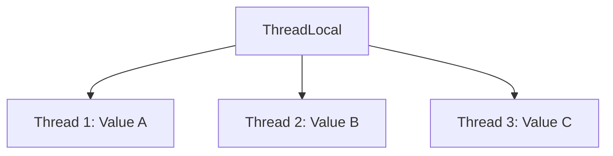

# Java ThreadLocal

## Introduction

In multithreaded applications, sharing data between threads can lead to synchronization issues and race conditions. While Java provides synchronization mechanisms like `synchronized` blocks and `Lock` interfaces, there are scenarios where each thread needs its own isolated copy of a variable. This is where `ThreadLocal` comes into play.

`ThreadLocal` provides thread-local variables that are unique to each thread. Each thread accessing a `ThreadLocal` variable has its own, independently initialized copy of the variable. These variables are stored in the thread itself, making them inherently thread-safe without explicit synchronization.

## Understanding ThreadLocal

### What is ThreadLocal?

`ThreadLocal` is a class in the `java.lang` package that enables you to create variables that can only be read and written by the same thread. If two threads access a `ThreadLocal` variable, each thread sees a different, independent value.

Think of `ThreadLocal` as a special map where:
- The key is the current thread
- The value is the thread-specific data you want to store



### Key Features of ThreadLocal

1. **Thread Isolation**: Each thread has its own copy of the variable
2. **No Synchronization Required**: Access to thread-local variables doesn't need synchronization
3. **Context Retention**: Variables persist for the thread's lifetime (unless explicitly removed)
4. **Clean API**: Simple get/set operations to access thread-specific data

## Basic Usage of ThreadLocal

The most basic operations with `ThreadLocal` are:

- `set(T value)`: Sets the current thread's copy of the variable
- `get()`: Returns the current thread's copy of the variable
- `remove()`: Removes the current thread's value
- `initialValue()`: Provides the initial value for the variable (overridable)

Here's a simple example demonstrating `ThreadLocal` usage:

```java
public class BasicThreadLocalExample {
    // Create a ThreadLocal variable
    private static ThreadLocal<String> threadLocalValue = new ThreadLocal<>();

    public static void main(String[] args) {
        // Create two threads that will access the same ThreadLocal variable
        Thread thread1 = new Thread(() -> {
            threadLocalValue.set("Thread 1's value");
            System.out.println("Thread 1: " + threadLocalValue.get());
        });
        
        Thread thread2 = new Thread(() -> {
            threadLocalValue.set("Thread 2's value");
            System.out.println("Thread 2: " + threadLocalValue.get());
        });
        
        thread1.start();
        thread2.start();
        
        try {
            thread1.join();
            thread2.join();
        } catch (InterruptedException e) {
            e.printStackTrace();
        }
    }
}
```

Output:
```
Thread 1: Thread 1's value
Thread 2: Thread 2's value
```

Notice how each thread gets its own independent copy of the `threadLocalValue`.

## Initial Values in ThreadLocal

You can provide an initial value for a `ThreadLocal` variable in two ways:

### 1. Using the initialValue() Method

```java
public class InitialValueExample {
    // ThreadLocal with overridden initialValue()
    private static ThreadLocal<String> threadLocal = new ThreadLocal<String>() {
        @Override
        protected String initialValue() {
            return "Initial value";
        }
    };
    
    public static void main(String[] args) {
        System.out.println("Initial value: " + threadLocal.get());
        
        threadLocal.set("New value");
        System.out.println("After setting value: " + threadLocal.get());
        
        threadLocal.remove();
        System.out.println("After removing value: " + threadLocal.get());
    }
}
```

Output:
```
Initial value: Initial value
After setting value: New value
After removing value: Initial value
```

### 2. Using withInitial() (Java 8+)

Java 8 introduced a more convenient way to create a `ThreadLocal` with an initial value using a `Supplier`:

```java
public class WithInitialExample {
    // ThreadLocal using withInitial
    private static ThreadLocal<String> threadLocal = 
        ThreadLocal.withInitial(() -> "Initial value from supplier");
    
    public static void main(String[] args) {
        System.out.println("Value from supplier: " + threadLocal.get());
    }
}
```

Output:
```
Value from supplier: Initial value from supplier
```

## Practical Use Cases for ThreadLocal

### 1. Storing User Context in Web Applications

In web applications, you often need to track the current user throughout a request. `ThreadLocal` can store user information for the duration of a request:

```java
public class UserContextHolder {
    private static final ThreadLocal<User> userContext = new ThreadLocal<>();
    
    public static void setUser(User user) {
        userContext.set(user);
    }
    
    public static User getUser() {
        return userContext.get();
    }
    
    public static void clear() {
        userContext.remove();
    }
}

// Usage in a web application filter
public class UserContextFilter implements Filter {
    @Override
    public void doFilter(ServletRequest request, ServletResponse response, FilterChain chain) 
            throws IOException, ServletException {
        try {
            // Extract user from request (e.g., from session)
            User user = extractUserFromRequest(request);
            UserContextHolder.setUser(user);
            
            // Continue with request processing
            chain.doFilter(request, response);
        } finally {
            // Clean up the ThreadLocal to prevent memory leaks
            UserContextHolder.clear();
        }
    }
    
    private User extractUserFromRequest(ServletRequest request) {
        // Implementation details...
        return new User("john_doe", "John Doe");
    }
}
```

### 2. Managing Database Connections

`ThreadLocal` can be used to store database connections for each thread in a connection pool:

```java
public class ThreadLocalConnectionManager {
    private static ThreadLocal<Connection> connectionHolder = ThreadLocal.withInitial(() -> {
        try {
            return DriverManager.getConnection("jdbc:mysql://localhost:3306/mydb", "user", "password");
        } catch (SQLException e) {
            throw new RuntimeException("Failed to create database connection", e);
        }
    });
    
    public static Connection getConnection() {
        return connectionHolder.get();
    }
    
    public static void closeConnection() {
        Connection conn = connectionHolder.get();
        if (conn != null) {
            try {
                conn.close();
            } catch (SQLException e) {
                e.printStackTrace();
            }
        }
        connectionHolder.remove();
    }
}
```

### 3. Simplifying Date Formatting in Multithreaded Environments

`SimpleDateFormat` is not thread-safe. Using `ThreadLocal` allows each thread to have its own formatter instance:

```java
public class SafeDateFormatter {
    private static final ThreadLocal<SimpleDateFormat> dateFormatter = 
        ThreadLocal.withInitial(() -> new SimpleDateFormat("yyyy-MM-dd HH:mm:ss"));
    
    public static String formatDate(Date date) {
        return dateFormatter.get().format(date);
    }
    
    public static Date parseDate(String dateStr) throws ParseException {
        return dateFormatter.get().parse(dateStr);
    }
}

// Usage
public class DateFormatterExample {
    public static void main(String[] args) {
        Runnable task = () -> {
            try {
                String dateStr = "2023-07-15 14:30:00";
                Date date = SafeDateFormatter.parseDate(dateStr);
                System.out.println("Thread " + Thread.currentThread().getName() + 
                                   " parsed date: " + date);
                
                String formatted = SafeDateFormatter.formatDate(new Date());
                System.out.println("Thread " + Thread.currentThread().getName() + 
                                   " formatted current date: " + formatted);
            } catch (ParseException e) {
                e.printStackTrace();
            }
        };
        
        // Run in multiple threads
        for (int i = 0; i < 3; i++) {
            new Thread(task, "Thread-" + i).start();
        }
    }
}
```

## InheritableThreadLocal

Sometimes, you might want child threads to inherit thread-local values from their parent thread. Java provides the `InheritableThreadLocal` class for this purpose:

```java
public class InheritableThreadLocalExample {
    private static ThreadLocal<String> threadLocal = new ThreadLocal<>();
    private static InheritableThreadLocal<String> inheritableThreadLocal = 
        new InheritableThreadLocal<>();
    
    public static void main(String[] args) {
        threadLocal.set("Parent ThreadLocal Value");
        inheritableThreadLocal.set("Parent InheritableThreadLocal Value");
        
        Runnable childTask = () -> {
            System.out.println("Child thread accessing regular ThreadLocal: " + 
                               threadLocal.get());
            System.out.println("Child thread accessing InheritableThreadLocal: " + 
                               inheritableThreadLocal.get());
        };
        
        Thread childThread = new Thread(childTask);
        childThread.start();
        
        try {
            childThread.join();
        } catch (InterruptedException e) {
            e.printStackTrace();
        }
    }
}
```

Output:
```
Child thread accessing regular ThreadLocal: null
Child thread accessing InheritableThreadLocal: Parent InheritableThreadLocal Value
```

## Memory Leaks and ThreadLocal

`ThreadLocal` variables can cause memory leaks if not used properly, especially in application servers and thread pools where threads have a long lifetime:

1. **The Problem**: Thread-local values are stored in the `ThreadLocalMap` of the `Thread` object. If the `ThreadLocal` variable itself becomes unreachable but the thread continues to live, the entry in the map can't be garbage collected.

2. **The Solution**: Always call `remove()` when you're done with a `ThreadLocal` variable, especially in long-lived threads.

```java
public class ThreadLocalMemoryLeakDemo {
    public static void main(String[] args) {
        ExecutorService executor = Executors.newFixedThreadPool(10);
        
        for (int i = 0; i < 100; i++) {
            final int taskId = i;
            executor.submit(() -> {
                try {
                    // Create a large object
                    ThreadLocal<byte[]> threadLocalData = new ThreadLocal<>();
                    threadLocalData.set(new byte[1024 * 1024]); // 1MB of data
                    
                    System.out.println("Task " + taskId + " executed by " + 
                                       Thread.currentThread().getName());
                    
                    // Proper cleanup - removes the reference from the ThreadLocalMap
                    threadLocalData.remove();
                } catch (Exception e) {
                    e.printStackTrace();
                }
            });
        }
        
        executor.shutdown();
        try {
            executor.awaitTermination(1, TimeUnit.MINUTES);
        } catch (InterruptedException e) {
            e.printStackTrace();
        }
    }
}
```

## When to Use ThreadLocal

`ThreadLocal` is most appropriate in situations where:

1. You need per-thread instances of non-thread-safe objects (e.g., `SimpleDateFormat`)
2. You want to store context information (like user authentication) through a request lifecycle
3. You need to avoid passing context objects through many method calls
4. You want thread confinement for data that should not be shared between threads

However, `ThreadLocal` should be avoided when:

1. The data needs to be shared between threads
2. You need thread-safety for data that is genuinely shared
3. You're working with very short-lived threads, where the overhead might not be justified

## Summary

`ThreadLocal` provides a powerful mechanism for maintaining thread-specific data without the complexities of explicit synchronization. Key takeaways include:

- `ThreadLocal` variables provide data isolation between threads
- Each thread has its own copy of the variable
- Thread-local variables are accessed using `get()`, `set()`, and `remove()` methods
- Use `initialValue()` or `withInitial()` for default values
- `InheritableThreadLocal` allows child threads to inherit values from parent threads
- Always clean up `ThreadLocal` variables by calling `remove()` to prevent memory leaks

By understanding when and how to use `ThreadLocal`, you can simplify your multithreaded code and avoid many synchronization issues that would otherwise arise in concurrent applications.

## Additional Resources

- [Java SE Documentation on ThreadLocal](https://docs.oracle.com/en/java/javase/17/docs/api/java.base/java/lang/ThreadLocal.html)
- [Java Concurrency in Practice](http://jcip.net/) by Brian Goetz (a comprehensive resource on Java concurrency)

## Exercises

1. Create a simple web server that uses `ThreadLocal` to track the processing time for each request.
2. Implement a connection pool using `ThreadLocal` that properly cleans up resources.
3. Use `ThreadLocal` to implement a transaction manager that associates transactions with the executing thread.
4. Compare the performance of synchronized access to a shared formatter versus using a `ThreadLocal` formatter in a high-concurrency scenario.
5. Create a custom `ThreadLocal` class that logs when values are set and retrieved to help debug `ThreadLocal` usage in your application.