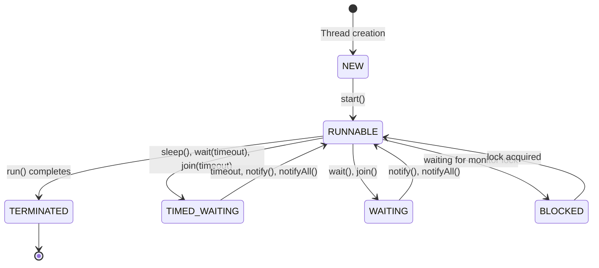

# Java Thread Lifecycle

## Introduction

Understanding how threads work in Java is essential for writing efficient concurrent applications. A Java thread goes through various states during its lifetime, collectively known as the **thread lifecycle**. This knowledge helps you manage threads effectively, prevent deadlocks, and optimize application performance.

In this tutorial, we'll explore the different states a Java thread can be in, how threads transition between these states, and practical examples to illustrate these concepts.

## Thread States in Java

A thread in Java can exist in one of six states, as defined by the `java.lang.Thread.State` enum:



Let's examine each of these states in detail:

### 1. NEW

When a thread is created but not yet started, it's in the **NEW** state. In this state, the thread object exists, but no system resources have been allocated for it yet.

```java
Thread thread = new Thread(() -> {
    System.out.println("Thread is running");
});
// At this point, thread is in the NEW state
System.out.println("Thread state: " + thread.getState()); // Output: NEW
```

### 2. RUNNABLE

After the `start()` method is called on a thread, it moves to the **RUNNABLE** state. This means the thread is now eligible to run, but it may or may not be actually executing at any given moment. This decision is made by the thread scheduler, which is part of the JVM.

```java
Thread thread = new Thread(() -> {
    System.out.println("Thread is running");
});
thread.start();
// At this point, thread is in the RUNNABLE state
System.out.println("Thread state: " + thread.getState()); // Output: RUNNABLE
```

### 3. BLOCKED

A thread enters the **BLOCKED** state when it's waiting to acquire a monitor lock to enter a synchronized block/method.

```java
public class BlockedStateDemo {
    private static final Object lock = new Object();
    
    public static void main(String[] args) throws InterruptedException {
        Thread thread1 = new Thread(() -> {
            synchronized (lock) {
                try {
                    Thread.sleep(5000); // Hold the lock for 5 seconds
                } catch (InterruptedException e) {
                    e.printStackTrace();
                }
            }
        });
        
        Thread thread2 = new Thread(() -> {
            synchronized (lock) {
                System.out.println("Thread 2 acquired the lock");
            }
        });
        
        thread1.start(); // Thread 1 acquires the lock
        Thread.sleep(100); // Give thread1 time to acquire lock
        
        thread2.start(); // Thread 2 attempts to acquire the lock but gets blocked
        Thread.sleep(100); // Give thread2 time to get blocked
        
        System.out.println("Thread 2 state: " + thread2.getState()); // Output: BLOCKED
    }
}
```

### 4. WAITING

A thread enters the **WAITING** state when it's waiting indefinitely for another thread to perform a particular action. Methods that cause a thread to enter this state include:
- `Object.wait()` with no timeout
- `Thread.join()` with no timeout
- `LockSupport.park()`

```java
public class WaitingStateDemo {
    public static void main(String[] args) throws InterruptedException {
        Object lock = new Object();
        
        Thread thread = new Thread(() -> {
            synchronized (lock) {
                try {
                    lock.wait(); // Thread enters WAITING state
                } catch (InterruptedException e) {
                    e.printStackTrace();
                }
            }
        });
        
        thread.start();
        Thread.sleep(1000); // Give thread time to enter WAITING state
        
        System.out.println("Thread state: " + thread.getState()); // Output: WAITING
        
        // Waking up the thread
        synchronized (lock) {
            lock.notify();
        }
    }
}
```

### 5. TIMED_WAITING

A thread enters the **TIMED_WAITING** state when it's waiting for another thread to perform a specific action for a specified period. Methods that cause a thread to enter this state include:
- `Thread.sleep(long millis)`
- `Object.wait(long timeout)`
- `Thread.join(long millis)`
- `LockSupport.parkNanos()`
- `LockSupport.parkUntil()`

```java
public class TimedWaitingStateDemo {
    public static void main(String[] args) throws InterruptedException {
        Thread thread = new Thread(() -> {
            try {
                Thread.sleep(5000); // Thread enters TIMED_WAITING state
            } catch (InterruptedException e) {
                e.printStackTrace();
            }
        });
        
        thread.start();
        Thread.sleep(1000); // Give thread time to enter TIMED_WAITING
        
        System.out.println("Thread state: " + thread.getState()); // Output: TIMED_WAITING
    }
}
```

### 6. TERMINATED

A thread enters the **TERMINATED** state when it has completed execution or has been terminated abnormally (e.g., due to an uncaught exception).

```java
public class TerminatedStateDemo {
    public static void main(String[] args) throws InterruptedException {
        Thread thread = new Thread(() -> {
            System.out.println("Thread is running and will terminate soon");
        });
        
        thread.start();
        Thread.sleep(1000); // Give thread time to complete execution
        
        System.out.println("Thread state: " + thread.getState()); // Output: TERMINATED
    }
}
```

## Thread State Transitions in Practice

Let's create a comprehensive example that demonstrates all thread states and transitions:

```java
public class ThreadLifecycleDemo {
    private static final Object lock = new Object();
    
    public static void main(String[] args) throws InterruptedException {
        Thread thread = new Thread(() -> {
            System.out.println("Thread started and running");
            
            synchronized (lock) {
                try {
                    System.out.println("Thread waiting for notification");
                    lock.wait(2000); // Thread will enter TIMED_WAITING state
                    System.out.println("Thread received notification or timeout");
                } catch (InterruptedException e) {
                    e.printStackTrace();
                }
            }
            
            System.out.println("Thread is terminating");
        });
        
        // NEW state
        System.out.println("1. State: " + thread.getState()); // Output: NEW
        
        thread.start();
        Thread.sleep(100); // Give thread time to start
        
        // RUNNABLE state
        System.out.println("2. State: " + thread.getState()); // Output: RUNNABLE
        
        Thread.sleep(200); // Give thread time to reach wait() call
        
        // TIMED_WAITING state
        System.out.println("3. State: " + thread.getState()); // Output: TIMED_WAITING
        
        synchronized (lock) {
            lock.notify();
        }
        System.out.println("4. Notification sent to thread");
        
        Thread.sleep(100); // Give thread time to process notification
        
        // RUNNABLE state again after notification
        System.out.println("5. State: " + thread.getState()); // Output: RUNNABLE
        
        Thread.sleep(1000); // Give thread time to terminate
        
        // TERMINATED state
        System.out.println("6. State: " + thread.getState()); // Output: TERMINATED
    }
}
```

**Output:**
```
1. State: NEW
2. State: RUNNABLE
Thread started and running
Thread waiting for notification
3. State: TIMED_WAITING
4. Notification sent to thread
Thread received notification or timeout
5. State: RUNNABLE
Thread is terminating
6. State: TERMINATED
```

## Real-World Applications

### 1. Monitoring Thread Health

Understanding thread states helps in building monitoring tools that can detect deadlocks or thread starvation:

```java
public class ThreadMonitor {
    public static void monitorThreads(Thread[] threads) {
        while (true) {
            System.out.println("\n--- Thread Health Report ---");
            for (Thread thread : threads) {
                Thread.State state = thread.getState();
                System.out.println("Thread " + thread.getName() + ": " + state);
                
                // Alert on potential problems
                if (state == Thread.State.BLOCKED) {
                    System.out.println("WARNING: Thread " + thread.getName() + " is BLOCKED!");
                }
            }
            
            try {
                Thread.sleep(5000); // Check every 5 seconds
            } catch (InterruptedException e) {
                break;
            }
        }
    }
    
    public static void main(String[] args) {
        // Create some worker threads
        Thread[] workers = new Thread[3];
        for (int i = 0; i < workers.length; i++) {
            workers[i] = new Thread(() -> {
                while (!Thread.interrupted()) {
                    // Some work
                    try {
                        Thread.sleep(1000);
                    } catch (InterruptedException e) {
                        return;
                    }
                }
            }, "Worker-" + i);
            workers[i].start();
        }
        
        // Create a monitor thread
        Thread monitor = new Thread(() -> monitorThreads(workers));
        monitor.setDaemon(true);
        monitor.start();
        
        // Let the program run for a while
        try {
            Thread.sleep(15000);
        } catch (InterruptedException e) {
            e.printStackTrace();
        }
        
        // Cleanup
        for (Thread worker : workers) {
            worker.interrupt();
        }
    }
}
```

### 2. Thread Pool Implementation

Thread lifecycles are crucial for implementing thread pools, where threads are reused rather than created and destroyed repeatedly:

```java
public class SimpleThreadPool {
    private final BlockingQueue<Runnable> taskQueue;
    private final List<WorkerThread> threads;
    private boolean shutdown;
    
    public SimpleThreadPool(int poolSize) {
        taskQueue = new LinkedBlockingQueue<>();
        threads = new ArrayList<>(poolSize);
        
        // Create and start worker threads
        for (int i = 0; i < poolSize; i++) {
            WorkerThread worker = new WorkerThread("Worker-" + i);
            threads.add(worker);
            worker.start();
        }
    }
    
    public void execute(Runnable task) {
        if (!shutdown) {
            try {
                taskQueue.put(task);
            } catch (InterruptedException e) {
                Thread.currentThread().interrupt();
            }
        } else {
            throw new IllegalStateException("ThreadPool has been shut down");
        }
    }
    
    public void shutdown() {
        shutdown = true;
        for (WorkerThread thread : threads) {
            thread.interrupt();
        }
    }
    
    private class WorkerThread extends Thread {
        public WorkerThread(String name) {
            super(name);
        }
        
        @Override
        public void run() {
            while (!Thread.interrupted()) {
                try {
                    Runnable task = taskQueue.take();
                    task.run();
                } catch (InterruptedException e) {
                    break; // Exit the thread
                }
            }
            System.out.println(getName() + " is terminating");
        }
    }
    
    // Example usage
    public static void main(String[] args) {
        SimpleThreadPool pool = new SimpleThreadPool(3);
        
        // Submit tasks
        for (int i = 0; i < 10; i++) {
            final int taskId = i;
            pool.execute(() -> {
                System.out.println("Executing task " + taskId + " by " + Thread.currentThread().getName());
                try {
                    Thread.sleep(500);
                } catch (InterruptedException e) {
                    Thread.currentThread().interrupt();
                }
            });
        }
        
        // Wait for tasks to complete
        try {
            Thread.sleep(6000);
        } catch (InterruptedException e) {
            e.printStackTrace();
        }
        
        // Shutdown the pool
        pool.shutdown();
    }
}
```

## Summary

Understanding the Java thread lifecycle is fundamental to writing robust multithreaded applications:

1. **NEW** - Thread is created but not started
2. **RUNNABLE** - Thread is started and eligible for execution
3. **BLOCKED** - Thread is waiting to acquire a monitor lock
4. **WAITING** - Thread is waiting indefinitely for another thread's action
5. **TIMED_WAITING** - Thread is waiting for another thread's action for a specified time
6. **TERMINATED** - Thread has completed execution

Key points to remember:
- Thread states are managed by the JVM
- Transitions between states happen based on method calls and thread scheduling
- Understanding thread states helps in debugging concurrency issues
- Proper thread lifecycle management is critical for application stability and performance

## Exercises

1. Create a program that demonstrates a deadlock scenario and use thread state monitoring to identify it.
2. Implement a simple task scheduler that uses thread states to manage task execution.
3. Write a program that simulates a resource pool where threads can go into WAITING state until a resource becomes available.
4. Create a visualization tool that shows the current state of threads in a multi-threaded application.

## Additional Resources

- [Java Thread API Documentation](https://docs.oracle.com/javase/8/docs/api/java/lang/Thread.html)
- [Java Concurrency in Practice](http://jcip.net/) by Brian Goetz
- [Oracle's Java Tutorial on Concurrency](https://docs.oracle.com/javase/tutorial/essential/concurrency/index.html)
- [Java Thread State and Lifecycle Video Tutorial](https://www.youtube.com/watch?v=TCd8QIS-2KI)

By understanding the thread lifecycle, you'll be better equipped to write efficient, bug-free multithreaded applications in Java!