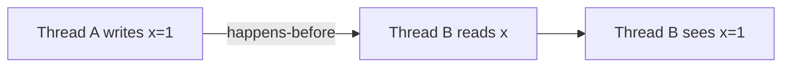

# Java Thread Synchronization

## Introduction

When multiple threads access shared resources concurrently, it can lead to inconsistent results and data corruption known as race conditions. Thread synchronization in Java provides mechanisms to control the execution of multiple threads to ensure they access shared resources in a controlled and predictable manner.

In this tutorial, we'll explore various synchronization techniques in Java, understand the concept of thread safety, and learn how to write concurrent programs that behave correctly even with multiple threads.

## Why Synchronization is Necessary

Let's see what happens without synchronization with a simple example:

```java
public class Counter {
    private int count = 0;
    
    public void increment() {
        count++; // This is not an atomic operation
    }
    
    public int getCount() {
        return count;
    }
    
    public static void main(String[] args) throws InterruptedException {
        Counter counter = new Counter();
        
        // Create two threads that increment the counter
        Thread t1 = new Thread(() -> {
            for (int i = 0; i < 10000; i++) {
                counter.increment();
            }
        });
        
        Thread t2 = new Thread(() -> {
            for (int i = 0; i < 10000; i++) {
                counter.increment();
            }
        });
        
        // Start the threads
        t1.start();
        t2.start();
        
        // Wait for both threads to complete
        t1.join();
        t2.join();
        
        // Print the final count
        System.out.println("Final count: " + counter.getCount());
    }
}
```

**Expected Output:**
```
Final count: 20000
```

**Actual Output (may vary):**
```
Final count: 15783
```

Wait, what happened? We expected the count to be 20,000 (10,000 increments from each thread), but we got a lower number. This is because the `count++` operation is not atomic. It involves:
1. Reading the current value
2. Incrementing it
3. Storing the new value

When two threads perform these steps concurrently, they might interfere with each other, leading to lost updates.

## Synchronization Techniques in Java

### 1. Synchronized Methods

The `synchronized` keyword on a method ensures that only one thread can execute that method on the same object at a time.

```java
public class SynchronizedCounter {
    private int count = 0;
    
    // Synchronized method
    public synchronized void increment() {
        count++;
    }
    
    public synchronized int getCount() {
        return count;
    }
    
    public static void main(String[] args) throws InterruptedException {
        SynchronizedCounter counter = new SynchronizedCounter();
        
        Thread t1 = new Thread(() -> {
            for (int i = 0; i < 10000; i++) {
                counter.increment();
            }
        });
        
        Thread t2 = new Thread(() -> {
            for (int i = 0; i < 10000; i++) {
                counter.increment();
            }
        });
        
        t1.start();
        t2.start();
        
        t1.join();
        t2.join();
        
        System.out.println("Final count: " + counter.getCount());
    }
}
```

**Output:**
```
Final count: 20000
```

Now we get the expected result! The `synchronized` keyword ensures that once a thread enters the `increment()` method, no other thread can enter it until the first thread completes the method.

### 2. Synchronized Blocks

Sometimes synchronizing an entire method might be inefficient. Synchronized blocks allow you to specify exactly what code needs synchronization:

```java
public class SynchronizedBlockExample {
    private int count = 0;
    
    public void increment() {
        // Only synchronize the critical section
        synchronized(this) {
            count++;
        }
        // Other non-critical code can be here
    }
    
    public int getCount() {
        synchronized(this) {
            return count;
        }
    }
}
```

### 3. Using Lock Objects

Java provides more flexible locking mechanisms through the `java.util.concurrent.locks` package:

```java
import java.util.concurrent.locks.Lock;
import java.util.concurrent.locks.ReentrantLock;

public class LockExample {
    private int count = 0;
    private Lock lock = new ReentrantLock();
    
    public void increment() {
        lock.lock();  // Acquire the lock
        try {
            count++;
        } finally {
            lock.unlock();  // Always release the lock in finally block
        }
    }
    
    public int getCount() {
        lock.lock();
        try {
            return count;
        } finally {
            lock.unlock();
        }
    }
    
    public static void main(String[] args) throws InterruptedException {
        LockExample counter = new LockExample();
        
        Thread t1 = new Thread(() -> {
            for (int i = 0; i < 10000; i++) {
                counter.increment();
            }
        });
        
        Thread t2 = new Thread(() -> {
            for (int i = 0; i < 10000; i++) {
                counter.increment();
            }
        });
        
        t1.start();
        t2.start();
        
        t1.join();
        t2.join();
        
        System.out.println("Final count: " + counter.getCount());
    }
}
```

**Output:**
```
Final count: 20000
```

Lock objects offer more flexibility than synchronized blocks:
- They allow trying to acquire a lock without blocking
- They support timed lock acquisition
- They can be more fair (ensuring threads acquire locks in the order they requested them)

## The Synchronized Block Intrinsics

When using the `synchronized` keyword, you need to synchronize on an object. This object is called the **monitor object** or **lock object**:

```java
public void someMethod() {
    // Synchronize on this object
    synchronized(this) {
        // Critical section
    }
    
    // Synchronize on a class
    synchronized(SomeClass.class) {
        // Critical section for class level locks
    }
    
    // Synchronize on a specific object
    Object lockObject = new Object();
    synchronized(lockObject) {
        // Critical section
    }
}
```

## Thread Communication

Sometimes threads need to coordinate with each other. Java provides methods for thread communication:

### The wait(), notify(), and notifyAll() Methods

These methods allow threads to communicate while synchronizing on the same object:

```java
public class ProducerConsumerExample {
    private final LinkedList<Integer> buffer = new LinkedList<>();
    private final int MAX_SIZE = 5;
    
    public void produce() throws InterruptedException {
        int value = 0;
        while (true) {
            synchronized (this) {
                // Wait if buffer is full
                while (buffer.size() == MAX_SIZE) {
                    System.out.println("Buffer full, producer waiting...");
                    wait();
                }
                
                // Add value to buffer
                buffer.add(value);
                System.out.println("Produced: " + value);
                value++;
                
                // Notify consumers
                notify();
                
                Thread.sleep(500); // Slow down for demonstration
            }
        }
    }
    
    public void consume() throws InterruptedException {
        while (true) {
            synchronized (this) {
                // Wait if buffer is empty
                while (buffer.isEmpty()) {
                    System.out.println("Buffer empty, consumer waiting...");
                    wait();
                }
                
                // Remove and print value from buffer
                int value = buffer.removeFirst();
                System.out.println("Consumed: " + value);
                
                // Notify producers
                notify();
                
                Thread.sleep(1000); // Slow down for demonstration
            }
        }
    }
    
    public static void main(String[] args) {
        ProducerConsumerExample example = new ProducerConsumerExample();
        
        Thread producerThread = new Thread(() -> {
            try {
                example.produce();
            } catch (InterruptedException e) {
                Thread.currentThread().interrupt();
            }
        });
        
        Thread consumerThread = new Thread(() -> {
            try {
                example.consume();
            } catch (InterruptedException e) {
                Thread.currentThread().interrupt();
            }
        });
        
        producerThread.start();
        consumerThread.start();
    }
}
```

**Output (partial):**
```
Produced: 0
Produced: 1
Produced: 2
Produced: 3
Produced: 4
Buffer full, producer waiting...
Consumed: 0
Produced: 5
Consumed: 1
Produced: 6
...
```

In this producer-consumer example:
1. The producer adds values to a buffer but waits when the buffer is full
2. The consumer takes values from the buffer but waits when the buffer is empty
3. They use `wait()` to pause execution and `notify()` to signal each other

## The Happens-Before Relationship

The Java Memory Model defines a "happens-before" relationship that ensures memory visibility between threads. When one thread writes to a variable and another reads it, we need to establish a happens-before relationship to ensure the reading thread sees the updated value.



Synchronization mechanisms like `synchronized` and `volatile` establish these relationships.

## Volatile Keyword

The `volatile` keyword provides a lighter-weight synchronization option for single variables:

```java
public class VolatileExample {
    private volatile boolean flag = false;
    
    public void writer() {
        flag = true;  // Write is immediately visible to other threads
    }
    
    public void reader() {
        while (!flag) {
            // Wait until flag becomes true
        }
        System.out.println("Flag is now true!");
    }
    
    public static void main(String[] args) {
        VolatileExample example = new VolatileExample();
        
        Thread writerThread = new Thread(example::writer);
        Thread readerThread = new Thread(example::reader);
        
        readerThread.start();
        
        try {
            Thread.sleep(1000);
        } catch (InterruptedException e) {
            Thread.currentThread().interrupt();
        }
        
        writerThread.start();
    }
}
```

The `volatile` keyword ensures:
1. Changes to the variable are visible to all threads
2. Reads and writes to the variable are atomic
3. Prevents compiler optimizations that could reorder operations

However, `volatile` doesn't provide atomicity for compound operations like `count++`.

## Common Synchronization Patterns

### 1. Thread-Safe Singleton Pattern

```java
public class Singleton {
    // The volatile keyword ensures that multiple threads
    // handle the singleton instance variable correctly
    private static volatile Singleton instance;
    
    private Singleton() {
        // Private constructor
    }
    
    public static Singleton getInstance() {
        if (instance == null) {
            synchronized (Singleton.class) {
                if (instance == null) {
                    instance = new Singleton();
                }
            }
        }
        return instance;
    }
}
```

This is known as double-checked locking and is a thread-safe way to implement lazy initialization of a singleton.

### 2. Immutable Objects

Immutable objects are inherently thread-safe:

```java
public final class ImmutableRGB {
    private final int red;
    private final int green;
    private final int blue;
    
    public ImmutableRGB(int red, int green, int blue) {
        this.red = red;
        this.green = green;
        this.blue = blue;
    }
    
    public int getRed() {
        return red;
    }
    
    public int getGreen() {
        return green;
    }
    
    public int getBlue() {
        return blue;
    }
    
    public ImmutableRGB changeRed(int newRed) {
        // Return a new object, don't modify existing one
        return new ImmutableRGB(newRed, green, blue);
    }
}
```

## Real-World Application: Bank Account Transfers

Here's a practical example of thread synchronization for a banking application:

```java
public class BankAccount {
    private String accountNumber;
    private double balance;
    
    public BankAccount(String accountNumber, double initialBalance) {
        this.accountNumber = accountNumber;
        this.balance = initialBalance;
    }
    
    public synchronized void deposit(double amount) {
        if (amount > 0) {
            balance += amount;
            System.out.println("Deposited " + amount + " to account " + accountNumber);
            System.out.println("New balance: " + balance);
        }
    }
    
    public synchronized boolean withdraw(double amount) {
        if (amount > 0 && balance >= amount) {
            balance -= amount;
            System.out.println("Withdrew " + amount + " from account " + accountNumber);
            System.out.println("New balance: " + balance);
            return true;
        }
        return false;
    }
    
    public synchronized double getBalance() {
        return balance;
    }
    
    // Static method to transfer money between accounts
    public static void transfer(BankAccount from, BankAccount to, double amount) {
        // Acquire locks in a specific order to prevent deadlocks
        BankAccount first = from.accountNumber.compareTo(to.accountNumber) < 0 ? from : to;
        BankAccount second = first == from ? to : from;
        
        synchronized (first) {
            synchronized (second) {
                if (from.withdraw(amount)) {
                    to.deposit(amount);
                    System.out.println("Transferred " + amount + " from " + from.accountNumber + " to " + to.accountNumber);
                } else {
                    System.out.println("Transfer failed due to insufficient funds");
                }
            }
        }
    }
    
    public static void main(String[] args) {
        BankAccount account1 = new BankAccount("AC001", 1000);
        BankAccount account2 = new BankAccount("AC002", 500);
        
        // Create threads that transfer money concurrently
        Thread t1 = new Thread(() -> {
            for (int i = 0; i < 5; i++) {
                transfer(account1, account2, 100);
                try {
                    Thread.sleep(100);
                } catch (InterruptedException e) {
                    Thread.currentThread().interrupt();
                }
            }
        });
        
        Thread t2 = new Thread(() -> {
            for (int i = 0; i < 3; i++) {
                transfer(account2, account1, 50);
                try {
                    Thread.sleep(200);
                } catch (InterruptedException e) {
                    Thread.currentThread().interrupt();
                }
            }
        });
        
        t1.start();
        t2.start();
        
        try {
            t1.join();
            t2.join();
        } catch (InterruptedException e) {
            Thread.currentThread().interrupt();
        }
        
        System.out.println("Final balance account1: " + account1.getBalance());
        System.out.println("Final balance account2: " + account2.getBalance());
    }
}
```

**Key points about the bank transfer example:**
1. Methods are synchronized to prevent concurrent access to account balances
2. The transfer method acquires locks in a consistent order to prevent deadlocks
3. The final balances remain consistent despite concurrent operations

## Best Practices for Thread Synchronization

1. **Minimize Synchronization Scope**: Synchronize only what needs to be synchronized
2. **Avoid Nested Synchronization**: It can lead to deadlocks
3. **Prefer Higher-Level Concurrency Utilities**: Use `java.util.concurrent` classes when possible
4. **Be Careful with Double-Checked Locking**: Use volatile for the reference if implementing it
5. **Use Immutable Objects**: They're inherently thread-safe
6. **Be Aware of Deadlocks**: Always acquire locks in a consistent order
7. **Guard Against Exceptions**: Always release locks in finally blocks when using explicit Lock objects

## Common Synchronization Issues

### 1. Deadlocks

A deadlock occurs when two or more threads are blocked forever, each waiting for the other to release resources.

```java
public class DeadlockExample {
    private final Object lock1 = new Object();
    private final Object lock2 = new Object();
    
    public void method1() {
        synchronized(lock1) {
            System.out.println("Thread 1: Holding lock1...");
            try { Thread.sleep(100); } catch (InterruptedException e) {}
            System.out.println("Thread 1: Waiting for lock2...");
            
            synchronized(lock2) {
                System.out.println("Thread 1: Holding lock1 & lock2");
            }
        }
    }
    
    public void method2() {
        synchronized(lock2) {
            System.out.println("Thread 2: Holding lock2...");
            try { Thread.sleep(100); } catch (InterruptedException e) {}
            System.out.println("Thread 2: Waiting for lock1...");
            
            synchronized(lock1) {
                System.out.println("Thread 2: Holding lock1 & lock2");
            }
        }
    }
    
    public static void main(String[] args) {
        DeadlockExample example = new DeadlockExample();
        
        Thread t1 = new Thread(example::method1);
        Thread t2 = new Thread(example::method2);
        
        t1.start();
        t2.start();
    }
}
```

To prevent deadlocks, always acquire locks in a consistent order.

### 2. Livelocks

A livelock is similar to a deadlock, but the threads are not blocked - they're just too busy responding to each other to make progress.

### 3. Starvation

Starvation occurs when a thread is unable to gain regular access to shared resources and is unable to make progress.

## Summary

Thread synchronization is essential for writing correct concurrent programs in Java. In this tutorial, we covered:

1. **Why synchronization is needed**: To prevent race conditions and ensure thread safety
2. **Synchronization techniques**:
   - Synchronized methods and blocks
   - Lock objects
   - Volatile variables
3. **Thread communication**: Using wait(), notify(), and notifyAll()
4. **Common patterns and issues**:
   - Thread-safe singleton
   - Immutable objects
   - Deadlocks, livelocks, and starvation

By applying these synchronization techniques, you can write concurrent programs that are both efficient and correct.

## Exercises

1. Create a thread-safe counter that uses the AtomicInteger class from the java.util.concurrent.atomic package.
2. Modify the producer-consumer example to use the BlockingQueue interface from the java.util.concurrent package.
3. Write a program that simulates a dining philosophers problem and implement a solution that avoids deadlock.
4. Create a thread-safe cache with a time-to-live feature for entries.
5. Write a program that demonstrates read-write locks using ReentrantReadWriteLock.

## Additional Resources

1. [Java Concurrency in Practice](https://jcip.net/) by Brian Goetz - The definitive book on Java concurrency
2. [Oracle's Java Tutorial on Concurrency](https://docs.oracle.com/javase/tutorial/essential/concurrency/)
3. [Java Memory Model Specification](https://docs.oracle.com/javase/specs/jls/se8/html/jls-17.html#jls-17.4)
4. [java.util.concurrent Package Documentation](https://docs.oracle.com/javase/8/docs/api/java/util/concurrent/package-summary.html)
5. [The "Double-Checked Locking is Broken" Declaration](https://www.cs.umd.edu/~pugh/java/memoryModel/DoubleCheckedLocking.html)