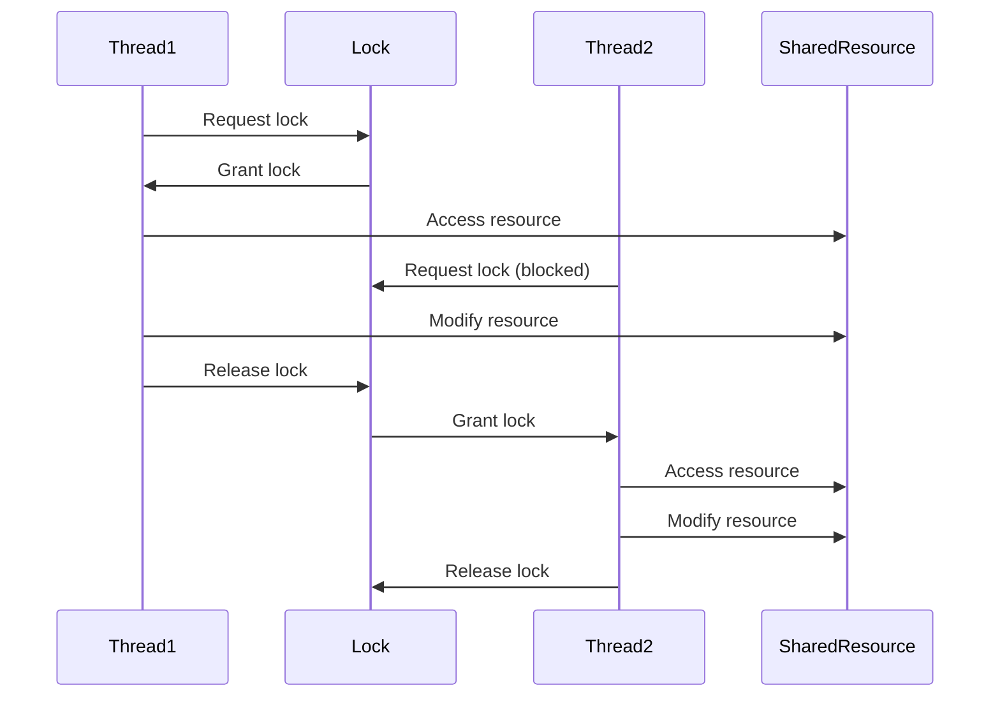

# Java Synchronized Blocks

## Introduction

In multithreaded programming, one of the biggest challenges is managing access to shared resources. When multiple threads attempt to access and modify the same data simultaneously, it can lead to inconsistent results, known as race conditions. Java provides a mechanism called **synchronized blocks** to address this issue.

Synchronized blocks allow you to protect critical sections of your code by ensuring that only one thread can execute the protected code at any given time. This creates thread-safe code blocks that maintain data consistency in concurrent environments.

## Understanding Thread Interference

Before diving into synchronized blocks, let's understand why they're needed:

```java
public class Counter {
    private int count = 0;
    
    public void increment() {
        count++; // This is not an atomic operation!
    }
    
    public int getCount() {
        return count;
    }
}
```

If multiple threads call the `increment()` method concurrently, you might expect the final count to be equal to the number of incrementations performed. However, this isn't guaranteed because the `count++` operation isn't atomic—it consists of multiple steps:

1. Read the current value of count
2. Add 1 to it
3. Write the result back to count

If two threads execute this method simultaneously, they might both read the same value, increment it, and write back the same result, effectively losing one increment.

## Synchronized Blocks Syntax

A synchronized block is declared using the `synchronized` keyword followed by an object reference in parentheses:

```java
synchronized (objectReference) {
    // Critical section of code
    // Only one thread can execute this at a time
}
```

The object reference acts as a "monitor" or "lock." When a thread enters the synchronized block, it acquires the lock on the specified object. Other threads trying to enter any synchronized block that uses the same lock will be blocked until the lock is released.

## Using Synchronized Blocks

Let's make our Counter class thread-safe using a synchronized block:

```java
public class SafeCounter {
    private int count = 0;
    private final Object lock = new Object(); // dedicated lock object
    
    public void increment() {
        synchronized (lock) {
            count++;
        }
    }
    
    public int getCount() {
        synchronized (lock) {
            return count;
        }
    }
}
```

Now, only one thread can increment or get the count at a time, preventing race conditions.

## Example: Synchronized Block in Action

Here's a complete example demonstrating how synchronized blocks prevent race conditions:

```java
public class SynchronizedBlockDemo {
    private int counter = 0;
    private final Object lock = new Object();

    public void increment() {
        synchronized (lock) {
            counter++;
        }
    }

    public int getCounter() {
        synchronized (lock) {
            return counter;
        }
    }

    public static void main(String[] args) throws InterruptedException {
        SynchronizedBlockDemo demo = new SynchronizedBlockDemo();
        
        // Create two threads that both increment the counter 10000 times
        Thread thread1 = new Thread(() -> {
            for (int i = 0; i < 10000; i++) {
                demo.increment();
            }
        });
        
        Thread thread2 = new Thread(() -> {
            for (int i = 0; i < 10000; i++) {
                demo.increment();
            }
        });
        
        thread1.start();
        thread2.start();
        
        // Wait for both threads to finish
        thread1.join();
        thread2.join();
        
        System.out.println("Final counter value: " + demo.getCounter());
    }
}
```

**Output:**
```
Final counter value: 20000
```

Without synchronization, the final value would likely be less than 20000 due to race conditions.

## The "this" Reference as a Lock

You can use the `this` reference as a lock, which synchronizes on the current object:

```java
public class ThisLockDemo {
    private int count = 0;
    
    public void increment() {
        synchronized (this) {
            count++;
        }
    }
}
```

While this works, it's often better to use a dedicated lock object as it provides better encapsulation and avoids potential deadlocks.

## Synchronized Methods vs. Synchronized Blocks

Java also allows you to declare entire methods as synchronized:

```java
public synchronized void increment() {
    count++;
}
```

This is equivalent to:

```java
public void increment() {
    synchronized (this) {
        count++;
    }
}
```

Synchronized blocks provide more granular control than synchronized methods because:

1. You can specify which object to use as a lock
2. You can synchronize only the critical parts of a method, not the entire method
3. They can help improve performance by minimizing the synchronized code section

## Class-Level Synchronization

If you need to synchronize static methods or static data, you can use the class object as the lock:

```java
public class ClassLevelSynchronization {
    private static int counter = 0;
    
    public static void increment() {
        synchronized (ClassLevelSynchronization.class) {
            counter++;
        }
    }
}
```

This ensures that only one thread can access the static counter variable at a time, regardless of how many instances of the class exist.

## Real-World Example: Thread-Safe Singleton

A classic application of synchronized blocks is implementing a thread-safe singleton pattern:

```java
public class ThreadSafeSingleton {
    private static ThreadSafeSingleton instance;
    
    // Private constructor prevents instantiation from other classes
    private ThreadSafeSingleton() {}
    
    public static ThreadSafeSingleton getInstance() {
        if (instance == null) {
            synchronized (ThreadSafeSingleton.class) {
                // Double-check locking pattern
                if (instance == null) {
                    instance = new ThreadSafeSingleton();
                }
            }
        }
        return instance;
    }
}
```

This implementation uses the "double-checked locking" pattern to reduce the overhead of synchronization while ensuring thread safety.

## Visualizing Synchronized Blocks

Here's a diagram showing how synchronized blocks control thread access:



## Common Pitfalls

### 1. Using Different Locks

If you use different objects as locks for the same shared resource, you won't prevent concurrent access:

```java
public class InconsistentLockingDemo {
    private int count = 0;
    
    public void increment() {
        synchronized (new Object()) { // Don't do this! New lock each time
            count++;
        }
    }
}
```

### 2. Lock Contention

Excessive synchronization can lead to "lock contention" where threads spend significant time waiting for locks:

```java
public class ContendedLock {
    private final Object lock = new Object();
    
    public void methodA() {
        synchronized (lock) {
            // Long operation that doesn't need exclusive access for its entirety
            performLengthyOperation();
        }
    }
}
```

Better approach:

```java
public class ImprovedLocking {
    private final Object lock = new Object();
    
    public void methodA() {
        // Do non-critical work outside synchronized block
        prepareData();
        
        synchronized (lock) {
            // Only synchronize the critical section
            updateSharedResource();
        }
        
        // Continue with non-critical work
        processResults();
    }
}
```

### 3. Deadlocks

Synchronized blocks can lead to deadlocks if not used carefully, particularly when acquiring multiple locks:

```java
public class DeadlockRisk {
    private final Object lock1 = new Object();
    private final Object lock2 = new Object();
    
    public void methodA() {
        synchronized (lock1) {
            synchronized (lock2) {
                // Do something
            }
        }
    }
    
    public void methodB() {
        synchronized (lock2) {
            synchronized (lock1) {
                // Do something else
            }
        }
    }
}
```

If one thread calls `methodA` while another calls `methodB`, they might deadlock. To prevent this, always acquire locks in the same order.

## Performance Considerations

Synchronized blocks introduce overhead, so consider these tips:

1. Keep synchronized blocks as short as possible
2. Don't perform I/O operations within synchronized blocks
3. Consider using concurrent collections from `java.util.concurrent` where appropriate
4. For read-heavy scenarios, consider using `ReadWriteLock` instead

## Summary

Synchronized blocks are essential tools for writing thread-safe Java applications:

- They protect critical sections of code by ensuring only one thread executes them at a time
- They help prevent race conditions and maintain data consistency
- They're more flexible than synchronized methods, allowing for finer-grained locking strategies
- The object used for synchronization acts as a lock that threads must acquire before executing the block
- They're key to implementing thread-safe patterns like Singleton

As you advance in multithreading programming, you'll find synchronized blocks form the foundation for more complex concurrency patterns and utilities in Java.

## Additional Resources

- [Oracle's Tutorial on Synchronized Methods](https://docs.oracle.com/javase/tutorial/essential/concurrency/syncmeth.html)
- [Java Concurrency in Practice](https://jcip.net/) by Brian Goetz
- [Java™ Threads by Scott Oaks and Henry Wong](https://www.oreilly.com/library/view/javatm-threads-third/0596007825/)

## Exercises

1. Implement a thread-safe counter that includes methods to increment, decrement, and get the current count.
2. Create a thread-safe bounded buffer (producer-consumer pattern) using synchronized blocks.
3. Implement a simple bank account class with deposit and withdraw methods that prevents overdrafts.
4. Modify the singleton pattern from this tutorial to use an enum instead (which is inherently thread-safe).
5. Create a thread-safe caching mechanism that permits concurrent reads but exclusive writes.