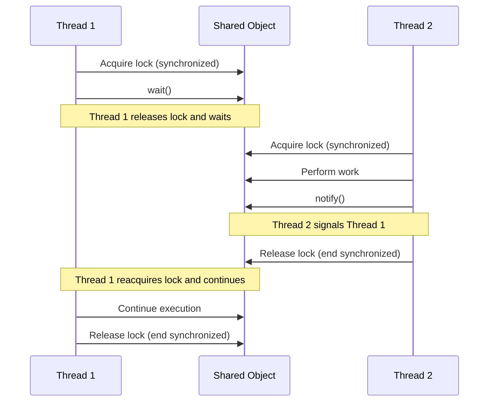

# Java Inter-thread Communication

In multi-threaded applications, threads often need to coordinate their activities or share information. This coordination, known as **inter-thread communication**, is essential for building efficient concurrent programs. In this tutorial, we'll explore how threads can communicate with each other in Java.

## Why is Inter-thread Communication Needed?

When working with multiple threads, scenarios like the following are common:

- One thread needs to signal another that a particular task is complete
- Multiple threads need to coordinate access to shared resources
- One thread might need to wait for another thread to reach a certain state

Java provides several mechanisms to enable such communication, ensuring threads work together harmoniously.

## The Core Methods for Inter-thread Communication

Java's `Object` class provides three fundamental methods for inter-thread communication:

1. `wait()` - Causes the current thread to wait until another thread calls `notify()` or `notifyAll()`
2. `notify()` - Wakes up a single thread waiting on this object
3. `notifyAll()` - Wakes up all threads waiting on this object

These methods must be called from within a synchronized context (block or method).

## Understanding wait(), notify(), and notifyAll()

Let's examine how these methods work together:



### Important Rules to Remember

- These methods must be called from within a synchronized context
- `wait()` causes the current thread to release the lock and wait
- `notify()`/`notifyAll()` do not release the lock; the synchronized block must finish first
- After being notified, a thread must reacquire the lock before continuing

## Basic Example: Wait and Notify

Here's a simple example demonstrating wait and notify:

```java
public class Message {
    private String message;
    private boolean empty = true;
    
    public synchronized String read() {
        while (empty) {
            try {
                wait(); // Wait until there's a message to read
            } catch (InterruptedException e) {
                Thread.currentThread().interrupt();
            }
        }
        empty = true;
        notifyAll(); // Notify that the message has been read
        return message;
    }
    
    public synchronized void write(String message) {
        while (!empty) {
            try {
                wait(); // Wait until the previous message is read
            } catch (InterruptedException e) {
                Thread.currentThread().interrupt();
            }
        }
        empty = false;
        this.message = message;
        notifyAll(); // Notify that a message is available
    }
}

public class Writer implements Runnable {
    private Message message;
    
    public Writer(Message message) {
        this.message = message;
    }
    
    public void run() {
        String[] messages = {
            "Hello",
            "How are you?",
            "I'm doing great",
            "Goodbye"
        };
        
        for (String msg : messages) {
            message.write(msg);
            System.out.println("Written: " + msg);
            
            try {
                Thread.sleep(1000);
            } catch (InterruptedException e) {
                Thread.currentThread().interrupt();
            }
        }
    }
}

public class Reader implements Runnable {
    private Message message;
    
    public Reader(Message message) {
        this.message = message;
    }
    
    public void run() {
        for (String msg = message.read(); !msg.equals("Goodbye"); msg = message.read()) {
            System.out.println("Read: " + msg);
            
            try {
                Thread.sleep(1500);
            } catch (InterruptedException e) {
                Thread.currentThread().interrupt();
            }
        }
        System.out.println("Read: Goodbye");
    }
}

public class WaitNotifyDemo {
    public static void main(String[] args) {
        Message message = new Message();
        
        Thread writerThread = new Thread(new Writer(message));
        Thread readerThread = new Thread(new Reader(message));
        
        writerThread.start();
        readerThread.start();
    }
}
```

### Output:

```
Written: Hello
Read: Hello
Written: How are you?
Read: How are you?
Written: I'm doing great
Read: I'm doing great
Written: Goodbye
Read: Goodbye
```

In this example:
1. We have a `Message` class that represents a shared resource
2. The `Writer` thread writes messages
3. The `Reader` thread reads those messages
4. They coordinate using `wait()` and `notifyAll()`

## The Producer-Consumer Pattern

One of the most common applications of inter-thread communication is the Producer-Consumer pattern. This pattern involves:

- **Producer threads** that create data and add it to a shared buffer
- **Consumer threads** that take data from the buffer and process it

Here's an example implementation:

```java
import java.util.LinkedList;
import java.util.Queue;

public class ProducerConsumerExample {
    public static void main(String[] args) {
        Buffer buffer = new Buffer(5); // Shared buffer with capacity 5
        
        // Create and start producer and consumer threads
        Thread producerThread = new Thread(new Producer(buffer));
        Thread consumerThread = new Thread(new Consumer(buffer));
        
        producerThread.start();
        consumerThread.start();
    }
}

// Shared buffer between producer and consumer
class Buffer {
    private Queue<Integer> queue;
    private int capacity;
    
    public Buffer(int capacity) {
        this.capacity = capacity;
        this.queue = new LinkedList<>();
    }
    
    public synchronized void produce(int item) throws InterruptedException {
        // Wait if buffer is full
        while (queue.size() == capacity) {
            System.out.println("Buffer is full. Producer is waiting...");
            wait();
        }
        
        // Add item to buffer
        queue.add(item);
        System.out.println("Produced: " + item + ", Buffer size: " + queue.size());
        
        // Notify consumer that an item is available
        notify();
    }
    
    public synchronized int consume() throws InterruptedException {
        // Wait if buffer is empty
        while (queue.isEmpty()) {
            System.out.println("Buffer is empty. Consumer is waiting...");
            wait();
        }
        
        // Remove and return the first item
        int item = queue.remove();
        System.out.println("Consumed: " + item + ", Buffer size: " + queue.size());
        
        // Notify producer that space is available
        notify();
        
        return item;
    }
}

// Producer thread that adds items to the buffer
class Producer implements Runnable {
    private Buffer buffer;
    
    public Producer(Buffer buffer) {
        this.buffer = buffer;
    }
    
    @Override
    public void run() {
        try {
            for (int i = 1; i <= 10; i++) {
                buffer.produce(i);
                Thread.sleep(500); // Simulate time to produce
            }
        } catch (InterruptedException e) {
            Thread.currentThread().interrupt();
        }
    }
}

// Consumer thread that removes items from the buffer
class Consumer implements Runnable {
    private Buffer buffer;
    
    public Consumer(Buffer buffer) {
        this.buffer = buffer;
    }
    
    @Override
    public void run() {
        try {
            for (int i = 1; i <= 10; i++) {
                buffer.consume();
                Thread.sleep(1000); // Simulate time to consume
            }
        } catch (InterruptedException e) {
            Thread.currentThread().interrupt();
        }
    }
}
```

### Output (will vary due to thread scheduling):

```
Produced: 1, Buffer size: 1
Produced: 2, Buffer size: 2
Consumed: 1, Buffer size: 1
Produced: 3, Buffer size: 2
Consumed: 2, Buffer size: 1
Produced: 4, Buffer size: 2
Consumed: 3, Buffer size: 1
Produced: 5, Buffer size: 2
Consumed: 4, Buffer size: 1
Produced: 6, Buffer size: 2
Consumed: 5, Buffer size: 1
Produced: 7, Buffer size: 2
Consumed: 6, Buffer size: 1
Produced: 8, Buffer size: 2
Consumed: 7, Buffer size: 1
Produced: 9, Buffer size: 2
Consumed: 8, Buffer size: 1
Produced: 10, Buffer size: 2
Consumed: 9, Buffer size: 1
Consumed: 10, Buffer size: 0
```

In this implementation:
1. The `Buffer` class represents a shared, bounded buffer
2. The `Producer` adds items to the buffer
3. The `Consumer` removes items from the buffer
4. When the buffer is full, the producer waits
5. When the buffer is empty, the consumer waits
6. They signal each other when the state changes

## Modern Approaches to Inter-thread Communication

While the wait/notify mechanism is fundamental, Java offers more modern approaches for inter-thread communication:

### 1. Using BlockingQueue

Java's `java.util.concurrent` package provides thread-safe collections like `BlockingQueue` that handle the synchronization for you:

```java
import java.util.concurrent.ArrayBlockingQueue;
import java.util.concurrent.BlockingQueue;

public class BlockingQueueExample {
    public static void main(String[] args) {
        // Create a blocking queue with capacity 5
        BlockingQueue<Integer> queue = new ArrayBlockingQueue<>(5);
        
        // Producer thread
        Thread producer = new Thread(() -> {
            try {
                for (int i = 1; i <= 10; i++) {
                    System.out.println("Producing: " + i);
                    queue.put(i); // Automatically blocks if queue is full
                    Thread.sleep(500);
                }
            } catch (InterruptedException e) {
                Thread.currentThread().interrupt();
            }
        });
        
        // Consumer thread
        Thread consumer = new Thread(() -> {
            try {
                for (int i = 1; i <= 10; i++) {
                    Integer value = queue.take(); // Automatically blocks if queue is empty
                    System.out.println("Consumed: " + value);
                    Thread.sleep(1000);
                }
            } catch (InterruptedException e) {
                Thread.currentThread().interrupt();
            }
        });
        
        producer.start();
        consumer.start();
    }
}
```

### 2. Using Semaphores

Semaphores can be used to control access to shared resources:

```java
import java.util.concurrent.Semaphore;

public class SemaphoreExample {
    public static void main(String[] args) {
        SharedResource resource = new SharedResource();
        
        Thread thread1 = new Thread(() -> {
            try {
                for (int i = 1; i <= 5; i++) {
                    resource.produce(i);
                }
            } catch (InterruptedException e) {
                Thread.currentThread().interrupt();
            }
        });
        
        Thread thread2 = new Thread(() -> {
            try {
                for (int i = 1; i <= 5; i++) {
                    resource.consume();
                }
            } catch (InterruptedException e) {
                Thread.currentThread().interrupt();
            }
        });
        
        thread1.start();
        thread2.start();
    }
}

class SharedResource {
    private int sharedValue;
    private Semaphore producerSemaphore = new Semaphore(1);
    private Semaphore consumerSemaphore = new Semaphore(0);
    
    public void produce(int value) throws InterruptedException {
        producerSemaphore.acquire();
        this.sharedValue = value;
        System.out.println("Produced: " + value);
        consumerSemaphore.release();
    }
    
    public void consume() throws InterruptedException {
        consumerSemaphore.acquire();
        System.out.println("Consumed: " + sharedValue);
        producerSemaphore.release();
    }
}
```

### 3. Using CountDownLatch

`CountDownLatch` can be used for one-time synchronization between threads:

```java
import java.util.concurrent.CountDownLatch;

public class CountDownLatchExample {
    public static void main(String[] args) throws InterruptedException {
        // Create a latch with count 3
        CountDownLatch latch = new CountDownLatch(3);
        
        // Start worker threads
        for (int i = 1; i <= 3; i++) {
            final int workerId = i;
            new Thread(() -> {
                try {
                    System.out.println("Worker " + workerId + " starting task");
                    Thread.sleep(1000 * workerId);
                    System.out.println("Worker " + workerId + " finished task");
                    latch.countDown(); // Signal that this worker is done
                } catch (InterruptedException e) {
                    Thread.currentThread().interrupt();
                }
            }).start();
        }
        
        // Main thread waits for all workers to finish
        System.out.println("Main thread waiting for workers...");
        latch.await();
        System.out.println("All workers have finished, main thread continues");
    }
}
```

## Common Pitfalls and Best Practices

When working with inter-thread communication, be aware of these potential issues:

### 1. Deadlocks

Deadlocks occur when two or more threads are waiting for each other to release locks.

```java
// Potential deadlock situation
public void method1() {
    synchronized(lockA) {
        synchronized(lockB) {
            // Code here
        }
    }
}

public void method2() {
    synchronized(lockB) {  // Different order of lock acquisition
        synchronized(lockA) {
            // Code here
        }
    }
}
```

**Best Practice**: Always acquire locks in the same order across all threads.

### 2. Spurious Wakeups

A thread can wake up from `wait()` without being notified.

```java
// Incorrect
synchronized(obj) {
    if (condition) {
        obj.wait();
    }
    // Process data
}

// Correct
synchronized(obj) {
    while (condition) {  // Always use a loop
        obj.wait();
    }
    // Process data
}
```

**Best Practice**: Always use `wait()` in a loop that checks the condition.

### 3. Lost Notifications

If `notify()` is called before `wait()`, the notification is lost.

**Best Practice**: Use appropriate state variables to track conditions, and use `notifyAll()` when in doubt.

## Practical Application: A Simple Task Scheduler

Here's a real-world application - a simple task scheduler that uses inter-thread communication:

```java
import java.util.LinkedList;
import java.util.Queue;
import java.util.concurrent.TimeUnit;

public class TaskSchedulerDemo {
    public static void main(String[] args) {
        TaskScheduler scheduler = new TaskScheduler();
        
        // Start the scheduler
        Thread schedulerThread = new Thread(scheduler);
        schedulerThread.start();
        
        // Submit some tasks
        for (int i = 1; i <= 5; i++) {
            final int taskId = i;
            scheduler.scheduleTask(() -> System.out.println("Executing Task " + taskId));
            try {
                Thread.sleep(1000);
            } catch (InterruptedException e) {
                Thread.currentThread().interrupt();
            }
        }
        
        // Let the tasks run for a while, then shutdown
        try {
            Thread.sleep(10000);
            scheduler.shutdown();
        } catch (InterruptedException e) {
            Thread.currentThread().interrupt();
        }
    }
}

class TaskScheduler implements Runnable {
    private final Queue<Runnable> taskQueue = new LinkedList<>();
    private boolean running = true;
    
    // Schedule a task
    public synchronized void scheduleTask(Runnable task) {
        taskQueue.add(task);
        System.out.println("Task scheduled, queue size: " + taskQueue.size());
        notify(); // Signal that a new task is available
    }
    
    // Shutdown the scheduler
    public synchronized void shutdown() {
        running = false;
        notify(); // Wake up the scheduler thread if it's waiting
        System.out.println("Scheduler shutdown initiated");
    }
    
    @Override
    public void run() {
        while (running) {
            Runnable task = null;
            
            // Get a task from the queue
            synchronized (this) {
                while (running && taskQueue.isEmpty()) {
                    try {
                        System.out.println("Scheduler waiting for tasks...");
                        wait();
                    } catch (InterruptedException e) {
                        Thread.currentThread().interrupt();
                        return;
                    }
                }
                
                if (!running) {
                    break;
                }
                
                task = taskQueue.poll();
            }
            
            // Execute the task outside the synchronized block
            try {
                System.out.println("Scheduler executing task");
                task.run();
                // Simulate some processing time
                TimeUnit.MILLISECONDS.sleep(2000);
            } catch (InterruptedException e) {
                Thread.currentThread().interrupt();
                return;
            }
        }
        
        System.out.println("Scheduler stopped");
    }
}
```

This scheduler demonstrates:
1. A worker thread that waits for tasks
2. Other threads that submit tasks to the queue
3. Synchronized methods to coordinate access to the task queue
4. Using `wait()` and `notify()` for signaling between threads

## Summary

Inter-thread communication is a fundamental aspect of Java multithreading that allows threads to coordinate their activities. In this tutorial, we've covered:

- The basic `wait()`, `notify()`, and `notifyAll()` methods for thread communication
- How to implement the Producer-Consumer pattern
- Modern approaches like `BlockingQueue`, `Semaphore`, and `CountDownLatch`
- Common pitfalls and best practices
- A practical example of a task scheduler

Understanding inter-thread communication enables you to build more efficient and robust concurrent applications.

## Additional Resources

1. [Java Documentation on wait/notify](https://docs.oracle.com/javase/tutorial/essential/concurrency/guardmeth.html)
2. [Java Concurrency in Practice](https://jcip.net/) - A book by Brian Goetz
3. [Oracle's Concurrency Tutorial](https://docs.oracle.com/javase/tutorial/essential/concurrency/)

## Exercises

1. Modify the Producer-Consumer example to support multiple producers and consumers.
2. Implement a simple thread pool using inter-thread communication techniques.
3. Create a barrier implementation that allows a group of threads to wait until they all reach a common point.
4. Build a resource pool (e.g., database connections) that uses inter-thread communication to manage available resources.
5. Implement a reader-writer lock that gives preference to writers.