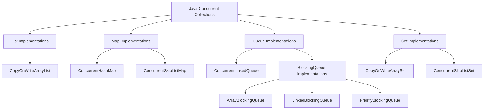

# Java Concurrent Collections

## Introduction

When working with multithreaded Java applications, regular collections like `ArrayList` or `HashMap` aren't thread-safe, which can lead to data inconsistency or corruption when multiple threads access them simultaneously. Java provides specialized concurrent collections in the `java.util.concurrent` package specifically designed to handle concurrent access safely and efficiently.

In this tutorial, you'll learn about:
- Why regular collections aren't thread-safe
- The main concurrent collections available in Java
- How to use these collections in real-world scenarios
- Performance considerations and best practices

## Why Regular Collections Aren't Thread-Safe

Standard collections in Java were designed for single-threaded environments. When multiple threads access these collections simultaneously, several issues can arise:

1. **Data Corruption**: Two threads might modify the same element simultaneously
2. **Visibility Problems**: Changes made by one thread might not be visible to others
3. **Inconsistent State**: Operations that should be atomic could be interleaved

Let's see an example that demonstrates the problem:

```java
// This is NOT thread-safe
ArrayList<String> regularList = new ArrayList<>();

// Thread 1
new Thread(() -> {
    for (int i = 0; i < 1000; i++) {
        regularList.add("Item " + i);
    }
}).start();

// Thread 2
new Thread(() -> {
    for (int i = 0; i < 1000; i++) {
        regularList.add("Item " + i);
    }
}).start();

// The size might not be 2000 as expected
// ConcurrentModificationException might occur when iterating
```

## Java's Concurrent Collections Overview

Java provides several concurrent collections to address these issues. Here's a quick overview:



Let's explore these collections in detail.

## ConcurrentHashMap

`ConcurrentHashMap` is a thread-safe implementation of the `Map` interface designed for high concurrency.

### Key Features

- Allows concurrent reads and a controlled number of concurrent writes
- Uses lock striping (dividing the map into segments) for better performance
- Does not lock the entire map during most operations
- Provides consistent iteration without `ConcurrentModificationException`

### Example

```java
import java.util.concurrent.ConcurrentHashMap;
import java.util.concurrent.ExecutorService;
import java.util.concurrent.Executors;
import java.util.concurrent.TimeUnit;

public class ConcurrentHashMapExample {
    public static void main(String[] args) throws InterruptedException {
        // Create a ConcurrentHashMap
        ConcurrentHashMap<String, Integer> concurrentMap = new ConcurrentHashMap<>();
        
        // Create a thread pool
        ExecutorService executorService = Executors.newFixedThreadPool(5);
        
        // Submit tasks to increment counters
        for (int i = 0; i < 100; i++) {
            final String key = "key" + (i % 10); // Using only 10 different keys
            
            executorService.submit(() -> {
                // Atomically update the value
                concurrentMap.compute(key, (k, v) -> (v == null) ? 1 : v + 1);
            });
        }
        
        // Shutdown the executor and wait for all tasks to complete
        executorService.shutdown();
        executorService.awaitTermination(1, TimeUnit.MINUTES);
        
        // Print the results
        System.out.println("Map contents:");
        concurrentMap.forEach((key, value) -> {
            System.out.println(key + ": " + value);
        });
    }
}
```

**Output:**
```
Map contents:
key0: 10
key5: 10
key9: 10
key4: 10
key8: 10
key3: 10
key7: 10
key2: 10
key6: 10
key1: 10
```

### Key Methods

- `putIfAbsent(K key, V value)`: Adds the key-value pair only if the key is not present
- `compute(K key, BiFunction<K, V, V> remappingFunction)`: Computes a new value for the key
- `computeIfPresent`/`computeIfAbsent`: Compute conditionally
- `forEach`: Perform an action for each entry

## CopyOnWriteArrayList

`CopyOnWriteArrayList` is a thread-safe variant of `ArrayList` in which all mutative operations (add, set, etc.) are implemented by creating a fresh copy of the underlying array.

### Key Features

- Thread-safe without synchronization
- Best for read-heavy, write-rare scenarios
- Provides a snapshot view during iteration
- No `ConcurrentModificationException` during iteration

### Example

```java
import java.util.Iterator;
import java.util.concurrent.CopyOnWriteArrayList;

public class CopyOnWriteArrayListExample {
    public static void main(String[] args) {
        // Create a CopyOnWriteArrayList
        CopyOnWriteArrayList<String> list = new CopyOnWriteArrayList<>();
        
        // Add elements
        list.add("Java");
        list.add("Python");
        list.add("C++");
        
        // Create an iterator
        Iterator<String> iterator = list.iterator();
        
        // Modify the list while iterating - this won't affect the iterator
        list.add("JavaScript");
        
        System.out.println("List contents: " + list);
        
        System.out.println("Iterator contents:");
        while (iterator.hasNext()) {
            System.out.println(iterator.next());
        }
        
        // Create a new iterator to see the new element
        System.out.println("New iterator contents:");
        iterator = list.iterator();
        while (iterator.hasNext()) {
            System.out.println(iterator.next());
        }
    }
}
```

**Output:**
```
List contents: [Java, Python, C++, JavaScript]
Iterator contents:
Java
Python
C++
New iterator contents:
Java
Python
C++
JavaScript
```

### When to Use

- Best for applications where reads greatly outnumber writes
- Good for event listener lists, where listeners are rarely added or removed
- Useful when you need a consistent snapshot while iterating

### Performance Considerations

The copy-on-write approach has significant performance implications:
- Write operations are expensive (O(n))
- Each modification creates a new copy of the entire list
- Read operations are fast and non-blocking

## BlockingQueue Implementations

Blocking queues are designed for producer-consumer patterns, where one or more threads produce items and other threads consume them.

### Key Implementations

1. **ArrayBlockingQueue**: Fixed-size queue backed by an array
2. **LinkedBlockingQueue**: Optionally bounded queue backed by linked nodes
3. **PriorityBlockingQueue**: Unbounded priority queue

### Example: Producer-Consumer Pattern

```java
import java.util.concurrent.*;

public class BlockingQueueExample {
    public static void main(String[] args) {
        // Create a blocking queue with capacity 5
        BlockingQueue<Integer> queue = new ArrayBlockingQueue<>(5);
        
        // Producer thread
        Thread producer = new Thread(() -> {
            try {
                for (int i = 0; i < 10; i++) {
                    System.out.println("Producing: " + i);
                    queue.put(i);
                    Thread.sleep(100); // Simulate work
                }
            } catch (InterruptedException e) {
                Thread.currentThread().interrupt();
            }
        });
        
        // Consumer thread
        Thread consumer = new Thread(() -> {
            try {
                for (int i = 0; i < 10; i++) {
                    int value = queue.take();
                    System.out.println("Consuming: " + value);
                    Thread.sleep(300); // Consumer works slower than producer
                }
            } catch (InterruptedException e) {
                Thread.currentThread().interrupt();
            }
        });
        
        // Start the threads
        producer.start();
        consumer.start();
        
        // Wait for threads to finish
        try {
            producer.join();
            consumer.join();
        } catch (InterruptedException e) {
            Thread.currentThread().interrupt();
        }
    }
}
```

**Output:**
```
Producing: 0
Producing: 1
Consuming: 0
Producing: 2
Producing: 3
Producing: 4
Producing: 5
Consuming: 1
Producing: 6
Consuming: 2
Producing: 7
Consuming: 3
Producing: 8
Consuming: 4
Producing: 9
Consuming: 5
Consuming: 6
Consuming: 7
Consuming: 8
Consuming: 9
```

### Key Methods

- `put(E e)`: Adds an element, waiting if necessary for space to become available
- `take()`: Retrieves and removes the head, waiting if necessary until an element becomes available
- `offer(E e, long timeout, TimeUnit unit)`: Adds an element, waiting up to the specified wait time
- `poll(long timeout, TimeUnit unit)`: Retrieves and removes the head, waiting up to the specified time

## ConcurrentSkipListMap and ConcurrentSkipListSet

These collections provide concurrent sorted map and set implementations.

### Key Features

- Maintain elements in sorted order
- Thread-safe without blocking
- Based on skip list data structure
- Good alternative to `TreeMap` and `TreeSet` in concurrent environments

### Example

```java
import java.util.concurrent.ConcurrentSkipListMap;

public class ConcurrentSkipListMapExample {
    public static void main(String[] args) {
        // Create a ConcurrentSkipListMap
        ConcurrentSkipListMap<String, Integer> scoreMap = new ConcurrentSkipListMap<>();
        
        // Add some student scores
        scoreMap.put("John", 85);
        scoreMap.put("Alice", 92);
        scoreMap.put("Bob", 78);
        scoreMap.put("Zack", 95);
        scoreMap.put("Carol", 88);
        
        // Display all scores (automatically sorted by keys)
        System.out.println("All scores (sorted by name):");
        scoreMap.forEach((name, score) -> System.out.println(name + ": " + score));
        
        // Get first and last entries
        System.out.println("\nFirst student: " + scoreMap.firstEntry());
        System.out.println("Last student: " + scoreMap.lastEntry());
        
        // Get submap from "B" to "D"
        System.out.println("\nStudents B to D:");
        scoreMap.subMap("B", "D").forEach((name, score) -> System.out.println(name + ": " + score));
    }
}
```

**Output:**
```
All scores (sorted by name):
Alice: 92
Bob: 78
Carol: 88
John: 85
Zack: 95

First student: Alice=92
Last student: Zack=95

Students B to D:
Bob: 78
Carol: 88
```

## Real-World Application: Concurrent Web Crawler

Let's build a simple concurrent web crawler that uses concurrent collections to manage URLs and track visited pages.

```java
import java.util.HashSet;
import java.util.Set;
import java.util.concurrent.*;
import java.io.BufferedReader;
import java.io.InputStreamReader;
import java.net.URL;
import java.util.regex.Matcher;
import java.util.regex.Pattern;

public class ConcurrentWebCrawler {
    
    private final ConcurrentHashMap<String, Boolean> visitedUrls = new ConcurrentHashMap<>();
    private final BlockingQueue<String> urlsToVisit = new LinkedBlockingQueue<>();
    private final Pattern urlPattern = Pattern.compile("href=\"(http[s]?://[^\"]+)\"");
    private final int maxPages;
    private final String domain;
    
    public ConcurrentWebCrawler(String startUrl, int maxPages) {
        this.maxPages = maxPages;
        urlsToVisit.add(startUrl);
        // Extract domain for limiting the crawl
        try {
            URL url = new URL(startUrl);
            this.domain = url.getHost();
        } catch (Exception e) {
            throw new IllegalArgumentException("Invalid start URL");
        }
    }
    
    public void crawl() {
        ExecutorService executor = Executors.newFixedThreadPool(5);
        
        for (int i = 0; i < 5; i++) { // Create 5 crawler threads
            executor.submit(() -> {
                try {
                    while (visitedUrls.size() < maxPages) {
                        String url = urlsToVisit.poll(1, TimeUnit.SECONDS);
                        if (url == null) continue;
                        
                        if (!visitedUrls.containsKey(url)) {
                            processPage(url);
                        }
                    }
                } catch (InterruptedException e) {
                    Thread.currentThread().interrupt();
                }
            });
        }
        
        executor.shutdown();
        try {
            executor.awaitTermination(1, TimeUnit.MINUTES);
        } catch (InterruptedException e) {
            Thread.currentThread().interrupt();
        }
        
        System.out.println("\nCrawling complete! Visited " + visitedUrls.size() + " pages.");
    }
    
    private void processPage(String urlString) {
        try {
            // Mark as visited first to avoid duplicate processing
            visitedUrls.put(urlString, true);
            
            URL url = new URL(urlString);
            // Skip if not in the same domain
            if (!url.getHost().equals(domain)) return;
            
            System.out.println("Crawling: " + urlString);
            
            BufferedReader reader = new BufferedReader(
                new InputStreamReader(url.openStream()));
            
            String line;
            while ((line = reader.readLine()) != null && visitedUrls.size() < maxPages) {
                Matcher matcher = urlPattern.matcher(line);
                while (matcher.find()) {
                    String newUrl = matcher.group(1);
                    // Only add URLs we haven't visited and that are in our queue
                    if (!visitedUrls.containsKey(newUrl)) {
                        urlsToVisit.offer(newUrl);
                    }
                }
            }
            
            reader.close();
        } catch (Exception e) {
            System.out.println("Error processing " + urlString + ": " + e.getMessage());
        }
    }
    
    public static void main(String[] args) {
        // Start with a simple site and limit to 10 pages
        ConcurrentWebCrawler crawler = new ConcurrentWebCrawler("https://www.example.com", 10);
        crawler.crawl();
    }
}
```

## Best Practices for Using Concurrent Collections

1. **Choose the Right Collection** for your specific needs:
   - Read-heavy: `ConcurrentHashMap`, `CopyOnWriteArrayList`
   - Producer-consumer scenarios: `BlockingQueue` implementations
   - Sorted maps/sets: `ConcurrentSkipListMap`/`Set`

2. **Understand the Performance Characteristics**:
   - Know the cost of operations (e.g., writes to `CopyOnWriteArrayList` are expensive)
   - Choose based on your read-write ratio

3. **Use Atomic Operations** provided by these collections:
   - Use `compute`, `computeIfAbsent`, etc. for `ConcurrentHashMap`
   - Avoid manual check-then-update patterns that can lead to race conditions

4. **Avoid External Synchronization** when possible:
   - The collections are already thread-safe
   - Additional synchronization may reduce concurrency

5. **Consider Memory Usage**:
   - Concurrent collections often have higher memory overhead
   - Collections like `CopyOnWriteArrayList` can temporarily double memory usage

## Summary

Java's concurrent collections provide thread-safe alternatives to standard collections with different trade-offs and use cases:

- **ConcurrentHashMap**: Efficient concurrent access for maps
- **CopyOnWriteArrayList/Set**: Thread-safe lists and sets optimized for reading
- **BlockingQueue Implementations**: For producer-consumer patterns
- **ConcurrentSkipListMap/Set**: Sorted thread-safe maps and sets

These collections help you write simpler, more robust concurrent code by handling thread safety internally rather than requiring external synchronization.

## Exercises

1. Create a thread-safe counter using `ConcurrentHashMap` where multiple threads increment counters for different categories.

2. Implement a multi-producer, multi-consumer scenario using `ArrayBlockingQueue` where producers generate random numbers and consumers process only even numbers.

3. Use `CopyOnWriteArrayList` to implement a thread-safe event notification system where listeners can be added and removed while events are being processed.

4. Create a concurrent task scheduler using `PriorityBlockingQueue` that executes tasks based on their priority.

5. Implement a concurrent cache with expiration using `ConcurrentHashMap` and scheduled tasks.

## Additional Resources

- [Java Documentation: Concurrent Collections](https://docs.oracle.com/en/java/javase/11/docs/api/java.base/java/util/concurrent/package-summary.html)
- [Oracle: Java Concurrency in Practice](https://www.oracle.com/technical-resources/articles/java/concurrency.html)
- [Baeldung: Guide to ConcurrentHashMap](https://www.baeldung.com/java-concurrent-hashmap)
- [Baeldung: Guide to the Java BlockingQueue](https://www.baeldung.com/java-blocking-queue)
- Book: "Java Concurrency in Practice" by Brian Goetz

Happy concurrent coding!