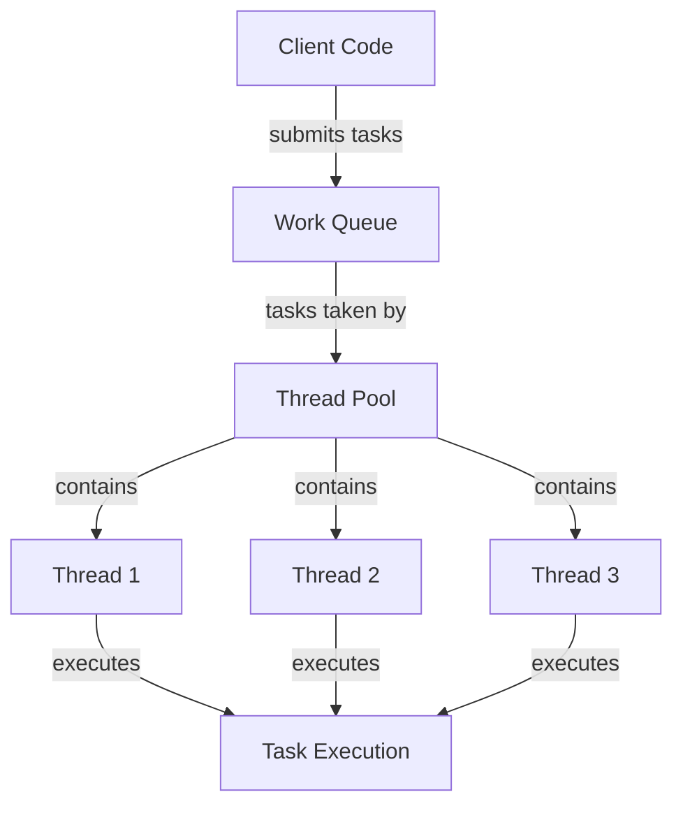

# Java Executor Framework

In modern Java applications, efficiently managing multiple threads is crucial for creating responsive and scalable software. The Java Executor Framework, introduced in Java 5 as part of the `java.util.concurrent` package, provides a powerful and flexible thread management system that helps developers overcome the limitations of manually creating and managing threads.

## Introduction to the Executor Framework

Before the Executor Framework, creating and managing threads in Java was done manually, which led to several challenges:

- Creating a new thread for every task can be resource-intensive
- Manually managing thread lifecycles adds complexity to your code
- Lack of built-in support for thread pooling and work queues
- Difficulty in tracking and handling thread execution results

The Executor Framework addresses these issues by providing a higher-level replacement for managing threads, separating task submission from task execution mechanics.

## Core Components of the Executor Framework

The Executor framework consists of three main interfaces:

1. **Executor**: The base interface that defines a simple `execute(Runnable)` method
2. **ExecutorService**: An extended interface with additional methods for lifecycle management and task submission
3. **ScheduledExecutorService**: An extension of ExecutorService that supports scheduled task execution

Let's examine each component in detail.

### The Executor Interface

The `Executor` interface forms the foundation of the framework with just one method:

```java
public interface Executor {
    void execute(Runnable command);
}
```

This simple interface separates task submission (`execute()`) from the details of how each task will run, including thread use, scheduling, etc.

### The ExecutorService Interface

`ExecutorService` extends the basic `Executor` interface with additional methods for managing service lifecycle and submitting tasks that return results.

Key methods include:

- `submit()`: Submits tasks and returns a `Future` object
- `shutdown()`: Initiates a graceful shutdown
- `shutdownNow()`: Attempts to stop all executing tasks immediately
- `awaitTermination()`: Blocks until all tasks complete or timeout occurs
- `invokeAll()`, `invokeAny()`: Submit collections of tasks

### The ScheduledExecutorService Interface

`ScheduledExecutorService` extends `ExecutorService` to support delayed and periodic task execution:

- `schedule()`: Schedule a task to run after a specified delay
- `scheduleAtFixedRate()`: Schedule tasks to run periodically
- `scheduleWithFixedDelay()`: Schedule periodic execution with a delay between completions

## Creating Executor Services

The `Executors` utility class provides factory methods for creating different types of executor services:

```java
import java.util.concurrent.ExecutorService;
import java.util.concurrent.Executors;

public class ExecutorExample {
    public static void main(String[] args) {
        // Create a fixed thread pool with 5 threads
        ExecutorService fixedPool = Executors.newFixedThreadPool(5);
        
        // Create a cached thread pool that creates new threads as needed
        ExecutorService cachedPool = Executors.newCachedThreadPool();
        
        // Create a single-threaded executor
        ExecutorService singleThreadExecutor = Executors.newSingleThreadExecutor();
        
        // Create a scheduled thread pool with 3 threads
        ScheduledExecutorService scheduledPool = Executors.newScheduledThreadPool(3);
    }
}
```

## Understanding Thread Pools

Thread pools are the backbone of the Executor Framework. They manage a pool of worker threads and provide a way to decouple task submission from execution.

Here's a visualization of how a thread pool works:



### Types of Thread Pools

The `Executors` class provides factory methods for creating different types of thread pools:

1. **Fixed Thread Pool**: Contains a fixed number of threads; if all threads are active when a new task is submitted, it will be queued until a thread becomes available.

2. **Cached Thread Pool**: Creates new threads as needed, but reuses previously constructed threads when available. Threads that remain idle for 60 seconds are terminated and removed from the pool.

3. **Single Thread Executor**: Uses a single worker thread operating off an unbounded queue. Tasks are guaranteed to execute sequentially according to the FIFO order.

4. **Scheduled Thread Pool**: Can schedule commands to run after a delay or periodically.

## Basic Usage with Runnable Tasks

Here's how to submit a `Runnable` task to an executor:

```java
import java.util.concurrent.ExecutorService;
import java.util.concurrent.Executors;

public class RunnableExample {
    public static void main(String[] args) {
        // Create a fixed thread pool
        ExecutorService executor = Executors.newFixedThreadPool(2);
        
        // Submit tasks
        for (int i = 0; i < 5; i++) {
            final int taskId = i;
            executor.execute(() -> {
                String threadName = Thread.currentThread().getName();
                System.out.println("Task " + taskId + " is running on " + threadName);
                try {
                    // Simulate work
                    Thread.sleep(1000);
                } catch (InterruptedException e) {
                    Thread.currentThread().interrupt();
                }
                System.out.println("Task " + taskId + " completed");
            });
        }
        
        // Shutdown the executor once all tasks are submitted
        executor.shutdown();
    }
}
```

Sample output:
```
Task 0 is running on pool-1-thread-1
Task 1 is running on pool-1-thread-2
Task 0 completed
Task 2 is running on pool-1-thread-1
Task 1 completed
Task 3 is running on pool-1-thread-2
Task 2 completed
Task 4 is running on pool-1-thread-1
Task 3 completed
Task 4 completed
```

Note how the tasks are executed by only two threads, even though we submitted five tasks. This demonstrates how the fixed thread pool manages thread resources.

## Working with Callable and Future

While `Runnable` tasks don't return results, the `Callable` interface allows tasks to return values and throw checked exceptions. The `Future` interface represents the result of an asynchronous computation.

```java
import java.util.concurrent.*;

public class CallableFutureExample {
    public static void main(String[] args) {
        ExecutorService executor = Executors.newFixedThreadPool(2);
        
        // Create a Callable task that returns a result
        Callable<Integer> task = () -> {
            System.out.println("Calculating...");
            TimeUnit.SECONDS.sleep(2); // Simulate long calculation
            return 42;  // Return a result
        };
        
        // Submit the task and get a Future
        Future<Integer> future = executor.submit(task);
        
        try {
            // Do other work while task is executing
            System.out.println("Waiting for the result...");
            
            // Get the result - this will block until the task completes
            Integer result = future.get();
            System.out.println("Result: " + result);
        } catch (InterruptedException | ExecutionException e) {
            e.printStackTrace();
        }
        
        executor.shutdown();
    }
}
```

Output:
```
Calculating...
Waiting for the result...
Result: 42
```

### Key Methods of Future

The `Future` interface provides methods to:

- Check if a task is completed (`isDone()`)
- Wait for a task to complete and get the result (`get()`)
- Cancel a task (`cancel()`)
- Check if a task was cancelled (`isCancelled()`)

```java
Future<Integer> future = executor.submit(task);

// Check if completed without blocking
if (future.isDone()) {
    System.out.println("Task completed!");
}

// Wait for at most 5 seconds
Integer result = future.get(5, TimeUnit.SECONDS);

// Cancel a task if it's taking too long
boolean wasCancelled = future.cancel(true); // true means interrupt if running
```

## Scheduled Task Execution

The `ScheduledExecutorService` allows you to schedule tasks to run once after a delay or repeatedly at fixed intervals:

```java
import java.util.concurrent.*;

public class ScheduledExecutorExample {
    public static void main(String[] args) {
        ScheduledExecutorService scheduler = Executors.newScheduledThreadPool(1);
        
        // Schedule a task to run after 2 seconds
        scheduler.schedule(() -> {
            System.out.println("Delayed task executed at " + System.currentTimeMillis()/1000);
        }, 2, TimeUnit.SECONDS);
        
        // Schedule a task to run every 3 seconds, starting 0 seconds from now
        scheduler.scheduleAtFixedRate(() -> {
            System.out.println("Fixed rate task executed at " + System.currentTimeMillis()/1000);
        }, 0, 3, TimeUnit.SECONDS);
        
        // Schedule a task to run every 3 seconds after the previous execution completes
        scheduler.scheduleWithFixedDelay(() -> {
            System.out.println("Fixed delay task executed at " + System.currentTimeMillis()/1000);
            try {
                // Simulate work taking 1 second
                Thread.sleep(1000);
            } catch (InterruptedException e) {
                e.printStackTrace();
            }
        }, 0, 3, TimeUnit.SECONDS);
        
        // Run for some time then shutdown
        try {
            Thread.sleep(10000);  // Run for 10 seconds
            scheduler.shutdown();
        } catch (InterruptedException e) {
            scheduler.shutdownNow();
        }
    }
}
```

Output (timestamps will vary):
```
Fixed rate task executed at 1679276405
Fixed delay task executed at 1679276405
Delayed task executed at 1679276407
Fixed rate task executed at 1679276408
Fixed delay task executed at 1679276409
Fixed rate task executed at 1679276411
Fixed delay task executed at 1679276413
```

### Fixed Rate vs Fixed Delay

- `scheduleAtFixedRate`: Tasks are scheduled based on the fixed start time of the task. If a task takes longer than the period, subsequent executions may stack up.
- `scheduleWithFixedDelay`: The delay between tasks is measured from the end of the previous task to the start of the next. This guarantees a gap between executions.

## Real-world Example: Web Crawler

Let's build a simple concurrent web crawler using the Executor Framework:

```java
import java.io.IOException;
import java.net.URL;
import java.util.*;
import java.util.concurrent.*;
import java.util.regex.Matcher;
import java.util.regex.Pattern;

public class SimpleCrawler {
    private final ExecutorService executorService;
    private final Set<String> visitedUrls = ConcurrentHashMap.newKeySet();
    private final int maxDepth;
    private final String rootUrl;
    
    public SimpleCrawler(String url, int maxDepth, int numThreads) {
        this.rootUrl = url;
        this.maxDepth = maxDepth;
        this.executorService = Executors.newFixedThreadPool(numThreads);
    }
    
    public void start() {
        crawl(rootUrl, 0);
        executorService.shutdown();
        try {
            executorService.awaitTermination(1, TimeUnit.HOURS);
        } catch (InterruptedException e) {
            System.err.println("Crawling interrupted: " + e.getMessage());
        }
        System.out.println("Crawling completed. Visited " + visitedUrls.size() + " URLs");
    }
    
    private void crawl(String url, int depth) {
        if (depth > maxDepth || visitedUrls.contains(url)) {
            return;
        }
        
        visitedUrls.add(url);
        System.out.println("Crawling URL: " + url + " at depth " + depth);
        
        executorService.submit(() -> {
            try {
                // Download page content
                String content = downloadUrl(url);
                
                // Extract links
                Set<String> links = extractLinks(content, url);
                
                // Crawl each link
                for (String link : links) {
                    crawl(link, depth + 1);
                }
            } catch (IOException e) {
                System.err.println("Error processing URL " + url + ": " + e.getMessage());
            }
        });
    }
    
    private String downloadUrl(String url) throws IOException {
        // Simplified implementation - in real code you'd use HttpClient, jsoup, etc.
        try (Scanner scanner = new Scanner(new URL(url).openStream(), "UTF-8")) {
            scanner.useDelimiter("\\A");
            return scanner.hasNext() ? scanner.next() : "";
        }
    }
    
    private Set<String> extractLinks(String content, String baseUrl) {
        Set<String> links = new HashSet<>();
        
        // Simple regex pattern for href links - real implementation would be more robust
        Pattern pattern = Pattern.compile("href=[\"']([^\"'#]+)[\"']");
        Matcher matcher = pattern.matcher(content);
        
        while (matcher.find()) {
            String link = matcher.group(1);
            // Convert relative URLs to absolute
            if (link.startsWith("/")) {
                try {
                    URL base = new URL(baseUrl);
                    link = base.getProtocol() + "://" + base.getHost() + link;
                } catch (Exception e) {
                    continue;
                }
            } else if (!link.startsWith("http")) {
                continue;
            }
            links.add(link);
        }
        return links;
    }
    
    public static void main(String[] args) {
        SimpleCrawler crawler = new SimpleCrawler("https://www.example.com", 2, 4);
        crawler.start();
    }
}
```

This example demonstrates how the Executor Framework can be used to build a concurrent web crawler that processes multiple URLs simultaneously. The crawler:

1. Starts with a root URL and a maximum crawling depth
2. Uses a thread pool to process URLs concurrently
3. Extracts links from each page and schedules them for crawling
4. Keeps track of visited URLs to avoid processing the same URL multiple times

## Best Practices

### 1. Always Shut Down Executor Services

Always shut down your executor services when they're no longer needed:

```java
executor.shutdown();
try {
    // Wait for existing tasks to terminate
    if (!executor.awaitTermination(60, TimeUnit.SECONDS)) {
        // Force shutdown if tasks don't complete in time
        executor.shutdownNow();
        if (!executor.awaitTermination(60, TimeUnit.SECONDS))
            System.err.println("Executor did not terminate");
    }
} catch (InterruptedException ie) {
    executor.shutdownNow();
    Thread.currentThread().interrupt();
}
```

### 2. Choose the Right Thread Pool Size

Consider the nature of your tasks when determining thread pool size:

- **CPU-bound tasks**: Use `Runtime.getRuntime().availableProcessors()` threads
- **I/O-bound tasks**: Use more threads than available processors since threads often wait

### 3. Handle Exceptions Properly

When working with executor services, exceptions in tasks won't crash your application but can be silently lost unless properly handled:

```java
Future<?> future = executor.submit(() -> {
    throw new RuntimeException("Task failed");
});

try {
    future.get(); // This will throw an ExecutionException
} catch (InterruptedException e) {
    Thread.currentThread().interrupt();
} catch (ExecutionException e) {
    System.err.println("Task failed with exception: " + e.getCause());
}
```

### 4. Use ExecutorCompletionService for Managing Multiple Tasks

When dealing with multiple tasks and you want to process results as they become available:

```java
ExecutorService executor = Executors.newFixedThreadPool(3);
ExecutorCompletionService<Integer> completionService = new ExecutorCompletionService<>(executor);

// Submit tasks
for (int i = 0; i < 10; i++) {
    final int id = i;
    completionService.submit(() -> {
        TimeUnit.MILLISECONDS.sleep(new Random().nextInt(1000));
        return id;
    });
}

// Process results as they complete
for (int i = 0; i < 10; i++) {
    try {
        Future<Integer> future = completionService.take();
        System.out.println("Task completed: " + future.get());
    } catch (Exception e) {
        e.printStackTrace();
    }
}

executor.shutdown();
```

## Summary

The Java Executor Framework provides a powerful abstraction for concurrent programming that separates task submission from task execution mechanics. Key benefits include:

- **Simplified thread management**: No need to create and manage threads manually
- **Thread pooling**: Efficient reuse of threads for optimal resource utilization
- **Asynchronous task execution**: Submit tasks and continue working without blocking
- **Task scheduling**: Run tasks after delays or periodically
- **Result handling**: Capture return values and exceptions with `Future` objects

By utilizing the Executor Framework, you can write cleaner, more efficient concurrent code while avoiding many common threading pitfalls.

## Additional Resources

1. [Java Documentation: Executor Interface](https://docs.oracle.com/javase/8/docs/api/java/util/concurrent/Executor.html)
2. [Java Documentation: ExecutorService Interface](https://docs.oracle.com/javase/8/docs/api/java/util/concurrent/ExecutorService.html)
3. [Java Concurrency in Practice](https://jcip.net/) by Brian Goetz et al.
4. [Baeldung: Guide to the Java ExecutorService](https://www.baeldung.com/java-executor-service-tutorial)

## Practice Exercises

1. **Image Processing Pipeline**: Create a program that processes multiple images concurrently using an ExecutorService. Each task should load an image, apply a filter, and save the result.

2. **Task Progress Tracker**: Implement a system that submits multiple tasks to an ExecutorService and shows a progress bar of overall completion.

3. **Scheduled Report Generator**: Use ScheduledExecutorService to create a program that generates and emails reports at fixed intervals.

4. **Custom Thread Pool**: Implement your own ThreadPoolExecutor with custom rejection handler, naming pattern for threads, and configurable queue size.

5. **Web Service Client**: Build a client that makes concurrent API requests to a web service and aggregates the results when all requests complete.