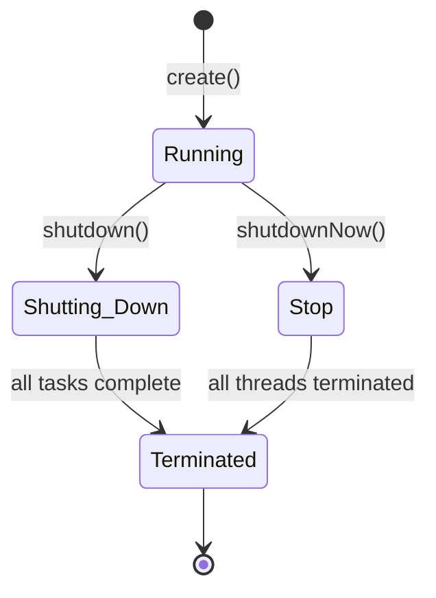

# Java Thread Pool

## Introduction

When developing multi-threaded applications in Java, managing thread creation and destruction can become resource-intensive. Creating a new thread for every task, especially for short-lived tasks, incurs significant overhead. This is where **Thread Pools** come in as a solution.

A thread pool consists of a group of pre-instantiated, idle threads that stand ready to be given work. These threads are used to execute tasks and are then returned to the pool when their work is done, rather than being terminated.

In this tutorial, we'll explore Java's Thread Pool implementation, understand its benefits, and learn how to use it effectively in your applications.

## Why Use Thread Pools?

Before diving into implementation, let's understand why thread pools are essential:

1. **Reduced resource consumption**: Reusing existing threads instead of creating new ones
2. **Improved responsiveness**: Tasks can be executed immediately without waiting for thread creation
3. **Predictable resource management**: Control over the number of threads in the application
4. **Graceful degradation**: When the system is under load, tasks wait in queue rather than overwhelming the system

## Java's Executor Framework

Java provides the `java.util.concurrent` package with the Executor framework for thread pool implementation. The primary interfaces and classes you'll work with include:

- `Executor`: A simple interface for executing tasks
- `ExecutorService`: An extended interface with lifecycle management methods
- `Executors`: A utility class with factory methods for creating different types of thread pools
- `ThreadPoolExecutor`: The core implementation class for thread pools

## Basic Thread Pool Implementation

Let's start with a simple example of using a thread pool:

```java
import java.util.concurrent.ExecutorService;
import java.util.concurrent.Executors;

public class BasicThreadPoolExample {
    public static void main(String[] args) {
        // Create a fixed thread pool with 5 threads
        ExecutorService executor = Executors.newFixedThreadPool(5);
        
        // Submit 10 tasks for execution
        for (int i = 0; i < 10; i++) {
            final int taskId = i;
            executor.execute(() -> {
                System.out.println("Task " + taskId + " is running on thread " + 
                                   Thread.currentThread().getName());
                try {
                    // Simulate task execution time
                    Thread.sleep(500);
                } catch (InterruptedException e) {
                    Thread.currentThread().interrupt();
                }
                System.out.println("Task " + taskId + " completed");
            });
        }
        
        // Shutdown the executor when no longer needed
        executor.shutdown();
        
        System.out.println("All tasks submitted. ThreadPool shutting down...");
    }
}
```

**Output:**
```
All tasks submitted. ThreadPool shutting down...
Task 0 is running on thread pool-1-thread-1
Task 4 is running on thread pool-1-thread-5
Task 3 is running on thread pool-1-thread-4
Task 2 is running on thread pool-1-thread-3
Task 1 is running on thread pool-1-thread-2
Task 0 completed
Task 5 is running on thread pool-1-thread-1
Task 4 completed
Task 6 is running on thread pool-1-thread-5
Task 3 completed
Task 7 is running on thread pool-1-thread-4
Task 2 completed
Task 8 is running on thread pool-1-thread-3
Task 1 completed
Task 9 is running on thread pool-1-thread-2
Task 5 completed
Task 6 completed
Task 7 completed
Task 8 completed
Task 9 completed
```

Notice how only 5 threads are used to execute 10 tasks. The threads are reused as they complete their assigned tasks.

## Types of Thread Pools in Java

Java's `Executors` class provides factory methods to create different types of thread pools for various use cases:

### 1. Fixed Thread Pool

A thread pool with a fixed number of threads. If a thread dies due to an exception, a new one is created to maintain the specified number.

```java
ExecutorService fixedPool = Executors.newFixedThreadPool(5);
```

**Best for**: Applications that need to limit the number of concurrent threads for resource management.

### 2. Cached Thread Pool

A thread pool that creates new threads as needed, but reuses previously constructed threads when available. Threads not used for 60 seconds are terminated and removed.

```java
ExecutorService cachedPool = Executors.newCachedThreadPool();
```

**Best for**: Applications with many short-lived tasks.

### 3. Scheduled Thread Pool

A thread pool that can schedule tasks to run after a specified delay or to execute periodically.

```java
import java.util.concurrent.ScheduledExecutorService;
import java.util.concurrent.TimeUnit;

ScheduledExecutorService scheduledPool = Executors.newScheduledThreadPool(3);
scheduledPool.schedule(() -> System.out.println("Delayed task"), 2, TimeUnit.SECONDS);
scheduledPool.scheduleAtFixedRate(() -> System.out.println("Periodic task"), 0, 3, TimeUnit.SECONDS);
```

**Best for**: Applications that need to schedule tasks for future execution.

### 4. Single-Thread Executor

A thread pool with only one thread. Guarantees that tasks are processed sequentially according to the order they were submitted.

```java
ExecutorService singleThreadExecutor = Executors.newSingleThreadExecutor();
```

**Best for**: Tasks that must be executed in a specific order or tasks that should not be executed concurrently.

## Thread Pool Lifecycle

Understanding the lifecycle of a thread pool is crucial for proper resource management:



The key lifecycle methods of `ExecutorService` are:

- `shutdown()`: Initiates an orderly shutdown. Previously submitted tasks are executed, but no new tasks will be accepted.
- `shutdownNow()`: Attempts to stop all actively executing tasks and halts pending tasks.
- `isShutdown()`: Returns true if the executor has been shut down.
- `isTerminated()`: Returns true if all tasks have completed following shutdown.
- `awaitTermination()`: Blocks until all tasks have completed after a shutdown request.

## Submitting Tasks and Getting Results

The `ExecutorService` interface provides two methods to submit tasks:

### 1. `execute` method

Used when you don't need to get the result of the task:

```java
executor.execute(() -> System.out.println("Simple task with no return value"));
```

### 2. `submit` method

Used when you need to get the result of the task. It returns a `Future` object:

```java
import java.util.concurrent.Future;
import java.util.concurrent.ExecutionException;

Future<Integer> future = executor.submit(() -> {
    // Compute and return a result
    return 42;
});

try {
    // This will block until the task completes
    Integer result = future.get();
    System.out.println("Task result: " + result);
} catch (InterruptedException | ExecutionException e) {
    e.printStackTrace();
}
```

## Practical Example: Web Page Downloader

Let's create a practical example of a web page downloader that uses a thread pool to download multiple pages concurrently:

```java
import java.io.BufferedReader;
import java.io.InputStreamReader;
import java.net.URL;
import java.util.ArrayList;
import java.util.List;
import java.util.concurrent.Callable;
import java.util.concurrent.ExecutionException;
import java.util.concurrent.ExecutorService;
import java.util.concurrent.Executors;
import java.util.concurrent.Future;
import java.util.concurrent.TimeUnit;

public class WebPageDownloader {
    static class PageContent {
        private final String url;
        private final String content;
        
        public PageContent(String url, String content) {
            this.url = url;
            this.content = content;
        }
        
        public String getUrl() {
            return url;
        }
        
        public String getContent() {
            return content;
        }
    }
    
    static class DownloadTask implements Callable<PageContent> {
        private final String url;
        
        public DownloadTask(String url) {
            this.url = url;
        }
        
        @Override
        public PageContent call() throws Exception {
            System.out.println("Downloading from " + url + " using " + 
                               Thread.currentThread().getName());
            
            StringBuilder content = new StringBuilder();
            try {
                URL website = new URL(url);
                BufferedReader reader = new BufferedReader(
                    new InputStreamReader(website.openStream()));
                
                String line;
                while ((line = reader.readLine()) != null) {
                    content.append(line);
                }
                reader.close();
                
                // Simulate some processing time
                Thread.sleep(1000);
                
                return new PageContent(url, content.toString().substring(0, 100) + "...");
            } catch (Exception e) {
                System.err.println("Error downloading " + url + ": " + e.getMessage());
                return new PageContent(url, "Error: " + e.getMessage());
            }
        }
    }
    
    public static void main(String[] args) {
        // List of URLs to download
        List<String> urls = new ArrayList<>();
        urls.add("https://www.google.com");
        urls.add("https://www.github.com");
        urls.add("https://www.stackoverflow.com");
        urls.add("https://www.oracle.com/java");
        urls.add("https://www.wikipedia.org");
        
        // Create a thread pool with 3 threads
        ExecutorService executor = Executors.newFixedThreadPool(3);
        
        List<Future<PageContent>> futures = new ArrayList<>();
        
        // Submit download tasks
        for (String url : urls) {
            Future<PageContent> future = executor.submit(new DownloadTask(url));
            futures.add(future);
        }
        
        // Process the results
        for (Future<PageContent> future : futures) {
            try {
                PageContent content = future.get();
                System.out.println("Downloaded " + content.getUrl() + 
                                   "\nContent preview: " + content.getContent());
                System.out.println("------------------------------");
            } catch (InterruptedException | ExecutionException e) {
                e.printStackTrace();
            }
        }
        
        // Shutdown the executor
        executor.shutdown();
        try {
            if (!executor.awaitTermination(5, TimeUnit.SECONDS)) {
                executor.shutdownNow();
            }
        } catch (InterruptedException e) {
            executor.shutdownNow();
        }
        
        System.out.println("All downloads completed!");
    }
}
```

This example demonstrates a real-world application of thread pools for concurrent network operations, which is a common use case.

## Advanced Thread Pool Configuration

For more control over thread pool behavior, you can directly use `ThreadPoolExecutor`:

```java
import java.util.concurrent.ArrayBlockingQueue;
import java.util.concurrent.ThreadPoolExecutor;
import java.util.concurrent.TimeUnit;

ThreadPoolExecutor customThreadPool = new ThreadPoolExecutor(
    3,                        // Core pool size
    5,                        // Maximum pool size
    60, TimeUnit.SECONDS,     // Keep-alive time for idle threads
    new ArrayBlockingQueue<>(10),  // Work queue
    new ThreadPoolExecutor.CallerRunsPolicy()  // Rejection policy
);

// Submit tasks as with regular ExecutorService
customThreadPool.submit(() -> System.out.println("Task executed"));
```

Parameters explained:
- **Core pool size**: Minimum number of threads to keep in the pool
- **Maximum pool size**: Upper limit on thread count
- **Keep-alive time**: How long to keep idle threads alive
- **Work queue**: Queue to hold tasks when all threads are busy
- **Rejection policy**: What to do when queue is full and max threads are reached

### Rejection Policies:

1. **AbortPolicy**: Throws a `RejectedExecutionException` (default)
2. **CallerRunsPolicy**: Executes the task in the caller's thread
3. **DiscardPolicy**: Silently discards the task
4. **DiscardOldestPolicy**: Discards the oldest unhandled request and tries again

## Thread Pool Best Practices

1. **Choose the right pool type** for your workload:
   - CPU-bound tasks: Use `Runtime.getRuntime().availableProcessors()` as the pool size
   - I/O-bound tasks: Can use larger pool sizes since threads spend time waiting

2. **Always shut down thread pools** properly to avoid resource leaks:
   ```java
   executor.shutdown();
   try {
       if (!executor.awaitTermination(60, TimeUnit.SECONDS)) {
           executor.shutdownNow();
       }
   } catch (InterruptedException e) {
       executor.shutdownNow();
   }
   ```

3. **Handle exceptions** in tasks to prevent thread termination:
   ```java
   executor.submit(() -> {
       try {
           // Task logic
       } catch (Exception e) {
           // Handle exception
           System.err.println("Task failed: " + e.getMessage());
       }
   });
   ```

4. **Monitor your thread pool** performance to adjust size and queue capacity based on application needs.

5. **Consider using thread factory** for naming threads, setting priority, or marking them as daemon:
   ```java
   import java.util.concurrent.ThreadFactory;
   
   ThreadFactory namedThreadFactory = (Runnable r) -> {
       Thread t = new Thread(r);
       t.setName("MyAppThread-" + t.getId());
       return t;
   };
   
   ExecutorService executor = Executors.newFixedThreadPool(5, namedThreadFactory);
   ```

## Common Pitfalls to Avoid

1. **Creating too many threads**: This can degrade performance due to context switching.

2. **Using unbounded queues with fixed thread pools**: This can lead to OutOfMemoryError if tasks are submitted faster than they can be processed.

3. **Not handling rejected tasks**: Always plan for what happens when your thread pool is saturated.

4. **Using Thread.sleep() in tasks**: This blocks threads unnecessarily. Consider using scheduled executors instead.

5. **Not shutting down the thread pools**: This can prevent your application from terminating properly.

## Summary

Thread pools in Java provide an efficient way to manage multiple threads for concurrent task execution. They offer significant benefits in terms of performance, resource utilization, and application stability.

Key takeaways:
- Thread pools reuse threads to reduce the overhead of thread creation
- The `ExecutorService` interface provides methods for submitting and managing tasks
- Different types of thread pools are available for various use cases
- Proper lifecycle management is essential for resource cleanup
- Advanced configuration options allow fine-tuning for specific needs

By using thread pools effectively, you can develop highly concurrent Java applications that scale well and make efficient use of system resources.

## Exercises

1. Create a thread pool that processes a large collection of integers, calculating their prime factors in parallel.

2. Implement a file processing application that uses a thread pool to read multiple files concurrently.

3. Modify the web page downloader example to add timeout functionality for each download task.

4. Create a custom thread factory that assigns names and priority to the threads in your thread pool.

5. Implement a thread pool that monitors and logs the execution time of each submitted task.

## Additional Resources

- [Java Documentation on ThreadPoolExecutor](https://docs.oracle.com/en/java/javase/17/docs/api/java.base/java/util/concurrent/ThreadPoolExecutor.html)
- [Java Concurrency in Practice](http://jcip.net/) by Brian Goetz
- [Oracle's Java Tutorial on Executors](https://docs.oracle.com/javase/tutorial/essential/concurrency/executors.html)