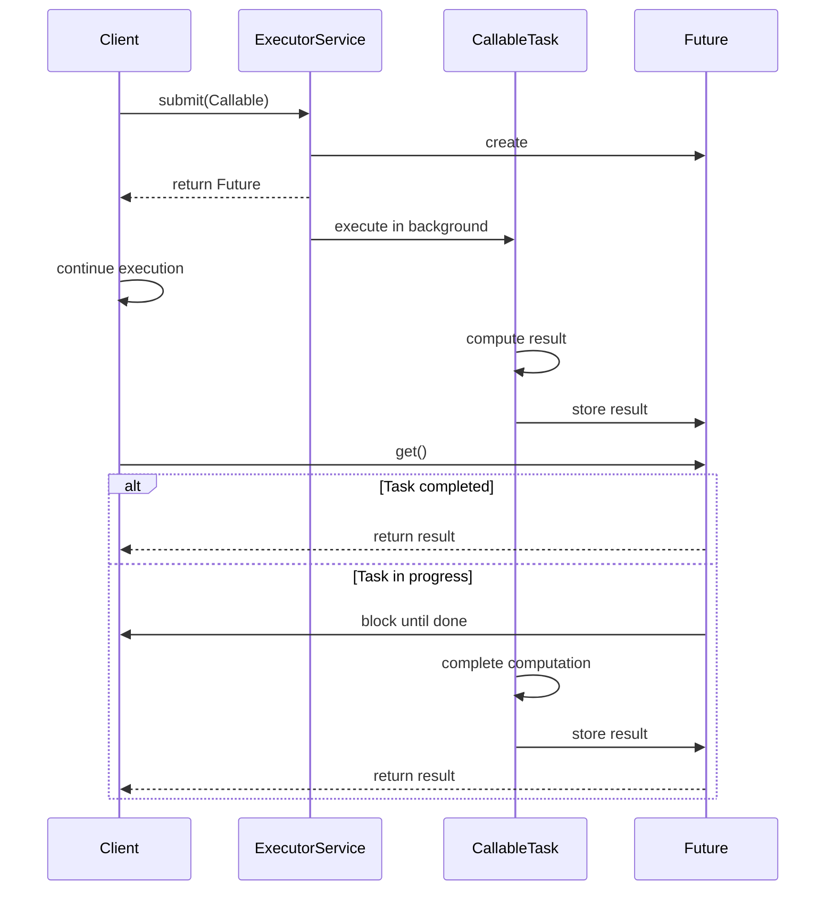

# Java Future and Callable

## Introduction

In Java's multithreading landscape, there are times when we need to execute tasks asynchronously and retrieve their results later. The `Runnable` interface, which we've seen in basic threading, doesn't provide a way to return values from tasks. This is where `Future` and `Callable` interfaces come in.

The `Callable` interface allows you to define tasks that return results and may throw checked exceptions, while the `Future` interface represents the result of an asynchronous computation. Together, they form a powerful mechanism for executing tasks concurrently and managing their results.

## Understanding Callable

### What is Callable?

`Callable` is a functional interface introduced in Java 5 as part of the `java.util.concurrent` package. Unlike `Runnable`, which has a `run()` method that returns void, `Callable` has a `call()` method that can return a value and throw checked exceptions.

Here's how the `Callable` interface is defined:

```java
public interface Callable<V> {
    V call() throws Exception;
}
```

### Callable vs Runnable

Here's a quick comparison between `Callable` and `Runnable`:

| Feature | Callable | Runnable |
|---------|----------|----------|
| Return value | Can return a value | Cannot return a value (void) |
| Exception handling | Can throw checked exceptions | Cannot throw checked exceptions |
| Method | `call()` | `run()` |
| Introduction | Java 5 | Java 1 |

## Understanding Future

### What is Future?

A `Future` represents the result of an asynchronous computation. It provides methods to check if the computation is complete, wait for its completion, and retrieve the result of the computation.

Here are the key methods in the `Future` interface:

```java
public interface Future<V> {
    boolean cancel(boolean mayInterruptIfRunning);
    boolean isCancelled();
    boolean isDone();
    V get() throws InterruptedException, ExecutionException;
    V get(long timeout, TimeUnit unit) throws InterruptedException, ExecutionException, TimeoutException;
}
```

- `cancel(boolean mayInterruptIfRunning)`: Attempts to cancel the execution of the task.
- `isCancelled()`: Returns true if the task was cancelled before completion.
- `isDone()`: Returns true if the task completed, either normally or by being cancelled.
- `get()`: Waits if necessary for the computation to complete, then retrieves its result.
- `get(long timeout, TimeUnit unit)`: Waits for a specified time period for the computation to complete, then retrieves its result if available.

## Using ExecutorService with Future and Callable

To execute a `Callable` task and get a `Future`, you typically use an `ExecutorService`. The `ExecutorService` provides methods to submit tasks and returns `Future` objects representing the pending results.

Here's a basic example:

```java
import java.util.concurrent.*;

public class FutureCallableExample {
    public static void main(String[] args) {
        // Create an ExecutorService with a single thread
        ExecutorService executor = Executors.newSingleThreadExecutor();
        
        // Submit a Callable task
        Future<Integer> future = executor.submit(new Callable<Integer>() {
            @Override
            public Integer call() throws Exception {
                // Simulate a time-consuming computation
                Thread.sleep(2000);
                return 123;
            }
        });
        
        System.out.println("Task submitted, doing other work...");
        
        try {
            // This will block until the task completes
            Integer result = future.get();
            System.out.println("Task result: " + result);
        } catch (InterruptedException | ExecutionException e) {
            e.printStackTrace();
        } finally {
            executor.shutdown();
        }
    }
}
```

**Output:**
```
Task submitted, doing other work...
Task result: 123
```

You can also use lambda expressions for a more concise syntax:

```java
Future<Integer> future = executor.submit(() -> {
    Thread.sleep(2000);
    return 123;
});
```

## Handling Multiple Futures

Sometimes you need to execute multiple tasks concurrently and process their results. The `ExecutorService` provides methods to handle such scenarios:

### Using invokeAll()

The `invokeAll()` method executes a collection of tasks and returns a list of `Future` objects in the same order:

```java
import java.util.*;
import java.util.concurrent.*;

public class MultipleTasksExample {
    public static void main(String[] args) {
        ExecutorService executor = Executors.newFixedThreadPool(3);
        
        List<Callable<String>> tasks = Arrays.asList(
            () -> {
                Thread.sleep(2000);
                return "Task 1 result";
            },
            () -> {
                Thread.sleep(1000);
                return "Task 2 result";
            },
            () -> {
                Thread.sleep(3000);
                return "Task 3 result";
            }
        );
        
        try {
            List<Future<String>> futures = executor.invokeAll(tasks);
            
            for (Future<String> future : futures) {
                System.out.println(future.get());
            }
        } catch (InterruptedException | ExecutionException e) {
            e.printStackTrace();
        } finally {
            executor.shutdown();
        }
    }
}
```

**Output:**
```
Task 1 result
Task 2 result
Task 3 result
```

### Using invokeAny()

The `invokeAny()` method executes a collection of tasks and returns the result of one that has completed successfully (i.e., without throwing an exception), if any do:

```java
import java.util.*;
import java.util.concurrent.*;

public class InvokeAnyExample {
    public static void main(String[] args) {
        ExecutorService executor = Executors.newFixedThreadPool(3);
        
        List<Callable<String>> tasks = Arrays.asList(
            () -> {
                Thread.sleep(2000);
                return "Task 1 result";
            },
            () -> {
                Thread.sleep(1000);
                return "Task 2 result";
            },
            () -> {
                Thread.sleep(3000);
                return "Task 3 result";
            }
        );
        
        try {
            String result = executor.invokeAny(tasks);
            System.out.println("Result from fastest task: " + result);
        } catch (InterruptedException | ExecutionException e) {
            e.printStackTrace();
        } finally {
            executor.shutdown();
        }
    }
}
```

**Output:**
```
Result from fastest task: Task 2 result
```

## Handling Timeouts

When working with asynchronous tasks, it's often important to set timeouts to avoid waiting indefinitely. The `Future.get()` method provides an overload that accepts a timeout:

```java
import java.util.concurrent.*;

public class FutureTimeoutExample {
    public static void main(String[] args) {
        ExecutorService executor = Executors.newSingleThreadExecutor();
        
        Future<String> future = executor.submit(() -> {
            // This task takes 5 seconds
            Thread.sleep(5000);
            return "Task completed";
        });
        
        try {
            // Wait for at most 2 seconds
            String result = future.get(2, TimeUnit.SECONDS);
            System.out.println(result);
        } catch (TimeoutException e) {
            System.out.println("Task timed out!");
            // Cancel the task
            future.cancel(true);
        } catch (InterruptedException | ExecutionException e) {
            e.printStackTrace();
        } finally {
            executor.shutdown();
        }
    }
}
```

**Output:**
```
Task timed out!
```

## CompletableFuture: The Modern Approach

Since Java 8, `CompletableFuture` provides a more advanced alternative to `Future`, with support for composing asynchronous operations, handling errors, and more. While it's beyond the scope of this basic tutorial, here's a simple example:

```java
import java.util.concurrent.CompletableFuture;
import java.util.concurrent.ExecutionException;

public class CompletableFutureExample {
    public static void main(String[] args) {
        CompletableFuture<String> future = CompletableFuture.supplyAsync(() -> {
            try {
                Thread.sleep(1000);
            } catch (InterruptedException e) {
                e.printStackTrace();
            }
            return "Hello";
        }).thenApply(result -> result + " World");
        
        try {
            System.out.println(future.get());
        } catch (InterruptedException | ExecutionException e) {
            e.printStackTrace();
        }
    }
}
```

**Output:**
```
Hello World
```

## Real-World Application: Web Service Aggregator

Let's see how `Future` and `Callable` can be used in a real-world scenario. Imagine you're building a travel booking platform that needs to fetch data from multiple services (flight, hotel, car rental) concurrently to display to the user:

```java
import java.util.concurrent.*;
import java.util.*;

public class TravelServiceAggregator {
    
    static class TravelService {
        static Map<String, String> getFlightDetails() throws InterruptedException {
            // Simulate API call to flight service
            Thread.sleep(2000);
            Map<String, String> details = new HashMap<>();
            details.put("airline", "Sky Airlines");
            details.put("departure", "10:00 AM");
            details.put("price", "$350");
            return details;
        }
        
        static Map<String, String> getHotelDetails() throws InterruptedException {
            // Simulate API call to hotel service
            Thread.sleep(1500);
            Map<String, String> details = new HashMap<>();
            details.put("name", "Ocean View Hotel");
            details.put("check-in", "2:00 PM");
            details.put("price", "$120/night");
            return details;
        }
        
        static Map<String, String> getCarRentalDetails() throws InterruptedException {
            // Simulate API call to car rental service
            Thread.sleep(1000);
            Map<String, String> details = new HashMap<>();
            details.put("company", "Fast Wheels");
            details.put("model", "Economy");
            details.put("price", "$45/day");
            return details;
        }
    }
    
    public static void main(String[] args) {
        ExecutorService executor = Executors.newFixedThreadPool(3);
        
        long startTime = System.currentTimeMillis();
        
        // Create tasks for each service call
        Callable<Map<String, String>> flightTask = TravelService::getFlightDetails;
        Callable<Map<String, String>> hotelTask = TravelService::getHotelDetails;
        Callable<Map<String, String>> carTask = TravelService::getCarRentalDetails;
        
        // Submit tasks to executor
        Future<Map<String, String>> flightFuture = executor.submit(flightTask);
        Future<Map<String, String>> hotelFuture = executor.submit(hotelTask);
        Future<Map<String, String>> carFuture = executor.submit(carTask);
        
        try {
            // Get results from all services
            Map<String, String> flightDetails = flightFuture.get();
            Map<String, String> hotelDetails = hotelFuture.get();
            Map<String, String> carDetails = carFuture.get();
            
            // Display aggregated results
            System.out.println("Flight details: " + flightDetails);
            System.out.println("Hotel details: " + hotelDetails);
            System.out.println("Car rental details: " + carDetails);
            
            long endTime = System.currentTimeMillis();
            System.out.println("Total time: " + (endTime - startTime) + "ms");
            
        } catch (InterruptedException | ExecutionException e) {
            e.printStackTrace();
        } finally {
            executor.shutdown();
        }
    }
}
```

**Output:**
```
Flight details: {airline=Sky Airlines, departure=10:00 AM, price=$350}
Hotel details: {name=Ocean View Hotel, check-in=2:00 PM, price=$120/night}
Car rental details: {company=Fast Wheels, model=Economy, price=$45/day}
Total time: 2014ms
```

This example demonstrates how using `Future` and `Callable` can significantly improve performance by executing tasks concurrently. If we executed these service calls sequentially, it would take approximately 4.5 seconds (2000 + 1500 + 1000 ms), but with concurrent execution, it only takes about 2 seconds (the time of the slowest service call).

## Task Flow Visualization

Here's a visual representation of how the execution flow works with `Future` and `Callable`:



## Summary

Java's `Future` and `Callable` interfaces provide a powerful mechanism for executing tasks asynchronously and retrieving their results. Here's what we've covered:

- `Callable` is a functional interface similar to `Runnable` but capable of returning values and throwing checked exceptions.
- `Future` represents the result of an asynchronous computation and provides methods to check status, wait for completion, and retrieve results.
- `ExecutorService` provides methods to submit `Callable` tasks and get `Future` objects.
- We can handle multiple futures using `invokeAll()` and `invokeAny()` methods.
- Timeouts can be specified when waiting for task completion.
- `CompletableFuture` (Java 8+) provides a more advanced API for composing asynchronous operations.
- Real-world applications often use these constructs to improve performance by executing tasks concurrently.

By mastering `Future` and `Callable`, you can write more efficient concurrent Java applications that handle multiple tasks simultaneously while managing their results effectively.

## Exercises

1. Create a program that calculates the factorial of numbers from 1 to 10 using separate `Callable` tasks and displays the results.
2. Implement a file downloader that downloads multiple files concurrently using `Future` and `Callable`.
3. Modify the travel service example to include error handling and fallback mechanisms when a service call fails.
4. Implement a simple web crawler that fetches multiple web pages concurrently and counts the total number of links found.
5. Create a program that uses `Future.get()` with timeouts to handle potentially slow service calls and provides alternative results when timeouts occur.

## Additional Resources

- [Java Official Documentation on Future](https://docs.oracle.com/en/java/javase/11/docs/api/java.base/java/util/concurrent/Future.html)
- [Java Official Documentation on Callable](https://docs.oracle.com/en/java/javase/11/docs/api/java.base/java/util/concurrent/Callable.html)
- [Java Concurrency in Practice](https://jcip.net/) - A comprehensive book on Java concurrency
- [Baeldung Tutorial on Java CompletableFuture](https://www.baeldung.com/java-completablefuture)
- [Oracle's Tutorial on Concurrency](https://docs.oracle.com/javase/tutorial/essential/concurrency/)