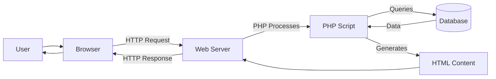

# PHP Introduction

## What is PHP?

<div style={{
    "width": "20%",
    "margin": "0 auto",
    "text-align": "center"
}}>
    
</div>

PHP (Hypertext Preprocessor) is a widely-used open-source server-side scripting language specifically designed for web development. Originally created by Rasmus Lerdorf in 1994, PHP has evolved into one of the most popular programming languages for building dynamic websites and web applications.

Unlike client-side languages like JavaScript that run in the user's browser, PHP code runs on the web server, generating HTML that is then sent to the client. This server-side execution makes PHP powerful for creating dynamic content, processing form data, accessing databases, and managing sessions.

## Why Learn PHP?

Here are some compelling reasons to learn PHP:

- **Widespread Usage**: PHP powers approximately 77% of all websites with a known server-side language
- **Easy to Learn**: PHP has a gentle learning curve, particularly for those with HTML knowledge
- **Versatility**: It works on all major operating systems and supports most web servers
- **Extensive Libraries**: PHP includes numerous built-in functions and extensions
- **Strong Community**: Large community support with abundant documentation and resources
- **Job Opportunities**: High demand for PHP developers in the job market
- **Popular Frameworks**: Powers frameworks like Laravel, Symfony, and WordPress (which runs about 43% of all websites)

## Setting Up PHP

Before writing PHP code, you need a proper development environment. Here's how to get started:

### Option 1: Local Development Environment

You can set up PHP locally using one of these methods:

1. **Install separate components**: Install PHP, a web server (like Apache), and MySQL individually
2. **All-in-one packages**: Use packages like XAMPP, WAMP (Windows), MAMP (Mac), or LAMP (Linux) that bundle everything together

### Option 2: Online Development Environment

If you prefer not to install anything, you can use online services like:
- Replit
- CodePen
- JSFiddle (with PHP support)

## PHP Basic Syntax

Let's start with basic PHP syntax. PHP code is enclosed within special start and end processing instructions:

```php
<?php
  // Your PHP code goes here
  echo "Hello, World!";
?>
```

You can embed PHP code within HTML:

```php
<!DOCTYPE html>
<html>
<head>
    <title>My First PHP Page</title>
</head>
<body>
    <h1>Welcome to PHP</h1>
    <?php
        echo "This is my first PHP script!";
    ?>
</body>
</html>
```

When executed, this produces:

```html
<!DOCTYPE html>
<html>
<head>
    <title>My First PHP Page</title>
</head>
<body>
    <h1>Welcome to PHP</h1>
    This is my first PHP script!
</body>
</html>
```

### Output with PHP

PHP uses several methods to output data:

- `echo`: Outputs one or more strings
- `print`: Similar to echo but can only output one string
- `print_r()`: Used to print arrays in a readable format (useful for debugging)
- `var_dump()`: Outputs information about a variable including its data type and value

Examples:

```php
<?php
// Using echo
echo "Hello World!";
echo "Multiple ", "strings ", "can be ", "concatenated.";

// Using print
print "Hello World!";

// Outputting variables
$name = "John";
echo "Hello " . $name;  // Using concatenation
echo "Hello $name";     // Using variable inside a double-quoted string

// print_r and var_dump for debugging
$colors = array("red", "blue", "green");
print_r($colors);
var_dump($colors);
?>
```

Output:
```
Hello World!
Multiple strings can be concatenated.
Hello World!
Hello John
Hello John
Array ( [0] => red [1] => blue [2] => green )
array(3) { [0]=> string(3) "red" [1]=> string(4) "blue" [2]=> string(5) "green" }
```

## PHP Variables

Variables in PHP are used to store data, like numbers, strings, arrays, and objects. Here's how to work with them:

### Variable Declaration

PHP variables start with a dollar sign (`$`) followed by the variable name:

```php
<?php
$text = "Hello World";
$number = 42;
$float = 3.14;
$isTrue = true;
$colors = array("red", "green", "blue");

// Displaying variables
echo $text;  // Outputs: Hello World
echo $number;  // Outputs: 42
?>
```

### Variable Rules

- Variable names must start with a letter or underscore
- Variable names can only contain alphanumeric characters and underscores (A-z, 0-9, and _)
- Variable names are case-sensitive ($name and $NAME are different variables)

### Variable Scope

PHP has three different variable scopes:

- **Local**: Variables declared within a function
- **Global**: Variables declared outside a function
- **Static**: Variables that don't lose their value when the function exits

```php
<?php
$globalVar = "I'm a global variable";  // Global scope

function testFunction() {
    $localVar = "I'm a local variable";  // Local scope
    
    // To access global variables inside a function:
    global $globalVar;
    echo $globalVar;
    
    // Static variable example
    static $counter = 0;
    $counter++;
    echo "Function called $counter time(s)";
}

testFunction();
testFunction();  // The counter will be 2 this time
?>
```

## PHP Data Types

PHP supports the following data types:

- **String**: Text enclosed in quotes (e.g., "Hello" or 'World')
- **Integer**: Whole numbers (e.g., 42, -7)
- **Float**: Decimal numbers (e.g., 3.14, -2.5)
- **Boolean**: True or false
- **Array**: Store multiple values in a single variable
- **Object**: Instance of a class
- **NULL**: Special type representing a variable with no value
- **Resource**: External resource reference (like a database connection)

```php
<?php
// String
$string = "Hello World";

// Integer
$integer = 25;

// Float
$float = 3.14;

// Boolean
$isTrue = true;
$isFalse = false;

// Array
$simpleArray = array("Apple", "Banana", "Orange");
$associativeArray = array("name" => "John", "age" => 30);

// Object
class Person {
    public $name;
    public function __construct($name) {
        $this->name = $name;
    }
}
$person = new Person("John");

// NULL
$nullVar = NULL;

// Checking data types
var_dump($string);    // string(11) "Hello World"
var_dump($integer);   // int(25)
var_dump($isTrue);    // bool(true)
var_dump($simpleArray);  // array(3) { [0]=> string(5) "Apple" [1]=> string(6) "Banana" [2]=> string(6) "Orange" }
?>
```

## PHP Constants

Constants are identifiers for values that cannot change during script execution:

```php
<?php
// Define a constant
define("GREETING", "Hello World!");
echo GREETING;  // Outputs: Hello World!

// Constants are global and can be used anywhere in your script
function testFunction() {
    echo GREETING;  // Will work without any additional code
}

// PHP predefined constants
echo PHP_VERSION;  // Outputs the PHP version
echo __FILE__;     // Outputs the current file path
?>
```

## PHP Operators

PHP provides various operators for performing operations on variables and values:

### Arithmetic Operators

```php
<?php
$a = 10;
$b = 3;

echo $a + $b;  // Addition: 13
echo $a - $b;  // Subtraction: 7
echo $a * $b;  // Multiplication: 30
echo $a / $b;  // Division: 3.33...
echo $a % $b;  // Modulus (remainder): 1
echo $a ** $b; // Exponentiation: 1000 (10^3)
?>
```

### Assignment Operators

```php
<?php
$x = 10;     // Basic assignment
$x += 5;     // Same as $x = $x + 5
$x -= 3;     // Same as $x = $x - 3
$x *= 2;     // Same as $x = $x * 2
$x /= 4;     // Same as $x = $x / 4
$x %= 3;     // Same as $x = $x % 3
?>
```

### Comparison Operators

```php
<?php
$a = 10;
$b = "10";

var_dump($a == $b);   // Equal (value): bool(true)
var_dump($a === $b);  // Identical (value and type): bool(false)
var_dump($a != $b);   // Not equal: bool(false)
var_dump($a !== $b);  // Not identical: bool(true)
var_dump($a > 5);     // Greater than: bool(true)
var_dump($a < 20);    // Less than: bool(true)
var_dump($a >= 10);   // Greater than or equal to: bool(true)
var_dump($a <= 10);   // Less than or equal to: bool(true)
?>
```

### Logical Operators

```php
<?php
$x = true;
$y = false;

var_dump($x && $y);  // AND: bool(false)
var_dump($x || $y);  // OR: bool(true)
var_dump(!$x);       // NOT: bool(false)
?>
```

## PHP Control Structures

Control structures allow you to control the flow of your script:

### If-Else Statement

```php
<?php
$hour = 14;  // 2 PM

if ($hour < 12) {
    echo "Good Morning!";
} elseif ($hour < 18) {
    echo "Good Afternoon!";
} else {
    echo "Good Evening!";
}
// Output: Good Afternoon!
?>
```

### Switch Statement

```php
<?php
$dayOfWeek = "Monday";

switch ($dayOfWeek) {
    case "Monday":
        echo "Start of work week.";
        break;
    case "Friday":
        echo "End of work week.";
        break;
    case "Saturday":
    case "Sunday":
        echo "Weekend!";
        break;
    default:
        echo "Midweek.";
}
// Output: Start of work week.
?>
```

### Loops

PHP provides several types of loops:

#### While Loop

```php
<?php
$i = 1;
while ($i <= 5) {
    echo $i . " ";
    $i++;
}
// Output: 1 2 3 4 5
?>
```

#### Do-While Loop

```php
<?php
$i = 1;
do {
    echo $i . " ";
    $i++;
} while ($i <= 5);
// Output: 1 2 3 4 5
?>
```

#### For Loop

```php
<?php
for ($i = 1; $i <= 5; $i++) {
    echo $i . " ";
}
// Output: 1 2 3 4 5
?>
```

#### Foreach Loop

```php
<?php
$colors = array("red", "green", "blue");

foreach ($colors as $color) {
    echo $color . " ";
}
// Output: red green blue

// With key and value
$person = array("name" => "John", "age" => 30, "job" => "Developer");
foreach ($person as $key => $value) {
    echo "$key: $value, ";
}
// Output: name: John, age: 30, job: Developer,
?>
```

## A Real-World Example: PHP Form Handling

One of the most common uses of PHP is form handling. Here's a simple example:

```php
<!DOCTYPE html>
<html>
<head>
    <title>PHP Form Example</title>
</head>
<body>
    <h2>Contact Form</h2>
    
    <?php
    // Define variables and set to empty values
    $nameErr = $emailErr = "";
    $name = $email = $message = "";
    $formSubmitted = false;
    
    // Form processing when submitted
    if ($_SERVER["REQUEST_METHOD"] == "POST") {
        $formSubmitted = true;
        
        // Validate name
        if (empty($_POST["name"])) {
            $nameErr = "Name is required";
        } else {
            $name = test_input($_POST["name"]);
        }
        
        // Validate email
        if (empty($_POST["email"])) {
            $emailErr = "Email is required";
        } else {
            $email = test_input($_POST["email"]);
            // Check if email address is well-formed
            if (!filter_var($email, FILTER_VALIDATE_EMAIL)) {
                $emailErr = "Invalid email format";
            }
        }
        
        // Get message
        $message = test_input($_POST["message"]);
    }
    
    // Function to sanitize input data
    function test_input($data) {
        $data = trim($data);
        $data = stripslashes($data);
        $data = htmlspecialchars($data);
        return $data;
    }
    ?>
    
    <!-- Show form if not submitted or if there are errors -->
    <?php if (!$formSubmitted || $nameErr || $emailErr): ?>
    
    <form method="post" action="<?php echo htmlspecialchars($_SERVER["PHP_SELF"]);?>">
        <div>
            <label for="name">Name:</label>
            <input type="text" name="name" value="<?php echo $name; ?>">
            <span style="color: red;"><?php echo $nameErr; ?></span>
        </div>
        
        <div>
            <label for="email">Email:</label>
            <input type="text" name="email" value="<?php echo $email; ?>">
            <span style="color: red;"><?php echo $emailErr; ?></span>
        </div>
        
        <div>
            <label for="message">Message:</label>
            <textarea name="message" rows="5" cols="40"><?php echo $message; ?></textarea>
        </div>
        
        <div>
            <input type="submit" name="submit" value="Submit">
        </div>
    </form>
    
    <?php else: ?>
    
    <!-- Thank you message when form is successfully submitted -->
    <div>
        <h3>Thank you for contacting us, <?php echo $name; ?>!</h3>
        <p>We have received your message and will respond to <?php echo $email; ?> soon.</p>
    </div>
    
    <?php endif; ?>
    
</body>
</html>
```

This example demonstrates:
- Form creation and processing
- Input validation
- Security measures (sanitizing input)
- Conditional output

## PHP in Web Development

PHP's role in the web development process can be visualized as:



## Summary

In this introduction, we've covered:

1. What PHP is and why it's important
2. Setting up a PHP development environment
3. Basic PHP syntax, including output methods
4. Variables and data types
5. Operators and control structures
6. A real-world example of form processing

PHP is a powerful language that forms the backbone of many web applications. As you continue your journey, you'll discover that PHP can handle everything from simple contact forms to complex e-commerce platforms and content management systems.

## Exercises for Practice

1. Create a simple PHP script that displays your name and current date/time.
2. Build a form that collects a user's name, age, and favorite color, then displays this information.
3. Write a PHP script that determines if a number is even or odd.
4. Create a PHP page that displays a different message based on the time of day.
5. Build a simple calculator that can add, subtract, multiply, and divide two numbers.

## Additional Resources

- [PHP Official Documentation](https://www.php.net/docs.php)
- [W3Schools PHP Tutorial](https://www.w3schools.com/php/)
- [PHP: The Right Way](https://phptherightway.com/)
- [PHP Sandbox](https://sandbox.onlinephpfunctions.com/) - Try PHP code online
- [PHP: A Beginner's Guide](https://www.codecademy.com/learn/learn-php)