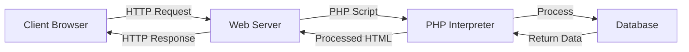
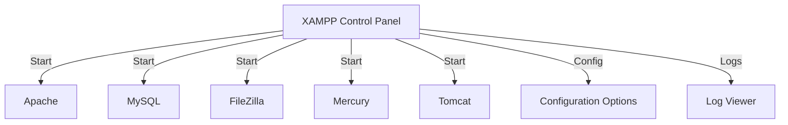

# PHP Environment Setup

## Introduction

Setting up a proper PHP development environment is the first crucial step in your journey to becoming a PHP developer. This guide will walk you through the process of installing and configuring PHP on different operating systems. We'll explore various options, from standalone PHP installations to all-in-one development stacks that include PHP, a web server, and a database.

By the end of this guide, you'll have a fully functional PHP environment where you can write, test, and debug your PHP applications.

## Understanding the PHP Environment

Before diving into installation steps, let's understand what components make up a typical PHP development environment:

1. **PHP Interpreter**: The core component that processes PHP code
2. **Web Server**: Software that serves web pages (commonly Apache or Nginx)
3. **Database**: For storing and retrieving data (commonly MySQL or MariaDB)
4. **Text Editor/IDE**: To write your PHP code (like VS Code, PHPStorm, or Sublime Text)

These components work together as illustrated in the following diagram:



## Installation Options

There are two main approaches to setting up a PHP environment:

1. **All-in-one packages**: These bundles include PHP, a web server, and a database in a single installation package
2. **Individual component installation**: Installing each component separately

For beginners, we recommend the all-in-one package approach as it simplifies the setup process significantly.

## All-in-One Development Stacks

### XAMPP (Cross-Platform)

XAMPP is one of the most popular development stacks, available for Windows, macOS, and Linux.

#### Installing XAMPP

1. **Download XAMPP**:
   - Visit [https://www.apachefriends.org/](https://www.apachefriends.org/)
   - Download the version for your operating system

2. **Installation on Windows**:
   - Run the downloaded installer
   - When prompted about Windows security and UAC, click "Yes"
   - Select components (at minimum, Apache, MySQL, PHP)
   - Choose installation directory (default is C:\xampp)
   - Complete the installation wizard

3. **Installation on macOS**:
   - Open the downloaded .dmg file
   - Drag the XAMPP icon to the Applications folder
   - Open the XAMPP application from your Applications folder

4. **Installation on Linux**:
   - Make the installer executable: `chmod +x xampp-linux-*.run`
   - Run the installer as root: `sudo ./xampp-linux-*.run`
   - Follow the installation prompts

5. **Starting XAMPP**:
   - Launch the XAMPP Control Panel
   - Start Apache and MySQL services by clicking the "Start" buttons

Here's what the XAMPP Control Panel looks like on Windows:



### WAMP (Windows)

WAMP (Windows, Apache, MySQL, PHP) is a Windows-specific development stack.

#### Installing WAMP

1. **Download WampServer**:
   - Visit [https://www.wampserver.com/en/](https://www.wampserver.com/en/)
   - Download the appropriate version (32-bit or 64-bit)

2. **Installation**:
   - Run the installer and follow the wizard
   - Select your default browser and text editor
   - Choose the location for installation (default is C:\wamp64 or C:\wamp)
   - Complete the installation

3. **Starting WAMP**:
   - Launch WampServer from the Start menu
   - The WAMP icon will appear in your system tray
   - Left-click the icon to view the dashboard
   - Ensure all services are running (icon should be green)

### MAMP (macOS and Windows)

MAMP (Mac, Apache, MySQL, PHP) was originally for macOS but is now available for Windows as well.

#### Installing MAMP

1. **Download MAMP**:
   - Visit [https://www.mamp.info/en/downloads/](https://www.mamp.info/en/downloads/)
   - Download the version for your operating system

2. **Installation on macOS**:
   - Open the downloaded .pkg file
   - Follow the installation wizard
   - MAMP will be installed in the Applications folder

3. **Installation on Windows**:
   - Run the installer and follow the wizard
   - Choose the installation location
   - Complete the installation

4. **Starting MAMP**:
   - Launch MAMP from your Applications folder (macOS) or Start menu (Windows)
   - Click "Start Servers" to begin
   - The welcome page will open automatically in your browser

### LAMP (Linux)

LAMP (Linux, Apache, MySQL, PHP) refers to installing these components individually on a Linux system.

#### Installing LAMP on Ubuntu

```bash
# Update system packages
sudo apt update

# Install Apache
sudo apt install apache2

# Install MySQL
sudo apt install mysql-server

# Install PHP and necessary extensions
sudo apt install php libapache2-mod-php php-mysql

# Restart Apache to apply changes
sudo systemctl restart apache2
```

## Manually Installing PHP Components

### Installing PHP on Windows

1. **Download PHP**:
   - Visit [https://windows.php.net/download/](https://windows.php.net/download/)
   - Download the latest Thread Safe ZIP package

2. **Extract the ZIP file**:
   - Create a folder (e.g., C:\php)
   - Extract the ZIP contents to this folder

3. **Configure PHP**:
   - In the PHP folder, copy `php.ini-development` to `php.ini`
   - Edit `php.ini` to uncomment necessary extensions:
     - Remove the semicolon (;) before `extension=mysqli`
     - Remove the semicolon before `extension=pdo_mysql`

4. **Add PHP to the System PATH**:
   - Right-click on "This PC" or "Computer" and select "Properties"
   - Click "Advanced system settings"
   - Click the "Environment Variables" button
   - Under "System variables", find and select "Path", then click "Edit"
   - Click "New" and add the path to your PHP folder (e.g., C:\php)
   - Click OK to close all dialogs

5. **Verify Installation**:
   - Open Command Prompt and type `php -v`
   - You should see the PHP version information

### Installing PHP on macOS

macOS comes with PHP pre-installed, but it may not be the latest version.

1. **Using Homebrew** (recommended):
   ```bash
   # Install Homebrew if not already installed
   /bin/bash -c "$(curl -fsSL https://raw.githubusercontent.com/Homebrew/install/HEAD/install.sh)"
   
   # Install PHP
   brew install php
   
   # Verify installation
   php -v
   ```

2. **Configure PHP**:
   - The php.ini file is located at `/usr/local/etc/php/X.Y/php.ini` (where X.Y is your PHP version)
   - Make any necessary changes to this file

### Installing PHP on Linux (Ubuntu)

1. **Install PHP and common extensions**:
   ```bash
   sudo apt update
   sudo apt install php php-cli php-fpm php-json php-common php-mysql php-zip php-gd php-mbstring php-curl php-xml php-pear php-bcmath
   ```

2. **Verify Installation**:
   ```bash
   php -v
   ```

## Testing Your PHP Installation

After setting up your PHP environment, you should test it to ensure everything is working correctly.

1. **Create a test PHP file**:
   - Navigate to your web server's document root:
     - XAMPP: `htdocs` folder (e.g., C:\xampp\htdocs)
     - WAMP: `www` folder (e.g., C:\wamp64\www)
     - MAMP: `htdocs` folder (e.g., /Applications/MAMP/htdocs)
     - LAMP: `/var/www/html`
   
   - Create a file named `info.php` with the following content:

```php
<?php
// Display all PHP information
phpinfo();
?>
```

2. **Access the file in your browser**:
   - Start your web server if it's not already running
   - Open your browser and navigate to:
     - XAMPP/WAMP/LAMP: `http://localhost/info.php`
     - MAMP: `http://localhost:8888/info.php` (default port is 8888)

3. **Expected Output**:
   You should see a page with comprehensive information about your PHP installation, including the version, loaded extensions, configuration settings, etc.

Here's what a portion of the output might look like:

```
PHP Version: 8.2.0

System: Windows NT DESKTOP-ABC123 10.0 build 19044
Server API: Apache 2.0 Handler
Virtual Directory Support: enabled
...
```

If you see this page, congratulations! Your PHP environment is set up correctly.

## Creating Your First PHP Script

Now let's create a simple "Hello World" script to test your PHP installation further:

1. **Create a new file** named `hello.php` in your web server's document root:

```php
<!DOCTYPE html>
<html>
<head>
    <title>My First PHP Page</title>
</head>
<body>
    <h1>Hello from PHP!</h1>
    
    <?php
    // This is a PHP code block
    echo "<p>Today's date is: " . date("Y-m-d") . "</p>";
    
    // A simple for loop
    echo "<p>Counting from 1 to 5: ";
    for ($i = 1; $i <= 5; $i++) {
        echo $i . " ";
    }
    echo "</p>";
    
    // Display server information
    echo "<p>You are running PHP version: " . phpversion() . "</p>";
    ?>
</body>
</html>
```

2. **Access the file** in your browser at `http://localhost/hello.php`

3. **Expected Output**:
   You should see a page with "Hello from PHP!" as the heading, followed by today's date, a counting sequence from 1 to 5, and your PHP version.

## Common Issues and Troubleshooting

### Port Conflicts

**Problem**: The web server fails to start because the port is already in use.
**Solution**: 
- Change the port in the configuration (Apache's httpd.conf file)
- Identify and stop the program using the conflicting port:
  ```bash
  # Windows (Command Prompt as Administrator)
  netstat -ano | findstr :80
  taskkill /PID [PID_NUMBER] /F
  
  # macOS/Linux
  sudo lsof -i :80
  sudo kill -9 [PID_NUMBER]
  ```

### Permission Issues

**Problem**: Server cannot write to files or directories.
**Solution**:
- Ensure proper permissions are set on the web directory:
  ```bash
  # Linux/macOS
  sudo chmod -R 755 /var/www/html
  sudo chown -R www-data:www-data /var/www/html
  ```

### PHP Extensions Not Loading

**Problem**: Required PHP extensions are not available.
**Solution**:
- Edit php.ini to enable necessary extensions
- Restart the web server after making changes

## Development Tools and IDEs

While a basic text editor can work for writing PHP code, specialized Integrated Development Environments (IDEs) can greatly improve your productivity:

1. **Visual Studio Code**:
   - Free, lightweight, and powerful
   - Install the PHP extensions like "PHP Intelephense" for better support

2. **PHPStorm**:
   - Paid IDE with comprehensive PHP support
   - Includes advanced features like code completion and debugging

3. **Sublime Text**:
   - Fast, customizable editor
   - Install PHP packages for better support

## Best Practices for Your Development Environment

1. **Use version control** (like Git) from the beginning
2. **Keep PHP and all components updated** regularly for security and new features
3. **Enable error reporting during development**:
   ```php
   // Add to the top of your scripts during development
   ini_set('display_errors', 1);
   ini_set('display_startup_errors', 1);
   error_reporting(E_ALL);
   ```
4. **Disable error display in production**:
   ```php
   // In production
   ini_set('display_errors', 0);
   error_reporting(0);
   ```
5. **Set up a staging environment** that mimics your production environment

## Summary

In this guide, we've covered everything you need to know to set up a PHP development environment:

- Understanding the components of a PHP environment
- Installing all-in-one packages (XAMPP, WAMP, MAMP, LAMP)
- Manually installing PHP components
- Testing your PHP installation
- Creating your first PHP script
- Troubleshooting common issues
- Recommended development tools

Setting up a proper PHP environment is the foundation for your PHP development journey. With your environment now configured, you're ready to start building PHP applications!

## Additional Resources

- [Official PHP Installation Documentation](https://www.php.net/manual/en/install.php)
- [XAMPP Documentation](https://www.apachefriends.org/docs/)
- [PHP The Right Way](https://phptherightway.com/)

## Exercises

1. Install PHP on your local machine using one of the methods described above.
2. Create a `phpinfo()` page and examine the output. List five important settings and their values.
3. Create a PHP script that shows the current date and time in different formats.
4. Modify the php.ini file to change the maximum file upload size, then verify your change worked.
5. Set up a virtual host for a project folder with its own domain name (e.g., myproject.local).