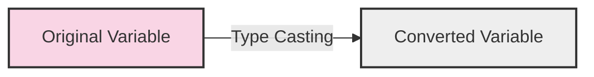

# PHP Type Casting

## Introduction

Type casting is the process of converting a variable from one data type to another. In PHP, which is a loosely typed language, variables don't need to be declared with a specific data type. However, there are situations where you need to ensure a variable is of a specific type for your code to work correctly.

This tutorial will explore the different methods of type casting in PHP, how they work, and when to use them. Whether you're parsing form data, working with database results, or performing calculations, understanding type casting is essential for writing reliable PHP code.

## What is Type Casting?

Type casting allows you to convert a variable from its original data type to another. For example, you might need to convert a string to an integer before performing arithmetic operations, or convert a number to a string before displaying it on a webpage.

PHP provides two primary methods for type casting:

1. **Implicit Type Casting (Automatic)** - PHP automatically converts a value from one data type to another when needed.
2. **Explicit Type Casting (Manual)** - You manually specify the data type conversion using casting operators.

Let's visualize how type casting works:



## Implicit Type Casting

PHP automatically converts variables between data types in certain contexts. This is also known as "type juggling."

### Example 1: String and Integer

```php
<?php
// PHP will automatically convert the string to an integer for addition
$string = "10";
$int = 20;
$result = $string + $int;

echo "Result: " . $result; // Output: Result: 30
echo "<br>";
echo "Type of result: " . gettype($result); // Output: Type of result: integer
?>
```

### Example 2: Boolean Conversion

```php
<?php
// PHP will convert different values to boolean in a condition
$zero = 0;
$nonZero = 42;
$emptyString = "";
$nonEmptyString = "Hello";

if ($zero) {
    echo "0 is true"; // This won't execute
} else {
    echo "0 is false"; // This will execute
}
echo "<br>";

if ($nonZero) {
    echo "42 is true"; // This will execute
} else {
    echo "42 is false";
}
echo "<br>";

if ($emptyString) {
    echo "Empty string is true";
} else {
    echo "Empty string is false"; // This will execute
}
echo "<br>";

if ($nonEmptyString) {
    echo "Non-empty string is true"; // This will execute
} else {
    echo "Non-empty string is false";
}
?>
```

**Output:**
```
0 is false
42 is true
Empty string is false
Non-empty string is true
```

While implicit type casting can be convenient, it can also lead to unexpected behavior or bugs if you're not careful. For more precise control, explicit type casting is recommended.

## Explicit Type Casting

PHP provides several casting operators that allow you to explicitly convert a variable from one data type to another:

- `(int)`, `(integer)` - Convert to integer
- `(bool)`, `(boolean)` - Convert to boolean
- `(float)`, `(double)`, `(real)` - Convert to float
- `(string)` - Convert to string
- `(array)` - Convert to array
- `(object)` - Convert to object
- `(unset)` - Convert to NULL (PHP 7.2 and earlier)

### Converting to Integer

```php
<?php
// Converting different types to integer
$floatVar = 7.8;
$stringVar = "42";
$stringWithText = "42 apples";
$boolVar = true;
$nullVar = null;

echo "(int)7.8 = " . (int)$floatVar . "<br>"; // Output: 7
echo "(int)\"42\" = " . (int)$stringVar . "<br>"; // Output: 42
echo "(int)\"42 apples\" = " . (int)$stringWithText . "<br>"; // Output: 42
echo "(int)true = " . (int)$boolVar . "<br>"; // Output: 1
echo "(int)null = " . (int)$nullVar . "<br>"; // Output: 0
?>
```

### Converting to Boolean

```php
<?php
// Converting different types to boolean
$intZero = 0;
$intNonZero = 42;
$stringEmpty = "";
$stringZero = "0";
$stringText = "Hello";
$nullVar = null;

echo "Boolean value of 0: " . (bool)$intZero . "<br>"; // Output: (empty - false is not displayed)
echo "Boolean value of 42: " . (bool)$intNonZero . "<br>"; // Output: 1
echo "Boolean value of empty string: " . var_export((bool)$stringEmpty, true) . "<br>"; // Output: false
echo "Boolean value of \"0\": " . var_export((bool)$stringZero, true) . "<br>"; // Output: false
echo "Boolean value of \"Hello\": " . (bool)$stringText . "<br>"; // Output: 1
echo "Boolean value of null: " . var_export((bool)$nullVar, true) . "<br>"; // Output: false
?>
```

### Converting to Float

```php
<?php
// Converting different types to float
$intVar = 42;
$stringVar = "7.8";
$stringWithText = "3.14 pi";
$boolVar = true;
$nullVar = null;

echo "(float)42 = " . (float)$intVar . "<br>"; // Output: 42.0
echo "(float)\"7.8\" = " . (float)$stringVar . "<br>"; // Output: 7.8
echo "(float)\"3.14 pi\" = " . (float)$stringWithText . "<br>"; // Output: 3.14
echo "(float)true = " . (float)$boolVar . "<br>"; // Output: 1.0
echo "(float)null = " . (float)$nullVar . "<br>"; // Output: 0.0
?>
```

### Converting to String

```php
<?php
// Converting different types to string
$intVar = 42;
$floatVar = 3.14;
$boolTrue = true;
$boolFalse = false;
$nullVar = null;
$arrayVar = [1, 2, 3];

echo "(string)42 = \"" . (string)$intVar . "\"<br>"; // Output: "42"
echo "(string)3.14 = \"" . (string)$floatVar . "\"<br>"; // Output: "3.14"
echo "(string)true = \"" . (string)$boolTrue . "\"<br>"; // Output: "1"
echo "(string)false = \"" . (string)$boolFalse . "\"<br>"; // Output: "" (empty string)
echo "(string)null = \"" . (string)$nullVar . "\"<br>"; // Output: "" (empty string)

// Arrays cannot be directly converted to strings
echo "Trying to convert array to string: ";
try {
    echo (string)$arrayVar;
} catch (Error $e) {
    echo "Error: " . $e->getMessage();
}
?>
```

### Converting to Array

```php
<?php
// Converting different types to array
$stringVar = "Hello";
$intVar = 42;
$nullVar = null;
$objectVar = new stdClass();
$objectVar->property = "value";

echo "String to array:<br>";
print_r((array)$stringVar);
echo "<br><br>";

echo "Integer to array:<br>";
print_r((array)$intVar);
echo "<br><br>";

echo "Null to array:<br>";
print_r((array)$nullVar);
echo "<br><br>";

echo "Object to array:<br>";
print_r((array)$objectVar);
?>
```

**Output:**
```
String to array:
Array ( [0] => Hello )

Integer to array:
Array ( [0] => 42 )

Null to array:
Array ( )

Object to array:
Array ( [property] => value )
```

### Converting to Object

```php
<?php
// Converting different types to object
$arrayVar = ['name' => 'John', 'age' => 30];
$stringVar = "Hello";
$intVar = 42;
$nullVar = null;

echo "Array to object:<br>";
$objFromArray = (object)$arrayVar;
echo $objFromArray->name . ", " . $objFromArray->age . "<br><br>";

echo "String to object:<br>";
$objFromString = (object)$stringVar;
print_r($objFromString);
echo "<br><br>";

echo "Integer to object:<br>";
$objFromInt = (object)$intVar;
print_r($objFromInt);
echo "<br><br>";

echo "Null to object:<br>";
$objFromNull = (object)$nullVar;
print_r($objFromNull);
?>
```

**Output:**
```
Array to object:
John, 30

String to object:
stdClass Object ( [scalar] => Hello )

Integer to object:
stdClass Object ( [scalar] => 42 )

Null to object:
stdClass Object ( )
```

## Type Casting Functions

In addition to casting operators, PHP provides several functions for type conversion:

### intval(), floatval(), and strval()

```php
<?php
$mixed = "42.8 apples";

echo "intval(\"$mixed\") = " . intval($mixed) . "<br>"; // Output: 42
echo "floatval(\"$mixed\") = " . floatval($mixed) . "<br>"; // Output: 42.8
echo "strval(42) = \"" . strval(42) . "\"<br>"; // Output: "42"
?>
```

### settype()

The `settype()` function changes the data type of a variable directly:

```php
<?php
$var = "42";
echo "Original \$var: $var, type: " . gettype($var) . "<br>";

settype($var, "integer");
echo "After settype to integer: $var, type: " . gettype($var) . "<br>";

settype($var, "string");
echo "After settype to string: $var, type: " . gettype($var) . "<br>";

settype($var, "boolean");
echo "After settype to boolean: $var, type: " . gettype($var) . "<br>";
echo "Boolean value: " . ($var ? "true" : "false") . "<br>";
?>
```

**Output:**
```
Original $var: 42, type: string
After settype to integer: 42, type: integer
After settype to string: 42, type: string
After settype to boolean: 1, type: boolean
Boolean value: true
```

## Practical Examples

### Example 1: Form Data Processing

When processing form data, you often need to ensure values are of the correct type:

```php
<?php
// Simulating form data
$formData = [
    'name' => 'John Doe',
    'age' => '25',
    'height' => '1.85',
    'is_subscribed' => 'yes'
];

// Type casting form data
$processedData = [
    'name' => (string)$formData['name'],
    'age' => (int)$formData['age'],
    'height' => (float)$formData['height'],
    'is_subscribed' => ($formData['is_subscribed'] === 'yes') ? true : false
];

echo "Processed form data:<br>";
echo "Name: " . $processedData['name'] . " (Type: " . gettype($processedData['name']) . ")<br>";
echo "Age: " . $processedData['age'] . " (Type: " . gettype($processedData['age']) . ")<br>";
echo "Height: " . $processedData['height'] . " (Type: " . gettype($processedData['height']) . ")<br>";
echo "Subscribed: " . ($processedData['is_subscribed'] ? 'Yes' : 'No') . " (Type: " . gettype($processedData['is_subscribed']) . ")";
?>
```

**Output:**
```
Processed form data:
Name: John Doe (Type: string)
Age: 25 (Type: integer)
Height: 1.85 (Type: double)
Subscribed: Yes (Type: boolean)
```

### Example 2: Database Results Processing

When working with database results, you may need to ensure data is of the correct type:

```php
<?php
// Simulating database result (string values from a database)
$dbResult = [
    'id' => '1001',
    'product_name' => 'Laptop',
    'price' => '999.99',
    'in_stock' => '1',
    'description' => null
];

// Processing database result with type casting
$product = [
    'id' => (int)$dbResult['id'],
    'product_name' => (string)$dbResult['product_name'],
    'price' => (float)$dbResult['price'],
    'in_stock' => (bool)$dbResult['in_stock'],
    'description' => $dbResult['description'] !== null ? (string)$dbResult['description'] : 'No description available'
];

echo "Processed product data:<br>";
echo "ID: " . $product['id'] . " (Type: " . gettype($product['id']) . ")<br>";
echo "Product Name: " . $product['product_name'] . " (Type: " . gettype($product['product_name']) . ")<br>";
echo "Price: $" . $product['price'] . " (Type: " . gettype($product['price']) . ")<br>";
echo "In Stock: " . ($product['in_stock'] ? 'Yes' : 'No') . " (Type: " . gettype($product['in_stock']) . ")<br>";
echo "Description: " . $product['description'] . " (Type: " . gettype($product['description']) . ")";
?>
```

**Output:**
```
Processed product data:
ID: 1001 (Type: integer)
Product Name: Laptop (Type: string)
Price: $999.99 (Type: double)
In Stock: Yes (Type: boolean)
Description: No description available (Type: string)
```

### Example 3: Mathematical Calculations

When performing calculations, type casting ensures values are treated as numbers:

```php
<?php
// Values obtained from various sources
$a = "10.5"; // From a form input
$b = 5;      // From a counter
$c = "15";   // From a database

// Without type casting (string concatenation may occur)
$result1 = $a + $b + $c;

// With explicit type casting
$result2 = (float)$a + (int)$b + (int)$c;

echo "Result without explicit type casting: $result1<br>";
echo "Result with explicit type casting: $result2<br>";

// Common mistake: string concatenation vs. addition
$num1 = "10";
$num2 = "20";

echo "String concatenation: " . $num1 . $num2 . "<br>"; // Output: 1020
echo "Addition after type casting: " . ((int)$num1 + (int)$num2) . "<br>"; // Output: 30
?>
```

**Output:**
```
Result without explicit type casting: 30.5
Result with explicit type casting: 30.5
String concatenation: 1020
Addition after type casting: 30
```

## Best Practices for Type Casting in PHP

1. **Be Explicit** - Use explicit type casting when the type is important to ensure your code behaves as expected.

2. **Validate Input** - Always validate and sanitize user input before type casting.

3. **Use Type-Specific Functions** - For more complex conversions, use PHP's built-in functions like `intval()`, `floatval()`, etc.

4. **Handle Edge Cases** - Consider what happens when casting unexpected values (e.g., non-numeric strings to numbers).

5. **Type-Checking** - Use functions like `is_int()`, `is_string()`, etc., to check types before operations.

```php
<?php
// Example of input validation before type casting
function processAge($inputAge) {
    // Validate input
    if (!is_numeric($inputAge)) {
        return "Error: Age must be a number";
    }
    
    // Type cast and validate range
    $age = (int)$inputAge;
    if ($age < 0 || $age > 120) {
        return "Error: Age must be between 0 and 120";
    }
    
    return "Valid age: $age";
}

echo processAge("25") . "<br>";     // Output: Valid age: 25
echo processAge("abc") . "<br>";    // Output: Error: Age must be a number
echo processAge("150") . "<br>";    // Output: Error: Age must be between 0 and 120
echo processAge("30.5") . "<br>";   // Output: Valid age: 30 (decimal part truncated)
?>
```

## Summary

Type casting in PHP is a powerful feature that allows you to convert variables from one data type to another. This is particularly useful in a loosely typed language like PHP, where variables can change types automatically based on context.

In this tutorial, we've covered:

- The difference between implicit and explicit type casting
- How to use casting operators such as `(int)`, `(float)`, `(string)`, etc.
- Type conversion functions like `intval()`, `floatval()`, and `settype()`
- Practical examples of type casting in form processing, database operations, and calculations
- Best practices for type casting in PHP

By mastering type casting, you'll write more reliable and predictable PHP code, reduce bugs caused by unexpected type conversions, and improve your overall programming skills.

## Exercises

1. Create a simple calculator that takes string inputs from a form and correctly performs arithmetic operations after type casting.

2. Write a function that sanitizes and type casts user registration data (name, age, email, etc.) before storing it.

3. Create a function that converts associative arrays to objects and back, preserving all data.

4. Write a script that demonstrates the difference between `==` (loose comparison) and `===` (strict comparison) with different data types.

5. Create a validation function that checks if a string can be safely converted to a specific data type.

## Additional Resources

- [PHP Manual: Type Juggling](https://www.php.net/manual/en/language.types.type-juggling.php)
- [PHP Manual: Type Casting](https://www.php.net/manual/en/language.types.type-juggling.php#language.types.typecasting)
- [PHP Data Types](https://www.php.net/manual/en/language.types.php)
- [PHP Type Comparisons](https://www.php.net/manual/en/types.comparisons.php)