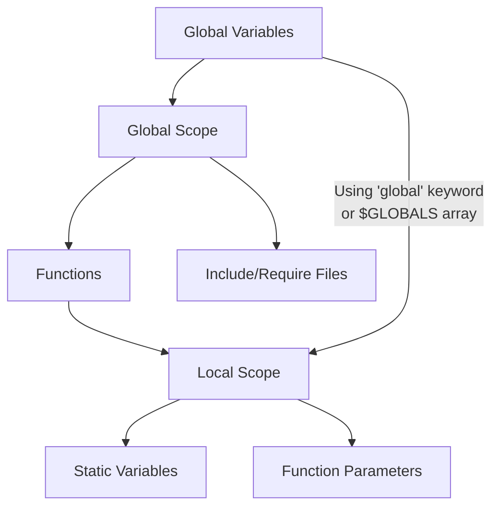

# PHP Scope

## Introduction

When working with PHP, understanding **variable scope** is essential for writing effective and bug-free code. Variable scope determines where in your code a particular variable can be accessed or modified. Misunderstanding scope can lead to unexpected behavior, hard-to-trace bugs, and inefficient code.

In this tutorial, we'll explore the different types of variable scopes in PHP, how to properly access and modify variables across different scopes, and see practical examples of scope in action.

## What is Variable Scope?

Scope refers to the region of your code where a variable is visible and accessible. In PHP, variables have different levels of visibility depending on where they are declared.

The main scopes in PHP are:

1. **Local scope** - Variables defined inside a function
2. **Global scope** - Variables defined outside all functions
3. **Static scope** - Variables that maintain their value between function calls
4. **Parameter scope** - Function parameters have local scope within a function

Let's explore each of these in detail.

## Local Scope

A variable declared inside a function has **local scope**. This means it can only be accessed within that function. Local variables are created when the function starts and are destroyed when the function completes.

```php
<?php
function testFunction() {
    $localVar = "I'm a local variable";
    echo $localVar; // This works
}

testFunction(); // Outputs: I'm a local variable

// Trying to access the variable outside the function
echo $localVar; // Error: Undefined variable $localVar
?>
```

**Output:**
```
I'm a local variable
PHP Notice:  Undefined variable: localVar
```

Local variables from one function are not accessible in other functions, even if they share the same name:

```php
<?php
function firstFunction() {
    $number = 10;
    echo "In firstFunction, number = $number
";
}

function secondFunction() {
    $number = 20;
    echo "In secondFunction, number = $number
";
}

firstFunction();
secondFunction();
?>
```

**Output:**
```
In firstFunction, number = 10
In secondFunction, number = 20
```

## Global Scope

Variables declared outside any function have **global scope**. These variables can be accessed from anywhere in the script, except inside functions where they need to be explicitly declared as global.

```php
<?php
$globalVar = "I'm a global variable";

echo "$globalVar outside a function
"; // This works

function testGlobal() {
    echo "$globalVar inside a function
"; // This doesn't work
}

testGlobal();
?>
```

**Output:**
```
I'm a global variable outside a function
PHP Notice:  Undefined variable: globalVar inside a function
```

To access a global variable inside a function, you need to use the `global` keyword:

```php
<?php
$globalVar = "I'm a global variable";

function testGlobal() {
    global $globalVar; // Declare the variable as global
    echo "$globalVar inside a function
"; // Now it works
}

testGlobal();

// You can also modify global variables from inside functions
function modifyGlobal() {
    global $globalVar;
    $globalVar = "Modified global variable";
}

modifyGlobal();
echo $globalVar; // Shows the modified value
?>
```

**Output:**
```
I'm a global variable inside a function
Modified global variable
```

### The $GLOBALS Array

Another way to access global variables inside functions is using the `$GLOBALS` array, which is a superglobal array that contains all global variables:

```php
<?php
$name = "John";

function greet() {
    echo "Hello, " . $GLOBALS['name'] . "!
";
    
    // You can also modify global variables this way
    $GLOBALS['name'] = "Jane";
}

greet();
echo "Name is now: $name";
?>
```

**Output:**
```
Hello, John!
Name is now: Jane
```

## Static Scope

The `static` keyword allows you to declare variables that maintain their value between function calls. Static variables only exist within the function's local scope but don't lose their value when the function exits.

```php
<?php
function counter() {
    static $count = 0; // Static variable initialized only once
    $count++;
    echo "Function has been called $count time(s)
";
}

counter(); // Outputs: Function has been called 1 time(s)
counter(); // Outputs: Function has been called 2 time(s)
counter(); // Outputs: Function has been called 3 time(s)
?>
```

**Output:**
```
Function has been called 1 time(s)
Function has been called 2 time(s)
Function has been called 3 time(s)
```

Without the `static` keyword, `$count` would be reinitialized to 0 each time the function is called.

Static variables are particularly useful for:
- Counting function calls
- Caching results
- Maintaining state between function calls

## Function Parameters

Function parameters are treated as local variables within the function. They're initialized with the values provided when the function is called.

```php
<?php
function greetPerson($name, $greeting = "Hello") {
    echo "$greeting, $name!
";
}

greetPerson("Maria"); // Uses the default greeting
greetPerson("Alex", "Hi"); // Provides a custom greeting
?>
```

**Output:**
```
Hello, Maria!
Hi, Alex!
```

### Parameter Passing: By Value vs. By Reference

By default, parameters are passed **by value**, meaning a copy of the value is created:

```php
<?php
function incrementNumber($num) {
    $num += 5;
    echo "Inside function: $num
";
}

$myNum = 10;
incrementNumber($myNum);
echo "Outside function: $myNum
"; // Value remains unchanged
?>
```

**Output:**
```
Inside function: 15
Outside function: 10
```

To modify the original variable, pass the parameter **by reference** using the `&` symbol:

```php
<?php
function incrementNumber(&$num) {
    $num += 5;
    echo "Inside function: $num
";
}

$myNum = 10;
incrementNumber($myNum);
echo "Outside function: $myNum
"; // Value is modified
?>
```

**Output:**
```
Inside function: 15
Outside function: 15
```

## Scope in Include and Require Files

When you include a file using `include` or `require`, any variables defined in the included file become available in the scope where the include statement is placed:

```php
// main.php
<?php
$mainVar = "I'm from main.php";
include 'included.php'; // This file uses and modifies variables
echo $mainVar . "
"; // Shows modified value
echo $includedVar; // Can access variables from the included file
?>

// included.php
<?php
$mainVar .= " - Modified in included.php";
$includedVar = "I'm defined in included.php";
?>
```

**Output (when running main.php):**
```
I'm from main.php - Modified in included.php
I'm defined in included.php
```

## Visualizing Variable Scope

Let's visualize how variable scope works in PHP with a diagram:



## Practical Examples

### Example 1: User Registration System

Here's a simplified example of how scope might be used in a user registration system:

```php
<?php
// Global configuration
$dbConnection = new mysqli("localhost", "username", "password", "database");

// Function to check if username exists
function isUsernameTaken($username) {
    global $dbConnection;
    
    $stmt = $dbConnection->prepare("SELECT id FROM users WHERE username = ?");
    $stmt->bind_param("s", $username);
    $stmt->execute();
    $result = $stmt->get_result();
    
    return $result->num_rows > 0;
}

// Function to register a new user
function registerUser($username, $password) {
    global $dbConnection;
    
    // Check if username already exists
    if (isUsernameTaken($username)) {
        return "Username already taken";
    }
    
    // Hash the password
    $hashedPassword = password_hash($password, PASSWORD_DEFAULT);
    
    // Insert the new user
    $stmt = $dbConnection->prepare("INSERT INTO users (username, password) VALUES (?, ?)");
    $stmt->bind_param("ss", $username, $hashedPassword);
    
    if ($stmt->execute()) {
        return "User registered successfully";
    } else {
        return "Registration failed: " . $dbConnection->error;
    }
}

// Usage
echo registerUser("john_doe", "secure_password");
?>
```

### Example 2: Shopping Cart Counter

Here's an example using static variables to count items in a shopping cart:

```php
<?php
function addToCart($item) {
    static $cart = [];
    static $itemCount = 0;
    
    $cart[] = $item;
    $itemCount++;
    
    echo "$item added to cart. You now have $itemCount item(s) in your cart.
";
    
    return $cart;
}

$myCart = addToCart("Laptop"); // First item
$myCart = addToCart("Phone");  // Second item
$myCart = addToCart("Headphones"); // Third item

echo "Cart contents: " . implode(", ", $myCart);
?>
```

**Output:**
```
Laptop added to cart. You now have 1 item(s) in your cart.
Phone added to cart. You now have 2 item(s) in your cart.
Headphones added to cart. You now have 3 item(s) in your cart.
Cart contents: Laptop, Phone, Headphones
```

## Common Pitfalls and Best Practices

### Pitfalls to Avoid

1. **Accidental Global Variables**: When you forget to declare a variable before using it in a function, PHP automatically creates it as a local variable, not a global one.

```php
<?php
$total = 0;

function addToTotal($value) {
    $total += $value; // This creates a NEW local $total, doesn't modify the global one
    return $total;
}

echo addToTotal(5); // Outputs: 5
echo $total;        // Outputs: 0 (unchanged)
?>
```

2. **Overuse of Global Variables**: Using too many global variables can make code harder to maintain and debug. Instead, consider passing values as parameters.

3. **Variable Collisions**: When different functions use variables with the same name, this can lead to confusion even though they don't actually conflict.

### Best Practices

1. **Minimize Global Variables**: Limit the use of global variables to essential configuration and state information.

2. **Use Functions for Encapsulation**: Encapsulate related functionality in functions to control variable scope.

3. **Pass Parameters Instead of Using Globals**: When possible, pass values as parameters rather than accessing globals inside functions.

4. **Return Values Instead of Modifying Globals**: Functions should generally return values rather than modifying global state.

5. **Use Static Variables Sparingly**: Only use static variables when you genuinely need to maintain state between function calls.

## Summary

Understanding PHP variable scope is crucial for writing clean, maintainable, and bug-free code. We've covered:

- **Local scope**: Variables defined inside functions, accessible only within that function
- **Global scope**: Variables defined outside functions, requiring special handling to access inside functions
- **Static scope**: Variables that maintain their values between function calls
- **Parameter scope**: How function arguments are treated as local variables

The proper use of variable scope can make your code more modular, easier to debug, and less prone to unexpected behavior.

## Exercises

1. Create a function that uses a static variable to track how many times it has been called, and returns a different message for the first, second, and all subsequent calls.

2. Write a script that defines a global array, then creates two functions - one that adds items to the array and another that removes items. Test your functions to ensure they're properly modifying the global array.

3. Create a counter class that uses static methods to track how many instances of the class have been created.

## Additional Resources

- [PHP Manual: Variable Scope](https://www.php.net/manual/en/language.variables.scope.php)
- [PHP Manual: Static Variables](https://www.php.net/manual/en/language.variables.scope.php#language.variables.scope.static)
- [PHP Manual: Global Variables](https://www.php.net/manual/en/reserved.variables.globals.php)