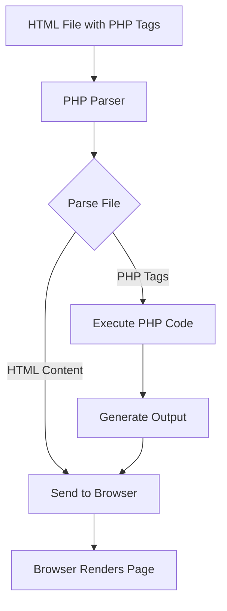

# PHP Tags

## Introduction

PHP tags are essential syntax elements that mark the beginning and end of PHP code blocks within HTML documents. These special delimiters tell the PHP interpreter which parts of your document contain PHP code that needs to be executed, as opposed to HTML content that should be sent directly to the browser.

Understanding PHP tags is fundamental for anyone learning PHP, as they serve as the bridge between PHP's server-side processing and HTML's presentation layer. This guide will explore the different types of PHP tags, their syntax, and best practices for their usage.

## Types of PHP Tags

PHP offers several different tag styles, each with its own syntax and use cases:

### 1. Standard PHP Tags

```php
<?php
  // PHP code goes here
?>
```

Standard PHP tags are the most widely used and universally compatible way to embed PHP code. They are always available and cannot be disabled in PHP configurations.

**Example:**

```php
<!DOCTYPE html>
<html>
<head>
    <title>My First PHP Page</title>
</head>
<body>
    <h1>Hello World</h1>
    <?php
        // This is PHP code
        echo "This text was generated by PHP!";
    ?>
</body>
</html>
```

**Output:**
```
Hello World
This text was generated by PHP!
```

### 2. Short Echo Tags

```php
<?= expression ?>
```

Short echo tags are a convenient shorthand for outputting expressions. They are equivalent to writing `<?php echo expression ?>`.

**Example:**

```php
<!DOCTYPE html>
<html>
<head>
    <title>Using Short Echo Tags</title>
</head>
<body>
    <h1>User Profile</h1>
    <p>Welcome, <?= $username ?>!</p>
    <p>Your account balance is: $<?= number_format($balance, 2) ?></p>
</body>
</html>
```

Assuming `$username = "JohnDoe"` and `$balance = 1250.75`, the output would be:

```
User Profile
Welcome, JohnDoe!
Your account balance is: $1,250.75
```

### 3. Short PHP Tags (Not Recommended)

```php
<? 
  // PHP code goes here 
?>
```

Short PHP tags provide a shorter alternative to the standard tags. However, they're not recommended for a few important reasons:
- They might be disabled in PHP configurations (`short_open_tag` setting)
- They can conflict with XML processing instructions
- They're less portable across different PHP environments

**Example:**

```php
<? 
    $greeting = "Hello from short tags!"; 
    echo $greeting;
?>
```

### 4. ASP-style Tags (Deprecated)

```php
<% 
  // PHP code goes here 
%>
```

ASP-style tags were introduced to make PHP syntax more familiar to developers coming from ASP backgrounds. However, they are deprecated and disabled by default in modern PHP versions.

## When to Use PHP Tags

Here are some common scenarios where you'll use PHP tags:

### 1. Embedding Dynamic Content in HTML

```php
<div class="product">
    <h2><?= $product['name'] ?></h2>
    <p class="price">$<?= number_format($product['price'], 2) ?></p>
    <?php if ($product['in_stock']): ?>
        <span class="badge badge-success">In Stock</span>
    <?php else: ?>
        <span class="badge badge-danger">Out of Stock</span>
    <?php endif; ?>
</div>
```

### 2. Processing Form Data

```php
<!DOCTYPE html>
<html>
<head>
    <title>Contact Form</title>
</head>
<body>
    <h1>Contact Us</h1>
    
    <?php
    // Check if form was submitted
    if ($_SERVER['REQUEST_METHOD'] === 'POST') {
        $name = $_POST['name'] ?? '';
        $email = $_POST['email'] ?? '';
        $message = $_POST['message'] ?? '';
        
        // Simple validation
        if (empty($name) || empty($email) || empty($message)) {
            echo '<div class="error">Please fill out all fields</div>';
        } else {
            // Process the form (e.g., send email)
            echo '<div class="success">Thank you for your message!</div>';
        }
    }
    ?>
    
    <form method="post">
        <div>
            <label for="name">Name:</label>
            <input type="text" id="name" name="name">
        </div>
        <div>
            <label for="email">Email:</label>
            <input type="email" id="email" name="email">
        </div>
        <div>
            <label for="message">Message:</label>
            <textarea id="message" name="message"></textarea>
        </div>
        <button type="submit">Send Message</button>
    </form>
</body>
</html>
```

### 3. Including External Files

```php
<!DOCTYPE html>
<html>
<head>
    <title>My Website</title>
    <?php include 'header-meta.php'; ?>
</head>
<body>
    <?php include 'navigation.php'; ?>
    
    <main>
        <h1>Welcome to My Website</h1>
        <p>This is the homepage content.</p>
    </main>
    
    <?php include 'footer.php'; ?>
</body>
</html>
```

## Alternative Syntax for Control Structures

When embedding PHP control structures within HTML, there's an alternative syntax that makes your code more readable:

```php
<?php if ($condition): ?>
    <!-- HTML content for true condition -->
<?php else: ?>
    <!-- HTML content for false condition -->
<?php endif; ?>

<?php foreach ($items as $item): ?>
    <!-- HTML content for each item -->
<?php endforeach; ?>
```

This syntax is particularly useful in templates where PHP and HTML are heavily intermixed.

## Best Practices for PHP Tags

1. **Always use standard PHP tags or short echo tags**
   ```php
   <?php /* Standard tags are always supported */ ?>
   <?= $variable ?>  // Short echo tags are convenient for output
   ```

2. **Avoid short PHP tags and ASP-style tags**
   Short tags (`<?`) might be disabled on some servers, and ASP-style tags (`<%`) are deprecated.

3. **Close PHP tags properly**
   Always make sure each opening tag has a corresponding closing tag to avoid parsing errors.

4. **Omit closing tag in PHP-only files**
   For files containing only PHP code, omit the closing `?>` tag to prevent accidental whitespace being sent to the browser.

5. **Use alternative syntax in templates**
   When mixing PHP and HTML, use the alternative syntax for control structures to improve readability.

6. **Be consistent with your tag style**
   Choose one style of PHP tags and stick with it throughout your project for consistency.

## Common Errors with PHP Tags

### 1. Whitespace Before PHP Tags

```php
 <?php echo "This will cause an error"; ?>
```
The space before `<?php` will result in output being sent to the browser before PHP processing begins, which can cause issues with sessions, headers, and redirects.

### 2. Forgetting to Close Tags

```php
<?php
  echo "This opens a PHP tag";
  // But forgets to close it!
```

### 3. Mixing Tags in a Nested Fashion

```php
<?php if ($condition) { ?>
    <p>Some HTML</p>
    <? echo "This can cause issues"; ?>
<?php } ?>
```

Mixing different tag styles can lead to parsing errors and inconsistent behavior across different environments.

## Diagrams: PHP Processing Flow



## Summary

PHP tags are fundamental building blocks that allow you to integrate PHP code with HTML. By understanding the different types of tags and following best practices, you can write cleaner, more maintainable code. Remember to:

- Use standard PHP tags (`<?php ?>`) for most code
- Use short echo tags (`<?= ?>`) for outputting expressions
- Avoid short tags and ASP-style tags for compatibility
- Follow proper tag syntax and nesting
- Consider the alternative syntax for control structures in templates

## Exercises

1. Create a simple HTML page with at least three different examples of PHP tags usage.
2. Write a PHP script that demonstrates the different ways to output variables using PHP tags.
3. Create a template file that uses the alternative syntax for control structures to display data from an array.
4. Debug a snippet of code that has PHP tag related errors.

## Additional Resources

- [PHP Manual: PHP Tags](https://www.php.net/manual/en/language.basic-syntax.phptags.php)
- [PHP Configuration: short_open_tag](https://www.php.net/manual/en/ini.core.php#ini.short-open-tag)
- [PHP Template Best Practices](https://phptherightway.com)