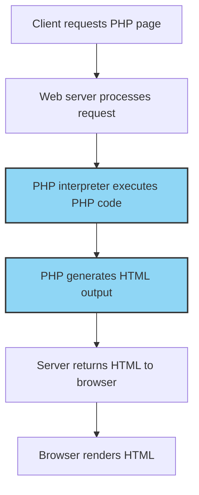

# PHP First Script

## Introduction

Welcome to your first step into the world of PHP programming! PHP (which stands for "PHP: Hypertext Preprocessor") is a widely-used, open-source scripting language especially suited for web development. Unlike JavaScript which runs in the browser, PHP code executes on the server and generates HTML that is then sent to the client.

In this tutorial, you'll learn how to create and run your very first PHP script. We'll cover the basic syntax, how to output text, and introduce you to variables - fundamental building blocks for any PHP application.

## Setting Up Your Environment

Before writing your first PHP script, make sure you have:

1. A web server with PHP installed (like XAMPP, WAMP, or MAMP for local development)
2. A text editor or IDE (like Visual Studio Code, Sublime Text, or PhpStorm)

If you haven't set these up yet, please refer to our "PHP Environment Setup" guide.

## Your First PHP Script

Let's start with the most basic PHP script - displaying "Hello, World!" on a webpage.

### Creating the File

1. Create a new file called `hello.php`
2. Open it in your text editor
3. Add the following code:

```php
<!DOCTYPE html>
<html>
<head>
    <title>My First PHP Script</title>
</head>
<body>
    <h1>Hello from HTML!</h1>
    
    <?php
    // This is a PHP code block
    echo "Hello, World from PHP!";
    ?>
</body>
</html>
```

### Understanding the Code

Let's break down what's happening in this script:

1. The file contains regular HTML like any web page
2. The `<?php ?>` tags define where PHP code begins and ends
3. The `echo` statement outputs text to the page
4. The `//` indicates a comment (not executed)

### Running Your Script

To run your PHP script:

1. Save the file in your web server's document root folder (e.g., `htdocs` in XAMPP)
2. Start your web server
3. Open a browser and navigate to `http://localhost/hello.php`

You should see both the HTML heading and the PHP-generated text displayed on the page.

## PHP Tags and Output

There are a few ways to include PHP code in your HTML documents.

### PHP Tags

```php
<?php
  // Your PHP code goes here
?>
```

These are the standard PHP opening and closing tags. Always use these for maximum compatibility.

### Shorthand Echo

PHP provides a shortcut for outputting data:

```php
<p>The current year is: <?= date("Y"); ?></p>
```

The `<?=` tag is equivalent to `<?php echo`.

## Variables and Basic Data Types

Let's enhance our script by using variables.

### Creating a New Script

Create a file called `variables.php` with the following code:

```php
<!DOCTYPE html>
<html>
<head>
    <title>PHP Variables</title>
</head>
<body>
    <h1>Working with PHP Variables</h1>
    
    <?php
    // Declaring variables
    $name = "John";
    $age = 25;
    $isStudent = true;
    $height = 1.85;
    
    // Using variables in output
    echo "<p>Hello, my name is $name.</p>";
    echo "<p>I am $age years old.</p>";
    echo "<p>Height: $height meters</p>";
    
    // Checking if someone is a student
    if ($isStudent) {
        echo "<p>I am currently a student.</p>";
    } else {
        echo "<p>I am not a student.</p>";
    }
    ?>
</body>
</html>
```

### Understanding Variables

In PHP:

- Variable names always start with a `$` symbol
- Variable names are case-sensitive (`$name` and `$Name` are different variables)
- Variables don't need to be declared with a specific type (PHP is loosely typed)
- You can include variables directly inside double-quoted strings

## Concatenation and Operations

PHP allows you to combine strings and perform operations with variables.

```php
<?php
$firstName = "Jane";
$lastName = "Doe";

// String concatenation using the '.' operator
$fullName = $firstName . " " . $lastName;
echo "<p>Full name: $fullName</p>";

// Basic arithmetic
$num1 = 10;
$num2 = 5;

echo "<p>Addition: " . ($num1 + $num2) . "</p>";
echo "<p>Subtraction: " . ($num1 - $num2) . "</p>";
echo "<p>Multiplication: " . ($num1 * $num2) . "</p>";
echo "<p>Division: " . ($num1 / $num2) . "</p>";
?>
```

## Creating a Practical Example

Let's build something a bit more useful - a simple greeting script that displays different messages based on the time of day.

Create a file called `greeting.php`:

```php
<!DOCTYPE html>
<html>
<head>
    <title>Time-based Greeting</title>
    <style>
        body {
            font-family: Arial, sans-serif;
            text-align: center;
            margin-top: 50px;
        }
        .greeting {
            font-size: 24px;
            margin-bottom: 20px;
        }
        .time {
            font-size: 18px;
            color: #666;
        }
    </style>
</head>
<body>
    <?php
    // Get the current hour (0-23)
    $currentHour = date('H');
    $currentTime = date('h:i A');
    
    // Initialize greeting variable
    $greeting = "";
    
    // Determine appropriate greeting based on time of day
    if ($currentHour < 12) {
        $greeting = "Good Morning";
        $color = "#FF9933"; // Orange for morning
    } elseif ($currentHour < 17) {
        $greeting = "Good Afternoon";
        $color = "#66CCFF"; // Blue for afternoon
    } else {
        $greeting = "Good Evening";
        $color = "#333366"; // Dark blue for evening
    }
    ?>
    
    <div class="greeting" style="color: <?php echo $color; ?>">
        <?php echo $greeting; ?>!
    </div>
    
    <div class="time">
        The current time is: <?= $currentTime ?>
    </div>
    
    <p>This is a dynamic greeting that changes based on the server's time.</p>
</body>
</html>
```

### How This Example Works

1. The script gets the current hour using PHP's `date()` function
2. It determines the appropriate greeting based on the time
3. It sets a different color for each time period
4. It displays the greeting and current time

This example demonstrates how PHP can generate dynamic content that changes based on conditions.

## PHP and HTML Interaction - The Flow of Execution

Understanding how PHP and HTML interact is crucial for beginners. Here's a visual representation of the execution flow:



Key points to understand:

1. PHP code is executed on the server before anything is sent to the browser
2. The browser only receives the resulting HTML, never the PHP code
3. PHP can generate different HTML based on conditions, user input, or database data

## Common Mistakes and How to Avoid Them

When writing your first PHP scripts, watch out for these common issues:

1. **Forgetting semicolons**: Each PHP statement must end with a semicolon
   ```php
   $name = "John"; // Correct
   $age = 25       // Incorrect - missing semicolon
   ```

2. **Confusing single and double quotes**: Double quotes allow variable interpolation, single quotes don't
   ```php
   echo "My name is $name"; // Outputs: My name is John
   echo 'My name is $name'; // Outputs: My name is $name
   ```

3. **Missing PHP closing tag**: Always close your PHP blocks
   ```php
   <?php
   echo "Hello";
   ?> <!-- Don't forget this -->
   ```

4. **File permissions issues**: Make sure your web server has permission to read your PHP files

## Summary

Congratulations! You've created your first PHP scripts and learned:

- How to embed PHP code in HTML
- The basic syntax of PHP
- How to use variables and output data
- How to make dynamic, conditional content

These fundamentals form the building blocks for more advanced PHP programming concepts like forms, functions, and database interactions.

## Practice Exercises

To reinforce what you've learned, try these exercises:

1. Modify the greeting script to include the user's name (use a hardcoded name for now)
2. Create a script that displays the current day of the week (e.g., "Today is Monday")
3. Write a PHP script that calculates and displays your age based on a hardcoded birth year
4. Create a simple calculator page that adds two hardcoded numbers

## Additional Resources

- [PHP Official Documentation](https://www.php.net/docs.php)
- [W3Schools PHP Tutorial](https://www.w3schools.com/php/)
- [PHP: The Right Way](https://phptherightway.com/)

Now that you've written your first PHP script, you're ready to dive deeper into the world of server-side programming!