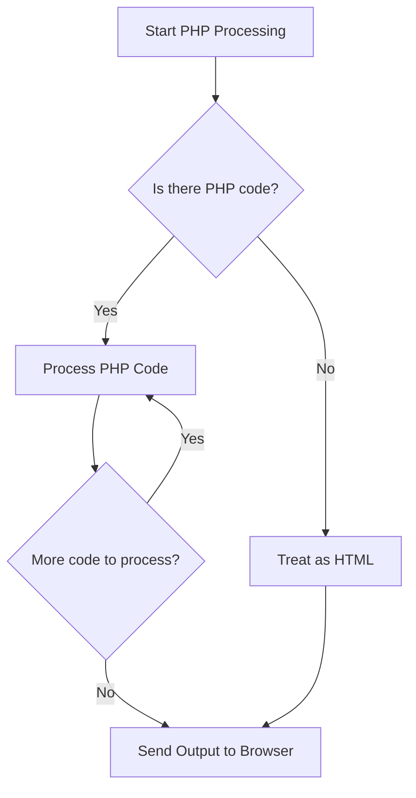

# PHP Syntax

## Introduction

PHP (Hypertext Preprocessor) is a widely-used open-source scripting language especially suited for web development. Understanding PHP syntax is the foundation for building dynamic websites and web applications. This guide will walk you through the basic syntax elements of PHP, from how PHP code is embedded in HTML to writing your first PHP statements.

## Basic PHP Structure

PHP code is enclosed within special start and end processing instructions: `<?php` and `?>`. These tags tell the web server to interpret the enclosed content as PHP code rather than HTML.

```php
<?php
  // Your PHP code goes here
?>
```

You can place PHP code anywhere within an HTML document:

```php
<!DOCTYPE html>
<html>
<head>
    <title>My First PHP Page</title>
</head>
<body>
    <h1>Welcome to PHP!</h1>
    
    <?php
        echo "This text is generated by PHP!";
    ?>
    
    <p>This is regular HTML content.</p>
</body>
</html>
```

**Output:**
```
Welcome to PHP!
This text is generated by PHP!
This is regular HTML content.
```

## PHP Statements and Semicolons

In PHP, each statement must end with a semicolon (`;`). Forgetting the semicolon is a common mistake for beginners.

```php
<?php
  echo "Hello World"; // Correct
  echo "This will cause an error" // Missing semicolon will cause an error
  echo "Another statement";
?>
```

## Comments in PHP

Comments are used to explain code and make it more readable. PHP supports both single-line and multi-line comments:

```php
<?php
  // This is a single-line comment
  
  # This is also a single-line comment
  
  /* This is a multi-line comment
     that can span across
     multiple lines */
     
  echo "Comments are not displayed in the output"; // This comment is at the end of a line
?>
```

## PHP Case Sensitivity

In PHP, variable names are case-sensitive, but function names and keywords are not.

```php
<?php
  $name = "John"; // Variable names are case-sensitive
  $Name = "Jane"; // This is a different variable
  
  echo $name; // Outputs: John
  echo $Name; // Outputs: Jane
  
  ECHO "Hello World!"; // Works, not case-sensitive
  echo "Hello World!"; // Works, not case-sensitive
  ECho "Hello World!"; // Works, not case-sensitive
?>
```

## Variables in PHP

Variables in PHP start with a dollar sign (`$`) followed by the variable name. Variable names are case-sensitive and must start with a letter or underscore, followed by letters, numbers, or underscores.

```php
<?php
  $text = "Hello World"; // String variable
  $number = 42; // Integer variable
  $float = 3.14; // Floating point variable
  $boolean = true; // Boolean variable
  
  echo $text; // Outputs: Hello World
  echo "<br>"; // HTML line break
  echo $number; // Outputs: 42
  echo "<br>";
  echo $float; // Outputs: 3.14
  echo "<br>";
  echo $boolean; // Outputs: 1 (true is displayed as 1, false is displayed as empty)
?>
```

**Output:**
```
Hello World
42
3.14
1
```

## Echo and Print Statements

The `echo` and `print` statements are used to output data to the screen:

```php
<?php
  $text = "PHP is fun!";
  
  echo "Using echo: ", $text, "<br>"; // Echo can take multiple parameters
  print "Using print: " . $text; // Print can only take one parameter
?>
```

**Output:**
```
Using echo: PHP is fun!
Using print: PHP is fun!
```

## String Concatenation

In PHP, you can concatenate (join) strings using the dot (`.`) operator:

```php
<?php
  $firstName = "John";
  $lastName = "Doe";
  
  // String concatenation using the . operator
  $fullName = $firstName . " " . $lastName;
  
  echo $fullName; // Outputs: John Doe
  
  // You can also concatenate and assign using .=
  $greeting = "Hello, ";
  $greeting .= $fullName;
  
  echo "<br>";
  echo $greeting; // Outputs: Hello, John Doe
?>
```

**Output:**
```
John Doe
Hello, John Doe
```

## PHP Data Types

PHP supports several data types:

```php
<?php
  // String
  $string = "This is a string";
  
  // Integer
  $integer = 42;
  
  // Float (decimal numbers)
  $float = 3.14;
  
  // Boolean
  $bool = true;
  
  // Array
  $array = array("Apple", "Banana", "Cherry");
  
  // Null
  $null = null;
  
  // Object
  class Person {
    public $name;
    public function __construct($name) {
      $this->name = $name;
    }
  }
  $object = new Person("John");
  
  // Check the data type using var_dump()
  var_dump($string);
  echo "<br>";
  var_dump($integer);
  echo "<br>";
  var_dump($float);
  echo "<br>";
  var_dump($bool);
  echo "<br>";
  var_dump($array);
  echo "<br>";
  var_dump($null);
  echo "<br>";
  var_dump($object);
?>
```

**Output:**
```
string(16) "This is a string"
int(42)
float(3.14)
bool(true)
array(3) { [0]=> string(5) "Apple" [1]=> string(6) "Banana" [2]=> string(6) "Cherry" }
NULL
object(Person)#1 (1) { ["name"]=> string(4) "John" }
```

## Operators in PHP

PHP supports various operators for arithmetic, comparison, logical operations, and more:

### Arithmetic Operators
```php
<?php
  $a = 10;
  $b = 3;
  
  echo $a + $b; // Addition: 13
  echo "<br>";
  echo $a - $b; // Subtraction: 7
  echo "<br>";
  echo $a * $b; // Multiplication: 30
  echo "<br>";
  echo $a / $b; // Division: 3.3333...
  echo "<br>";
  echo $a % $b; // Modulus (remainder): 1
  echo "<br>";
  echo $a ** $b; // Exponentiation: 1000
?>
```

**Output:**
```
13
7
30
3.3333333333333
1
1000
```

### Comparison Operators
```php
<?php
  $a = 10;
  $b = 3;
  $c = "10";
  
  var_dump($a == $c);  // Equal (true - checks only value)
  echo "<br>";
  var_dump($a === $c); // Identical (false - checks type and value)
  echo "<br>";
  var_dump($a != $b);  // Not equal (true)
  echo "<br>";
  var_dump($a !== $c); // Not identical (true)
  echo "<br>";
  var_dump($a > $b);   // Greater than (true)
  echo "<br>";
  var_dump($a < $b);   // Less than (false)
  echo "<br>";
  var_dump($a >= $b);  // Greater than or equal to (true)
  echo "<br>";
  var_dump($a <= $b);  // Less than or equal to (false)
?>
```

**Output:**
```
bool(true)
bool(false)
bool(true)
bool(true)
bool(true)
bool(false)
bool(true)
bool(false)
```

### Logical Operators
```php
<?php
  $a = true;
  $b = false;
  
  var_dump($a && $b); // And (false)
  echo "<br>";
  var_dump($a || $b); // Or (true)
  echo "<br>";
  var_dump(!$a);      // Not (false)
?>
```

**Output:**
```
bool(false)
bool(true)
bool(false)
```

## Control Structures

### If-Else Statements
```php
<?php
  $age = 20;
  
  if ($age < 18) {
    echo "You are a minor.";
  } elseif ($age >= 18 && $age < 65) {
    echo "You are an adult.";
  } else {
    echo "You are a senior citizen.";
  }
?>
```

**Output:**
```
You are an adult.
```

### Switch Statement
```php
<?php
  $day = "Wednesday";
  
  switch ($day) {
    case "Monday":
      echo "It's the start of the work week.";
      break;
    case "Wednesday":
      echo "It's the middle of the work week.";
      break;
    case "Friday":
      echo "It's almost the weekend!";
      break;
    default:
      echo "It's just another day.";
  }
?>
```

**Output:**
```
It's the middle of the work week.
```

### Loops

#### While Loop
```php
<?php
  $counter = 1;
  
  while ($counter <= 5) {
    echo "Count: $counter<br>";
    $counter++;
  }
?>
```

**Output:**
```
Count: 1
Count: 2
Count: 3
Count: 4
Count: 5
```

#### Do-While Loop
```php
<?php
  $counter = 1;
  
  do {
    echo "Count: $counter<br>";
    $counter++;
  } while ($counter <= 5);
?>
```

**Output:**
```
Count: 1
Count: 2
Count: 3
Count: 4
Count: 5
```

#### For Loop
```php
<?php
  for ($i = 1; $i <= 5; $i++) {
    echo "Iteration: $i<br>";
  }
?>
```

**Output:**
```
Iteration: 1
Iteration: 2
Iteration: 3
Iteration: 4
Iteration: 5
```

#### Foreach Loop (for arrays)
```php
<?php
  $fruits = array("Apple", "Banana", "Cherry", "Date");
  
  foreach ($fruits as $fruit) {
    echo "Fruit: $fruit<br>";
  }
  
  // With key => value
  $person = array("name" => "John", "age" => 30, "job" => "Developer");
  
  foreach ($person as $key => $value) {
    echo "$key: $value<br>";
  }
?>
```

**Output:**
```
Fruit: Apple
Fruit: Banana
Fruit: Cherry
Fruit: Date
name: John
age: 30
job: Developer
```

## PHP Syntax Flowchart

Here's a visual representation of PHP execution flow:



## Real-World Example: User Registration Form

Here's a practical example of PHP syntax in action - a simple user registration form validator:

```php
<?php
// Initialize variables to avoid undefined variable errors
$nameErr = $emailErr = $passwordErr = "";
$name = $email = $password = "";

// Check if the form was submitted
if ($_SERVER["REQUEST_METHOD"] == "POST") {
  // Validate name
  if (empty($_POST["name"])) {
    $nameErr = "Name is required";
  } else {
    $name = test_input($_POST["name"]);
    // Check if name contains only letters and whitespace
    if (!preg_match("/^[a-zA-Z-' ]*$/", $name)) {
      $nameErr = "Only letters and white space allowed";
    }
  }
  
  // Validate email
  if (empty($_POST["email"])) {
    $emailErr = "Email is required";
  } else {
    $email = test_input($_POST["email"]);
    // Check if email address is well-formed
    if (!filter_var($email, FILTER_VALIDATE_EMAIL)) {
      $emailErr = "Invalid email format";
    }
  }
  
  // Validate password
  if (empty($_POST["password"])) {
    $passwordErr = "Password is required";
  } else {
    $password = test_input($_POST["password"]);
    // Check if password is at least 8 characters
    if (strlen($password) < 8) {
      $passwordErr = "Password must be at least 8 characters";
    }
  }
  
  // If no errors, display success message
  if (empty($nameErr) && empty($emailErr) && empty($passwordErr)) {
    echo "<div style='color: green;'>Registration successful!</div>";
  }
}

// Function to sanitize input data
function test_input($data) {
  $data = trim($data);
  $data = stripslashes($data);
  $data = htmlspecialchars($data);
  return $data;
}
?>

<!DOCTYPE html>
<html>
<head>
  <title>Registration Form</title>
  <style>
    .error {color: red;}
  </style>
</head>
<body>
  <h2>User Registration</h2>
  <form method="post" action="<?php echo htmlspecialchars($_SERVER["PHP_SELF"]);?>">
    <div>
      <label for="name">Name:</label>
      <input type="text" name="name" value="<?php echo $name;?>">
      <span class="error">* <?php echo $nameErr;?></span>
    </div>
    <div>
      <label for="email">Email:</label>
      <input type="text" name="email" value="<?php echo $email;?>">
      <span class="error">* <?php echo $emailErr;?></span>
    </div>
    <div>
      <label for="password">Password:</label>
      <input type="password" name="password">
      <span class="error">* <?php echo $passwordErr;?></span>
    </div>
    <button type="submit">Register</button>
  </form>
</body>
</html>
```

This example demonstrates:
- Form handling with PHP
- Input validation
- Error messaging
- Sanitizing user input for security
- Integrating PHP with HTML
- Control structures (if-else)
- Functions in PHP

## Summary

In this guide, we've covered the fundamental PHP syntax elements:

- Basic PHP structure with `<?php ?>` tags
- Statements and semicolons
- Comments
- Case sensitivity
- Variables
- Echo and print statements
- String concatenation
- Data types
- Operators (arithmetic, comparison, logical)
- Control structures (if-else, switch)
- Loops (while, do-while, for, foreach)

Understanding these basic syntax elements is crucial for building PHP applications. As you progress, you'll learn how to combine these elements to create more complex programs.

## Additional Resources

1. [PHP Official Documentation](https://www.php.net/docs.php)
2. [W3Schools PHP Tutorial](https://www.w3schools.com/php/)
3. [PHP: The Right Way](https://phptherightway.com/)

## Exercises

1. Create a simple PHP script that displays your name and current date.
2. Write a PHP program that calculates and displays the multiplication table for a given number.
3. Create a form that accepts a user's age and displays a custom message based on their age group.
4. Write a PHP script that takes an array of numbers and calculates the sum, average, minimum, and maximum values.
5. Create a PHP function that checks if a given string is a palindrome (reads the same forwards and backwards).