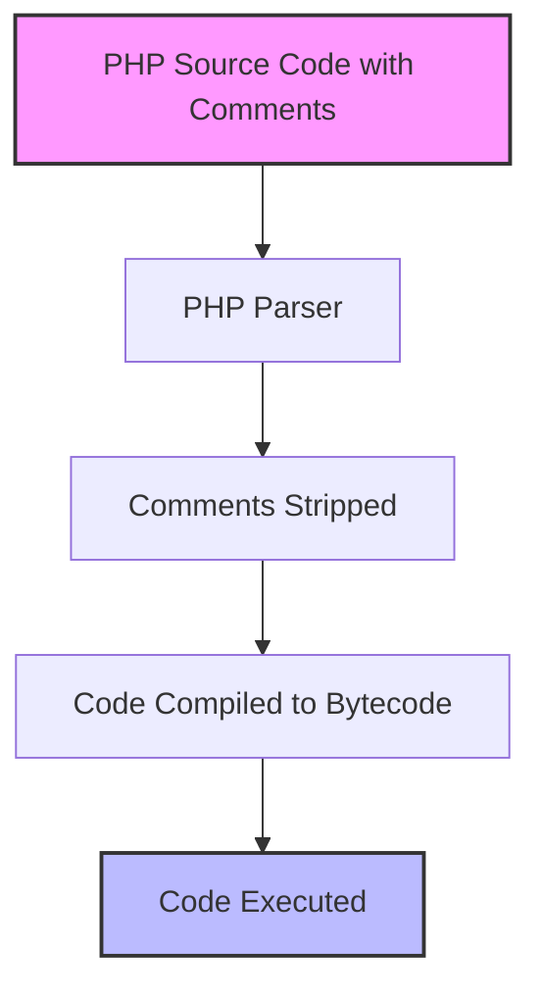

# PHP Comments

## Introduction

Comments are an essential part of writing clean, maintainable PHP code. They allow you to add notes, explanations, and documentation directly within your code without affecting its execution. Properly commented code is easier to understand, debug, and maintain—both for yourself when revisiting your code later and for other developers who might work with your code.

In this tutorial, you'll learn:
- What PHP comments are and why they're important
- Different types of PHP comments
- Best practices for using comments effectively
- Real-world examples of well-commented PHP code

## Types of PHP Comments

PHP supports three main types of comments:

### 1. Single-Line Comments

Single-line comments start with `//` or `#` and continue until the end of the line. They're perfect for brief explanations.

```php
// This is a single-line comment using double slashes
echo "Hello World!"; // You can also place comments at the end of a line

# This is a single-line comment using the hash/pound symbol
echo "Another message"; # Less commonly used but perfectly valid
```

**Output:**
```
Hello World!
Another message
```

Note that the comments don't appear in the output - they're only visible in the source code.

### 2. Multi-Line Comments

Multi-line or block comments start with `/*` and end with `*/`. Everything between these markers is treated as a comment, even if it spans multiple lines.

```php
/* This is a multi-line comment
   You can write as many lines as you want
   The comment doesn't end until the closing marker */
   
echo "Hello after a multi-line comment";

/* You can also use
   multi-line comments
   for a single line */
```

**Output:**
```
Hello after a multi-line comment
```

### 3. DocBlock Comments

DocBlock comments are a special type of multi-line comment that starts with `/**` and follows specific formatting conventions. They're commonly used for documentation and can be processed by documentation generators like PHPDoc.

```php
/**
 * Calculates the sum of two numbers
 *
 * @param int $a First number
 * @param int $b Second number
 * @return int The sum of the two numbers
 */
function add($a, $b) {
    return $a + $b;
}

echo add(5, 3);
```

**Output:**
```
8
```

## When to Use Comments

Comments serve different purposes in your code:

### Code Documentation

Comments help explain what your code does, why certain decisions were made, and how to use functions or classes you've created.

```php
/**
 * User authentication class
 * 
 * Handles user login, registration, and session management
 */
class Auth {
    /**
     * Attempts to log in a user with the provided credentials
     *
     * @param string $username The user's username or email
     * @param string $password The user's password
     * @return bool True if login successful, false otherwise
     */
    public function login($username, $password) {
        // Implementation details...
    }
}
```

### Code Explanation

Use comments to explain complex algorithms or logic that might not be immediately obvious to someone reading your code.

```php
function calculateDiscount($price, $purchaseHistory) {
    // Base discount starts at 5%
    $discount = 0.05;
    
    // Add 1% extra discount for each previous purchase, up to 5%
    $loyaltyBonus = min(count($purchaseHistory) * 0.01, 0.05);
    $discount += $loyaltyBonus;
    
    // If total purchase price is over $100, add another 2%
    if ($price > 100) {
        $discount += 0.02;
    }
    
    return $price * $discount;
}
```

### Temporary Code Disabling

Comments can be used to temporarily disable code without deleting it.

```php
function processPayment($amount) {
    // Validate the payment amount
    if ($amount <= 0) {
        return false;
    }
    
    // Process with PayPal API
    // processPayPalPayment($amount);  // Temporarily disabled
    
    // Using Stripe API instead for now
    processStripePayment($amount);
    
    return true;
}
```

## Best Practices for PHP Comments

To make the most of comments in your PHP code:

### DO:

1. **Write clear, concise comments**
   ```php
   // Calculate the total price including tax
   $totalPrice = $price + ($price * $taxRate);
   ```

2. **Comment complex logic or algorithms**
   ```php
   // Implementation of the Bubble Sort algorithm
   // Time complexity: O(n²) in worst and average cases
   function bubbleSort($arr) {
       // Sort implementation...
   }
   ```

3. **Use DocBlocks for functions, classes, and methods**
   ```php
   /**
    * Formats a phone number into a standardized format
    *
    * @param string $phoneNumber The raw phone number input
    * @return string The formatted phone number
    */
   function formatPhoneNumber($phoneNumber) {
       // Implementation...
   }
   ```

4. **Update comments when you change code**
   ```php
   // UPDATED: Now supports international phone numbers
   function formatPhoneNumber($phoneNumber, $countryCode = 'US') {
       // Implementation...
   }
   ```

### DON'T:

1. **Don't state the obvious**
   ```php
   // Bad comment - states the obvious
   $total = $subtotal + $tax; // Add tax to subtotal
   
   // Better to omit or provide more insight if needed
   $total = $subtotal + $tax; // Including regional tax calculated earlier
   ```

2. **Don't leave outdated comments**
   ```php
   // WRONG: This function validates email format
   // (comment is misleading if the function now does something else)
   function processUserInput($input) {
       // Implementation that doesn't match the comment...
   }
   ```

3. **Don't write comments for poor code**
   ```php
   // Don't do this:
   // This is a workaround because the function is broken
   // Better approach: Fix the function instead of commenting about the issue
   ```

## Real-World Example: Building a Simple Calculator

Let's see how comments can improve a real-world PHP application:

```php
<?php
/**
 * Simple Calculator Application
 * 
 * This script handles basic arithmetic operations
 * using values submitted from a form.
 */

// Initialize variables with default values
$num1 = 0;
$num2 = 0;
$operation = '+';
$result = '';
$error = '';

// Process the form if it was submitted
if ($_SERVER["REQUEST_METHOD"] == "POST") {
    // Retrieve and validate user inputs
    $num1 = filter_input(INPUT_POST, 'num1', FILTER_VALIDATE_FLOAT);
    $num2 = filter_input(INPUT_POST, 'num2', FILTER_VALIDATE_FLOAT);
    $operation = $_POST['operation'] ?? '+';
    
    // Check if inputs are valid numbers
    if ($num1 === false || $num2 === false) {
        $error = "Please enter valid numbers";
    } else {
        // Perform the selected operation
        switch ($operation) {
            case '+':
                $result = $num1 + $num2;
                break;
            case '-':
                $result = $num1 - $num2;
                break;
            case '*':
                $result = $num1 * $num2;
                break;
            case '/':
                // Handle division by zero
                if ($num2 == 0) {
                    $error = "Cannot divide by zero";
                } else {
                    $result = $num1 / $num2;
                }
                break;
            default:
                $error = "Invalid operation";
        }
    }
}

// Display the result or error message if calculation was performed
if ($_SERVER["REQUEST_METHOD"] == "POST" && empty($error)) {
    echo "Result: $num1 $operation $num2 = $result";
} elseif (!empty($error)) {
    echo "Error: $error";
}
?>

<!-- HTML form for the calculator inputs -->
<form method="post" action="<?php echo htmlspecialchars($_SERVER["PHP_SELF"]); ?>">
    <input type="text" name="num1" value="<?php echo $num1; ?>">
    
    <select name="operation">
        <option value="+" <?php if($operation == '+') echo 'selected'; ?>>+</option>
        <option value="-" <?php if($operation == '-') echo 'selected'; ?>>-</option>
        <option value="*" <?php if($operation == '*') echo 'selected'; ?>>×</option>
        <option value="/" <?php if($operation == '/') echo 'selected'; ?>>÷</option>
    </select>
    
    <input type="text" name="num2" value="<?php echo $num2; ?>">
    <input type="submit" value="Calculate">
</form>
```

In this example, comments serve several purposes:
- Documentation header explaining what the script does
- Organizational comments that divide the code into logical sections
- Explanatory comments for specific operations like form validation and error handling

## PHP Comments and Performance

It's worth noting that comments have no impact on your PHP script's performance. When PHP processes your code, it ignores all comments completely. This means you can add as many comments as you need without worrying about slowing down your application.



## Summary

Comments are a powerful tool for making your PHP code more readable, maintainable, and accessible. By using the right type of comment in the right situation and following best practices:

- Single-line comments (`//` or `#`) for brief explanations
- Multi-line comments (`/* */`) for longer descriptions
- DocBlock comments (`/** */`) for documentation

You can create code that's not only functional but also well-documented and easier to work with over time.

Remember that the best code is self-explanatory, with comments serving to enhance understanding rather than compensate for confusing code. As you grow as a PHP developer, aim to write clear code first and use comments to provide additional context where needed.

## Exercises

1. Take an existing PHP function you've written and add appropriate DocBlock comments to it.
2. Review a PHP script you wrote previously and identify places where comments would improve clarity.
3. Practice using comments to organize your code into logical sections.
4. Try refactoring a piece of code that relies on comments to explain confusing logic. Can you make the code clearer so it needs fewer explanatory comments?

## Additional Resources

- [PHP Documentation on Comments](https://www.php.net/manual/en/language.basic-syntax.comments.php)
- [PHPDoc Documentation](https://docs.phpdoc.org/3.0/guide/guides/docblocks.html)
- [Clean Code: A Handbook of Agile Software Craftsmanship](https://www.amazon.com/Clean-Code-Handbook-Software-Craftsmanship/dp/0132350882) - A book with excellent advice on code documentation