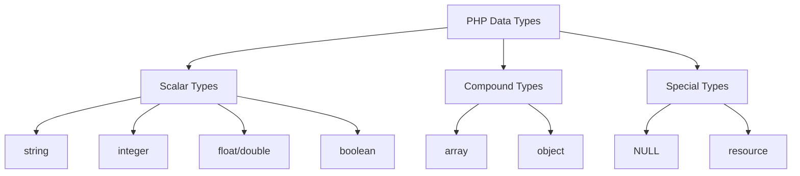

# PHP Variables

Variables are essential building blocks in any programming language, including PHP. They serve as containers that store data which can be used throughout your program. Understanding how variables work in PHP is a crucial first step in mastering PHP development.

## What Are PHP Variables?

In PHP, a variable is a symbol or name that stands for a value. Think of variables as labeled boxes where you can store information that you want to use or manipulate in your code.

Key characteristics of PHP variables:
- They always start with a dollar sign (`$`)
- They are case-sensitive (`$name` and `$Name` are different variables)
- They can store different types of data (numbers, text, arrays, etc.)
- Their values can change throughout program execution

## Declaring and Initializing Variables

In PHP, you don't need to declare variable types explicitly. PHP automatically converts variables to the correct data type based on their context. Here's how to create variables:

```php
<?php
// Creating a variable and assigning a value
$name = "John";
$age = 25;
$is_student = true;
$height = 1.85;

// Output the variables
echo "Name: " . $name . "<br>";
echo "Age: " . $age . "<br>";
echo "Is student: " . ($is_student ? "Yes" : "No") . "<br>";
echo "Height: " . $height . " meters<br>";
?>
```

**Output:**
```
Name: John
Age: 25
Is student: Yes
Height: 1.85 meters
```

## Variable Naming Rules

When naming your variables in PHP, follow these guidelines:

1. Variable names must start with a letter or underscore (`_`)
2. Variable names can only contain letters, numbers, and underscores
3. Variable names cannot contain spaces or special characters
4. Variable names are case-sensitive

```php
<?php
// Valid variable names
$name = "Valid";
$_name = "Valid";
$name1 = "Valid";
$first_name = "Valid";

// Invalid variable names (these would cause errors)
// $1name = "Invalid";     // Cannot start with a number
// $first-name = "Invalid"; // Cannot contain hyphens
// $first name = "Invalid"; // Cannot contain spaces
?>
```

## Variable Scope

Variable scope refers to the part of your code where a variable can be accessed. PHP has three main variable scopes:

### 1. Local Scope

Variables declared within a function have local scope and can only be accessed within that function.

```php
<?php
function testFunction() {
    $localVar = "I'm local";
    echo $localVar; // This works
}

testFunction(); // Outputs: I'm local
// echo $localVar; // This would cause an error - variable not accessible here
?>
```

### 2. Global Scope

Variables declared outside all functions have global scope. To access global variables inside a function, you need to use the `global` keyword or the `$GLOBALS` array.

```php
<?php
$globalVar = "I'm global";

function testGlobal() {
    global $globalVar; // Using the global keyword
    echo $globalVar;
}

function testGlobalsArray() {
    echo $GLOBALS['globalVar']; // Using the $GLOBALS array
}

testGlobal();     // Outputs: I'm global
testGlobalsArray(); // Outputs: I'm global
?>
```

### 3. Static Scope

Sometimes you want a local variable to retain its value between function calls. You can do this with the `static` keyword.

```php
<?php
function counter() {
    static $count = 0; // Static variable
    $count++;
    echo "Count: $count<br>";
}

counter(); // Outputs: Count: 1
counter(); // Outputs: Count: 2
counter(); // Outputs: Count: 3
?>
```

## Variable Data Types

PHP supports several data types for variables:



Let's see examples of each:

```php
<?php
// Scalar types
$string = "Hello, World!";
$integer = 42;
$float = 3.14;
$boolean = true;

// Compound types
$array = ["apple", "banana", "cherry"];
$assoc_array = ["name" => "John", "age" => 25];

class Person {
    public $name;
}
$object = new Person();
$object->name = "Jane";

// Special types
$null_var = NULL;
$file = fopen("example.txt", "r"); // resource type
?>
```

## Checking Variable Types

PHP provides several functions to check variable types:

```php
<?php
$name = "John";
$age = 25;

// Check variable types
echo gettype($name) . "<br>"; // Outputs: string
echo gettype($age) . "<br>";  // Outputs: integer

// Type-specific checks
var_dump(is_string($name)); // Outputs: bool(true)
var_dump(is_integer($age)); // Outputs: bool(true)
var_dump(is_numeric("25")); // Outputs: bool(true)

// The var_dump function provides detailed information about variables
var_dump($name); // Outputs: string(4) "John"
var_dump($age);  // Outputs: int(25)
?>
```

## Variable Variables

PHP has a unique feature called "variable variables" that allows you to use the value of one variable as the name of another variable.

```php
<?php
$foo = "bar";
$$foo = "baz";  // Creates a variable named $bar with value "baz"

echo $foo . "<br>";  // Outputs: bar
echo $$foo . "<br>"; // Outputs: baz
echo $bar . "<br>";  // Outputs: baz
?>
```

## Constants vs Variables

Unlike variables, constants don't change their value once defined:

```php
<?php
// Define a constant
define("PI", 3.14159);
const MAX_USERS = 100;

echo PI . "<br>";        // Outputs: 3.14159
echo MAX_USERS . "<br>"; // Outputs: 100

// PI = 3.14; // This would cause an error - constants cannot be changed
?>
```

## Practical Examples

### Example 1: Form Data Processing

```php
<?php
// Simulating form data
$form_data = [
    'username' => 'johndoe',
    'email' => 'john@example.com',
    'age' => 28
];

// Processing form data
$username = $form_data['username'];
$email = $form_data['email'];
$age = $form_data['age'];

// Validate and use the data
if (!empty($username) && filter_var($email, FILTER_VALIDATE_EMAIL) && $age >= 18) {
    echo "Welcome, $username! Your account has been created.";
} else {
    echo "Please provide valid information.";
}
?>
```

### Example 2: Shopping Cart Total

```php
<?php
// Shopping cart items with prices
$cart_items = [
    ['name' => 'T-shirt', 'price' => 19.99, 'quantity' => 2],
    ['name' => 'Jeans', 'price' => 49.99, 'quantity' => 1],
    ['name' => 'Shoes', 'price' => 79.99, 'quantity' => 1]
];

// Calculate the total
$total = 0;
foreach ($cart_items as $item) {
    $item_total = $item['price'] * $item['quantity'];
    $total += $item_total;
    echo $item['name'] . ": $" . number_format($item_total, 2) . "<br>";
}

// Apply discount if total is over $100
$discount = 0;
if ($total > 100) {
    $discount = $total * 0.1; // 10% discount
    $total -= $discount;
}

echo "<br>";
echo "Subtotal: $" . number_format($total + $discount, 2) . "<br>";
if ($discount > 0) {
    echo "Discount: -$" . number_format($discount, 2) . "<br>";
}
echo "Total: $" . number_format($total, 2);
?>
```

**Output:**
```
T-shirt: $39.98
Jeans: $49.99
Shoes: $79.99

Subtotal: $169.96
Discount: -$16.99
Total: $152.96
```

## Variable Best Practices

1. **Use descriptive names**: `$user_age` is better than `$ua`
2. **Follow a consistent naming convention**: Stick to camelCase or snake_case
3. **Initialize variables before use**: Avoid undefined variable errors
4. **Keep scope as limited as possible**: Don't use globals when locals will do
5. **Use constants for fixed values**: This prevents accidental changes
6. **Clean up when done**: Unset variables you no longer need
7. **Check variables before use**: Use `isset()` or `empty()` to validate

## Summary

PHP variables are fundamental to PHP programming, allowing you to store and manipulate data within your applications. Key points to remember:

- Variables in PHP start with a dollar sign (`$`)
- PHP variables are loosely typed and automatically converted as needed
- Variable scope determines where your variables can be accessed
- PHP supports various data types including strings, integers, arrays, and objects
- Understanding variables is essential for building any PHP application

## Exercises

1. Create a PHP script that calculates the area and perimeter of a rectangle using variables for length and width.
2. Write a program that swaps the values of two variables without using a third variable.
3. Create a shopping cart system that calculates the total price with tax and displays an itemized receipt.
4. Write a function that counts how many times it has been called using a static variable.
5. Create a script that demonstrates the difference between local and global variable scope.

## Additional Resources

- [PHP Manual: Variables](https://www.php.net/manual/en/language.variables.php)
- [PHP Data Types](https://www.php.net/manual/en/language.types.php)
- [Variable Scope in PHP](https://www.php.net/manual/en/language.variables.scope.php)
- [W3Schools PHP Variables Tutorial](https://www.w3schools.com/php/php_variables.asp)