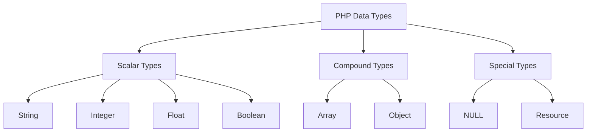

# PHP Data Types

## Introduction

In programming, data types are a crucial concept that define what kind of data a variable can hold. PHP, being a loosely typed language, offers flexibility in how we work with different types of data. Understanding PHP data types is fundamental for writing efficient and error-free code.

In this tutorial, we'll explore the various data types available in PHP, how to use them, and their practical applications in real-world programming scenarios.

## PHP Variables and Data Types Overview

Before diving into specific data types, let's understand how variables work in PHP:

```php
<?php
// Variables in PHP start with a $ sign
$my_variable = "Hello, PHP!";
echo $my_variable; // Output: Hello, PHP!

// PHP automatically assigns a data type based on the value
$my_number = 42;
echo gettype($my_number); // Output: integer
?>
```

PHP supports eight primitive data types divided into three categories:



## Scalar Data Types

Scalar data types can hold only a single value. PHP has four scalar data types:

### 1. String

Strings are sequences of characters enclosed in either single quotes (`'`) or double quotes (`"`).

```php
<?php
// String declaration
$single_quoted = 'Hello World';
$double_quoted = "Hello World";

// String with variable interpolation
$name = "John";
echo "Hello, $name!"; // Output: Hello, John!
echo 'Hello, $name!'; // Output: Hello, $name! (no interpolation)

// String functions
echo strlen($name); // Output: 4
echo strtoupper($name); // Output: JOHN
?>
```

**Real-world application:** Strings are used for storing and manipulating text data like usernames, addresses, and content.

### 2. Integer

Integers are whole numbers without decimal points.

```php
<?php
// Integer declaration
$age = 25;
$negative_number = -42;

// Integer operations
$sum = $age + 5; // 30
$product = $age * 2; // 50

// Checking if a value is an integer
var_dump(is_int($age)); // bool(true)

// Integer functions
echo max(1, 5, 3); // Output: 5
?>
```

**Real-world application:** Integers are used for counting, indexing arrays, and performing arithmetic calculations.

### 3. Float (Floating-point numbers)

Floats, also called doubles, are numbers with decimal points or in exponential form.

```php
<?php
// Float declaration
$price = 19.99;
$scientific = 2.5e3; // 2500

// Float comparison (be careful with precision!)
$a = 1.23;
$b = 1.23000;
var_dump($a == $b); // bool(true)

// Checking float type
var_dump(is_float($price)); // bool(true)
?>
```

**Real-world application:** Floats are used for prices, scientific calculations, and any value requiring decimal precision.

### 4. Boolean

Booleans represent truth values - either `true` or `false`.

```php
<?php
// Boolean declaration
$is_active = true;
$is_completed = false;

// Conditional statements with booleans
if ($is_active) {
    echo "The user is active"; // This will be printed
}

// Type conversion to boolean
$zero = 0;
$non_zero = 42;
var_dump((bool)$zero);     // bool(false)
var_dump((bool)$non_zero); // bool(true)
?>
```

**Real-world application:** Booleans are used for conditional logic, checking if features are enabled/disabled, or if conditions are met.

## Compound Data Types

Compound data types can store multiple values in a single variable:

### 1. Array

Arrays are ordered maps that can hold multiple values of any type.

```php
<?php
// Indexed array
$fruits = ["Apple", "Banana", "Cherry"];
echo $fruits[0]; // Output: Apple

// Associative array
$person = [
    "name" => "Alice",
    "age" => 28,
    "is_student" => false
];
echo $person["name"]; // Output: Alice

// Multidimensional array
$users = [
    ["name" => "John", "role" => "admin"],
    ["name" => "Jane", "role" => "editor"]
];
echo $users[1]["role"]; // Output: editor

// Array functions
$numbers = [5, 2, 8, 1];
sort($numbers);
print_r($numbers); // Array ( [0] => 1 [1] => 2 [2] => 5 [3] => 8 )
?>
```

**Real-world application:** Arrays are used for storing collections of data like user records, configuration settings, or any list-based information.

### 2. Object

Objects are instances of classes, which can contain properties and methods.

```php
<?php
// Defining a class
class Car {
    // Properties
    public $color;
    public $brand;
    
    // Method
    function set_color($color) {
        $this->color = $color;
    }
    
    function get_color() {
        return $this->color;
    }
}

// Creating an object
$my_car = new Car();
$my_car->set_color("Red");
$my_car->brand = "Toyota";

// Accessing object properties and methods
echo $my_car->get_color(); // Output: Red
echo $my_car->brand;       // Output: Toyota
?>
```

**Real-world application:** Objects are used in object-oriented programming to model real-world entities like users, products, or services with both data and behaviors.

## Special Data Types

PHP includes two special data types:

### 1. NULL

NULL represents a variable with no value.

```php
<?php
// NULL value
$var = NULL;

// Checking for NULL
var_dump(is_null($var)); // bool(true)

// Variables assigned NULL
$user = "John";
$user = null; // The variable still exists but has no value
?>
```

**Real-world application:** NULL is used to reset variables, indicate the absence of a value, or check if a variable has been assigned a value.

### 2. Resource

Resources are special variables that hold references to external resources like database connections or file handles.

```php
<?php
// File resource
$file = fopen("example.txt", "r");

// Database connection resource
$conn = mysqli_connect("localhost", "username", "password", "database");

// Checking resource type
var_dump(is_resource($file)); // bool(true)

// Always close resources when done
fclose($file);
mysqli_close($conn);
?>
```

**Real-world application:** Resources are used when interacting with external systems like files, databases, or network connections.

## Type Juggling and Type Casting

PHP automatically converts types as needed, a feature called type juggling:

```php
<?php
// Type juggling examples
$sum = "10" + 20;      // $sum is an integer (30)
$concat = "10" . "20"; // $concat is a string ("1020")

// Explicit type casting
$string_value = "42";
$int_value = (int)$string_value;   // Convert to integer
$float_value = (float)"3.14";      // Convert to float
$string_again = (string)42;        // Convert to string
$bool_value = (bool)"";            // Convert to boolean (false)

// Checking variable type
$value = 3.14;
echo gettype($value);              // Output: double (float)
var_dump($value);                  // Output: float(3.14)
?>
```

## Practical Example: Form Data Processing

Let's see how different data types work together in a real application:

```php
<?php
// Simulating form submission
$form_data = [
    'username' => 'john_doe',
    'age' => '25',
    'newsletter' => 'yes',
    'interests' => ['coding', 'music', 'sports']
];

// Processing and validating form data
$username = $form_data['username'];                     // String
$age = (int)$form_data['age'];                          // Convert to Integer
$wants_newsletter = ($form_data['newsletter'] === 'yes'); // Boolean
$interests = $form_data['interests'];                   // Array

// Using the data
if ($age >= 18) {
    echo "$username is $age years old and is an adult.<br>";
    
    if ($wants_newsletter) {
        echo "Will receive our newsletter.<br>";
    }
    
    echo "Interests: " . implode(", ", $interests);
}
?>
```

Output:
```
john_doe is 25 years old and is an adult.
Will receive our newsletter.
Interests: coding, music, sports
```

## Summary

In this tutorial, we covered PHP's data types:

1. **Scalar Types**: String, Integer, Float, and Boolean
2. **Compound Types**: Array and Object
3. **Special Types**: NULL and Resource

Understanding data types is crucial for:
- Writing more efficient code
- Avoiding unexpected behavior
- Proper data validation
- Building robust applications

As you continue to learn PHP, you'll find that mastering data types helps you solve more complex programming challenges and create more reliable applications.

## Exercises

To reinforce your understanding of PHP data types, try these exercises:

1. Create an associative array representing a product with properties like name, price, quantity, and availability.
2. Write a function that takes different data types as parameters and returns their types.
3. Create a simple class to represent a Person with properties and methods, then instantiate it.
4. Write code that demonstrates type juggling and explicit type conversion.
5. Build a form processor that validates different types of input (text, numbers, checkboxes).

## Additional Resources

- [PHP Manual: Types](https://www.php.net/manual/en/language.types.php)
- [PHP Array Functions](https://www.php.net/manual/en/ref.array.php)
- [PHP Type Comparisons](https://www.php.net/manual/en/types.comparisons.php)
- [PHP Object-Oriented Programming](https://www.php.net/manual/en/language.oop5.php)