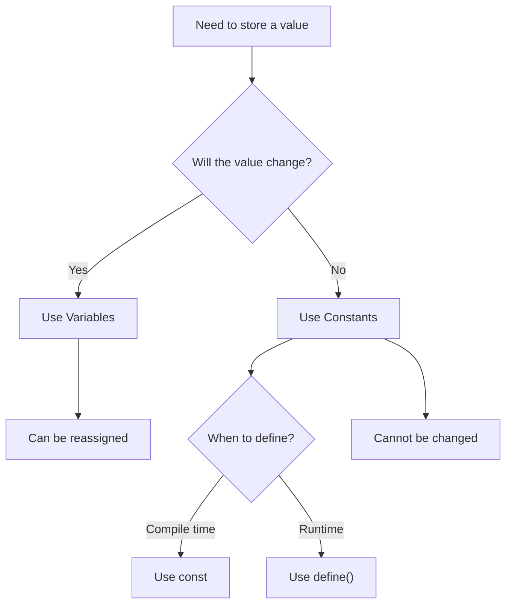

# PHP Constants

## Introduction

Constants are named values that remain unchanged throughout the execution of a PHP script. Unlike variables, once a constant is defined, its value cannot be changed or undefined. Constants are useful for storing values that should remain fixed, such as configuration settings, mathematical values, or application-wide parameters.

In this tutorial, we'll explore how to define constants in PHP, understand their characteristics, and learn when and how to use them effectively in your applications.

## Defining Constants

### Using the `define()` Function

The most traditional way to define a constant in PHP is using the `define()` function. This function takes two parameters: the name of the constant and its value.

```php
// Syntax
define(name, value, case_insensitive);

// Example
define("PI", 3.14159);
define("SITE_NAME", "PHP Tutorials");
define("DATABASE_HOST", "localhost");

// Using the constants
echo "The value of PI is: " . PI;
echo "<br>";
echo "Welcome to " . SITE_NAME;
```

**Output:**
```
The value of PI is: 3.14159
Welcome to PHP Tutorials
```

The third parameter `case_insensitive` is optional and determines whether the constant name should be case-insensitive. However, this parameter is deprecated as of PHP 7.3.0, and constants are now case-sensitive by default.

### Using the `const` Keyword

From PHP 5.3.0 onwards, you can also define constants using the `const` keyword:

```php
// Syntax
const CONSTANT_NAME = value;

// Example
const MAX_USERS = 100;
const APP_VERSION = "1.0.0";
const DEBUG_MODE = true;

// Using the constants
echo "Maximum users allowed: " . MAX_USERS;
echo "<br>";
echo "Application version: " . APP_VERSION;
```

**Output:**
```
Maximum users allowed: 100
Application version: 1.0.0
```

## Key Differences Between `define()` and `const`

| Feature | `define()` | `const` |
|---------|------------|---------|
| Scope | Can be used globally | Cannot be defined inside functions or loops |
| Runtime | Can be defined at runtime | Must be defined at compile time |
| Conditional Definition | Can be defined conditionally | Cannot be defined within conditional blocks |
| Expression Evaluation | Can use expressions as values | Limited to simple values |

```php
// Valid with define()
if($debug) {
    define("DEBUG_MODE", true);
}

// Invalid with const
if($debug) {
    const DEBUG_MODE = true; // This will cause an error
}
```

## Constant Characteristics

### Naming Conventions

While PHP allows flexibility in naming constants, following these best practices is recommended:

1. Use all uppercase letters
2. Separate words with underscores
3. Start with a letter or underscore
4. Use descriptive names that indicate the purpose

```php
// Good constant names
define("MAX_UPLOAD_SIZE", 5242880);
define("DEFAULT_TIMEZONE", "UTC");
define("USER_ROLE_ADMIN", 1);

// Less ideal constant names
define("maxsize", 5242880); // Not uppercase
define("DT", "UTC"); // Not descriptive enough
```

### Constant Values

Constants can store various data types:

```php
// Storing different data types in constants
define("PI", 3.14159); // Float
define("MAX_USERS", 1000); // Integer
define("SITE_NAME", "PHP Learning Portal"); // String
define("DEBUG_MODE", true); // Boolean
define("ALLOWED_EXTENSIONS", ["jpg", "png", "gif"]); // Array (PHP 7+)
```

### Checking if a Constant Exists

Before using a constant, you might want to check if it's defined:

```php
// Checking if constants exist
if (defined("PI")) {
    echo "PI constant exists with value: " . PI;
} else {
    define("PI", 3.14159);
    echo "PI constant was defined now.";
}
```

## Predefined Constants

PHP comes with several predefined constants that provide useful information:

```php
// PHP predefined constants
echo "PHP version: " . PHP_VERSION;
echo "<br>";
echo "Operating system: " . PHP_OS;
echo "<br>";
echo "Maximum integer value: " . PHP_INT_MAX;
echo "<br>";
echo "Line number: " . __LINE__;
echo "<br>";
echo "Current file: " . __FILE__;
```

**Output:**
```
PHP version: 8.1.0
Operating system: Linux
Maximum integer value: 9223372036854775807
Line number: 5
Current file: /var/www/html/example.php
```

## Magic Constants

PHP also provides special constants called "magic constants" that change their values depending on where they are used:

```php
// File information
echo "Current file: " . __FILE__;
echo "<br>";
echo "Current directory: " . __DIR__;

// Function information
function showInfo() {
    echo "<br>";
    echo "Current function: " . __FUNCTION__;
}
showInfo();

// Class information
class TestClass {
    public function getInfo() {
        echo "<br>";
        echo "Current class: " . __CLASS__;
        echo "<br>";
        echo "Current method: " . __METHOD__;
    }
}
$test = new TestClass();
$test->getInfo();
```

**Output:**
```
Current file: /var/www/html/constants.php
Current directory: /var/www/html
Current function: showInfo
Current class: TestClass
Current method: TestClass::getInfo
```

## Constant Arrays

Since PHP 7.0, you can define array constants:

```php
// Array constants
define("ALLOWED_EXTENSIONS", ["jpg", "png", "gif"]);
const ADMIN_ROLES = ["super_admin", "admin", "editor"];

// Using array constants
echo "Allowed file extensions: ";
foreach (ALLOWED_EXTENSIONS as $extension) {
    echo $extension . " ";
}

echo "<br>Admin roles: ";
foreach (ADMIN_ROLES as $role) {
    echo $role . " ";
}
```

**Output:**
```
Allowed file extensions: jpg png gif 
Admin roles: super_admin admin editor
```

## Class Constants

In object-oriented PHP, you can define constants within classes:

```php
class Database {
    // Class constants
    const HOST = "localhost";
    const USER = "root";
    const PASSWORD = "secret";
    const DATABASE = "app_db";
    
    public function connect() {
        echo "Connecting to " . self::DATABASE . " on " . self::HOST;
    }
}

// Using class constants
echo Database::HOST;
echo "<br>";

$db = new Database();
$db->connect();
```

**Output:**
```
localhost
Connecting to app_db on localhost
```

## Constant Groups with Namespaces

For better organization, you can group related constants using namespaces:

```php
namespace Config {
    const APP_NAME = "PHP Tutorial";
    const APP_VERSION = "1.0.0";
}

namespace Database {
    const HOST = "localhost";
    const PORT = 3306;
}

// Using namespaced constants
echo Config\APP_NAME;
echo "<br>";
echo Database\HOST . ":" . Database\PORT;
```

**Output:**
```
PHP Tutorial
localhost:3306
```

## Real-World Examples

### Configuration Settings

Constants are perfect for application configuration:

```php
// config.php
define("DB_HOST", "localhost");
define("DB_USER", "app_user");
define("DB_PASS", "secure_password");
define("DB_NAME", "application_db");
define("SITE_URL", "https://phplearning.com");
define("ADMIN_EMAIL", "admin@example.com");
define("DEBUG_MODE", true);

// Using in another file
require_once('config.php');

// Database connection
$conn = new mysqli(DB_HOST, DB_USER, DB_PASS, DB_NAME);

// Site settings
$siteTitle = SITE_URL . " - PHP Learning Platform";

// Conditional debugging
if (DEBUG_MODE) {
    error_reporting(E_ALL);
    ini_set('display_errors', 1);
}
```

### Application Status Codes

Constants help make code more readable and maintainable:

```php
// status.php
class OrderStatus {
    const PENDING = 1;
    const PROCESSING = 2;
    const SHIPPED = 3;
    const DELIVERED = 4;
    const CANCELLED = 5;
}

// Using status codes
$order = getOrderFromDatabase($orderId);

if ($order->status === OrderStatus::DELIVERED) {
    echo "Your order has been delivered successfully!";
} else if ($order->status === OrderStatus::SHIPPED) {
    echo "Your order is on the way!";
} else if ($order->status === OrderStatus::CANCELLED) {
    echo "This order has been cancelled.";
}
```

### Math and Physics Applications

Constants are ideal for mathematical and scientific values:

```php
// Physics calculations
define("GRAVITY", 9.81); // m/s²
define("SPEED_OF_LIGHT", 299792458); // m/s
define("PLANCK_CONSTANT", 6.62607015e-34); // J⋅s

// Calculate free fall time
function calculateFallTime($height) {
    return sqrt((2 * $height) / GRAVITY);
}

$height = 100; // meters
echo "An object falling from " . $height . "m will take " . 
     calculateFallTime($height) . " seconds to hit the ground.";

// Calculate energy from mass
function calculateEnergy($mass) {
    return $mass * pow(SPEED_OF_LIGHT, 2);
}

$mass = 0.001; // 1 gram in kg
echo "<br>Energy from " . ($mass * 1000) . "g of matter: " . 
     calculateEnergy($mass) . " joules";
```

## Constants vs. Variables

Let's understand when to use constants versus variables:



| Feature      | Constants                          | Variables                       |
|--------------|------------------------------------|---------------------------------|
| Reassignment | Cannot be changed after definition | Can be changed anytime          |
| Scope        | Global by default                  | Depends on where defined        |
| Naming       | Usually ALL_CAPS                   | Usually camelCase or snake_case |
| Dollar Sign  | No `$` prefix                      | Requires `$` prefix             |
| Use Case     | Configuration, fixed values        | User input, changing data       |

## Best Practices

1. **Use constants for values that shouldn't change**  
   Configuration settings, file paths, and application-wide settings are perfect candidates.

2. **Follow naming conventions**  
   Use uppercase names with underscores for better readability.

3. **Group related constants**  
   Use classes or namespaces to organize related constants.

4. **Avoid magic numbers in code**  
   Instead of hardcoding values like `86400` (seconds in a day), use a constant like `SECONDS_PER_DAY`.

5. **Create configuration files**  
   Store all your application constants in dedicated config files.

```php
// Instead of this
if ($user->role === 1) {
    // Admin actions
}

// Do this
define("ROLE_ADMIN", 1);
define("ROLE_EDITOR", 2);
define("ROLE_USER", 3);

if ($user->role === ROLE_ADMIN) {
    // Admin actions
}
```

## Summary

PHP constants provide a way to store values that shouldn't change throughout your application's execution. They improve code readability, maintainability, and help prevent accidental modification of important values.

Key points to remember:
- Constants can be defined using `define()` or the `const` keyword
- Once defined, constants cannot be changed or undefined
- Constants are typically named using uppercase letters and underscores
- They're useful for configuration settings, status codes, and fixed values
- PHP provides several predefined and magic constants

## Exercises

1. Create a configuration file with constants for a blog application (database settings, file paths, etc.)
2. Define a class with constants for different user roles and permissions
3. Write a script that uses PHP's predefined constants to display system information
4. Create a simple calculator that uses mathematical constants (PI, E, etc.)

## Additional Resources

- [PHP Manual: Constants](https://www.php.net/manual/en/language.constants.php)
- [PHP Magic Constants](https://www.php.net/manual/en/language.constants.predefined.php)
- [PHP 7 Array Constants](https://www.php.net/manual/en/migration70.new-features.php)