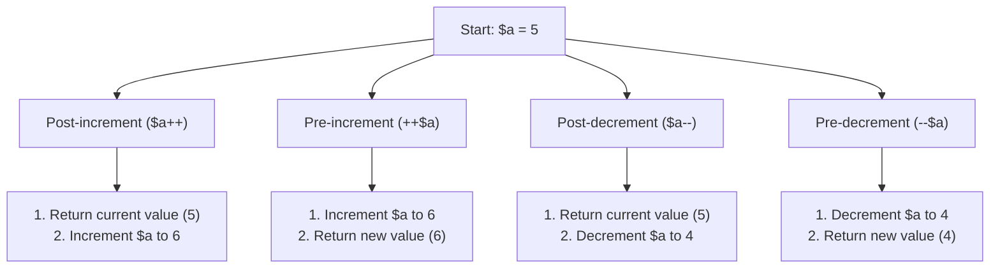

# PHP Operators

## Introduction

Operators are symbols that tell the PHP interpreter to perform specific mathematical, relational, or logical operations and produce a result. They are essential building blocks for creating expressions and making decisions in your code.

In this tutorial, you'll learn about the various types of operators in PHP, how they work, and how to use them effectively in your applications.

## Types of PHP Operators

PHP provides several types of operators that serve different purposes in your code:

1. Arithmetic Operators
2. Assignment Operators
3. Comparison Operators
4. Logical (Boolean) Operators
5. Increment/Decrement Operators
6. String Operators
7. Array Operators
8. Conditional (Ternary) Operators
9. Null Coalescing Operator
10. Type Operators

Let's explore each of these categories in detail.

## Arithmetic Operators

Arithmetic operators are used to perform common mathematical operations.

| Operator | Name           | Example    | Result                                      |
|----------|----------------|------------|---------------------------------------------|
| `+`      | Addition       | `$a + $b`  | Sum of `$a` and `$b`                        |
| `-`      | Subtraction    | `$a - $b`  | Difference of `$a` and `$b`                 |
| `*`      | Multiplication | `$a * $b`  | Product of `$a` and `$b`                    |
| `/`      | Division       | `$a / $b`  | Quotient of `$a` and `$b`                   |
| `%`      | Modulus        | `$a % $b`  | Remainder of `$a` divided by `$b`           |
| `**`     | Exponentiation | `$a ** $b` | Result of raising `$a` to the power of `$b` |

### Example: Arithmetic Operators

```php
<?php
$a = 10;
$b = 3;

// Addition
echo "Addition: " . ($a + $b) . "<br>";        // Output: Addition: 13

// Subtraction
echo "Subtraction: " . ($a - $b) . "<br>";     // Output: Subtraction: 7

// Multiplication
echo "Multiplication: " . ($a * $b) . "<br>";  // Output: Multiplication: 30

// Division
echo "Division: " . ($a / $b) . "<br>";        // Output: Division: 3.3333333333333

// Modulus (Remainder)
echo "Modulus: " . ($a % $b) . "<br>";         // Output: Modulus: 1

// Exponentiation
echo "Exponentiation: " . ($a ** $b) . "<br>"; // Output: Exponentiation: 1000
?>
```

## Assignment Operators

Assignment operators are used to assign values to variables. The basic assignment operator is `=`, which assigns the value on the right to the variable on the left.

| Operator | Example     | Equivalent to                         |
|----------|-------------|---------------------------------------|
| `=`      | `$a = $b`   | `$a = $b`                             |
| `+=`     | `$a += $b`  | `$a = $a + $b`                        |
| `-=`     | `$a -= $b`  | `$a = $a - $b`                        |
| `*=`     | `$a *= $b`  | `$a = $a * $b`                        |
| `/=`     | `$a /= $b`  | `$a = $a / $b`                        |
| `%=`     | `$a %= $b`  | `$a = $a % $b`                        |
| `**=`    | `$a **= $b` | `$a = $a ** $b`                       |
| `.=`     | `$a .= $b`  | `$a = $a . $b` (string concatenation) |

### Example: Assignment Operators

```php
<?php
$a = 10;
echo "Initial value: $a<br>";  // Output: Initial value: 10

// Addition assignment
$a += 5;  // Equivalent to: $a = $a + 5
echo "After addition assignment: $a<br>";  // Output: After addition assignment: 15

// Subtraction assignment
$a -= 3;  // Equivalent to: $a = $a - 3
echo "After subtraction assignment: $a<br>";  // Output: After subtraction assignment: 12

// Multiplication assignment
$a *= 2;  // Equivalent to: $a = $a * 2
echo "After multiplication assignment: $a<br>";  // Output: After multiplication assignment: 24

// String concatenation assignment
$str = "Hello";
$str .= " World!";  // Equivalent to: $str = $str . " World!"
echo "String after concatenation: $str<br>";  // Output: String after concatenation: Hello World!
?>
```

## Comparison Operators

Comparison operators allow you to compare two values. They return a boolean value (`true` or `false`).

| Operator | Name                     | Example     | Result                                                               |
|----------|--------------------------|-------------|----------------------------------------------------------------------|
| `==`     | Equal                    | `$a == $b`  | `true` if `$a` is equal to `$b` (regardless of type)                 |
| `===`    | Identical                | `$a === $b` | `true` if `$a` is equal to `$b` and they are of the same type        |
| `!=`     | Not equal                | `$a != $b`  | `true` if `$a` is not equal to `$b` (regardless of type)             |
| `<>`     | Not equal                | `$a <> $b`  | Same as `!=`                                                         |
| `!==`    | Not identical            | `$a !== $b` | `true` if `$a` is not equal to `$b` or they are not of the same type |
| `<`      | Less than                | `$a < $b`   | `true` if `$a` is less than `$b`                                     |
| `>`      | Greater than             | `$a > $b`   | `true` if `$a` is greater than `$b`                                  |
| `<=`     | Less than or equal to    | `$a <= $b`  | `true` if `$a` is less than or equal to `$b`                         |
| `>=`     | Greater than or equal to | `$a >= $b`  | `true` if `$a` is greater than or equal to `$b`                      |
| `<=>`    | Spaceship                | `$a <=> $b` | Returns `-1` if `$a < $b`, `0` if `$a == $b`, `1` if `$a > $b`       |

### Example: Comparison Operators

```php
<?php
$a = 10;
$b = "10";
$c = 20;

// Equal (==): Checks if values are equal, not types
echo "a == b: ";
var_dump($a == $b);  // Output: a == b: bool(true)

// Identical (===): Checks if values AND types are equal
echo "a === b: ";
var_dump($a === $b);  // Output: a === b: bool(false)

// Not equal (!=)
echo "a != c: ";
var_dump($a != $c);  // Output: a != c: bool(true)

// Not identical (!==)
echo "a !== b: ";
var_dump($a !== $b);  // Output: a !== b: bool(true)

// Less than (<)
echo "a < c: ";
var_dump($a < $c);  // Output: a < c: bool(true)

// Greater than (>)
echo "c > a: ";
var_dump($c > $a);  // Output: c > a: bool(true)

// Spaceship operator (<=>)
echo "a <=> c: ";
var_dump($a <=> $c);  // Output: a <=> c: int(-1)
echo "c <=> a: ";
var_dump($c <=> $a);  // Output: c <=> a: int(1)
echo "a <=> a: ";
var_dump($a <=> $a);  // Output: a <=> a: int(0)
?>
```

## Logical Operators

Logical operators are used to combine conditional statements.

| Operator | Name         | Example      | Result                                                |
|----------|--------------|--------------|-------------------------------------------------------|
| `and`    | And          | `$a and $b`  | `true` if both `$a` and `$b` are `true`               |
| `or`     | Or           | `$a or $b`   | `true` if either `$a` or `$b` is `true`               |
| `xor`    | Exclusive or | `$a xor $b`  | `true` if either `$a` or `$b` is `true`, but not both |
| `&&`     | And          | `$a && $b`   | `true` if both `$a` and `$b` are `true`               |
| `\|\|`   | Or           | `$a \|\| $b` | `true` if either `$a` or `$b` is `true`               |
| `!`      | Not          | `!$a`        | `true` if `$a` is not `true`                          |

### Example: Logical Operators

```php
<?php
$a = true;
$b = false;

// AND
echo "a AND b: ";
var_dump($a and $b);  // Output: a AND b: bool(false)
// Same as
echo "a && b: ";
var_dump($a && $b);   // Output: a && b: bool(false)

// OR
echo "a OR b: ";
var_dump($a or $b);   // Output: a OR b: bool(true)
// Same as
echo "a || b: ";
var_dump($a || $b);   // Output: a || b: bool(true)

// XOR (exclusive OR)
echo "a XOR b: ";
var_dump($a xor $b);  // Output: a XOR b: bool(true)

// NOT
echo "!a: ";
var_dump(!$a);        // Output: !a: bool(false)
echo "!b: ";
var_dump(!$b);        // Output: !b: bool(true)

// Combining logical operators
$c = true;
echo "a && (b || c): ";
var_dump($a && ($b || $c));  // Output: a && (b || c): bool(true)
?>
```

### Operator Precedence

Logical operators have different precedence levels. The `&&` operator has higher precedence than `||`. Use parentheses to make your code more readable and to ensure the correct evaluation order.

```php
<?php
$x = true;
$y = false;
$z = true;

// Without parentheses
$result1 = $x && $y || $z;  // Evaluates as: ($x && $y) || $z
var_dump($result1);  // Output: bool(true)

// With parentheses to clarify intent
$result2 = $x && ($y || $z);
var_dump($result2);  // Output: bool(true)

$result3 = ($x && $y) || $z;
var_dump($result3);  // Output: bool(true)
?>
```

## Increment/Decrement Operators

Increment and decrement operators are used to increase or decrease the value of a variable by one.

| Operator | Name           | Description                             |
|----------|----------------|-----------------------------------------|
| `++$a`   | Pre-increment  | Increments `$a` by 1, then returns `$a` |
| `$a++`   | Post-increment | Returns `$a`, then increments `$a` by 1 |
| `--$a`   | Pre-decrement  | Decrements `$a` by 1, then returns `$a` |
| `$a--`   | Post-decrement | Returns `$a`, then decrements `$a` by 1 |

### Example: Increment/Decrement Operators

```php
<?php
$a = 5;

// Post-increment: returns the value, then increments
echo "Original value: $a<br>";  // Output: Original value: 5
$b = $a++;
echo "After post-increment: a = $a, b = $b<br>";  // Output: After post-increment: a = 6, b = 5

// Reset value
$a = 5;

// Pre-increment: increments the value, then returns it
echo "Original value: $a<br>";  // Output: Original value: 5
$c = ++$a;
echo "After pre-increment: a = $a, c = $c<br>";  // Output: After pre-increment: a = 6, c = 6

// Reset value
$a = 5;

// Post-decrement: returns the value, then decrements
echo "Original value: $a<br>";  // Output: Original value: 5
$d = $a--;
echo "After post-decrement: a = $a, d = $d<br>";  // Output: After post-decrement: a = 4, d = 5

// Reset value
$a = 5;

// Pre-decrement: decrements the value, then returns it
echo "Original value: $a<br>";  // Output: Original value: 5
$e = --$a;
echo "After pre-decrement: a = $a, e = $e<br>";  // Output: After pre-decrement: a = 4, e = 4
?>
```

Here's a visual representation of the difference between pre and post increment/decrement:



## String Operators

PHP has two string operators:

| Operator | Name                     | Example  | Result                     |
|----------|--------------------------|----------|----------------------------|
| `.`        | Concatenation            | `$a . $b`  | Concatenation of `$a` and `$b` |
| `.=`       | Concatenation assignment | `$a .= $b` | Appends `$b` to `$a`           |

### Example: String Operators

```php
<?php
$firstname = "John";
$lastname = "Doe";

// String concatenation
$fullname = $firstname . " " . $lastname;
echo "Full name: " . $fullname . "<br>";  // Output: Full name: John Doe

// String concatenation assignment
$greeting = "Hello, ";
$greeting .= $fullname;
$greeting .= "! Welcome to our website.";
echo $greeting;  // Output: Hello, John Doe! Welcome to our website.
?>
```

## Array Operators

PHP offers several operators to work with arrays:

| Operator | Name         | Example   | Result                                                                                    |
|----------|--------------|-----------|-------------------------------------------------------------------------------------------|
| `+`      | Union        | `$a + $b`   | Union of `$a` and `$b`                                                                        |
| `==`     | Equality     | `$a == $b`  | `true` if `$a` and `$b` have the same key/value pairs                                         |
| `===`    | Identity     | `$a === $b` | `true` if `$a` and `$b` have the same key/value pairs in the same order and of the same types |
| `!=`     | Inequality   | `$a != $b`  | `true` if `$a` is not equal to `$b`                                                           |
| `<>`     | Inequality   | `$a <> $b`  | `true` if `$a` is not equal to `$b`                                                           |
| `!==`    | Non-identity | `$a !== $b` | `true` if `$a` is not identical to `$b`                                                       |

### Example: Array Operators

```php
<?php
// Define two arrays
$array1 = ["a" => "apple", "b" => "banana"];
$array2 = ["c" => "cherry", "b" => "blueberry"];
$array3 = ["b" => "banana", "a" => "apple"];

// Union operator (+)
$union = $array1 + $array2;
echo "Union result:<br>";
print_r($union);
// Output: 
// Array
// (
//     [a] => apple
//     [b] => banana
//     [c] => cherry
// )
echo "<br>";

// Note that the value for key 'b' from $array1 is kept (not overwritten)

// Equality operator (==)
echo "array1 == array3: ";
var_dump($array1 == $array3);  // Output: array1 == array3: bool(true)

// Identity operator (===)
echo "array1 === array3: ";
var_dump($array1 === $array3);  // Output: array1 === array3: bool(false)
// They have the same key/value pairs but in different order

// Inequality operator (!=)
echo "array1 != array2: ";
var_dump($array1 != $array2);  // Output: array1 != array2: bool(true)
?>
```

## Conditional (Ternary) Operators

The conditional operator is a shorthand for the `if...else` statement.

### Syntax

```php
condition ? expr1 : expr2
```

If `condition` is `true`, the result is `expr1`. Otherwise, it's `expr2`.

### Example: Ternary Operator

```php
<?php
$age = 20;

// Regular if-else statement
if ($age >= 18) {
    $status = "adult";
} else {
    $status = "minor";
}

// Equivalent ternary operator
$status = ($age >= 18) ? "adult" : "minor";

echo "Status: $status<br>";  // Output: Status: adult

// Nested ternary operators (be careful with readability)
$age = 15;
$status = ($age >= 18) ? "adult" : (($age >= 13) ? "teenager" : "child");

echo "Status: $status<br>";  // Output: Status: teenager
?>
```

### Shorthand Ternary Operator (Elvis Operator)

PHP also has a shorthand version of the ternary operator, often called the "Elvis operator":

```php
condition ?: expr
```

This is equivalent to:

```php
condition ? condition : expr
```

### Example: Elvis Operator

```php
<?php
$username = "john_doe";
$defaultUsername = "guest";

// Using the Elvis operator
$displayName = $username ?: $defaultUsername;
echo "Display name: $displayName<br>";  // Output: Display name: john_doe

// What if username is empty?
$username = "";
$displayName = $username ?: $defaultUsername;
echo "Display name: $displayName<br>";  // Output: Display name: guest

// Note: empty strings, 0, null, etc. are considered false in PHP
?>
```

## Null Coalescing Operator

The null coalescing operator (`??`) is used to provide a default value when a variable is `null` or doesn't exist.

### Syntax

```php
expr1 ?? expr2
```

If `expr1` exists and is not `null`, it returns `expr1`. Otherwise, it returns `expr2`.

### Example: Null Coalescing Operator

```php
<?php
// Assume $_GET['user'] doesn't exist
$username = $_GET['user'] ?? 'nobody';
echo "Username: $username<br>";  // Output: Username: nobody

// Chaining null coalescing operators
$username = $_GET['user'] ?? $_POST['user'] ?? 'nobody';
echo "Username: $username<br>";  // Output: Username: nobody

// Difference between ?? and ?:
$value = 0;

// With ternary operator, 0 is considered false
$result1 = $value ?: "default";
echo "Result with ?: $result1<br>";  // Output: Result with ?: default

// With null coalescing, only null or non-existent variables trigger the default
$result2 = $value ?? "default";
echo "Result with ??: $result2<br>";  // Output: Result with ??: 0
?>
```

## Type Operators

Type operators are used to check if a variable is of a specific type.

| Operator   | Name       | Example                   | Result                                     |
|------------|------------|---------------------------|--------------------------------------------|
| instanceof | Type check | `$obj` instanceof MyClass | `true` if `$obj` is an instance of MyClass |

### Example: instanceof Operator

```php
<?php
class MyClass {
    // Class definition
}

class AnotherClass {
    // Class definition
}

$obj = new MyClass();

// Check if $obj is an instance of MyClass
echo '$obj instanceof MyClass: ';
var_dump($obj instanceof MyClass);        // Output: $obj instanceof MyClass: bool(true)

// Check if $obj is an instance of AnotherClass
echo '$obj instanceof AnotherClass: ';
var_dump($obj instanceof AnotherClass);   // Output: $obj instanceof AnotherClass: bool(false)
?>
```

## Operator Precedence

PHP operators have different precedence levels, which determine the order of operations. Here's a simplified precedence table (highest to lowest):

1. `Clone, New`
2. `**`
3. `++, --`
4. `! (logical not)`
5. `*, /, %`
6. `+, - (addition, subtraction)`
7. `<, <=, >, >=`
8. `==, !=, ===, !==`
9. `&& (logical and)`
10. `|| (logical or)`
11. `? : (ternary)`
12. `=, +=, -=, etc. (assignment)`
13. `and (logical and)`
14. `xor (logical xor)`
15. `or (logical or)`

### Example: Operator Precedence

```php
<?php
$a = 5;
$b = 3;
$c = 2;

// Without parentheses
$result1 = $a + $b * $c;
echo "5 + 3 * 2 = $result1<br>";  // Output: 5 + 3 * 2 = 11
// Multiplication has higher precedence than addition

// With parentheses to override default precedence
$result2 = ($a + $b) * $c;
echo "(5 + 3) * 2 = $result2<br>";  // Output: (5 + 3) * 2 = 16

// Logical operator precedence
$x = true;
$y = false;
$z = true;

$result3 = $x || $y && $z;  // && has higher precedence than ||
echo "true || false && true = ";
var_dump($result3);  // Output: true || false && true = bool(true)
// Evaluated as: true || (false && true) = true || false = true

$result4 = ($x || $y) && $z;
echo "(true || false) && true = ";
var_dump($result4);  // Output: (true || false) && true = bool(true)
// Evaluated as: (true || false) && true = true && true = true
?>
```

## Best Practices for Using Operators

1. **Use parentheses for clarity**: Even when operator precedence would give you the expected result, using parentheses can make your code more readable and less prone to misinterpretation.

2. **Be careful with loose comparison**: The `==` operator performs type juggling, which can lead to unexpected results. When in doubt, use the strict comparison operator `===`.

3. **Avoid complex nested ternary operators**: While they might save lines of code, deeply nested ternary operators can be difficult to read and maintain. Consider using if-else statements for complex conditions.

4. **Use meaningful variable names**: This makes your expressions easier to understand at a glance.

5. **Remember operator precedence**: When combining different types of operators, be aware of their precedence to avoid unexpected results.

## Real-World Examples

### Example 1: Form Validation

```php
<?php
// Simple form validation using various operators
$username = $_POST['username'] ?? '';
$age = (int)($_POST['age'] ?? 0);
$email = $_POST['email'] ?? '';

$errors = [];

// Check if username is provided and has at least 3 characters
if (empty($username) || strlen($username) < 3) {
    $errors[] = "Username must be at least 3 characters long.";
}

// Check if age is valid
if ($age <= 0 || $age > 120) {
    $errors[] = "Please provide a valid age between 1 and 120.";
}

// Simple email validation using strpos
if (empty($email) || strpos($email, '@') === false) {
    $errors[] = "Please provide a valid email address.";
}

// Check if there are any errors
$formIsValid = empty($errors);

// Display appropriate message
$message = $formIsValid ? "Form submitted successfully!" : "Please fix the errors and try again.";

echo $message;

// If there are errors, display them
if (!$formIsValid) {
    echo "<ul>";
    foreach ($errors as $error) {
        echo "<li>$error</li>";
    }
    echo "</ul>";
}
?>
```

### Example 2: Shopping Cart Calculation

```php
<?php
// A simple shopping cart calculation using operators
$cart = [
    ['name' => 'T-shirt', 'price' => 19.99, 'quantity' => 2],
    ['name' => 'Jeans', 'price' => 49.99, 'quantity' => 1],
    ['name' => 'Shoes', 'price' => 79.99, 'quantity' => 1]
];

$subtotal = 0;
$taxRate = 0.08; // 8% tax
$hasDiscount = true;
$discountRate = 0.1; // 10% discount

// Calculate subtotal
foreach ($cart as $item) {
    $subtotal += $item['price'] * $item['quantity'];
}

// Apply discount if applicable
$discount = $hasDiscount ? $subtotal * $discountRate : 0;
$afterDiscount = $subtotal - $discount;

// Calculate tax
$tax = $afterDiscount * $taxRate;

// Calculate total
$total = $afterDiscount + $tax;

// Format for display
$formattedSubtotal = number_format($subtotal, 2);
$formattedDiscount = number_format($discount, 2);
$formattedAfterDiscount = number_format($afterDiscount, 2);
$formattedTax = number_format($tax, 2);
$formattedTotal = number_format($total, 2);

// Display cart summary
echo <<<HTML
<h2>Cart Summary</h2>
<table border="1" cellpadding="5">
    <tr>
        <th>Item</th>
        <th>Price</th>
        <th>Quantity</th>
        <th>Subtotal</th>
    </tr>
HTML;

foreach ($cart as $item) {
    $itemSubtotal = $item['price'] * $item['quantity'];
    $formattedItemPrice = number_format($item['price'], 2);
    $formattedItemSubtotal = number_format($itemSubtotal, 2);
    
    echo <<<HTML
    <tr>
        <td>{$item['name']}</td>
        <td>\${$formattedItemPrice}</td>
        <td>{$item['quantity']}</td>
        <td>\${$formattedItemSubtotal}</td>
    </tr>
HTML;
}

echo <<<HTML
</table>
<br>
<div>
    <strong>Subtotal:</strong> \${$formattedSubtotal}<br>
    <strong>Discount:</strong> -\${$formattedDiscount}<br>
    <strong>After Discount:</strong> \${$formattedAfterDiscount}<br>
    <strong>Tax (8%):</strong> \${$formattedTax}<br>
    <strong>Total:</strong> \${$formattedTotal}
</div>
HTML;
?>
```

## Summary

PHP operators are essential tools for performing operations on variables and values in your PHP applications. In this tutorial, we've covered the most important operators in PHP including:

- Arithmetic operators for mathematical calculations
- Assignment operators for assigning values to variables
- Comparison operators for comparing values
- Logical operators for combining conditions
- Increment/decrement operators for increasing or decreasing values
- String operators for concatenating strings
- Array operators for working with arrays
- Conditional (ternary) operators for shorthand conditionals
- Null coalescing operator for providing fallback values
- Type operators for checking object types

Understanding how these operators work and their precedence rules is crucial for writing efficient and error-free PHP code.

## Additional Resources

For further learning and practice, check out these resources:

1. [PHP Manual: Operators](https://www.php.net/manual/en/language.operators.php)
2. [PHP Manual: Operator Precedence](https://www.php.net/manual/en/language.operators.precedence.php)
3. [W3Schools PHP Operators](https://www.w3schools.com/php/php_operators.asp)

## Exercises

1. Create a simple calculator that uses different arithmetic operators based on user input.
2. Write a script that compares two arrays using array operators.
3. Implement a form validation system that uses logical operators to check multiple conditions.
4. Create a pricing calculator that applies different discounts based on conditions using ternary operators.
5. Write a function that sorts an array of numbers using comparison operators.