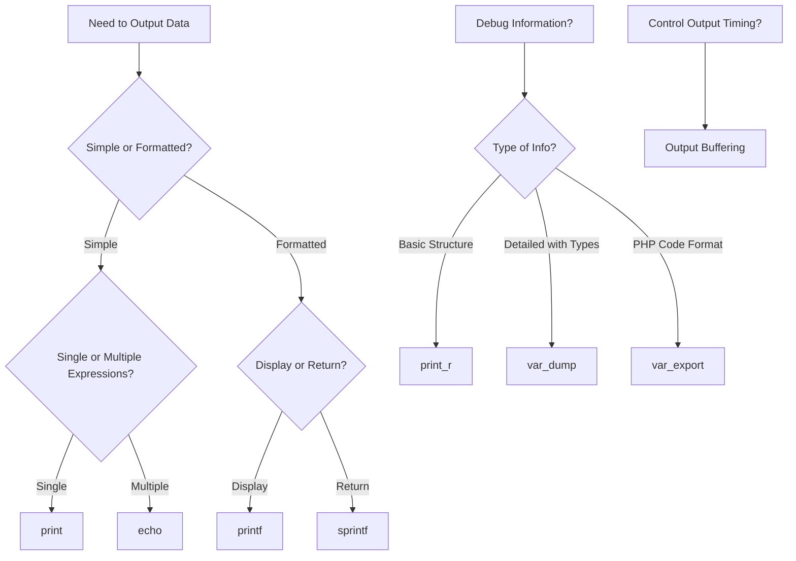

# PHP Output Methods

## Introduction

When building web applications with PHP, one of the most fundamental tasks is outputting data to the browser. PHP provides several methods for displaying text, HTML, variables, and other information. Understanding these output methods is essential for any PHP developer, as they form the foundation of how your PHP scripts communicate with users.

In this tutorial, we'll explore the various output methods in PHP, their syntax, differences, and practical applications. By the end, you'll have a solid understanding of how to effectively output data in your PHP applications.

## Basic Output Methods

### The `echo` Statement

The `echo` statement is the most commonly used output method in PHP. It can output one or multiple strings, variables, or expressions.

#### Basic Syntax

```php
echo expression1, expression2, ...;
```

#### Examples

```php
<?php
// Simple string output
echo "Hello, World!";

// Output: Hello, World!

// Multiple expressions
echo "Hello, ", "PHP ", "Developers!";

// Output: Hello, PHP Developers!

// Variables and strings
$name = "John";
$age = 25;
echo "My name is " . $name . " and I am " . $age . " years old.";

// Output: My name is John and I am 25 years old.

// HTML content
echo "<h1>Welcome</h1><p>This is a paragraph.</p>";

// Output: 
// <h1>Welcome</h1><p>This is a paragraph.</p>
?>
```

### The `print` Statement

The `print` statement works similarly to `echo` but can only output one expression at a time and returns a value (always 1).

#### Basic Syntax

```php
print expression;
```

#### Examples

```php
<?php
// Simple string output
print "Hello, World!";

// Output: Hello, World!

// Using print with a return value
$result = print "PHP is fun!";
echo "<br>The print statement returned: " . $result;

// Output: 
// PHP is fun!
// The print statement returned: 1

// Variables and strings
$name = "Sarah";
print "Hello, " . $name . "!";

// Output: Hello, Sarah!
?>
```

### Echo vs. Print: Key Differences

```php
<?php
// Echo can take multiple parameters (no parentheses)
echo "Hello", " ", "World", "!";  // Works fine

// Print can only take one parameter
// print "Hello", "World";  // This will cause an error

// Echo doesn't return a value
// $var = echo "Hello";  // This will cause an error

// Print returns 1, so it can be used in expressions
$var = print "Hello";  // $var will be 1
?>
```

## Formatted Output Methods

### The `printf()` Function

The `printf()` function outputs a formatted string. It's similar to the C programming language's printf function and offers more control over how your output is formatted.

#### Basic Syntax

```php
printf(format, arg1, arg2, ...);
```

#### Common Format Specifiers

- `%s` - String
- `%d` - Integer
- `%f` - Float
- `%c` - Character
- `%.2f` - Float with 2 decimal places

#### Examples

```php
<?php
// Basic printf usage
$name = "Lisa";
$score = 95.75;
printf("Student %s scored %.1f points", $name, $score);

// Output: Student Lisa scored 95.8 points

// Formatting integers with padding
printf("Number: %05d", 42);

// Output: Number: 00042

// Formatting currency
$price = 1250.99;
printf("Price: $%',.2f", $price);

// Output: Price: $1,250.99

// Width specifier
printf("Name: %-10s | Score: %d", "John", 85);

// Output: Name: John       | Score: 85
?>
```

### The `sprintf()` Function

The `sprintf()` function works exactly like `printf()`, but instead of outputting the formatted string, it returns it.

#### Basic Syntax

```php
$variable = sprintf(format, arg1, arg2, ...);
```

#### Examples

```php
<?php
// Storing formatted output
$name = "Mike";
$score = 88.5;
$result = sprintf("Student %s scored %.1f points", $name, $score);
echo $result;

// Output: Student Mike scored 88.5 points

// Creating multiple formatted strings
$num1 = sprintf("%04d", 12);
$num2 = sprintf("%04d", 365);
echo "ID: " . $num1 . "-" . $num2;

// Output: ID: 0012-0365

// Useful for database preparation
$date = sprintf("%04d-%02d-%02d", 2023, 9, 15);
echo "SQL date format: " . $date;

// Output: SQL date format: 2023-09-15
?>
```

## Alternative Output Methods

### The `print_r()` Function

The `print_r()` function is used to display readable information about a variable, particularly useful for arrays and objects.

#### Basic Syntax

```php
print_r(variable, return);
```

Where `return` is an optional boolean parameter. If set to `true`, `print_r()` will return the output instead of printing it.

#### Examples

```php
<?php
// Simple array display
$fruits = ["Apple", "Banana", "Cherry"];
print_r($fruits);

// Output:
// Array
// (
//     [0] => Apple
//     [1] => Banana
//     [2] => Cherry
// )

// Associative array
$person = [
    "name" => "John",
    "age" => 30,
    "city" => "New York"
];
print_r($person);

// Output:
// Array
// (
//     [name] => John
//     [age] => 30
//     [city] => New York
// )

// Return the output
$output = print_r($fruits, true);
echo "<pre>" . $output . "</pre>";

// Output:
// Array
// (
//     [0] => Apple
//     [1] => Banana
//     [2] => Cherry
// )
?>
```

### The `var_dump()` Function

The `var_dump()` function displays structured information about variables, including their type and value. It provides more detailed information than `print_r()`.

#### Basic Syntax

```php
var_dump(variable1, variable2, ...);
```

#### Examples

```php
<?php
// Basic variable inspection
$name = "John";
$age = 30;
$isStudent = false;
var_dump($name, $age, $isStudent);

// Output:
// string(4) "John"
// int(30)
// bool(false)

// Array inspection
$scores = [95, 87, 92];
var_dump($scores);

// Output:
// array(3) {
//   [0]=>
//   int(95)
//   [1]=>
//   int(87)
//   [2]=>
//   int(92)
// }

// Object inspection
$obj = new stdClass();
$obj->name = "Product";
$obj->price = 19.99;
var_dump($obj);

// Output:
// object(stdClass)#1 (2) {
//   ["name"]=>
//   string(7) "Product"
//   ["price"]=>
//   float(19.99)
// }
?>
```

### The `var_export()` Function

The `var_export()` function outputs a string representation of a variable that can be used as PHP code.

#### Basic Syntax

```php
var_export(variable, return);
```

Where `return` is an optional boolean parameter. If set to `true`, `var_export()` will return the output instead of printing it.

#### Examples

```php
<?php
// Basic variable export
$config = [
    "debug" => true,
    "timeout" => 30,
    "database" => [
        "host" => "localhost",
        "user" => "admin"
    ]
];

var_export($config);

// Output:
// array (
//   'debug' => true,
//   'timeout' => 30,
//   'database' => 
//   array (
//     'host' => 'localhost',
//     'user' => 'admin',
//   ),
// )

// Return the output and save to file
$exportCode = var_export($config, true);
echo "// The generated code:
" . $exportCode;

// Output:
// The generated code:
// array (
//   'debug' => true,
//   'timeout' => 30,
//   'database' => 
//   array (
//     'host' => 'localhost',
//     'user' => 'admin',
//   ),
// )
?>
```

## Output Buffering

PHP provides output buffering functions that allow you to control when output is sent to the browser.

### Basic Output Buffering Functions

```php
<?php
// Start output buffering
ob_start();

// Generate some output
echo "<h1>Welcome</h1>";
echo "<p>This text will be buffered.</p>";

// Get the contents of the buffer
$content = ob_get_contents();

// Clean (erase) the buffer
ob_clean();

// Now output a modified version
echo "<div class='container'>" . $content . "</div>";

// End output buffering and send to browser
ob_end_flush();

// You can also discard the buffer without sending
// ob_end_clean();
?>
```

## Practical Examples

### Creating a Simple HTML Template

```php
<?php
$pageTitle = "Welcome to My Website";
$username = "Guest";
$isLoggedIn = false;

// Using output methods to build a template
echo "<!DOCTYPE html>
";
echo "<html>
<head>
";
printf("  <title>%s</title>
", $pageTitle);
echo "  <meta charset='UTF-8'>
";
echo "</head>
<body>
";

echo "  <header>
";
printf("    <h1>%s</h1>
", $pageTitle);
echo "  </header>
";

echo "  <main>
";
if ($isLoggedIn) {
    printf("    <p>Hello, %s! Welcome back.</p>
", $username);
} else {
    echo "    <p>Please log in to access your account.</p>
";
}
echo "  </main>
";

echo "  <footer>
";
echo "    <p>&copy; " . date("Y") . " My PHP Website</p>
";
echo "  </footer>
";

echo "</body>
</html>";
?>
```

### Generating a Dynamic Data Table

```php
<?php
// Sample data
$students = [
    ["id" => 101, "name" => "John Doe", "score" => 92.5],
    ["id" => 102, "name" => "Jane Smith", "score" => 88.0],
    ["id" => 103, "name" => "Bob Johnson", "score" => 95.5]
];

// Generate HTML table using output methods
echo "<table border='1'>
";
echo "  <thead>
";
echo "    <tr>
";
echo "      <th>ID</th>
";
echo "      <th>Name</th>
";
echo "      <th>Score</th>
";
echo "      <th>Grade</th>
";
echo "    </tr>
";
echo "  </thead>
";
echo "  <tbody>
";

foreach ($students as $student) {
    // Determine grade based on score
    $grade = "";
    if ($student["score"] >= 90) {
        $grade = "A";
    } elseif ($student["score"] >= 80) {
        $grade = "B";
    } elseif ($student["score"] >= 70) {
        $grade = "C";
    } else {
        $grade = "F";
    }
    
    echo "    <tr>
";
    printf("      <td>%d</td>
", $student["id"]);
    printf("      <td>%s</td>
", $student["name"]);
    printf("      <td>%.1f</td>
", $student["score"]);
    printf("      <td>%s</td>
", $grade);
    echo "    </tr>
";
}

echo "  </tbody>
";
echo "</table>";
?>
```

## Output Methods Flowchart



## Summary

PHP offers a variety of output methods, each with its own strengths and use cases:

- **Basic Output**:
  - `echo`: Fast, can output multiple expressions, no return value
  - `print`: Slightly slower, can output one expression, returns 1

- **Formatted Output**:
  - `printf()`: Outputs formatted strings
  - `sprintf()`: Returns formatted strings

- **Debug Output**:
  - `print_r()`: Displays human-readable information about variables
  - `var_dump()`: Shows detailed information including types and structures
  - `var_export()`: Outputs PHP code representation of variables

- **Output Control**:
  - Output buffering functions (`ob_start()`, `ob_get_contents()`, etc.)

Understanding these output methods will help you effectively display information in your PHP applications, debug your code, and create dynamic content.

## Practice Exercises

1. Create a PHP script that uses `echo` to output an HTML form.
2. Use `printf()` to format and display a table of product prices with proper currency formatting.
3. Create an array of user information and use `print_r()`, `var_dump()`, and `var_export()` to display it. Compare the differences in output.
4. Use output buffering to capture HTML content, modify it, and then display the modified version.
5. Create a function that generates a formatted receipt using `sprintf()` and returns it as a string.

## Additional Resources

- [PHP Documentation: echo](https://www.php.net/manual/en/function.echo.php)
- [PHP Documentation: printf](https://www.php.net/manual/en/function.printf.php)
- [PHP Documentation: Output Control Functions](https://www.php.net/manual/en/ref.outcontrol.php)
- [PHP Documentation: print_r](https://www.php.net/manual/en/function.print-r.php)