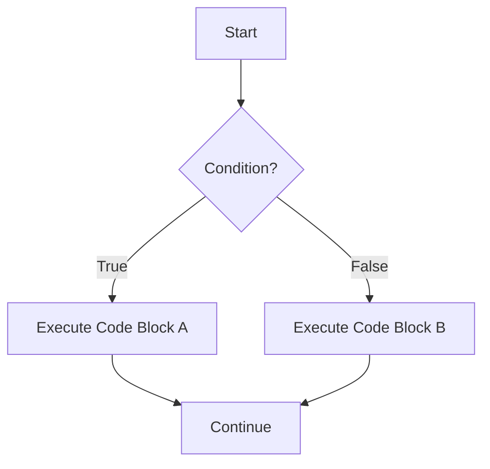

# PHP Conditional Statements

In programming, we often need our code to make decisions based on certain conditions. PHP provides several conditional statements that allow you to execute different blocks of code depending on whether specified conditions are true or false.

## What Are Conditional Statements?

Conditional statements are control structures that enable your program to take different paths based on whether a specified condition evaluates to `true` or `false`. They're like forks in the road that determine which way your code will go.



## The `if` Statement

The `if` statement is the most basic conditional statement. It executes a block of code only if the specified condition evaluates to `true`.

### Syntax

```php
if (condition) {
    // Code to execute if condition is true
}
```

### Example

```php
<?php
$temperature = 30;

if ($temperature > 25) {
    echo "It's a hot day!";
}
?>
```

**Output:**
```
It's a hot day!
```

In this example, the message "It's a hot day!" is displayed because the condition `$temperature > 25` evaluates to `true`.

## The `if...else` Statement

The `if...else` statement allows you to execute one block of code if the condition is `true` and another block if it's `false`.

### Syntax

```php
if (condition) {
    // Code to execute if condition is true
} else {
    // Code to execute if condition is false
}
```

### Example

```php
<?php
$temperature = 20;

if ($temperature > 25) {
    echo "It's a hot day!";
} else {
    echo "It's not that hot today.";
}
?>
```

**Output:**
```
It's not that hot today.
```

Since the temperature is 20, which is not greater than 25, the condition evaluates to `false`, and the code in the `else` block is executed.

## The `if...elseif...else` Statement

When you need to check multiple conditions, the `if...elseif...else` statement comes in handy.

### Syntax

```php
if (condition1) {
    // Code to execute if condition1 is true
} elseif (condition2) {
    // Code to execute if condition1 is false and condition2 is true
} else {
    // Code to execute if all conditions are false
}
```

### Example

```php
<?php
$temperature = 15;

if ($temperature > 25) {
    echo "It's a hot day!";
} elseif ($temperature >= 15 && $temperature <= 25) {
    echo "It's a pleasant day!";
} else {
    echo "It's a cold day!";
}
?>
```

**Output:**
```
It's a pleasant day!
```

In this example, since the temperature is 15, the second condition evaluates to `true`, and "It's a pleasant day!" is displayed.

## Nested `if` Statements

You can place `if` statements inside other `if` statements to create more complex conditional logic.

### Example

```php
<?php
$temperature = 30;
$isRaining = false;

if ($temperature > 25) {
    echo "It's a hot day! ";
    
    if ($isRaining) {
        echo "But it's raining, so it feels cooler.";
    } else {
        echo "And there's no rain to cool things down.";
    }
}
?>
```

**Output:**
```
It's a hot day! And there's no rain to cool things down.
```

## The `switch` Statement

The `switch` statement is an alternative to using multiple `if...elseif` statements when you want to compare a single variable against multiple possible values.

### Syntax

```php
switch (expression) {
    case value1:
        // Code to execute if expression equals value1
        break;
    case value2:
        // Code to execute if expression equals value2
        break;
    // ... more cases ...
    default:
        // Code to execute if expression doesn't match any case
}
```

### Example

```php
<?php
$dayOfWeek = 3;

switch ($dayOfWeek) {
    case 1:
        echo "Today is Monday";
        break;
    case 2:
        echo "Today is Tuesday";
        break;
    case 3:
        echo "Today is Wednesday";
        break;
    case 4:
        echo "Today is Thursday";
        break;
    case 5:
        echo "Today is Friday";
        break;
    case 6:
        echo "Today is Saturday";
        break;
    case 7:
        echo "Today is Sunday";
        break;
    default:
        echo "Invalid day number";
}
?>
```

**Output:**
```
Today is Wednesday
```

Since `$dayOfWeek` is 3, the third case is matched, and "Today is Wednesday" is displayed.

### Important Notes About `switch` Statements

1. The `break` statement is crucial - without it, the code will continue executing the following cases, even if they don't match.
2. The `default` case is optional but recommended for handling unexpected values.
3. You can have multiple cases execute the same code by stacking them:

```php
<?php
$dayOfWeek = 6;

switch ($dayOfWeek) {
    case 1:
    case 2:
    case 3:
    case 4:
    case 5:
        echo "It's a weekday";
        break;
    case 6:
    case 7:
        echo "It's the weekend";
        break;
    default:
        echo "Invalid day number";
}
?>
```

**Output:**
```
It's the weekend
```

## The Ternary Operator

The ternary operator is a shorthand way to write simple `if...else` statements. It's useful when you want to assign a value based on a condition.

### Syntax

```php
(condition) ? value_if_true : value_if_false;
```

### Example

```php
<?php
$temperature = 30;
$weather = ($temperature > 25) ? "hot" : "not hot";

echo "The weather is " . $weather;
?>
```

**Output:**
```
The weather is hot
```

This is equivalent to:

```php
<?php
$temperature = 30;
if ($temperature > 25) {
    $weather = "hot";
} else {
    $weather = "not hot";
}

echo "The weather is " . $weather;
?>
```

## Null Coalescing Operator (`??`)

Introduced in PHP 7, the null coalescing operator is a shorthand way to assign a default value if a variable is null or doesn't exist.

### Syntax

```php
$value = $possible_null ?? $default_value;
```

### Example

```php
<?php
// Imagine $user_preference might be set from a form or database
$user_preference = null; 
$theme = $user_preference ?? "default";

echo "Using theme: " . $theme;
?>
```

**Output:**
```
Using theme: default
```

Since `$user_preference` is null, the value "default" is assigned to `$theme`.

## Real-World Applications

### Form Validation

```php
<?php
// Simulating form submission
$username = "john_doe";
$password = "";

if (empty($username)) {
    echo "Username is required";
} elseif (empty($password)) {
    echo "Password is required";
} else {
    echo "Form validation passed";
}
?>
```

**Output:**
```
Password is required
```

### User Authentication

```php
<?php
// Simulating user credentials
$stored_username = "admin";
$stored_password = "secret123";

// Simulating user input
$input_username = "admin";
$input_password = "secret123";

if ($input_username === $stored_username && $input_password === $stored_password) {
    echo "Authentication successful. Welcome, " . $input_username . "!";
} else {
    echo "Invalid username or password.";
}
?>
```

**Output:**
```
Authentication successful. Welcome, admin!
```

### Shopping Cart Discount

```php
<?php
$cart_total = 120;
$discount = 0;

if ($cart_total >= 200) {
    $discount = 20; // 20% discount
} elseif ($cart_total >= 100) {
    $discount = 10; // 10% discount
} elseif ($cart_total >= 50) {
    $discount = 5; // 5% discount
}

$final_price = $cart_total - ($cart_total * $discount / 100);

echo "Original price: $" . $cart_total . "<br>";
echo "Discount applied: " . $discount . "%<br>";
echo "Final price: $" . $final_price;
?>
```

**Output:**
```
Original price: $120
Discount applied: 10%
Final price: $108
```

## Summary

Conditional statements are essential tools in programming that allow your code to make decisions based on different conditions. In PHP, you have several options:

- **`if`** - Executes code if a condition is true
- **`if...else`** - Executes one block if a condition is true, another if it's false
- **`if...elseif...else`** - Checks multiple conditions sequentially
- **`switch`** - Compares a single variable against multiple possible values
- **Ternary operator** - A shorthand for simple if-else statements
- **Null coalescing operator** - A shorthand for providing default values

Mastering conditional statements is crucial for creating dynamic, responsive PHP applications that can adapt to different scenarios and user inputs.

## Exercises

1. Write a PHP script that grades a student based on their score:
   - 90-100: A
   - 80-89: B
   - 70-79: C
   - 60-69: D
   - Below 60: F

2. Create a PHP program that determines whether a year is a leap year or not.

3. Build a simple calculator that performs different operations (addition, subtraction, multiplication, division) based on user input.

## Additional Resources

- [PHP Official Documentation on Control Structures](https://www.php.net/manual/en/language.control-structures.php)
- [W3Schools PHP Conditionals Tutorial](https://www.w3schools.com/php/php_if_else.asp)
- [PHP: The Right Way](https://phptherightway.com/)