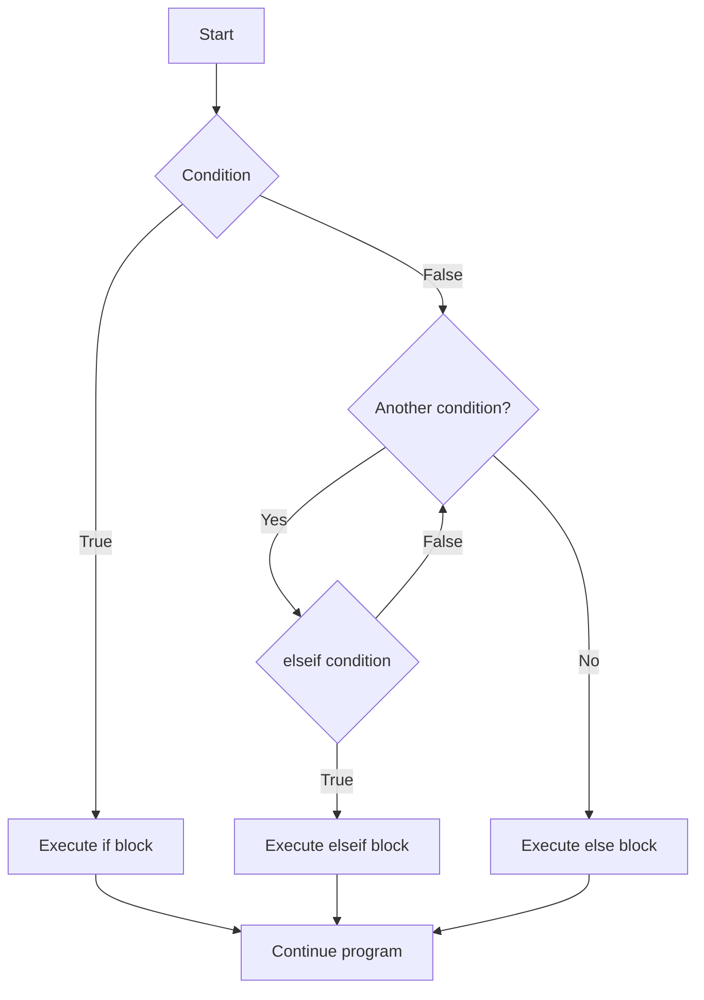

# PHP If Else Statements

## Introduction

Conditional statements are a fundamental part of programming, allowing your code to make decisions and execute different actions based on specific conditions. In PHP, the `if`, `else if` (or `elseif`), and `else` statements are essential tools that enable your programs to follow different paths depending on whether certain conditions are true or false.

Think of conditional statements as the decision-making mechanism in your code. Just as we make decisions in everyday life based on circumstances ("If it's raining, I'll take an umbrella; otherwise, I'll wear sunglasses"), your PHP code can make similar logical choices.

## Basic If Statement

The most basic conditional statement is the `if` statement. It executes a block of code only if a specified condition evaluates to `true`.

### Syntax

```php
if (condition) {
    // Code to execute if condition is true
}
```

### Example

```php
<?php
$temperature = 28;

if ($temperature > 25) {
    echo "It's a hot day!";
}
?>
```

**Output:**
```
It's a hot day!
```

In this example, the message "It's a hot day!" will be displayed because the condition `$temperature > 25` evaluates to `true`.

## If Else Statement

The `if...else` structure allows you to execute one block of code if a condition is true and another block if the condition is false.

### Syntax

```php
if (condition) {
    // Code to execute if condition is true
} else {
    // Code to execute if condition is false
}
```

### Example

```php
<?php
$hour = 20;

if ($hour < 18) {
    echo "Good day!";
} else {
    echo "Good evening!";
}
?>
```

**Output:**
```
Good evening!
```

Since `$hour` is 20, which is not less than 18, the condition `$hour < 18` evaluates to `false`. Therefore, the code in the `else` block executes, and "Good evening!" is displayed.

## If Elseif Else Statement

When you need to test multiple conditions, the `elseif` (or `else if`) statement comes in handy. It allows you to check another condition if the previous condition(s) evaluated to `false`.

### Syntax

```php
if (condition1) {
    // Code to execute if condition1 is true
} elseif (condition2) {
    // Code to execute if condition1 is false and condition2 is true
} else {
    // Code to execute if both condition1 and condition2 are false
}
```

### Example

```php
<?php
$grade = 75;

if ($grade >= 90) {
    echo "A (Excellent)";
} elseif ($grade >= 80) {
    echo "B (Good)";
} elseif ($grade >= 70) {
    echo "C (Average)";
} elseif ($grade >= 60) {
    echo "D (Below Average)";
} else {
    echo "F (Fail)";
}
?>
```

**Output:**
```
C (Average)
```

In this example, the program checks the value of `$grade` against multiple conditions and displays the appropriate grade letter. Since `$grade` is 75, which is greater than or equal to 70 but less than 80, the output is "C (Average)".

## Nested If Statements

You can also place an `if` statement inside another `if` or `else` block, creating what's known as a nested `if` statement. This allows for more complex decision-making processes.

### Syntax

```php
if (condition1) {
    // Code to execute if condition1 is true
    if (condition2) {
        // Code to execute if both condition1 and condition2 are true
    } else {
        // Code to execute if condition1 is true but condition2 is false
    }
} else {
    // Code to execute if condition1 is false
}
```

### Example

```php
<?php
$age = 25;
$hasID = true;

if ($age >= 18) {
    if ($hasID) {
        echo "You can enter the venue and purchase alcohol.";
    } else {
        echo "You can enter the venue but cannot purchase alcohol without ID.";
    }
} else {
    echo "Sorry, you must be 18 or older to enter the venue.";
}
?>
```

**Output:**
```
You can enter the venue and purchase alcohol.
```

In this example, there are two conditions being checked: whether the person is 18 or older and whether they have an ID. Since both conditions are true, the message "You can enter the venue and purchase alcohol." is displayed.

## Ternary Operator: Shorthand If Else

PHP also offers a shorthand way to write simple if-else statements using the ternary operator (`? :`). This can make your code more concise for straightforward conditions.

### Syntax

```php
(condition) ? expression_if_true : expression_if_false;
```

### Example

```php
<?php
$age = 20;
$status = ($age >= 18) ? "Adult" : "Minor";
echo $status;
?>
```

**Output:**
```
Adult
```

This example uses the ternary operator to check if `$age` is greater than or equal to 18. If it is, the variable `$status` is assigned the value "Adult"; otherwise, it's assigned "Minor". Since `$age` is 20, `$status` becomes "Adult", and that's what gets echoed.

## Null Coalescing Operator (??)

PHP 7 introduced the null coalescing operator (`??`), which is a shorthand for a common use case of the ternary operator: checking if a variable is set and not null.

### Syntax

```php
$result = $variable ?? 'default_value';
```

### Example

```php
<?php
// Assume $_GET['user'] is not set
$username = $_GET['user'] ?? 'Guest';
echo "Hello, $username!";
?>
```

**Output:**
```
Hello, Guest!
```

In this example, if `$_GET['user']` is set and not null, its value is assigned to `$username`. Otherwise, `$username` is assigned the value 'Guest'. Since we're assuming `$_GET['user']` is not set, `$username` becomes 'Guest'.

## Control Flow Diagram

Here's a visual representation of how if-else statements control the flow of your program:



## Practical Examples

### Example 1: Form Validation

```php
<?php
$username = "john_doe";
$password = "12345";

if (empty($username)) {
    echo "Username is required.";
} elseif (strlen($username) < 5) {
    echo "Username must be at least 5 characters long.";
} elseif (empty($password)) {
    echo "Password is required.";
} elseif (strlen($password) < 8) {
    echo "Password must be at least 8 characters long.";
} else {
    echo "Form validation successful!";
}
?>
```

**Output:**
```
Password must be at least 8 characters long.
```

This example demonstrates form validation where multiple conditions are checked in sequence. The password fails the validation because it's shorter than the required 8 characters.

### Example 2: Calculating Discount

```php
<?php
$totalPurchase = 120;
$discount = 0;
$discountMessage = "";

if ($totalPurchase >= 200) {
    $discount = 0.15; // 15% discount
    $discountMessage = "15% discount applied!";
} elseif ($totalPurchase >= 100) {
    $discount = 0.10; // 10% discount
    $discountMessage = "10% discount applied!";
} elseif ($totalPurchase >= 50) {
    $discount = 0.05; // 5% discount
    $discountMessage = "5% discount applied!";
} else {
    $discountMessage = "No discount applied.";
}

$discountAmount = $totalPurchase * $discount;
$finalPrice = $totalPurchase - $discountAmount;

echo $discountMessage . "<br>";
echo "Original price: $" . number_format($totalPurchase, 2) . "<br>";
echo "Discount amount: $" . number_format($discountAmount, 2) . "<br>";
echo "Final price: $" . number_format($finalPrice, 2);
?>
```

**Output:**
```
10% discount applied!
Original price: $120.00
Discount amount: $12.00
Final price: $108.00
```

This example calculates a discount based on the total purchase amount. Since the purchase is $120, a 10% discount is applied.

### Example 3: Simple Login System

```php
<?php
$registeredUsers = [
    'admin' => 'admin123',
    'user' => 'password123'
];

$inputUsername = 'admin';
$inputPassword = 'admin123';

if (!array_key_exists($inputUsername, $registeredUsers)) {
    echo "Username not found!";
} elseif ($registeredUsers[$inputUsername] !== $inputPassword) {
    echo "Incorrect password!";
} else {
    echo "Login successful! Welcome, $inputUsername.";
}
?>
```

**Output:**
```
Login successful! Welcome, admin.
```

This example shows a simple login system where the input username and password are compared against registered user credentials. Since both match, the login is successful.

## Best Practices

1. **Use curly braces**: Even for single-line blocks, using curly braces improves readability and prevents bugs when code is modified later.

2. **Be mindful of comparison operators**: Make sure you understand the difference between `==` (equality) and `===` (identity).

3. **Keep conditions simple**: If conditions become complex, consider breaking them down into separate variables or functions for better readability.

4. **Consider the evaluation order**: Conditions are evaluated from top to bottom, so place the most common or least expensive checks first for efficiency.

5. **Avoid deep nesting**: If you find yourself nesting multiple `if` statements, consider restructuring your code or using switch statements when appropriate.

## Summary

PHP if-else statements are powerful tools that allow your code to make decisions based on conditions. From basic if statements to more complex nested conditionals, understanding these constructs is essential for writing dynamic and interactive PHP applications.

In this guide, we've covered:
- Basic if statements
- If-else statements
- If-elseif-else statements
- Nested if statements
- The ternary operator for shorthand conditionals
- The null coalescing operator
- Real-world applications through practical examples

## Exercises

1. Create a PHP script that determines whether a given year is a leap year. (Hint: A leap year is divisible by 4 but not by 100, unless it's also divisible by 400.)

2. Write a program that calculates and displays the appropriate shipping cost based on the total weight of the package:
   - Less than 1kg: $5.00
   - 1kg to less than 5kg: $10.00
   - 5kg to less than 10kg: $15.00
   - 10kg or more: $20.00

3. Create a simple calculator that performs different operations (addition, subtraction, multiplication, division) based on user input.

## Additional Resources

- [PHP Manual: Control Structures](https://www.php.net/manual/en/language.control-structures.php)
- [PHP Manual: Comparison Operators](https://www.php.net/manual/en/language.operators.comparison.php)
- [PHP Manual: Logical Operators](https://www.php.net/manual/en/language.operators.logical.php)