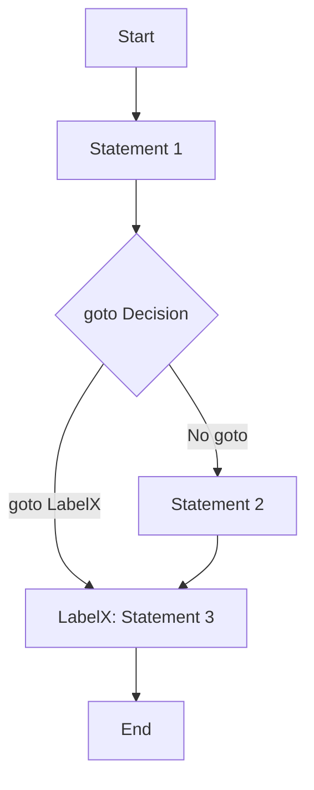

# PHP Goto Statement

## Introduction

The `goto` statement is one of PHP's control flow features that allows you to jump to another section in your program. Introduced in PHP 5.3, it provides a way to transfer program execution to a specified label within the same file and function scope.

While the `goto` statement is often considered controversial in programming (sometimes referred to as "dangerous" or "spaghetti code inducer"), understanding it is important for PHP developers. This guide will explain how `goto` works, its limitations, when to use it (and when not to), and provide practical examples.

## Basic Syntax

The `goto` statement has a simple syntax consisting of two parts:

1. The `goto` statement itself, followed by a label name:
   ```php
   goto label_name;
   ```

2. The label definition, which consists of the label name followed by a colon:
   ```php
   label_name:
   ```

## How It Works

When PHP encounters a `goto` statement, it immediately jumps to the specified label and continues execution from there. Here's a simple example:

```php
<?php
  echo "Step 1<br>";
  
  goto step3;
  
  echo "Step 2<br>"; // This line will be skipped
  
  step3:
  echo "Step 3<br>";
?>
```

**Output:**
```
Step 1
Step 3
```

In this example, the execution jumps from `goto step3;` directly to the `step3:` label, completely skipping the "Step 2" echo statement.

## Limitations of goto

The `goto` statement has several important limitations:

1. **Scope Restriction**: `goto` can only jump within the same file and function. You cannot jump into or out of functions or methods.

2. **Cannot Jump into Loops or Switch Structures**: `goto` cannot jump into the middle of a loop, `if` statement, or `switch` structure.

3. **Cannot Jump out of a Function**: `goto` cannot be used to jump out of one function into another.

Let's look at examples of these limitations:

### Invalid: Jumping into a Loop

```php
<?php
  goto inside_loop; // Error: Cannot jump into a loop
  
  for ($i = 0; $i < 5; $i++) {
    inside_loop:
    echo $i;
  }
?>
```

This will produce a fatal error: "goto' into loop or switch statement is disallowed".

### Invalid: Jumping Between Functions

```php
<?php
  function first_function() {
    echo "In first function<br>";
    goto second_func_label; // Error: Cannot jump between functions
  }
  
  function second_function() {
    second_func_label:
    echo "In second function<br>";
  }
  
  first_function();
?>
```

This will produce a fatal error: "'goto' to undefined label 'second_func_label'".

## Practical Uses of goto

Despite its limitations and controversial nature, there are some legitimate uses for the `goto` statement:

### 1. Error Handling and Cleanup

One common use is to quickly exit from deeply nested structures when an error occurs:

```php
<?php
  // Database connection, file operations, etc.
  
  if (!$connection) {
    echo "Connection failed<br>";
    goto cleanup;
  }
  
  // More operations that depend on connection
  
  if (!$query_result) {
    echo "Query failed<br>";
    goto cleanup;
  }
  
  // More code...
  
  cleanup:
  // Close connections, free resources, etc.
  echo "Performing cleanup operations<br>";
?>
```

### 2. Breaking Out of Nested Loops

While PHP offers `break` statements with levels, `goto` can be more readable for deeply nested loops:

```php
<?php
  $found = false;
  
  for ($i = 0; $i < 10; $i++) {
    for ($j = 0; $j < 10; $j++) {
      for ($k = 0; $k < 10; $k++) {
        echo "Checking coordinates: $i,$j,$k<br>";
        
        if ($i == 5 && $j == 5 && $k == 5) {
          echo "Found target at 5,5,5!<br>";
          $found = true;
          goto end_of_search;
        }
      }
    }
  }
  
  end_of_search:
  
  if ($found) {
    echo "Search completed successfully.<br>";
  } else {
    echo "Target not found.<br>";
  }
?>
```

This example will stop looping when it finds the coordinates (5,5,5) and jump to the end of the search.

### 3. State Machine Implementation

A basic state machine can be implemented using `goto`:

```php
<?php
  $state = "START";
  
  start:
  echo "Starting process...<br>";
  // Do some processing
  goto process;
  
  process:
  echo "Processing data...<br>";
  // Simulate some processing
  $success = true;
  
  if ($success) {
    goto success;
  } else {
    goto error;
  }
  
  error:
  echo "Error occurred during processing!<br>";
  goto end;
  
  success:
  echo "Processing completed successfully.<br>";
  goto end;
  
  end:
  echo "Process ended.<br>";
?>
```

**Output:**
```
Starting process...
Processing data...
Processing completed successfully.
Process ended.
```

## Best Practices

Even though PHP supports the `goto` statement, it's important to use it wisely:

1. **Use Sparingly**: Most control flow needs can be met using structured programming constructs like loops, conditionals, and functions.

2. **Comment Thoroughly**: If you use `goto`, add clear comments explaining why it's necessary.

3. **Consider Alternatives**: Before using `goto`, consider if other control structures would work better.

4. **Maintain Readability**: Ensure your code remains readable and maintainable even with `goto` statements.

## Alternative Approaches

In many cases, you can avoid using `goto` by using these alternatives:

### Using Functions

```php
<?php
  function process_data($data) {
    if (!validate($data)) {
      return false;
    }
    
    // Process data
    return true;
  }
  
  if (process_data($input)) {
    echo "Processing successful";
  } else {
    echo "Processing failed";
  }
?>
```

### Using Break with Levels

```php
<?php
  for ($i = 0; $i < 10; $i++) {
    for ($j = 0; $j < 10; $j++) {
      for ($k = 0; $k < 10; $k++) {
        echo "Checking: $i,$j,$k<br>";
        
        if ($i == 5 && $j == 5 && $k == 5) {
          echo "Found at 5,5,5!<br>";
          break 3; // Break out of all three loops
        }
      }
    }
  }
  
  echo "Search complete.<br>";
?>
```

## Flow Visualization

Here's a visual representation of how the `goto` statement affects program flow:



## Summary

The PHP `goto` statement is a control flow feature that allows jumping to labeled sections within the same file and function. While it has significant limitations and should be used sparingly, it can be helpful in specific scenarios like error handling and breaking out of deeply nested structures.

Key points to remember:
- `goto` can only jump within the same file and function scope
- It cannot jump into loops, switch statements, or between functions
- Legitimate uses include error handling, breaking deep nesting, and simple state machines
- Alternative approaches often lead to more maintainable code

## Exercises

1. Write a PHP script that uses `goto` to implement a simple calculator with operation states (add, subtract, multiply, divide).

2. Refactor the error handling example to use functions instead of `goto`. Compare both approaches.

3. Create a nested loop structure with at least 3 levels and use both the `goto` method and the `break` with levels method to exit when a condition is met.

## Additional Resources

- [PHP Official Documentation on goto](https://www.php.net/manual/en/control-structures.goto.php)
- [PHP Control Structures Overview](https://www.php.net/manual/en/language.control-structures.php)
- "Clean Code" by Robert C. Martin (for perspectives on structured programming)