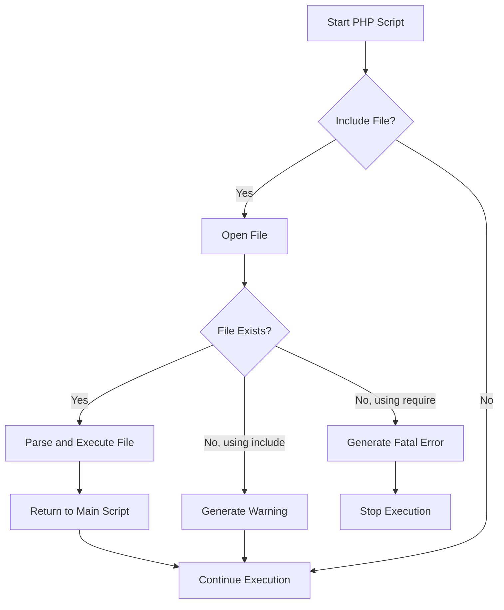

# PHP Include and Require

## Introduction

When building PHP applications, you'll often need to reuse the same code across multiple pages. Copying and pasting the same code into every file creates maintenance issues—when you need to change something, you'll have to update it in multiple places.

PHP provides a solution to this problem through **file inclusion statements**. These statements allow you to insert the content of one PHP file into another, making your code more maintainable, modular, and easier to manage.

In this tutorial, we'll explore four PHP statements for including external files:
- `include`
- `require`
- `include_once`
- `require_once`

By the end of this tutorial, you'll understand how to effectively use these statements to create modular and maintainable PHP applications.

## Include vs. Require: Key Differences

Before diving into examples, let's understand the fundamental difference between `include` and `require`:

| Statement | Behavior on File Not Found |
|-----------|----------------------------|
| `include` | Generates a **warning** and continues execution |
| `require` | Generates a **fatal error** and stops execution |

This difference makes `require` more suitable when the file is absolutely necessary for your application to function.

## Basic Usage

### The `include` Statement

The `include` statement incorporates and evaluates the specified file.

**Syntax:**
```php
include 'filename.php';
```

**Example:**

Let's create two files:

1. First, a file named `header.php`:

```php
<?php
echo "<header>";
echo "<h1>My Website</h1>";
echo "<nav><ul>";
echo "<li><a href='index.php'>Home</a></li>";
echo "<li><a href='about.php'>About</a></li>";
echo "<li><a href='contact.php'>Contact</a></li>";
echo "</ul></nav>";
echo "</header>";
?>
```

2. Then, a file named `index.php` that includes the header:

```php
<!DOCTYPE html>
<html>
<head>
    <title>My Website</title>
</head>
<body>
    <?php include 'header.php'; ?>
    
    <main>
        <h2>Welcome to My Website</h2>
        <p>This is the home page.</p>
    </main>
    
    <footer>
        <p>&copy; 2025 My Website</p>
    </footer>
</body>
</html>
```

**Output:**
```html
<!DOCTYPE html>
<html>
<head>
    <title>My Website</title>
</head>
<body>
    <header>
        <h1>My Website</h1>
        <nav>
            <ul>
                <li><a href='index.php'>Home</a></li>
                <li><a href='about.php'>About</a></li>
                <li><a href='contact.php'>Contact</a></li>
            </ul>
        </nav>
    </header>
    
    <main>
        <h2>Welcome to My Website</h2>
        <p>This is the home page.</p>
    </main>
    
    <footer>
        <p>&copy; 2025 My Website</p>
    </footer>
</body>
</html>
```

### The `require` Statement

The `require` statement works just like `include`, but with one crucial difference—if the file is not found, it will produce a fatal error.

**Syntax:**
```php
require 'filename.php';
```

**Example:**

```php
<!DOCTYPE html>
<html>
<head>
    <title>My Website</title>
</head>
<body>
    <?php require 'header.php'; ?>
    
    <main>
        <h2>Welcome to My Website</h2>
        <p>This is the home page.</p>
    </main>
    
    <?php require 'footer.php'; ?>
</body>
</html>
```

If `footer.php` doesn't exist, the script will terminate with an error like:

```
Fatal error: require(): Failed opening required 'footer.php' (include_path='.:/usr/share/php') in /var/www/html/index.php on line 13
```

## Using `include_once` and `require_once`

Sometimes you might accidentally include the same file multiple times, which can lead to errors (especially with function or class declarations). PHP provides `include_once` and `require_once` to ensure a file is included only once.

### The `include_once` Statement

**Syntax:**
```php
include_once 'filename.php';
```

**Example:**

```php
<?php
// functions.php
function greet($name) {
    return "Hello, $name!";
}
?>

<?php
// index.php
include_once 'functions.php';
include_once 'functions.php';  // This won't cause any issues

echo greet("World");  // Outputs: Hello, World!
?>
```

### The `require_once` Statement

**Syntax:**
```php
require_once 'filename.php';
```

**Example:**
```php
<?php
// class.php
class User {
    public $name;
    
    public function __construct($name) {
        $this->name = $name;
    }
    
    public function sayHello() {
        return "Hello, my name is " . $this->name;
    }
}
?>

<?php
// profile.php
require_once 'class.php';
$user = new User("John");
echo $user->sayHello();  // Outputs: Hello, my name is John
?>
```

## Including Files with Variables

PHP allows you to use variables to specify the file path to include:

```php
<?php
$page = 'about';
include $page . '.php';  // Will include about.php
?>
```

This feature can be useful for creating dynamic content based on user input, but be careful about security implications.

## Common Use Cases for File Inclusion

### 1. Template System

You can create a simple template system by including header and footer files:

```php
<?php
// template.php
include 'header.php';
echo $content;  // Content specific to each page
include 'footer.php';
?>
```

### 2. Configuration Files

Store database credentials and other configuration settings in a separate file:

```php
<?php
// config.php
$db_host = 'localhost';
$db_user = 'username';
$db_pass = 'password';
$db_name = 'mydb';
?>

<?php
// database.php
require_once 'config.php';
$conn = mysqli_connect($db_host, $db_user, $db_pass, $db_name);
?>
```

### 3. Reusable Functions

Create a library of custom functions:

```php
<?php
// functions.php
function formatDate($date) {
    return date("F j, Y", strtotime($date));
}

function slugify($text) {
    return strtolower(preg_replace('/[^a-z0-9]+/', '-', $text));
}
?>

<?php
// blog.php
require_once 'functions.php';
echo formatDate("2025-03-01");  // Outputs: March 1, 2025
echo slugify("Hello World!");    // Outputs: hello-world
?>
```

## File Inclusion Flowchart

Here's a diagram showing how file inclusion affects the execution flow:



## Best Practices

1. **Use `require` for Critical Files**: When a file is essential for your script to function correctly, use `require` instead of `include`.

2. **Use `*_once` for Function/Class Definitions**: Always use `include_once` or `require_once` when including files with function or class definitions to avoid redeclaration errors.

3. **Organize Your Includes**: Keep included files organized in a logical directory structure.
   ```
   project/
   ├── includes/
   │   ├── config.php
   │   ├── functions.php
   │   └── classes/
   │       ├── User.php
   │       └── Database.php
   ├── templates/
   │   ├── header.php
   │   └── footer.php
   └── public/
       ├── index.php
       └── about.php
   ```

4. **Include Path**: Use `set_include_path()` to specify additional directories where PHP should look for included files.

5. **Security Considerations**: Be very careful when using variables in include statements, especially when they contain user input.

## Common Errors and How to Fix Them

### 1. "Failed to open stream: No such file or directory"

This error occurs when PHP can't find the file you're trying to include.

**Solution**: Check that the file exists and that the path is correct. Remember that the path is relative to the script that's running, not the script that contains the include statement.

### 2. "Cannot redeclare function/class"

This happens when you define the same function or class multiple times.

**Solution**: Use `include_once` or `require_once` instead of `include` or `require`.

### 3. "Unexpected end of file"

This can happen if your included file has a syntax error or an unclosed PHP tag.

**Solution**: Check the syntax of your included files, and make sure all opening tags have corresponding closing tags.

## Summary

PHP's include and require statements provide powerful tools for creating modular and maintainable code. Here's a quick recap:

- Use `include` when the file is optional
- Use `require` when the file is essential
- Use `include_once` and `require_once` to prevent duplicate inclusion, especially for files containing function or class definitions
- File inclusion allows you to create reusable components, templates, and libraries

By effectively using these statements, you can write cleaner, more maintainable PHP code that's easier to develop and debug.

## Exercises

1. Create a simple website with multiple pages that share a common header, navigation bar, and footer.

2. Build a configuration system that loads different settings based on whether the site is in development or production mode.

3. Create a custom function library and include it in multiple pages.

4. Implement a simple template system that allows you to change the layout of your entire site by modifying a single file.

## Additional Resources

- [PHP Manual: Include](https://www.php.net/manual/en/function.include.php)
- [PHP Manual: Require](https://www.php.net/manual/en/function.require.php)
- [PHP Manual: Include_once](https://www.php.net/manual/en/function.include-once.php)
- [PHP Manual: Require_once](https://www.php.net/manual/en/function.require-once.php)