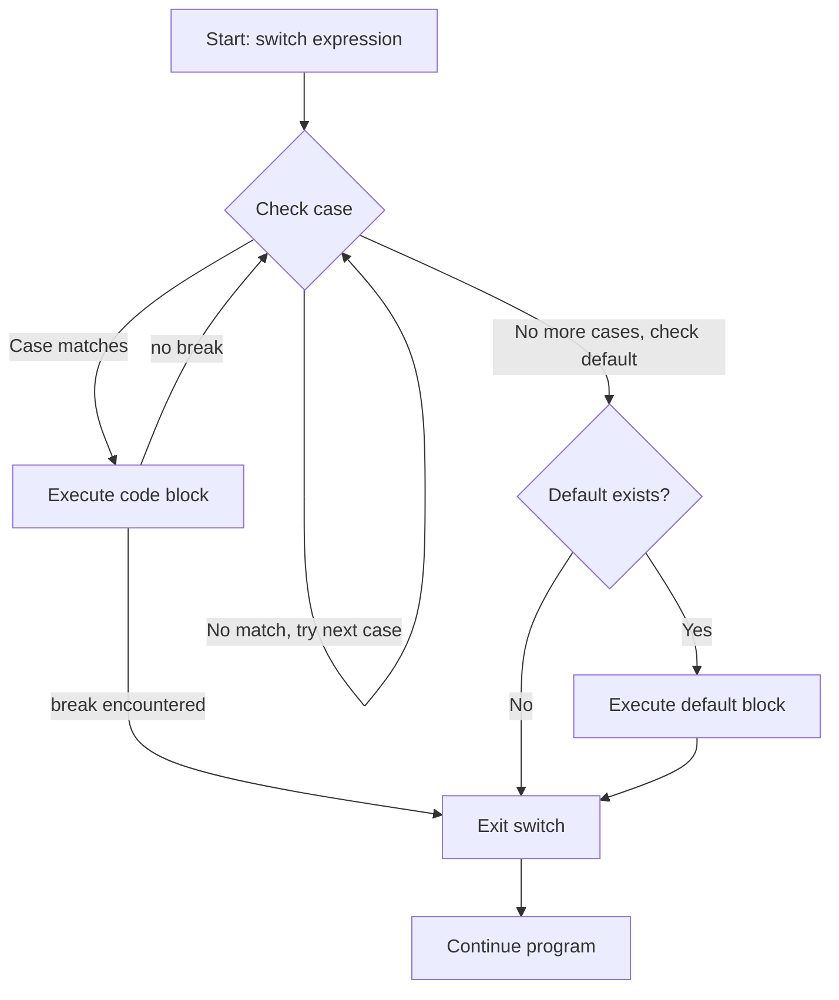

# PHP Switch Case

## Introduction

The `switch` statement is a powerful control flow structure in PHP that provides an elegant alternative to multiple `if-else` statements when you need to compare a single variable against several different values. It improves code readability and can be more efficient when dealing with multiple conditions based on the same variable.

The `switch` statement evaluates an expression once and compares its value against a series of case statements. When it finds a match, it executes the corresponding code block until it encounters a `break` statement or reaches the end of the switch structure.

## Basic Syntax

Here's the basic syntax of the PHP `switch` statement:

```php
switch (expression) {
    case value1:
        // Code to execute if expression equals value1
        break;
    case value2:
        // Code to execute if expression equals value2
        break;
    ...
    default:
        // Code to execute if none of the cases match
}
```

Let's break down the components:

- **expression**: The value to be evaluated (typically a variable)
- **case value**: The possible values that the expression might equal
- **break**: Ends the execution of the switch block (prevents "falling through" to the next case)
- **default**: Optional block that executes if none of the cases match

## Simple Example

Here's a basic example that displays a message based on a user's favorite color:

```php
<?php
$favoriteColor = "blue";

switch ($favoriteColor) {
    case "red":
        echo "Your favorite color is red like fire!";
        break;
    case "blue":
        echo "Your favorite color is blue like the sky!";
        break;
    case "green":
        echo "Your favorite color is green like nature!";
        break;
    default:
        echo "Your favorite color is neither red, blue, nor green!";
}
?>
```

**Output:**
```
Your favorite color is blue like the sky!
```

## The Importance of `break`

The `break` statement is crucial in a switch structure. Without it, PHP will continue executing the code for all subsequent cases after finding a match, regardless of whether those cases match or not. This behavior is called "falling through."

Let's see what happens when we forget to include the `break` statement:

```php
<?php
$grade = "B";

switch ($grade) {
    case "A":
        echo "Excellent! ";
    case "B":
        echo "Good job! ";
    case "C":
        echo "You passed. ";
    case "D":
        echo "You need improvement. ";
    default:
        echo "Invalid grade.";
}
?>
```

**Output:**
```
Good job! You passed. You need improvement. Invalid grade.
```

Since `$grade` is "B", the execution starts at the "B" case and continues through all subsequent cases because there are no break statements.

## Multiple Cases with the Same Code

If you want multiple cases to execute the same code, you can list them sequentially:

```php
<?php
$day = "Saturday";

switch ($day) {
    case "Monday":
    case "Tuesday":
    case "Wednesday":
    case "Thursday":
    case "Friday":
        echo "It's a weekday. Time to work!";
        break;
    case "Saturday":
    case "Sunday":
        echo "It's the weekend! Time to relax!";
        break;
    default:
        echo "Invalid day!";
}
?>
```

**Output:**
```
It's the weekend! Time to relax!
```

## Switch vs. If-Else

Let's compare using a `switch` statement with using multiple `if-else` statements:

### Using Switch:

```php
<?php
$fruit = "apple";

switch ($fruit) {
    case "apple":
        echo "It's an apple.";
        break;
    case "banana":
        echo "It's a banana.";
        break;
    case "orange":
        echo "It's an orange.";
        break;
    default:
        echo "It's some other fruit.";
}
?>
```

### Equivalent If-Else:

```php
<?php
$fruit = "apple";

if ($fruit == "apple") {
    echo "It's an apple.";
} elseif ($fruit == "banana") {
    echo "It's a banana.";
} elseif ($fruit == "orange") {
    echo "It's an orange.";
} else {
    echo "It's some other fruit.";
}
?>
```

Both code snippets will produce the same output, but the `switch` statement is often more readable when comparing a single variable against multiple values.

## Switch with Expressions in Case Statements

PHP evaluates case values at runtime, allowing for more dynamic comparisons:

```php
<?php
$age = 25;

switch (true) {
    case ($age < 13):
        echo "You are a child.";
        break;
    case ($age >= 13 && $age < 18):
        echo "You are a teenager.";
        break;
    case ($age >= 18 && $age < 65):
        echo "You are an adult.";
        break;
    default:
        echo "You are a senior.";
}
?>
```

**Output:**
```
You are an adult.
```

By using `switch(true)`, we can evaluate expressions in each case. The first case that evaluates to true will be executed.

## Real-World Application: Simple Calculator

Let's create a simple calculator using the `switch` statement:

```php
<?php
function calculate($num1, $num2, $operator) {
    switch ($operator) {
        case '+':
            return $num1 + $num2;
        case '-':
            return $num1 - $num2;
        case '*':
            return $num1 * $num2;
        case '/':
            if ($num2 == 0) {
                return "Division by zero is not allowed";
            }
            return $num1 / $num2;
        default:
            return "Invalid operator";
    }
}

// Usage examples
echo calculate(10, 5, '+') . "<br>"; // 15
echo calculate(10, 5, '-') . "<br>"; // 5
echo calculate(10, 5, '*') . "<br>"; // 50
echo calculate(10, 5, '/') . "<br>"; // 2
echo calculate(10, 0, '/') . "<br>"; // Division by zero is not allowed
echo calculate(10, 5, '%') . "<br>"; // Invalid operator
?>
```

**Output:**
```
15
5
50
2
Division by zero is not allowed
Invalid operator
```

## Real-World Application: HTTP Status Codes

Here's another practical example that provides human-readable messages for common HTTP status codes:

```php
<?php
function getHttpStatusMessage($statusCode) {
    switch ($statusCode) {
        case 200:
            return "OK - The request has succeeded.";
        case 201:
            return "Created - The request has been fulfilled and a new resource created.";
        case 400:
            return "Bad Request - The request could not be understood by the server.";
        case 401:
            return "Unauthorized - Authentication is required and has failed.";
        case 404:
            return "Not Found - The requested resource was not found.";
        case 500:
            return "Internal Server Error - The server encountered an unexpected condition.";
        default:
            return "Unknown status code.";
    }
}

// Usage examples
echo getHttpStatusMessage(200) . "<br>";
echo getHttpStatusMessage(404) . "<br>";
echo getHttpStatusMessage(999) . "<br>";
?>
```

**Output:**
```
OK - The request has succeeded.
Not Found - The requested resource was not found.
Unknown status code.
```

## Switch vs. Match Expression (PHP 8.0+)

If you're using PHP 8.0 or higher, the new `match` expression provides a more concise alternative to the `switch` statement:

```php
<?php
// Only works in PHP 8.0+
$day = "Monday";

$message = match ($day) {
    "Monday", "Tuesday", "Wednesday", "Thursday", "Friday" => "It's a weekday. Time to work!",
    "Saturday", "Sunday" => "It's the weekend! Time to relax!",
    default => "Invalid day!"
};

echo $message;
?>
```

Key differences between `match` and `switch`:
1. `match` is an expression that returns a value, while `switch` is a statement
2. `match` uses strict comparison (`===`), while `switch` uses loose comparison (`==`)
3. `match` doesn't require `break` statements
4. `match` requires all possible cases to be covered, or include a default case
5. `match` can combine multiple conditions with a single result using commas

## Control Flow Visualization

Here's a visual representation of how the switch statement works:



## Summary

The PHP `switch` statement is a powerful control structure for comparing a single variable against multiple values. Key points to remember:

- It's an alternative to multiple `if-else` statements that improves readability
- Always include `break` statements to prevent falling through to other cases
- Group multiple cases that share the same code
- Use the `default` case to handle unexpected values
- For more complex comparisons, you can use `switch(true)` with expressions in cases
- In PHP 8.0+, consider using the `match` expression for more concise and safer code

## Practice Exercises

1. Create a switch statement that outputs a different message for each day of the week
2. Build a simple grade calculator that converts numerical scores to letter grades (A, B, C, D, F)
3. Write a switch statement that identifies whether a given character is a vowel or consonant
4. Create a simple menu system for a command-line application using switch
5. Implement a currency converter that converts between USD, EUR, GBP, and JPY using switch

## Additional Resources

- [PHP Official Documentation on Switch](https://www.php.net/manual/en/control-structures.switch.php)
- [PHP 8.0 Match Expression Documentation](https://www.php.net/manual/en/control-structures.match.php)
- [W3Schools PHP Switch Tutorial](https://www.w3schools.com/php/php_switch.asp)