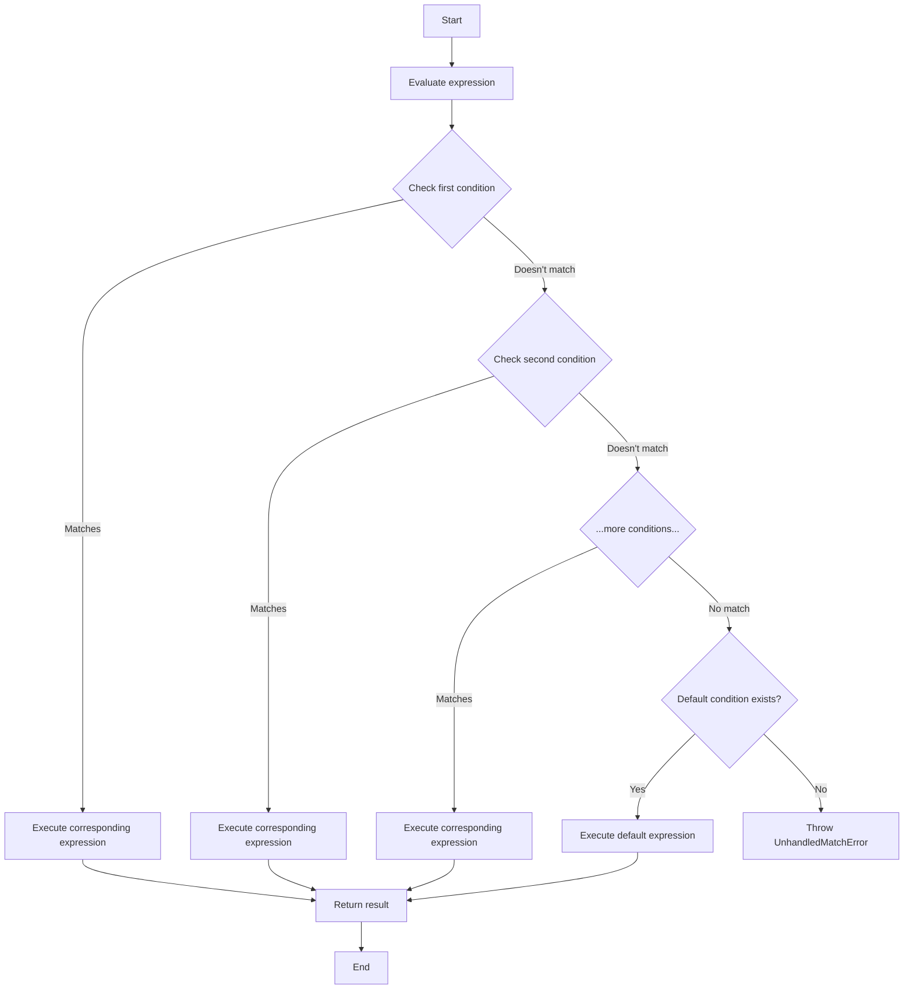

# PHP Match Expression

## Introduction

The match expression is one of PHP's more recent additions, introduced in PHP 8.0. It provides a more elegant and concise way to handle conditional branching compared to the traditional `switch` statement. The match expression evaluates an expression and compares it against multiple possible values, then executes the corresponding expression for the first match it finds.

Think of the match expression as an upgraded version of the switch statement with a cleaner syntax, strict comparison, and the ability to return values directly. It's especially useful for mapping input values to corresponding output values without verbose conditional logic.

## Basic Syntax

Here's the basic syntax of the PHP match expression:

```php
$result = match (expression) {
    value1 => returnExpression1,
    value2, value3 => returnExpression2,
    default => defaultReturnExpression,
};
```

Key points about the match expression:
- It returns a value (unlike `switch` which is a statement)
- It uses the `=>` arrow syntax to map values to expressions
- It uses strict comparison (`===`)
- It doesn't require `break` statements
- It allows multiple values to be handled by the same expression
- The `default` arm handles any values that don't match other conditions

## Match vs. Switch: Key Differences

Let's compare the match expression with the traditional switch statement:

| Feature | match | switch |
|---------|-------|--------|
| Type | Expression (returns a value) | Statement (doesn't return) |
| Comparison | Strict comparison (`===`) | Loose comparison (`==`) |
| Fall-through | No fall-through | Falls through without `break` |
| Syntax | Concise, uses `=>` | More verbose, uses `:` and `break` |
| Multiple conditions | Comma-separated values | Multiple `case` statements |

## Basic Examples

### Example 1: Simple Value Matching

```php
$dayNumber = 3;
$dayName = match ($dayNumber) {
    1 => 'Monday',
    2 => 'Tuesday',
    3 => 'Wednesday',
    4 => 'Thursday',
    5 => 'Friday',
    6 => 'Saturday',
    7 => 'Sunday',
    default => 'Invalid day number',
};

echo "Day $dayNumber is $dayName";
// Output: Day 3 is Wednesday
```

### Example 2: Multiple Values for One Result

```php
$dayType = match ($dayName) {
    'Saturday', 'Sunday' => 'Weekend',
    'Monday', 'Tuesday', 'Wednesday', 'Thursday', 'Friday' => 'Weekday',
    default => 'Unknown',
};

echo "$dayName is a $dayType";
// Output: Wednesday is a Weekday
```

## Advanced Usage

### Using Expressions in Match Arms

The match expression allows you to use expressions in both the value positions and the result positions:

```php
$score = 85;
$grade = match (true) {
    $score >= 90 => 'A',
    $score >= 80 => 'B',
    $score >= 70 => 'C',
    $score >= 60 => 'D',
    default => 'F',
};

echo "Score: $score, Grade: $grade";
// Output: Score: 85, Grade: B
```

In this example, we're using `true` as the expression to match against, and then using boolean expressions as conditions. The first condition that evaluates to `true` will be used.

### Using Match for Error Handling

Match expressions are excellent for handling different error conditions:

```php
function processFile($filename) {
    $status = checkFile($filename); // Returns a status code
    
    return match ($status) {
        0 => "File $filename processed successfully",
        1 => "File $filename not found",
        2 => "Permission denied for $filename",
        3 => "File $filename is empty",
        default => "Unknown error occurred with $filename",
    };
}

// Usage
echo processFile("data.txt");
// Output depends on the status returned by checkFile()
```

### Using Match with Objects

Match expressions can also handle objects by comparing their properties:

```php
class HttpResponse {
    public function __construct(public int $statusCode) {}
}

$response = new HttpResponse(404);

$message = match ($response->statusCode) {
    200, 201 => 'Success',
    301, 302 => 'Redirection',
    400 => 'Bad Request',
    401 => 'Unauthorized',
    403 => 'Forbidden',
    404 => 'Not Found',
    500 => 'Server Error',
    default => 'Unknown Status Code',
};

echo "Response: $message";
// Output: Response: Not Found
```

## Real-World Applications

### Form Input Validation

```php
function validateInput($type, $value) {
    return match ($type) {
        'email' => filter_var($value, FILTER_VALIDATE_EMAIL) ? 'Valid email' : 'Invalid email',
        'url' => filter_var($value, FILTER_VALIDATE_URL) ? 'Valid URL' : 'Invalid URL',
        'age' => (is_numeric($value) && $value >= 0 && $value <= 120) ? 'Valid age' : 'Invalid age',
        'username' => (preg_match('/^[a-zA-Z0-9_]{3,20}$/', $value)) ? 'Valid username' : 'Invalid username',
        default => 'Unknown validation type',
    };
}

// Usage examples
echo validateInput('email', 'user@example.com'); // Valid email
echo validateInput('age', '150'); // Invalid age
```

### API Response Handling

```php
function handleApiResponse($statusCode) {
    $action = match ($statusCode) {
        200 => fn() => displayData(),
        400, 401, 403 => fn() => showErrorMessage("Client error: $statusCode"),
        500, 502, 503 => fn() => logServerError("Server error: $statusCode"),
        default => fn() => logUnknownStatus("Unknown status: $statusCode"),
    };
    
    return $action();
}
```

### Command Router

```php
function routeCommand($command, $parameters) {
    return match ($command) {
        'create' => createResource($parameters),
        'read' => readResource($parameters),
        'update' => updateResource($parameters),
        'delete' => deleteResource($parameters),
        'list' => listResources(),
        'help' => displayHelp(),
        default => "Unknown command: $command. Type 'help' for available commands.",
    };
}

// Usage
echo routeCommand('create', ['name' => 'New Item', 'value' => 42]);
```

## Flow Diagram

Here's a visual representation of how the match expression works:



## Error Handling

If the match expression doesn't find a matching value and no default arm is provided, it will throw an `UnhandledMatchError`. Always include a default arm or ensure all possible values are covered:

```php
function potentiallyDangerous($value) {
    try {
        return match ($value) {
            1 => 'One',
            2 => 'Two',
            // No default arm!
        };
    } catch (\UnhandledMatchError $e) {
        return "Error: Unhandled match value: $value";
    }
}

echo potentiallyDangerous(3); // Error: Unhandled match value: 3
```

## Best Practices

1. **Use match for simple value mapping**: Match is best when mapping input values to output values.

2. **Include a default arm**: Always include a default arm to handle unexpected values.

3. **Choose match over switch** when:
   - You need to return a value directly
   - You want strict comparison
   - You have simple expressions to execute
   
4. **Choose switch over match** when:
   - You have complex blocks of code to execute
   - You need fall-through behavior
   - You're working with older PHP versions (< 8.0)

5. **Combine related conditions**: Group related values on the same line for cleaner code.

## Summary

The PHP match expression is a powerful addition to PHP's control flow arsenal, offering a cleaner, more concise alternative to the switch statement. It's especially useful for:

- Mapping values to results
- Handling different conditions with compact syntax
- Performing strict comparisons
- Returning values directly from conditional logic

Match expressions make your code more readable and less error-prone by eliminating common issues like forgetting `break` statements or unexpected type coercions.

## Practice Exercises

1. Create a function that converts numeric scores (0-100) to letter grades (A, B, C, D, F) using a match expression.

2. Write a function that takes a HTTP status code and returns an appropriate message using a match expression.

3. Implement a simple calculator that takes two numbers and an operator (+, -, *, /) and returns the result using a match expression.

4. Create a function that validates different types of user input (email, phone, zip code) using a match expression.

## Additional Resources

- [PHP Documentation on match](https://www.php.net/manual/en/control-structures.match.php)
- [RFC: Match expression v2](https://wiki.php.net/rfc/match_expression_v2)
- [What's new in PHP 8.0](https://www.php.net/releases/8.0/en.php)