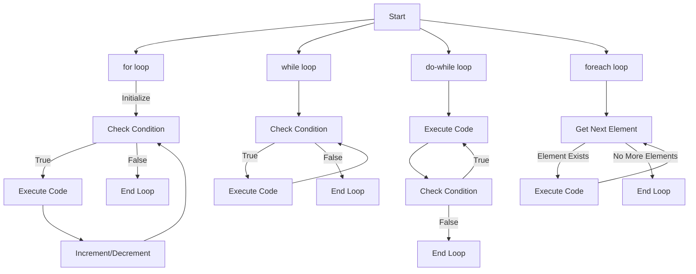

# PHP Loops

## Introduction

Loops are fundamental programming structures that allow you to execute a block of code repeatedly. In PHP, loops are essential for tasks like processing arrays, generating repetitive HTML elements, or performing operations a specific number of times. Instead of writing the same code multiple times, loops provide an efficient way to automate repetitive tasks.

This guide will introduce you to different types of loops in PHP, explain how they work, and provide practical examples to help you implement them in your projects.

## Types of PHP Loops

PHP supports four main types of loops:

1. **for loop** - Executes code a specified number of times
2. **while loop** - Executes code as long as a condition is true
3. **do-while loop** - Similar to while, but guarantees at least one execution
4. **foreach loop** - Specifically designed to work with arrays and objects

Let's explore each type in detail.

## For Loop

The `for` loop is ideal when you know exactly how many times you want to execute a block of code. It consists of three parts:

1. **Initialization**: Sets a starting value for the counter variable
2. **Condition**: Specifies how long the loop should continue
3. **Increment/Decrement**: Updates the counter variable after each iteration

### Syntax

```php
for (initialization; condition; increment/decrement) {
    // Code to be executed
}
```

### Example: Counting from 1 to 5

```php
<?php
for ($i = 1; $i <= 5; $i++) {
    echo "Number: $i <br>";
}
?>
```

**Output:**
```
Number: 1
Number: 2
Number: 3
Number: 4
Number: 5
```

In this example:
- `$i = 1` initializes the counter variable
- `$i <= 5` sets the condition (continue while $i is less than or equal to 5)
- `$i++` increments the counter after each iteration

### Practical Example: Generating a Multiplication Table

```php
<?php
$number = 7;
echo "<h3>Multiplication Table for $number</h3>";
echo "<table border='1'>";
for ($i = 1; $i <= 10; $i++) {
    $result = $number * $i;
    echo "<tr><td>$number × $i</td><td>=</td><td>$result</td></tr>";
}
echo "</table>";
?>
```

**Output:**

This will generate an HTML table showing the multiplication table for the number 7, from 7×1 through 7×10.

## While Loop

The `while` loop executes a block of code as long as a specified condition is true. Unlike the `for` loop, it only requires a condition.

### Syntax

```php
while (condition) {
    // Code to be executed
}
```

### Example: Counting Down from 5

```php
<?php
$counter = 5;
while ($counter > 0) {
    echo "Countdown: $counter <br>";
    $counter--;
}
echo "Blast off!";
?>
```

**Output:**
```
Countdown: 5
Countdown: 4
Countdown: 3
Countdown: 2
Countdown: 1
Blast off!
```

In this example:
- The loop starts with `$counter = 5`
- Each iteration checks if `$counter > 0` is true
- Inside the loop, we decrement `$counter` by 1 using `$counter--`
- Once `$counter` becomes 0, the condition becomes false, and the loop ends

### Practical Example: Reading Lines from a File

```php
<?php
$file = fopen("sample.txt", "r");

if ($file) {
    $lineNumber = 1;
    
    while (!feof($file)) {
        $line = fgets($file);
        echo "Line $lineNumber: $line<br>";
        $lineNumber++;
    }
    
    fclose($file);
} else {
    echo "Unable to open the file.";
}
?>
```

This example demonstrates reading a file line by line using a `while` loop. The loop continues until the end of the file is reached (`feof()` function checks for the end-of-file).

## Do-While Loop

The `do-while` loop is similar to the `while` loop, but with one important difference: the code block is executed once before checking the condition. This ensures that the code runs at least once, even if the condition is initially false.

### Syntax

```php
do {
    // Code to be executed
} while (condition);
```

### Example: Rolling a Die

```php
<?php
do {
    $roll = rand(1, 6);
    echo "You rolled a $roll<br>";
} while ($roll != 6);

echo "You rolled a six! Game over.";
?>
```

**Output:**
```
You rolled a 3
You rolled a 1
You rolled a 6
You rolled a six! Game over.
```

In this example:
- We generate a random number between 1 and 6 (simulating a die roll)
- We display the result
- We continue rolling as long as we don't get a 6
- The loop will always execute at least once, guaranteeing at least one roll

### Practical Example: User Input Validation

```php
<?php
// Simulating user input for demonstration
$input = "";
$attempts = 0;

do {
    // In a real application, this would come from a form
    if ($attempts == 0) $input = "";
    if ($attempts == 1) $input = "abc";
    if ($attempts == 2) $input = "123";
    
    $isValid = is_numeric($input);
    
    if (!$isValid) {
        echo "Invalid input: $input. Please enter a number.<br>";
    }
    
    $attempts++;
    
    // In a real application, this would stop after actual user input
    if ($attempts > 3) break;
    
} while (!$isValid);

if ($isValid) {
    echo "Valid number received: $input";
}
?>
```

**Output:**
```
Invalid input: . Please enter a number.
Invalid input: abc. Please enter a number.
Valid number received: 123
```

This example demonstrates input validation using a `do-while` loop. The loop continues until valid input (a number) is provided.

## Foreach Loop

The `foreach` loop is specifically designed for iterating through arrays and objects. It automatically assigns each element of the array to a variable on each iteration.

### Syntax

```php
foreach ($array as $value) {
    // Code using $value
}

// OR with key-value pairs:
foreach ($array as $key => $value) {
    // Code using $key and $value
}
```

### Example: Processing a Simple Array

```php
<?php
$fruits = ["Apple", "Banana", "Cherry", "Date", "Elderberry"];

foreach ($fruits as $fruit) {
    echo "I like $fruit<br>";
}
?>
```

**Output:**
```
I like Apple
I like Banana
I like Cherry
I like Date
I like Elderberry
```

### Example: Working with Associative Arrays

```php
<?php
$person = [
    "name" => "John",
    "age" => 28,
    "job" => "Web Developer",
    "city" => "New York"
];

foreach ($person as $key => $value) {
    echo "<strong>$key</strong>: $value<br>";
}
?>
```

**Output:**
```
name: John
age: 28
job: Web Developer
city: New York
```

### Practical Example: Generating an HTML Table from Data

```php
<?php
$students = [
    ["id" => 1, "name" => "Alice", "grade" => "A"],
    ["id" => 2, "name" => "Bob", "grade" => "B"],
    ["id" => 3, "name" => "Charlie", "grade" => "A-"],
    ["id" => 4, "name" => "Diana", "grade" => "B+"]
];

echo "<table border='1'>
        <tr>
            <th>ID</th>
            <th>Name</th>
            <th>Grade</th>
        </tr>";

foreach ($students as $student) {
    echo "<tr>
            <td>{$student['id']}</td>
            <td>{$student['name']}</td>
            <td>{$student['grade']}</td>
          </tr>";
}

echo "</table>";
?>
```

This example generates an HTML table by iterating through an array of student records. The `foreach` loop makes it easy to process nested arrays.

## Loop Control Statements

PHP provides control statements that allow you to modify the behavior of loops:

### Break Statement

The `break` statement immediately terminates the loop.

```php
<?php
for ($i = 1; $i <= 10; $i++) {
    if ($i == 5) {
        break; // Exit the loop when $i equals 5
    }
    echo "Number: $i <br>";
}
?>
```

**Output:**
```
Number: 1
Number: 2
Number: 3
Number: 4
```

### Continue Statement

The `continue` statement skips the current iteration and moves to the next one.

```php
<?php
for ($i = 1; $i <= 10; $i++) {
    if ($i % 2 == 0) {
        continue; // Skip even numbers
    }
    echo "Odd number: $i <br>";
}
?>
```

**Output:**
```
Odd number: 1
Odd number: 3
Odd number: 5
Odd number: 7
Odd number: 9
```

## Nested Loops

You can place a loop inside another loop to create nested loops. This is useful for working with multi-dimensional arrays or generating complex patterns.

### Example: Creating a Multiplication Table

```php
<?php
echo "<table border='1'>";

// Create the header row
echo "<tr><th></th>";
for ($i = 1; $i <= 5; $i++) {
    echo "<th>$i</th>";
}
echo "</tr>";

// Create the data rows
for ($i = 1; $i <= 5; $i++) {
    echo "<tr><th>$i</th>";
    
    for ($j = 1; $j <= 5; $j++) {
        $result = $i * $j;
        echo "<td>$result</td>";
    }
    
    echo "</tr>";
}

echo "</table>";
?>
```

This example creates a 5×5 multiplication table using nested loops:
- The outer loop creates the rows
- The inner loop creates the columns
- The result of multiplying the row and column numbers is displayed in each cell

## Loop Flow Visualization

Here's a visual representation of how different loops work:



## Performance Considerations

When working with loops, keep these performance tips in mind:

1. **Avoid expensive operations inside loops** whenever possible
2. **Calculate array sizes outside the loop** using `count()` once, rather than in each iteration
3. **Use the most appropriate loop type** for your specific scenario
4. **Consider using array functions** like `array_map()`, `array_filter()`, or `array_reduce()` for certain operations instead of explicit loops

## Common Use Cases for Loops

Here are some common scenarios where loops are particularly useful:

1. **Data processing**: Transforming, filtering, or analyzing array data
2. **Pagination**: Displaying a limited number of items per page
3. **File operations**: Reading, writing, or processing file data
4. **HTML generation**: Creating repeating elements like tables, lists, or form fields
5. **Database operations**: Processing result sets from database queries

## Practical Example: Building a Dynamic Form

```php
<?php
$formFields = [
    ["name" => "username", "label" => "Username", "type" => "text", "required" => true],
    ["name" => "email", "label" => "Email Address", "type" => "email", "required" => true],
    ["name" => "password", "label" => "Password", "type" => "password", "required" => true],
    ["name" => "bio", "label" => "Biography", "type" => "textarea", "required" => false],
    ["name" => "subscribe", "label" => "Subscribe to newsletter", "type" => "checkbox", "required" => false]
];

echo "<form action='process.php' method='post'>";

foreach ($formFields as $field) {
    echo "<div class='form-group'>";
    echo "<label for='{$field['name']}'>{$field['label']}";
    
    if ($field['required']) {
        echo " <span class='required'>*</span>";
    }
    
    echo "</label>";
    
    if ($field['type'] === 'textarea') {
        echo "<textarea name='{$field['name']}' id='{$field['name']}'></textarea>";
    } else if ($field['type'] === 'checkbox') {
        echo "<input type='{$field['type']}' name='{$field['name']}' id='{$field['name']}'>";
    } else {
        echo "<input type='{$field['type']}' name='{$field['name']}' id='{$field['name']}'>";
    }
    
    echo "</div>";
}

echo "<button type='submit'>Submit</button>";
echo "</form>";
?>
```

This example demonstrates generating a dynamic form with different field types using a `foreach` loop. The loop iterates through an array of field definitions and creates the appropriate HTML elements for each one.

## Summary

Loops are essential programming constructs that allow you to execute code repeatedly. PHP offers four main types of loops:

1. **for loop**: Best when you know exactly how many iterations you need
2. **while loop**: Useful when the number of iterations depends on a condition
3. **do-while loop**: Similar to while, but guarantees at least one execution
4. **foreach loop**: Specifically designed for iterating through arrays and objects

By mastering these loop types and understanding when to use each one, you can write more efficient and maintainable PHP code. Remember to use loop control statements like `break` and `continue` when needed, and consider using nested loops for more complex scenarios.

## Exercises

To practice your understanding of PHP loops, try these exercises:

1. Write a program that displays all even numbers between 1 and 20 using a `for` loop.
2. Create a PHP script that calculates the factorial of a number using a `while` loop.
3. Use a `do-while` loop to create a number guessing game that continues until the correct number is guessed.
4. Write a program that uses a `foreach` loop to find the largest value in an array of numbers.
5. Create a nested loop structure to generate a 10×10 checkerboard pattern using HTML tables.

## Additional Resources

- [PHP Manual: for loops](https://www.php.net/manual/en/control-structures.for.php)
- [PHP Manual: while loops](https://www.php.net/manual/en/control-structures.while.php)
- [PHP Manual: do-while loops](https://www.php.net/manual/en/control-structures.do.while.php)
- [PHP Manual: foreach loops](https://www.php.net/manual/en/control-structures.foreach.php)
- [PHP Manual: Control Structures](https://www.php.net/manual/en/language.control-structures.php)