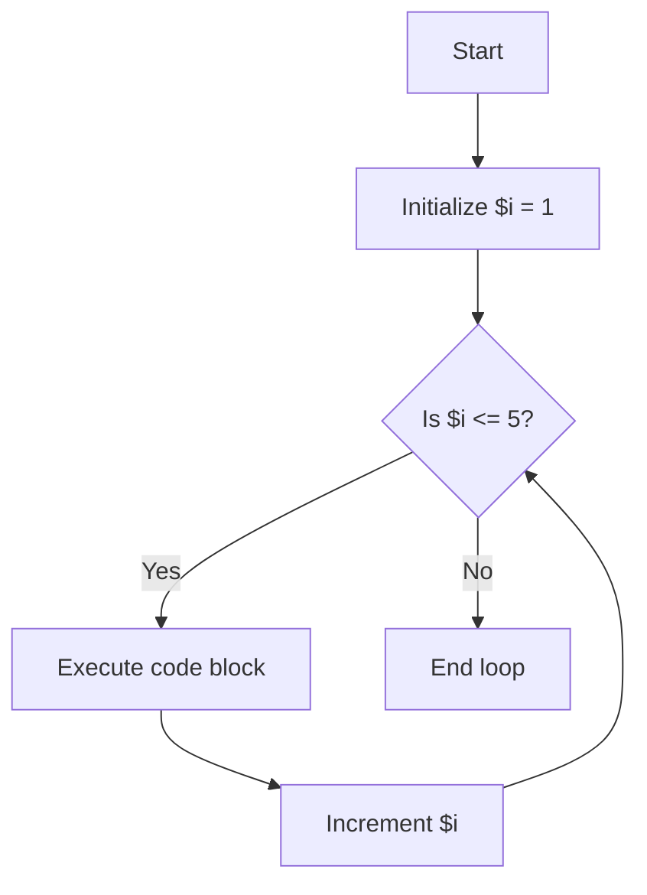

# PHP For Loops

## Introduction

In programming, we often need to execute a block of code repeatedly. For example, you might want to process each item in an array or count from 1 to 10. PHP provides several types of loops to handle these repetitive tasks, and one of the most common is the **for loop**.

A for loop allows you to execute a block of code a specific number of times. It's particularly useful when you know in advance how many iterations you need. This makes for loops ideal for counting, iterating through arrays with known lengths, and performing operations a fixed number of times.

## Basic Syntax

The basic syntax of a PHP for loop is:

```php
for (initialization; condition; increment/decrement) {
    // Code to be executed
}
```

Let's break down these components:

1. **Initialization**: Executed once at the beginning. Typically used to set a counter variable.
2. **Condition**: Evaluated before each iteration. If true, the loop continues; if false, it stops.
3. **Increment/Decrement**: Executed after each iteration. Usually increments or decrements the counter.

## Simple For Loop Example

Here's a basic example that counts from 1 to 5:

```php
<?php
for ($i = 1; $i <= 5; $i++) {
    echo "Count: $i <br>";
}
?>
```

Output:
```
Count: 1
Count: 2
Count: 3
Count: 4
Count: 5
```

### How this works:

1. `$i = 1`: Initialize the counter variable to 1
2. `$i <= 5`: Continue the loop as long as $i is less than or equal to 5
3. `$i++`: Increment $i by 1 after each iteration
4. Inside the loop, we output the current value of $i

This flow can be visualized as:



## Variations of For Loops

### Counting Backwards

You can also use for loops to count backwards:

```php
<?php
for ($i = 10; $i >= 1; $i--) {
    echo "Countdown: $i <br>";
}
echo "Blast off!";
?>
```

Output:
```
Countdown: 10
Countdown: 9
Countdown: 8
Countdown: 7
Countdown: 6
Countdown: 5
Countdown: 4
Countdown: 3
Countdown: 2
Countdown: 1
Blast off!
```

### Custom Increments

You're not limited to incrementing by 1. You can use any increment value:

```php
<?php
// Count by 2s
for ($i = 2; $i <= 10; $i += 2) {
    echo "Even number: $i <br>";
}
?>
```

Output:
```
Even number: 2
Even number: 4
Even number: 6
Even number: 8
Even number: 10
```

## Nested For Loops

You can place one for loop inside another to create a nested loop structure. This is useful for working with multi-dimensional arrays or creating patterns:

```php
<?php
for ($i = 1; $i <= 3; $i++) {
    echo "Outer loop iteration: $i <br>";
    
    for ($j = 1; $j <= 2; $j++) {
        echo "&nbsp;&nbsp;&nbsp;&nbsp;Inner loop iteration: $j <br>";
    }
}
?>
```

Output:
```
Outer loop iteration: 1
    Inner loop iteration: 1
    Inner loop iteration: 2
Outer loop iteration: 2
    Inner loop iteration: 1
    Inner loop iteration: 2
Outer loop iteration: 3
    Inner loop iteration: 1
    Inner loop iteration: 2
```

## Practical Examples

### Example 1: Creating an HTML Table

For loops are great for generating HTML structures like tables:

```php
<?php
echo "<table border='1'>";

// Table headers
echo "<tr>";
for ($i = 1; $i <= 5; $i++) {
    echo "<th>Column $i</th>";
}
echo "</tr>";

// Table rows and data
for ($row = 1; $row <= 3; $row++) {
    echo "<tr>";
    for ($col = 1; $col <= 5; $col++) {
        echo "<td>Row $row, Col $col</td>";
    }
    echo "</tr>";
}

echo "</table>";
?>
```

This generates a 3×5 HTML table with row and column labels.

### Example 2: Processing Array Elements

For loops are commonly used to process arrays:

```php
<?php
$fruits = ["Apple", "Banana", "Cherry", "Date", "Elderberry"];
$fruitCount = count($fruits);

echo "<ul>";
for ($i = 0; $i < $fruitCount; $i++) {
    echo "<li>Fruit #" . ($i + 1) . ": " . $fruits[$i] . "</li>";
}
echo "</ul>";
?>
```

Output:
```
• Fruit #1: Apple
• Fruit #2: Banana
• Fruit #3: Cherry
• Fruit #4: Date
• Fruit #5: Elderberry
```

### Example 3: Calculating Factorial

A factorial is the product of all positive integers less than or equal to a given number. We can calculate factorials using a for loop:

```php
<?php
function factorial($n) {
    $result = 1;
    
    for ($i = 2; $i <= $n; $i++) {
        $result *= $i;
    }
    
    return $result;
}

echo "Factorial of 5 is: " . factorial(5);
?>
```

Output:
```
Factorial of 5 is: 120
```

## Common Pitfalls and Tips

### Infinite Loops

Be careful with your loop conditions. If the condition never evaluates to false, you'll create an infinite loop that could crash your script:

```php
// CAUTION: This creates an infinite loop!
for ($i = 1; $i > 0; $i++) {
    echo $i; // This will keep running forever (or until memory runs out)
}
```

### Performance Considerations

When working with large loops:

1. **Cache array lengths**: For array operations, store the array length in a variable rather than calling `count()` in each iteration.

```php
// More efficient
$array = [1, 2, 3, 4, 5, /* ...thousands of items... */];
$length = count($array);
for ($i = 0; $i < $length; $i++) {
    // Process $array[$i]
}
```

2. **Minimize work inside loops**: Move operations that don't need to be repeated outside the loop.

### Alternative Syntax

PHP offers an alternative syntax for control structures that's useful in templates:

```php
<?php for ($i = 1; $i <= 3; $i++): ?>
    <div>Item <?= $i ?></div>
<?php endfor; ?>
```

## When to Use For Loops vs. Other Loops

- **For loops**: Best when you know exactly how many times you need to iterate
- **While loops**: Better when you don't know the number of iterations in advance
- **Foreach loops**: Best for iterating through arrays and objects

## Summary

PHP for loops are powerful tools for executing code a specific number of times. Key points to remember:

- A for loop has three parts: initialization, condition, and increment/decrement
- For loops are ideal when you know exactly how many iterations you need
- You can create variations like counting backwards or using custom increments
- Nested for loops allow you to work with multi-dimensional structures
- Be careful to avoid infinite loops by ensuring your condition will eventually be false

For loops are foundational to programming and mastering them will help you write more efficient and cleaner code.

## Exercises

1. Write a for loop that displays all even numbers from 20 to 40.
2. Create a program that uses nested for loops to display a multiplication table for numbers 1 through 10.
3. Use a for loop to generate the first 10 numbers in the Fibonacci sequence.
4. Write a function that uses a for loop to check if a number is prime.
5. Create a for loop that iterates through an array of strings and finds the longest string.

## Additional Resources

- [PHP Manual: For Loops](https://www.php.net/manual/en/control-structures.for.php)
- [W3Schools PHP For Loop Tutorial](https://www.w3schools.com/php/php_looping_for.asp)
- [PHP Control Structures Overview](https://www.php.net/manual/en/language.control-structures.php)