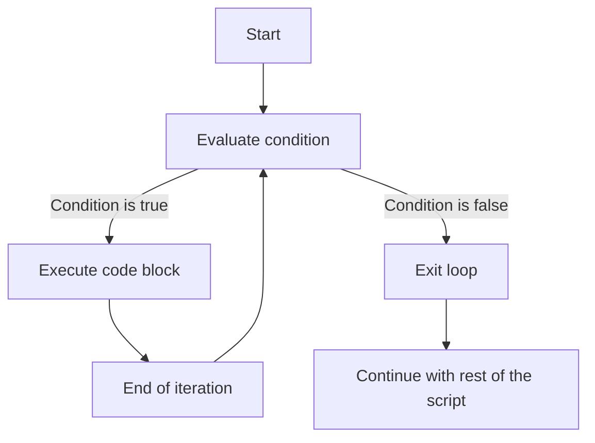

# PHP While Loop

## Introduction

The `while` loop is one of PHP's fundamental control structures that allows you to execute a block of code repeatedly as long as a specified condition evaluates to true. While loops are especially useful when you don't know in advance how many iterations will be needed - the loop continues until the condition is no longer satisfied.

In this tutorial, you'll learn:
- How while loops work in PHP
- When to use while loops
- How to create and control while loops with examples
- Common pitfalls and how to avoid them

## Basic Syntax

The basic syntax of a PHP while loop is:

```php
while (condition) {
    // Code to be executed
}
```

The while loop follows this process:
1. The condition is evaluated
2. If the condition is true, the code block is executed
3. After execution, the condition is evaluated again
4. This process repeats until the condition becomes false

## Simple While Loop Example

Let's start with a basic example that counts from 1 to 5:

```php
<?php
$counter = 1;

while ($counter <= 5) {
    echo "Counter value: $counter <br>";
    $counter++;
}
?>
```

**Output:**
```
Counter value: 1
Counter value: 2
Counter value: 3
Counter value: 4
Counter value: 5
```

### How it works:

1. We initialize a variable `$counter` with a value of 1
2. The while loop checks if `$counter` is less than or equal to 5
3. Inside the loop, we output the current value of `$counter`
4. We increment `$counter` by 1 using the `$counter++` operator
5. When `$counter` becomes 6, the condition `$counter <= 5` evaluates to false, and the loop ends

## The Loop Flow

Here's a diagram showing how a while loop flows:



## Important Considerations

When working with while loops, keep these points in mind:

1. **Initialization**: Always initialize your counter or control variable before the loop starts
2. **Condition**: The condition must eventually become false, or your loop will run indefinitely
3. **Update**: Make sure your code includes a statement that will eventually change the condition

## Common Pitfalls

### Infinite Loops

One of the most common mistakes with while loops is creating an infinite loop:

```php
<?php
$counter = 1;

// CAUTION: Infinite loop! 
while ($counter <= 5) {
    echo "This will print forever!<br>";
    // We forgot to increment $counter
}
?>
```

To avoid infinite loops:
- Always include a statement that modifies the condition
- Ensure the condition will eventually become false
- Consider adding a safety mechanism like a maximum number of iterations

### Incorrect Condition Evaluation

Make sure your condition is properly designed:

```php
<?php
$counter = 10;

// This loop never executes because the condition is false from the start
while ($counter < 5) {
    echo "This won't print at all!<br>";
    $counter++;
}
?>
```

## Practical Examples

### Example 1: Reading File Lines

Using a while loop to read a file line by line:

```php
<?php
$file = fopen("example.txt", "r");

if ($file) {
    while (!feof($file)) {
        $line = fgets($file);
        echo $line . "<br>";
    }
    fclose($file);
}
?>
```

**Input (example.txt):**
```
Line 1: Hello PHP!
Line 2: Learning about while loops.
Line 3: This is the last line.
```

**Output:**
```
Line 1: Hello PHP!
Line 2: Learning about while loops.
Line 3: This is the last line.
```

### Example 2: Dynamic Database Results

Let's see how to use a while loop with database results:

```php
<?php
// Assume $connection is a valid database connection
$query = "SELECT name, email FROM users LIMIT 5";
$result = mysqli_query($connection, $query);

echo "<table border='1'>
<tr>
    <th>Name</th>
    <th>Email</th>
</tr>";

while ($row = mysqli_fetch_assoc($result)) {
    echo "<tr>";
    echo "<td>" . $row['name'] . "</td>";
    echo "<td>" . $row['email'] . "</td>";
    echo "</tr>";
}

echo "</table>";
mysqli_free_result($result);
?>
```

**Sample Output:**
```
+------------+------------------------+
| Name       | Email                  |
+------------+------------------------+
| John Doe   | john.doe@example.com   |
| Jane Smith | jane.smith@example.com |
| Bob Brown  | bob.brown@example.com  |
| Alice Wong | alice.wong@example.com |
| Sam Lee    | sam.lee@example.com    |
+------------+------------------------+
```

## The do-while Loop Variant

PHP also offers a variant called the `do-while` loop that guarantees the code block executes at least once before checking the condition:

```php
<?php
$counter = 6;

do {
    echo "Counter value: $counter <br>";
    $counter++;
} while ($counter <= 5);
?>
```

**Output:**
```
Counter value: 6
```

Notice that even though the condition `$counter <= 5` is false from the start, the code block executes once.

## When to Use While Loops

While loops are great for:

1. Processing data with an unknown number of iterations
2. Reading files until the end is reached
3. Processing database results
4. Implementing input validation loops that continue until valid input is provided
5. Game loops that continue until a winning or losing condition is met

## Summary

The PHP while loop is a powerful control structure for executing code repeatedly based on a condition. Key points to remember:

- A while loop executes as long as its condition evaluates to true
- Always initialize variables before the loop starts
- Make sure your condition will eventually become false to avoid infinite loops
- Include a statement inside the loop that affects the condition
- Use do-while loops when you need to execute the code block at least once

## Exercises

1. Write a while loop that displays all even numbers between 2 and 20.
2. Create a program that uses a while loop to continuously ask for user input until they enter "quit".
3. Implement a number guessing game using a while loop that continues until the user guesses the correct number.
4. Write a while loop to calculate the factorial of a number.
5. Create a while loop that processes an array until a specific value is found.

## Additional Resources

- [PHP Official Documentation on while loops](https://www.php.net/manual/en/control-structures.while.php)
- [PHP Control Structures Overview](https://www.php.net/manual/en/language.control-structures.php)
- [Comparison with for loops and foreach loops](https://www.php.net/manual/en/control-structures.intro.php)

Happy coding!