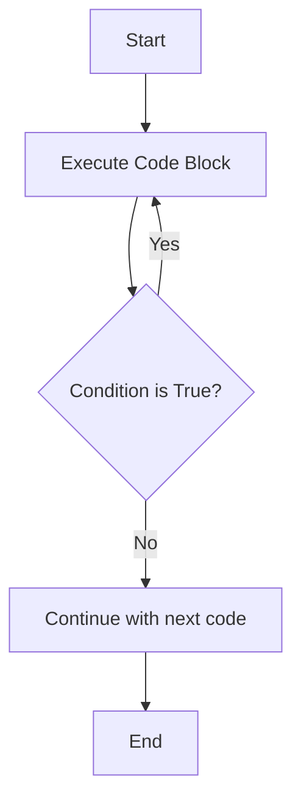

# PHP Do While Loop

## Introduction

The `do-while` loop is an essential control flow structure in PHP that allows you to execute a block of code repeatedly based on a condition. Unlike the standard `while` loop, the `do-while` loop guarantees that the code block will execute **at least once** before the condition is evaluated.

This makes the `do-while` loop particularly useful in scenarios where you need to ensure that a piece of code runs before checking whether it should continue running.

## Syntax

The basic syntax of a `do-while` loop in PHP is:

```php
do {
    // Code to be executed
} while (condition);
```

Notice that:
- The code block is enclosed within curly braces `{}`
- The condition is evaluated after the code block executes
- The statement must end with a semicolon `;` after the condition

## How It Works



1. The code block inside the `do { }` section executes
2. After execution, the condition in the `while (condition)` part is evaluated
3. If the condition is `true`, the code block executes again
4. If the condition is `false`, the loop terminates and the program continues with the next statement
5. The key difference from a regular `while` loop is that the code always executes at least once, regardless of the condition

## Basic Example

Let's start with a simple example that prints numbers from 1 to 5:

```php
<?php
$i = 1;
do {
    echo $i . " ";
    $i++;
} while ($i <= 5);
?>
```

**Output:**
```
1 2 3 4 5
```

### Step-by-Step Explanation:

1. We initialize `$i` with the value `1`
2. The code block executes, outputting the current value of `$i` (which is `1`)
3. We increment `$i` by 1, making it `2`
4. The condition `$i <= 5` is checked, which is `true` (since `2 <= 5`)
5. The loop continues, outputting `2`, then `3`, then `4`, then `5`
6. When `$i` becomes `6`, the condition `$i <= 5` becomes `false`
7. The loop terminates

## Do While vs. While Loop

The main difference between a `do-while` loop and a regular `while` loop is when the condition is evaluated:

- **While loop**: Condition is checked before the code executes (pre-test loop)
- **Do-while loop**: Condition is checked after the code executes (post-test loop)

This means a `do-while` loop will always execute at least once, even if the condition is initially false.

### Example Demonstrating the Difference:

```php
<?php
// Example with a false condition from the start

// While loop - won't execute at all
$i = 10;
while ($i < 5) {
    echo "This will never be printed in a while loop";
    $i++;
}
echo "While loop complete<br>";

// Do-while loop - will execute once
$j = 10;
do {
    echo "This will be printed once in a do-while loop";
    $j++;
} while ($j < 5);
echo "Do-while loop complete";
?>
```

**Output:**
```
While loop complete
This will be printed once in a do-while loop
Do-while loop complete
```

Notice that the code in the `while` loop never executes because the condition is false from the start, but the code in the `do-while` loop executes once regardless.

## Practical Examples

### Example 1: Menu System

A common use case for `do-while` loops is creating menu systems where you want to display options at least once:

```php
<?php
$choice = '';
do {
    echo "
--- Menu ---
";
    echo "1. View Profile
";
    echo "2. Edit Settings
";
    echo "3. Logout
";
    echo "Enter your choice (1-3): ";
    
    // In a real application, you would get input from the user
    // For this example, we'll simulate a choice
    $choice = "3"; // Simulating user selecting option 3
    
    switch ($choice) {
        case '1':
            echo "Viewing profile...
";
            break;
        case '2':
            echo "Editing settings...
";
            break;
        case '3':
            echo "Logging out...
";
            break;
        default:
            echo "Invalid choice. Please try again.
";
    }
} while ($choice != '3');
echo "You have exited the system.";
?>
```

**Output:**
```
--- Menu ---
1. View Profile
2. Edit Settings
3. Logout
Enter your choice (1-3): Logging out...
You have exited the system.
```

### Example 2: Input Validation

`do-while` loops are perfect for input validation where you want to keep asking for input until valid data is provided:

```php
<?php
function validateNumber($number) {
    return is_numeric($number) && $number >= 1 && $number <= 100;
}

// In a real application, you would get input from the user
// For this example, we'll simulate the input process
$validInput = false;
$attempts = 0;
$simulatedInputs = ['abc', '-5', '500', '42']; // Simulate user inputs

do {
    // Simulate getting input from user
    $number = $simulatedInputs[$attempts];
    echo "Attempt " . ($attempts + 1) . ": User entered: " . $number . "
";
    
    if (validateNumber($number)) {
        echo "Valid input received: " . $number . "
";
        $validInput = true;
    } else {
        echo "Invalid input. Please enter a number between 1 and 100.
";
    }
    
    $attempts++;
} while (!$validInput && $attempts < count($simulatedInputs));

if ($validInput) {
    echo "Processing can continue with the valid number: " . $number;
} else {
    echo "Maximum attempts reached. No valid input provided.";
}
?>
```

**Output:**
```
Attempt 1: User entered: abc
Invalid input. Please enter a number between 1 and 100.
Attempt 2: User entered: -5
Invalid input. Please enter a number between 1 and 100.
Attempt 3: User entered: 500
Invalid input. Please enter a number between 1 and 100.
Attempt 4: User entered: 42
Valid input received: 42
Processing can continue with the valid number: 42
```

### Example 3: Reading Data Until a Condition is Met

Another common use case is processing data until a specific condition is met:

```php
<?php
// Simulating reading data from a source
function getNextValue() {
    static $data = [15, 23, 42, 8, 16, 4, 0];
    static $index = 0;
    
    if ($index < count($data)) {
        return $data[$index++];
    }
    return null;
}

$sum = 0;
$count = 0;

do {
    $value = getNextValue();
    
    // Process data until we encounter a zero or run out of data
    if ($value !== null && $value !== 0) {
        $sum += $value;
        $count++;
        echo "Read value: $value, Running sum: $sum
";
    }
} while ($value !== 0 && $value !== null);

if ($count > 0) {
    $average = $sum / $count;
    echo "Processed $count values with an average of " . number_format($average, 2);
} else {
    echo "No data was processed.";
}
?>
```

**Output:**
```
Read value: 15, Running sum: 15
Read value: 23, Running sum: 38
Read value: 42, Running sum: 80
Read value: 8, Running sum: 88
Read value: 16, Running sum: 104
Read value: 4, Running sum: 108
Processed 6 values with an average of 18.00
```

## Common Pitfalls and Best Practices

### Avoiding Infinite Loops

Make sure your condition will eventually become `false`, or include a `break` statement:

```php
<?php
$i = 1;
do {
    echo $i . " ";
    $i++;
    
    // Safety mechanism to prevent infinite loops
    if ($i > 100) {
        echo "Safety break activated!";
        break;
    }
} while ($i <= 5); // Normal exit condition
?>
```

### Forgetting the Semicolon

One common mistake is forgetting the semicolon after the `while (condition)` part:

```php
// Incorrect - missing semicolon
do {
    // Code
} while ($condition) // This will cause a syntax error

// Correct
do {
    // Code
} while ($condition); // Note the semicolon
```

### Using Continue and Break

You can use `continue` to skip the rest of the current iteration and `break` to exit the loop entirely:

```php
<?php
$i = 0;
do {
    $i++;
    
    // Skip even numbers
    if ($i % 2 == 0) {
        echo "Skipping $i
";
        continue;
    }
    
    echo "Processing $i
";
    
    // Exit if we reach 5
    if ($i >= 5) {
        echo "Breaking at $i
";
        break;
    }
} while ($i < 10);
echo "Loop complete.";
?>
```

**Output:**
```
Processing 1
Skipping 2
Processing 3
Skipping 4
Processing 5
Breaking at 5
Loop complete.
```

## Summary

The PHP `do-while` loop is a powerful control structure that guarantees at least one execution of a code block before checking a condition. Key points to remember:

- The loop always executes at least once, regardless of the condition
- The condition is evaluated after each iteration
- It's particularly useful for menu systems, input validation, and situations where you need at least one execution
- Always remember to include the semicolon after the condition
- Be careful to avoid infinite loops by ensuring the condition will eventually become false

## Practice Exercises

1. **Basic Counter**: Write a `do-while` loop that outputs numbers from 10 down to 1.

2. **Sum Calculator**: Create a program that asks the user for numbers and adds them up until they enter 0.

3. **Password Validation**: Implement a password entry system that keeps asking for a password until the correct one is entered or the maximum number of attempts is reached.

4. **Menu Application**: Build a simple console application with a menu that allows users to select different options, using a `do-while` loop to keep returning to the menu until they choose to exit.

## Additional Resources

- [PHP Manual: do-while](https://www.php.net/manual/en/control-structures.do.while.php)
- [PHP Manual: Control Structures](https://www.php.net/manual/en/language.control-structures.php)
- [Comparison of Loop Structures in PHP](https://www.php.net/manual/en/control-structures.intro.php)

Happy coding with PHP `do-while` loops!