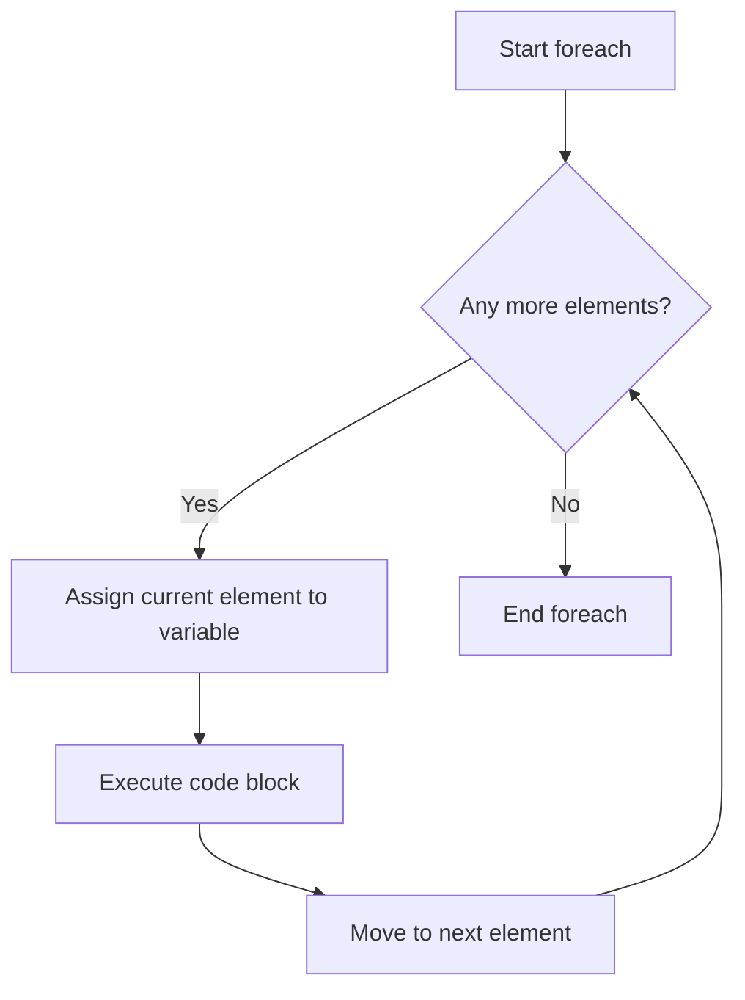

# PHP Foreach Loop

## Introduction

The `foreach` loop is one of PHP's most powerful and frequently used control flow structures. It provides an easy and clean way to iterate through arrays and objects without needing to manage index counters or know the exact size of the collection. For beginners working with collections of data in PHP, mastering the foreach loop is essential.

In this guide, we'll explore how foreach loops work, their syntax variations, and practical applications that you'll commonly encounter in real-world PHP development.

## Basic Syntax

The foreach loop in PHP has two basic syntax formats:

```php
// Format 1: Value only
foreach ($array as $value) {
    // Code to be executed
}

// Format 2: Key and value
foreach ($array as $key => $value) {
    // Code to be executed
}
```

### How It Works

1. The foreach loop starts at the beginning of the array
2. Each iteration assigns the current element to the `$value` variable
3. Optionally, the current key/index can be assigned to the `$key` variable
4. The pointer moves to the next element after each iteration
5. The loop continues until it reaches the end of the array

## Simple Array Example

Let's start with a basic example that demonstrates iterating through a simple numeric array:

```php
<?php
// A simple array of fruits
$fruits = ["Apple", "Banana", "Cherry", "Dragon fruit", "Elderberry"];

// Loop through and display each fruit
foreach ($fruits as $fruit) {
    echo $fruit . "<br>";
}
?>
```

**Output:**
```
Apple
Banana
Cherry
Dragon fruit
Elderberry
```

In this example, each element in the `$fruits` array is assigned to the `$fruit` variable one by one, and then displayed.

## Accessing Array Keys

Often, you'll need to access both the keys and values of an array. The foreach loop makes this easy:

```php
<?php
// An array with string keys
$fruitColors = [
    "Apple" => "Red",
    "Banana" => "Yellow",
    "Cherry" => "Red",
    "Dragon fruit" => "Pink",
    "Elderberry" => "Purple"
];

// Loop through and display each fruit and its color
foreach ($fruitColors as $fruit => $color) {
    echo "A $fruit is $color in color.<br>";
}
?>
```

**Output:**
```
A Apple is Red in color.
A Banana is Yellow in color.
A Cherry is Red in color.
A Dragon fruit is Pink in color.
A Elderberry is Purple in color.
```

The `$fruit => $color` syntax gives us access to both the key and the value in each iteration.

## Working with Multidimensional Arrays

Foreach loops can also handle multidimensional arrays by nesting them:

```php
<?php
// A multidimensional array of fruits with properties
$fruitDetails = [
    "Apple" => [
        "color" => "Red",
        "taste" => "Sweet",
        "price" => 1.50
    ],
    "Banana" => [
        "color" => "Yellow",
        "taste" => "Sweet",
        "price" => 0.75
    ],
    "Lemon" => [
        "color" => "Yellow",
        "taste" => "Sour",
        "price" => 0.80
    ]
];

// Loop through the outer array
foreach ($fruitDetails as $fruit => $properties) {
    echo "<h3>$fruit</h3>";
    echo "<ul>";
    
    // Loop through the inner array
    foreach ($properties as $property => $value) {
        echo "<li>$property: $value</li>";
    }
    
    echo "</ul>";
}
?>
```

**Output:**
```
Apple
• color: Red
• taste: Sweet
• price: 1.5

Banana
• color: Yellow
• taste: Sweet
• price: 0.75

Lemon
• color: Yellow
• taste: Sour
• price: 0.8
```

This pattern is very common when working with data from databases or API responses, which often come in nested structures.

## Using Foreach with Objects

The foreach loop works not only with arrays but also with objects. It iterates through the public properties of an object:

```php
<?php
// Define a simple class
class Fruit {
    public $name;
    public $color;
    public $price;
    
    public function __construct($name, $color, $price) {
        $this->name = $name;
        $this->color = $color;
        $this->price = $price;
    }
}

// Create an object
$apple = new Fruit("Apple", "Red", 1.50);

// Loop through the object properties
foreach ($apple as $property => $value) {
    echo "$property: $value<br>";
}
?>
```

**Output:**
```
name: Apple
color: Red
price: 1.5
```

## Modifying Array Elements

If you need to modify the array elements during iteration, you can use references with the `&` symbol:

```php
<?php
$numbers = [1, 2, 3, 4, 5];

// Without reference (will not modify the original array)
foreach ($numbers as $number) {
    $number *= 2; // This only affects the local $number variable
}
echo "Without reference: ";
print_r($numbers);

// With reference (will modify the original array)
foreach ($numbers as &$number) {
    $number *= 2; // This modifies the actual array element
}
echo "<br>With reference: ";
print_r($numbers);

// Important: Unset the reference after the loop
unset($number);
?>
```

**Output:**
```
Without reference: Array ( [0] => 1 [1] => 2 [2] => 3 [3] => 4 [4] => 5 )
With reference: Array ( [0] => 2 [1] => 4 [2] => 6 [3] => 8 [4] => 10 )
```

:::caution
When using references with foreach, always unset the reference variable after the loop. Otherwise, any later modification to that variable will affect the last element of the array!
:::

## Flow Control within Foreach Loops

You can control the flow of foreach loops using `continue` and `break` statements:

```php
<?php
$numbers = [1, 2, 3, 4, 5, 6, 7, 8, 9, 10];

// Skip even numbers and stop at 8
foreach ($numbers as $number) {
    // Skip even numbers
    if ($number % 2 == 0) {
        continue; // Skip the rest of this iteration
    }
    
    // Stop at 8
    if ($number > 7) {
        break; // Exit the loop entirely
    }
    
    echo $number . " ";
}
// Output: 1 3 5 7
?>
```

## Practical Example: Processing Form Data

A common real-world use of foreach loops is processing form data:

```php
<?php
// Imagine this is form data submitted via POST
$_POST = [
    'name' => 'John Doe',
    'email' => 'john@example.com',
    'age' => '28',
    'interests' => ['PHP', 'JavaScript', 'MySQL']
];

// Validate and sanitize form data
$errors = [];
$sanitizedData = [];

foreach ($_POST as $field => $value) {
    // Skip processing the interests array for now
    if ($field === 'interests') {
        $sanitizedData[$field] = $value;
        continue;
    }
    
    // Remove whitespace
    $value = trim($value);
    
    // Check if field is empty
    if (empty($value)) {
        $errors[] = "The $field field is required.";
        continue;
    }
    
    // Store the sanitized value
    $sanitizedData[$field] = htmlspecialchars($value, ENT_QUOTES);
}

// Now process the interests array separately
if (isset($sanitizedData['interests']) && is_array($sanitizedData['interests'])) {
    foreach ($sanitizedData['interests'] as $key => $interest) {
        $sanitizedData['interests'][$key] = htmlspecialchars(trim($interest), ENT_QUOTES);
    }
}

// Display the sanitized data
echo "<h3>Sanitized Form Data:</h3>";
foreach ($sanitizedData as $field => $value) {
    if (is_array($value)) {
        echo "$field: " . implode(', ', $value) . "<br>";
    } else {
        echo "$field: $value<br>";
    }
}
?>
```

**Output:**
```
Sanitized Form Data:
name: John Doe
email: john@example.com
age: 28
interests: PHP, JavaScript, MySQL
```

## Visualizing the Foreach Loop Flow

Here's a diagram illustrating how the foreach loop works:



## Performance Considerations

Foreach loops are very convenient, but there are some performance considerations to keep in mind:

1. **Memory Usage**: When iterating over large arrays, foreach creates a copy of the array by default. Use references (`&`) if you need to modify the original array, but be aware of the caveats.

2. **Iterating Objects**: When using foreach on objects, PHP uses internal mechanisms that can be slower than array iteration. For large collections, consider implementing the `Iterator` interface.

3. **Nested Loops**: Be cautious with nested foreach loops as they can lead to O(n²) complexity. For large datasets, this can cause significant performance issues.

```php
<?php
// Time comparison example
$largeArray = range(1, 10000);

$startTime = microtime(true);
foreach ($largeArray as $value) {
    // Do something simple
    $result = $value * 2;
}
$endTime = microtime(true);
echo "Foreach time: " . ($endTime - $startTime) . " seconds<br>";

$startTime = microtime(true);
$count = count($largeArray);
for ($i = 0; $i < $count; $i++) {
    // Do the same thing
    $result = $largeArray[$i] * 2;
}
$endTime = microtime(true);
echo "For loop time: " . ($endTime - $startTime) . " seconds<br>";
?>
```

For most everyday use cases, foreach provides the best balance of readability and performance.

## Summary

The foreach loop is an essential tool in PHP programming, especially when working with arrays and objects. Here's a recap of what we've learned:

- Foreach provides a simple way to iterate through arrays and objects without needing to manage indices
- Two syntax formats: with value only (`foreach ($array as $value)`) or with key and value (`foreach ($array as $key => $value)`)
- It works with multidimensional arrays through nested loops
- You can modify array elements during iteration using references (`&`)
- Flow control statements like `continue` and `break` can be used within foreach loops
- Foreach is commonly used in real-world applications for processing data collections

## Exercises

To practice your understanding of foreach loops, try these exercises:

1. Create an associative array of 5 countries and their capitals, then use a foreach loop to display them in an HTML table.

2. Write a foreach loop that filters out all negative numbers from an array.

3. Create a nested array representing a small inventory system (items, quantities, prices) and use foreach loops to calculate the total inventory value.

4. Write a function that uses foreach to find and return the largest value in an array without using PHP's built-in max() function.

5. Create a foreach loop that generates an HTML select dropdown from an associative array where the keys are the option values and the array values are the display text.

## Additional Resources

- [PHP Manual: Foreach](https://www.php.net/manual/en/control-structures.foreach.php)
- [PHP Arrays](https://www.php.net/manual/en/language.types.array.php)
- [PHP Iterator Interface](https://www.php.net/manual/en/class.iterator.php) for advanced object iteration