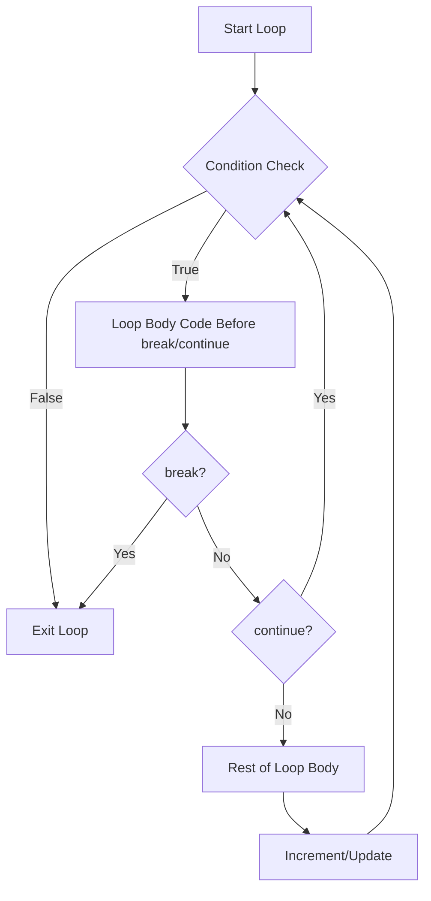

# PHP Break and Continue

## Introduction

When working with loops in PHP, you sometimes need more fine-grained control over how the loop executes. The `break` and `continue` statements are powerful tools that allow you to alter the normal flow of loop execution. These statements help you create more efficient code by giving you the ability to skip iterations or exit loops entirely based on specific conditions.

In this tutorial, we'll explore:
- What the `break` statement does and when to use it
- What the `continue` statement does and when to use it
- Practical examples of both statements
- How these statements work in nested loops

## The `break` Statement

The `break` statement terminates the execution of a loop immediately. When PHP encounters a `break` statement, it stops the current loop and continues executing the code after the loop.

### Basic Syntax

```php
break;  // Exits the innermost loop
break n;  // Exits n levels of nested loops (PHP 5.4.0 and later)
```

### Example: Using `break` in a `for` Loop

```php
<?php
// Print numbers from 1 to 10, but stop when we reach 5
for ($i = 1; $i <= 10; $i++) {
    echo $i . " ";
    
    if ($i == 5) {
        break;  // Exit the loop when $i equals 5
    }
}
echo "Loop ended";
?>
```

**Output:**
```
1 2 3 4 5 Loop ended
```

### Explanation

In this example:
1. We start a loop that counts from 1 to 10
2. For each iteration, we print the current value of `$i`
3. We check if `$i` equals 5
4. When `$i` reaches 5, the `break` statement executes and the loop terminates
5. The code continues execution with the statement after the loop ("Loop ended")

## The `continue` Statement

The `continue` statement skips the rest of the current iteration and jumps to the beginning of the next iteration. Unlike `break`, it doesn't terminate the loop entirely.

### Basic Syntax

```php
continue;  // Skips to the next iteration of the innermost loop
continue n;  // Skips to the next iteration of the nth level loop (PHP 5.4.0 and later)
```

### Example: Using `continue` in a `for` Loop

```php
<?php
// Print all numbers from 1 to 10 except 5
for ($i = 1; $i <= 10; $i++) {
    if ($i == 5) {
        continue;  // Skip this iteration when $i equals 5
    }
    echo $i . " ";
}
echo "Loop ended";
?>
```

**Output:**
```
1 2 3 4 6 7 8 9 10 Loop ended
```

### Explanation

In this example:
1. We start a loop that counts from 1 to 10
2. For each iteration, we check if `$i` equals 5
3. If `$i` is 5, the `continue` statement executes, skipping the rest of the loop body for that iteration
4. For all other values, we print the current value of `$i`
5. After the loop completes, we print "Loop ended"

## Practical Examples

### Example 1: Using `break` to Find an Element in an Array

```php
<?php
$fruits = ["apple", "banana", "orange", "mango", "strawberry"];
$searchFruit = "orange";
$position = -1;

for ($i = 0; $i < count($fruits); $i++) {
    if ($fruits[$i] == $searchFruit) {
        $position = $i;
        break;  // No need to continue searching once we've found the fruit
    }
}

if ($position >= 0) {
    echo "$searchFruit found at position $position";
} else {
    echo "$searchFruit not found in the array";
}
?>
```

**Output:**
```
orange found at position 2
```

### Example 2: Using `continue` to Process Only Even Numbers

```php
<?php
$numbers = [1, 2, 3, 4, 5, 6, 7, 8, 9, 10];
$sumOfEvenNumbers = 0;

foreach ($numbers as $number) {
    if ($number % 2 != 0) {
        continue;  // Skip odd numbers
    }
    $sumOfEvenNumbers += $number;
    echo "Added $number to sum. Current sum: $sumOfEvenNumbers
";
}

echo "Final sum of even numbers: $sumOfEvenNumbers";
?>
```

**Output:**
```
Added 2 to sum. Current sum: 2
Added 4 to sum. Current sum: 6
Added 6 to sum. Current sum: 12
Added 8 to sum. Current sum: 20
Added 10 to sum. Current sum: 30
Final sum of even numbers: 30
```

## Working with Nested Loops

Both `break` and `continue` statements affect only the innermost loop by default. However, PHP allows you to specify how many levels of nested loops should be affected.

### Example: Using `break` in Nested Loops

```php
<?php
for ($i = 1; $i <= 3; $i++) {
    echo "Outer loop iteration $i:
";
    
    for ($j = 1; $j <= 5; $j++) {
        if ($j == 4) {
            break;  // Exits only the inner loop
        }
        echo "  Inner loop: $j
";
    }
}
?>
```

**Output:**
```
Outer loop iteration 1:
  Inner loop: 1
  Inner loop: 2
  Inner loop: 3
Outer loop iteration 2:
  Inner loop: 1
  Inner loop: 2
  Inner loop: 3
Outer loop iteration 3:
  Inner loop: 1
  Inner loop: 2
  Inner loop: 3
```

### Example: Using `break` with Levels

```php
<?php
for ($i = 1; $i <= 3; $i++) {
    echo "Outer loop iteration $i:
";
    
    for ($j = 1; $j <= 5; $j++) {
        if ($i == 2 && $j == 3) {
            break 2;  // Exit both the inner and outer loops
        }
        echo "  Inner loop: $j
";
    }
}
echo "Loops ended";
?>
```

**Output:**
```
Outer loop iteration 1:
  Inner loop: 1
  Inner loop: 2
  Inner loop: 3
  Inner loop: 4
  Inner loop: 5
Outer loop iteration 2:
  Inner loop: 1
  Inner loop: 2
Loops ended
```

### Example: Using `continue` with Levels

```php
<?php
for ($i = 1; $i <= 3; $i++) {
    for ($j = 1; $j <= 3; $j++) {
        if ($i == 2 && $j == 2) {
            echo "Skipping to next iteration of outer loop when i=$i and j=$j
";
            continue 2;  // Skip to the next iteration of the outer loop
        }
        echo "i=$i, j=$j
";
    }
}
?>
```

**Output:**
```
i=1, j=1
i=1, j=2
i=1, j=3
i=2, j=1
Skipping to next iteration of outer loop when i=2 and j=2
i=3, j=1
i=3, j=2
i=3, j=3
```

## Control Flow Visualization

Here's a visual representation of how `break` and `continue` affect loop flow:



## Real-World Applications

### Example 1: Validating User Input

```php
<?php
function validateUsername($username) {
    $errors = [];
    
    // Check minimum length
    if (strlen($username) < 5) {
        $errors[] = "Username must be at least 5 characters";
    }
    
    // Check for invalid characters
    for ($i = 0; $i < strlen($username); $i++) {
        $char = $username[$i];
        
        // Allow only letters, numbers, and underscores
        if (!ctype_alnum($char) && $char !== '_') {
            $errors[] = "Username can only contain letters, numbers, and underscores";
            break;  // No need to check further characters once we find one invalid
        }
    }
    
    return $errors;
}

// Testing the function
$testUsernames = ["user", "valid_username", "invalid@username", "valid123"];

foreach ($testUsernames as $username) {
    echo "Validating username: $username
";
    $errors = validateUsername($username);
    
    if (empty($errors)) {
        echo "✅ Valid username

";
        continue;  // Skip to the next username
    }
    
    echo "❌ Invalid username:
";
    foreach ($errors as $error) {
        echo "- $error
";
    }
    echo "
";
}
?>
```

**Output:**
```
Validating username: user
❌ Invalid username:
- Username must be at least 5 characters

Validating username: valid_username
✅ Valid username

Validating username: invalid@username
❌ Invalid username:
- Username can only contain letters, numbers, and underscores

Validating username: valid123
✅ Valid username
```

### Example 2: Processing a CSV File

```php
<?php
function processCsvData($csvString) {
    $lines = explode("
", $csvString);
    $data = [];
    $errors = [];
    
    // Skip header row
    for ($i = 1; $i < count($lines); $i++) {
        $line = trim($lines[$i]);
        
        // Skip empty lines
        if (empty($line)) {
            continue;
        }
        
        $fields = str_getcsv($line);
        
        // Check if we have the expected number of fields
        if (count($fields) !== 3) {
            $errors[] = "Line $i: Invalid format, expected 3 fields";
            continue;  // Skip to next line
        }
        
        list($id, $name, $age) = $fields;
        
        // Validate ID
        if (!is_numeric($id)) {
            $errors[] = "Line $i: ID must be numeric";
            continue;  // Skip to next line
        }
        
        // Validate age
        if (!is_numeric($age) || $age < 0 || $age > 120) {
            $errors[] = "Line $i: Age must be between 0 and 120";
            continue;  // Skip to next line
        }
        
        // Add valid data
        $data[] = [
            'id' => (int)$id,
            'name' => $name,
            'age' => (int)$age
        ];
    }
    
    return ['data' => $data, 'errors' => $errors];
}

// Sample CSV data
$csvString = "id,name,age
1,John,25
2,Alice,thirty
3,Bob,45
,Mark,20
5,Emma,22";

$result = processCsvData($csvString);

// Display valid data
echo "Valid Entries:
";
foreach ($result['data'] as $entry) {
    echo "{$entry['id']}: {$entry['name']} ({$entry['age']} years old)
";
}

// Display errors
if (!empty($result['errors'])) {
    echo "
Errors Found:
";
    foreach ($result['errors'] as $error) {
        echo "- $error
";
    }
}
?>
```

**Output:**
```
Valid Entries:
1: John (25 years old)
3: Bob (45 years old)
5: Emma (22 years old)

Errors Found:
- Line 2: Age must be between 0 and 120
- Line 4: ID must be numeric
```

## Summary

The `break` and `continue` statements are essential tools for controlling the flow of loops in PHP:

- **`break`** terminates loop execution completely
  - Use it when you've found what you're looking for
  - Use it to exit a loop early when a certain condition is met

- **`continue`** skips the rest of the current iteration
  - Use it to skip iterations that don't meet certain criteria
  - Use it to make your code more efficient by avoiding unnecessary operations

Both statements can be used with a numeric argument to control multiple levels of nested loops. This feature is especially useful in complex loop structures.

By mastering `break` and `continue`, you can write more efficient and readable code, particularly when dealing with loops that process large datasets or require complex conditions.

## Exercises

1. Write a PHP script that finds the first prime number greater than 100 using a loop and the `break` statement.

2. Create a function that takes an array of numbers and uses the `continue` statement to calculate the sum of only positive numbers.

3. Write a program that uses nested loops and the `break` statement with a level parameter to print a pattern of asterisks forming a right triangle, but stops when the pattern reaches 5 rows.

4. Create a script that simulates a simple menu system using a `while` loop and the `break` statement to exit the program when the user selects "Exit."

5. Write a function that validates a password string using various criteria (length, uppercase, special characters) and uses the `continue` statement to skip validation if one of the criteria fails.

## Additional Resources

- [PHP Official Documentation: break](https://www.php.net/manual/en/control-structures.break.php)
- [PHP Official Documentation: continue](https://www.php.net/manual/en/control-structures.continue.php)
- [PHP Control Structures](https://www.php.net/manual/en/language.control-structures.php)
- [PHP Loops](https://www.php.net/manual/en/language.control-structures.for.php)