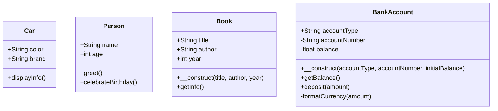

# PHP OOP Introduction

## What is Object-Oriented Programming?

Object-Oriented Programming (OOP) is a programming paradigm that uses "objects" to design applications and organize code. PHP has supported OOP since PHP 4, but PHP 5 and later versions have significantly improved its OOP capabilities.

In traditional procedural programming, you write a sequence of steps to complete tasks. OOP, however, allows you to structure your code by creating objects that have their own properties and behaviors (methods).

## Why Learn PHP OOP?

Before we dive into the technical details, let's understand why OOP is worth learning:

- **Better Organization**: OOP helps you organize your code into reusable, self-contained components
- **Maintainability**: Changes to one part of the code are less likely to break other parts
- **Reusability**: You can reuse objects across different parts of your application or even in different projects
- **Real-world Representation**: Objects can model real-world entities, making your code more intuitive
- **Modern Framework Compatibility**: Most modern PHP frameworks (Laravel, Symfony, etc.) are built using OOP principles

## Basic OOP Concepts in PHP

### Classes and Objects

A **class** is like a blueprint that defines the structure and behavior of objects. An **object** is an instance of a class.

Here's a simple example of a class and an object in PHP:

```php
// Defining a class
class Car {
    // Properties (attributes)
    public $color;
    public $brand;
    
    // Method (behavior)
    public function displayInfo() {
        return "This is a " . $this->color . " " . $this->brand . ".";
    }
}

// Creating an object (instance) of the Car class
$myCar = new Car();

// Setting property values
$myCar->color = "red";
$myCar->brand = "Toyota";

// Calling the method
echo $myCar->displayInfo();
```

**Output:**
```
This is a red Toyota.
```

In this example:
- We define a `Car` class with properties (`$color`, `$brand`) and a method (`displayInfo()`)
- We create an instance of the `Car` class using the `new` keyword
- We access and set the object's properties using the arrow (`->`) notation
- We call the object's method to display information about the car

### Properties and Methods

**Properties** (also called attributes or fields) are variables that belong to a class. They define the state of an object.

**Methods** are functions that belong to a class. They define what an object can do.

```php
class Person {
    // Properties
    public $name;
    public $age;
    
    // Methods
    public function greet() {
        return "Hello, my name is " . $this->name . "!";
    }
    
    public function celebrateBirthday() {
        $this->age++;
        return "Happy Birthday! I am now " . $this->age . " years old.";
    }
}

// Creating a Person object
$john = new Person();
$john->name = "John";
$john->age = 25;

// Using methods
echo $john->greet();
echo "<br>";
echo $john->celebrateBirthday();
```

**Output:**
```
Hello, my name is John!
Happy Birthday! I am now 26 years old.
```

### The `$this` Keyword

Within a class method, `$this` refers to the current object. It's used to access the object's properties and methods.

In the examples above, we used `$this->color`, `$this->brand`, and `$this->age` to access the object's properties.

## Constructor Method

A constructor is a special method that is automatically called when an object is created. In PHP, the constructor method is named `__construct()`.

```php
class Book {
    public $title;
    public $author;
    public $year;
    
    // Constructor
    public function __construct($title, $author, $year) {
        $this->title = $title;
        $this->author = $author;
        $this->year = $year;
    }
    
    public function getInfo() {
        return $this->title . " by " . $this->author . " (" . $this->year . ")";
    }
}

// Creating a Book object using the constructor
$myBook = new Book("The Hobbit", "J.R.R. Tolkien", 1937);

// Output book information
echo $myBook->getInfo();
```

**Output:**
```
The Hobbit by J.R.R. Tolkien (1937)
```

The constructor makes the object initialization more efficient and ensures that the required properties are set when the object is created.

## Access Modifiers

PHP supports three types of access modifiers:

- **public**: Properties and methods can be accessed from anywhere
- **private**: Properties and methods can only be accessed within the class
- **protected**: Properties and methods can be accessed within the class and by classes derived from that class

```php
class BankAccount {
    // Public property
    public $accountType;
    
    // Private properties
    private $accountNumber;
    private $balance;
    
    public function __construct($accountType, $accountNumber, $initialBalance) {
        $this->accountType = $accountType;
        $this->accountNumber = $accountNumber;
        $this->balance = $initialBalance;
    }
    
    // Public method to check balance
    public function getBalance() {
        return $this->formatCurrency($this->balance);
    }
    
    // Public method to deposit money
    public function deposit($amount) {
        if ($amount > 0) {
            $this->balance += $amount;
            return "Deposited " . $this->formatCurrency($amount) . ". New balance: " . $this->formatCurrency($this->balance);
        }
        return "Invalid amount for deposit.";
    }
    
    // Private utility method
    private function formatCurrency($amount) {
        return "$" . number_format($amount, 2);
    }
}

// Create a bank account
$account = new BankAccount("Savings", "123456789", 1000);

// Access public property
echo "Account Type: " . $account->accountType;
echo "<br>";

// Using public methods
echo "Current Balance: " . $account->getBalance();
echo "<br>";
echo $account->deposit(500);
echo "<br>";

// This would cause an error because accountNumber is private
// echo $account->accountNumber;

// This would also cause an error because formatCurrency is private
// echo $account->formatCurrency(100);
```

**Output:**
```
Account Type: Savings
Current Balance: $1,000.00
Deposited $500.00. New balance: $1,500.00
```

Access modifiers help in implementing **encapsulation**, which is a key principle of OOP. Encapsulation restricts direct access to some components of an object, preventing unintended interference with the object's internal state.

## Visualizing the Class Structure



## PHP OOP in Real-World Applications

Let's see how OOP can be applied in a real-world scenario. Suppose we're building a simple product management system for an e-commerce website:

```php
class Product {
    // Properties
    private $id;
    private $name;
    private $price;
    private $stock;
    
    // Constructor
    public function __construct($id, $name, $price, $stock = 0) {
        $this->id = $id;
        $this->name = $name;
        $this->price = $price;
        $this->stock = $stock;
    }
    
    // Getter methods
    public function getId() {
        return $this->id;
    }
    
    public function getName() {
        return $this->name;
    }
    
    public function getPrice() {
        return $this->price;
    }
    
    public function getStock() {
        return $this->stock;
    }
    
    // Setter methods
    public function setName($name) {
        $this->name = $name;
    }
    
    public function setPrice($price) {
        if ($price >= 0) {
            $this->price = $price;
            return true;
        }
        return false;
    }
    
    // Business logic methods
    public function addStock($quantity) {
        if ($quantity > 0) {
            $this->stock += $quantity;
            return true;
        }
        return false;
    }
    
    public function reduceStock($quantity) {
        if ($quantity > 0 && $this->stock >= $quantity) {
            $this->stock -= $quantity;
            return true;
        }
        return false;
    }
    
    public function isInStock() {
        return $this->stock > 0;
    }
    
    public function getFormattedPrice() {
        return "$" . number_format($this->price, 2);
    }
    
    public function displayInfo() {
        $status = $this->isInStock() ? "In Stock (" . $this->stock . ")" : "Out of Stock";
        return "Product: " . $this->name . " (ID: " . $this->id . ")<br>" .
               "Price: " . $this->getFormattedPrice() . "<br>" .
               "Status: " . $status;
    }
}

// Usage example
$laptop = new Product(1, "Gaming Laptop", 1299.99, 10);
$smartphone = new Product(2, "Smartphone Pro", 999, 5);

// Display product information
echo $laptop->displayInfo();
echo "<hr>";
echo $smartphone->displayInfo();

// Update product price
$smartphone->setPrice(899);
echo "<hr>";
echo "Updated smartphone price: " . $smartphone->getFormattedPrice();

// Process an order
echo "<hr>";
if ($laptop->reduceStock(2)) {
    echo "Order processed successfully. Remaining stock: " . $laptop->getStock();
} else {
    echo "Order could not be processed due to insufficient stock.";
}
```

**Output:**
```
Product: Gaming Laptop (ID: 1)
Price: $1,299.99
Status: In Stock (10)
---
Product: Smartphone Pro (ID: 2)
Price: $999.00
Status: In Stock (5)
---
Updated smartphone price: $899.00
---
Order processed successfully. Remaining stock: 8
```

In this example:
- We encapsulate the product data and behavior in one class
- We use private properties to protect the data
- We provide getter and setter methods to control access to the properties
- We implement business logic methods to handle operations like managing stock
- We format data consistently using dedicated methods

This approach makes the code more organized, maintainable, and reusable compared to a procedural approach.

## Summary

In this introduction to PHP OOP, we've covered:

- What OOP is and why it's beneficial
- How to define classes and create objects
- Properties and methods to represent state and behavior
- The constructor method for object initialization
- Access modifiers to control visibility
- A real-world application of OOP principles

Object-oriented programming is a powerful paradigm that can help you write better PHP code. It may require a different way of thinking if you're coming from a procedural background, but the benefits are well worth the effort.

## Exercises

To solidify your understanding, try completing these exercises:

1. Create a `User` class with properties for username, email, and password. Add methods for registering, logging in, and updating profile information.

2. Create a `ShoppingCart` class that can hold multiple `Product` objects. Implement methods to add products, remove products, calculate the total price, and checkout.

3. Extend the `Product` class we created to include different product types (e.g., `DigitalProduct`, `PhysicalProduct`) with their specific properties and behaviors.

## Additional Resources

- [PHP.net Official Documentation on Classes and Objects](https://www.php.net/manual/en/language.oop5.php)
- [PHP OOP Video Tutorial Series on YouTube](https://www.youtube.com/results?search_query=php+oop+tutorial)
- [Object-Oriented PHP for Beginners (Tuts+ Course)](https://code.tutsplus.com/courses/object-oriented-php-for-beginners)
- [Modern PHP by Josh Lockhart](https://www.oreilly.com/library/view/modern-php/9781491905173/) - A book that covers PHP OOP and modern practices