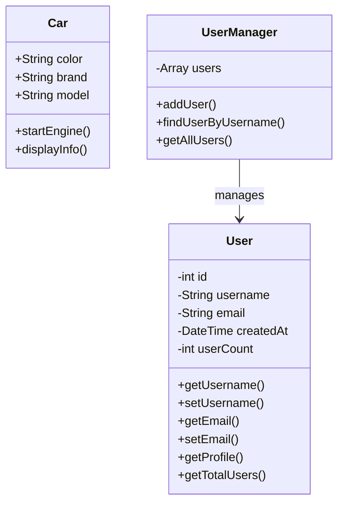

# PHP Classes and Objects

## Introduction

Object-Oriented Programming (OOP) is a programming paradigm that uses "objects" to design applications and organize code. PHP has supported Object-Oriented Programming since PHP 5, allowing developers to create more maintainable and reusable code structures.

In this tutorial, we'll explore the fundamental building blocks of OOP in PHP: classes and objects. Think of classes as blueprints that define the structure and behavior of objects, while objects are instances of these classes that contain actual data.

## Understanding Classes in PHP

### What is a Class?

A class is a blueprint that defines the properties (attributes) and methods (functions) that an object of that class will have. It's a template that describes what an object will look like when it's created.

### Defining a Class

In PHP, we define a class using the `class` keyword:

```php
<?php
class Car {
    // Properties (attributes)
    public $color;
    public $brand;
    public $model;
    
    // Methods (functions)
    public function startEngine() {
        return "The engine is now running!";
    }
    
    public function displayInfo() {
        return "This is a {$this->color} {$this->brand} {$this->model}.";
    }
}
?>
```

Let's break down the components of a class:

1. **Class Declaration**: We start with the `class` keyword followed by the class name. By convention, class names usually begin with an uppercase letter.

2. **Properties**: These are variables that belong to the class. In our example, `$color`, `$brand`, and `$model` are properties of the `Car` class.

3. **Methods**: These are functions that belong to the class. In our example, `startEngine()` and `displayInfo()` are methods of the `Car` class.

4. **Visibility Modifiers**: Keywords like `public`, `private`, or `protected` determine who can access the property or method. We'll explore these in detail later.

## Creating and Using Objects

### What is an Object?

An object is an instance of a class. When we create an object, we're essentially creating a concrete implementation of the class blueprint.

### Creating Objects

To create an object in PHP, we use the `new` keyword followed by the class name:

```php
<?php
// Create an object of the Car class
$myCar = new Car();

// Set property values
$myCar->color = "Red";
$myCar->brand = "Toyota";
$myCar->model = "Corolla";

// Call methods
echo $myCar->startEngine(); // Output: The engine is now running!
echo "<br>";
echo $myCar->displayInfo(); // Output: This is a Red Toyota Corolla.
?>
```

### Using `$this` Keyword

In the class methods, we often need to access the properties of the current object. For this, we use the `$this` keyword, which refers to the current instance of the class.

```php
public function displayInfo() {
    return "This is a {$this->color} {$this->brand} {$this->model}.";
}
```

## Constructors and Destructors

### Constructors

A constructor is a special method that automatically runs when an object is created. In PHP, the constructor method is named `__construct()`. It's useful for initializing object properties.

```php
<?php
class Car {
    public $color;
    public $brand;
    public $model;
    
    // Constructor
    public function __construct($color, $brand, $model) {
        $this->color = $color;
        $this->brand = $brand;
        $this->model = $model;
        echo "A new car object has been created!<br>";
    }
    
    public function displayInfo() {
        return "This is a {$this->color} {$this->brand} {$this->model}.";
    }
}

// Create an object with constructor parameters
$myCar = new Car("Blue", "Honda", "Civic");
echo $myCar->displayInfo();
?>
```

**Output:**
```
A new car object has been created!
This is a Blue Honda Civic.
```

### Destructors

A destructor is another special method that automatically runs when an object is destroyed or the script ends. In PHP, the destructor method is named `__destruct()`.

```php
<?php
class Car {
    public $color;
    public $brand;
    
    public function __construct($color, $brand) {
        $this->color = $color;
        $this->brand = $brand;
        echo "Car created: {$this->color} {$this->brand}<br>";
    }
    
    public function __destruct() {
        echo "The {$this->color} {$this->brand} is being destroyed!<br>";
    }
}

// Create objects
$car1 = new Car("Red", "Toyota");
$car2 = new Car("Blue", "Honda");

// The destructors will automatically be called at the end of the script
// or when objects are unset
unset($car1);
?>
```

**Output:**
```
Car created: Red Toyota
Car created: Blue Honda
The Red Toyota is being destroyed!
The Blue Honda is being destroyed!
```

## Property and Method Visibility

PHP provides three visibility modifiers for properties and methods:

1. **public**: Accessible from anywhere, both inside and outside the class.
2. **private**: Accessible only from within the class that defines them.
3. **protected**: Accessible from within the class and from classes that inherit from it.

```php
<?php
class BankAccount {
    public $accountHolder; // Accessible from anywhere
    private $balance; // Accessible only within this class
    protected $accountNumber; // Accessible in this class and child classes
    
    public function __construct($holder, $initialBalance, $accountNum) {
        $this->accountHolder = $holder;
        $this->balance = $initialBalance;
        $this->accountNumber = $accountNum;
    }
    
    public function deposit($amount) {
        if ($amount > 0) {
            $this->balance += $amount;
            return "Deposited: $" . $amount . ". New balance: $" . $this->balance;
        }
        return "Invalid amount for deposit";
    }
    
    private function generateStatement() {
        // Only accessible from within the class
        return "Account Statement for: " . $this->accountHolder;
    }
    
    public function getStatement() {
        // Public method that uses the private method
        return $this->generateStatement() . "
Balance: $" . $this->balance;
    }
}

$account = new BankAccount("John Doe", 1000, "12345");
echo $account->accountHolder; // Works fine
// echo $account->balance; // Error: Cannot access private property
// echo $account->accountNumber; // Error: Cannot access protected property

echo $account->deposit(500); // Works fine
// echo $account->generateStatement(); // Error: Cannot access private method
echo $account->getStatement(); // Works fine
?>
```

## Static Properties and Methods

Static properties and methods belong to the class itself, not to any specific instance (object) of the class. They can be accessed without creating an instance of the class.

```php
<?php
class MathOperations {
    public static $pi = 3.14159;
    
    public static function square($number) {
        return $number * $number;
    }
    
    public static function calculateCircleArea($radius) {
        return self::$pi * self::square($radius);
    }
}

// Accessing static property
echo MathOperations::$pi; // Output: 3.14159
echo "<br>";

// Calling static methods
echo MathOperations::square(5); // Output: 25
echo "<br>";
echo MathOperations::calculateCircleArea(3); // Output: 28.27431
?>
```

Note the use of `self::` to access static properties and methods within the class.

## Class Constants

Class constants are values that cannot change once they are defined. They are defined using the `const` keyword.

```php
<?php
class PaymentStatus {
    const PENDING = "pending";
    const COMPLETED = "completed";
    const FAILED = "failed";
    
    public function printStatuses() {
        echo "Available statuses: " . self::PENDING . ", " . 
             self::COMPLETED . ", " . self::FAILED;
    }
}

// Accessing class constants
echo PaymentStatus::PENDING; // Output: pending
echo "<br>";

$status = new PaymentStatus();
$status->printStatuses(); // Output: Available statuses: pending, completed, failed
?>
```

## Real-World Example: User Management System

Let's create a practical example of a simple user management system using classes and objects:

```php
<?php
class User {
    private $id;
    private $username;
    private $email;
    private $createdAt;
    private static $userCount = 0;
    
    public function __construct($username, $email) {
        self::$userCount++;
        $this->id = self::$userCount;
        $this->username = $username;
        $this->email = $email;
        $this->createdAt = date('Y-m-d H:i:s');
    }
    
    public function getUsername() {
        return $this->username;
    }
    
    public function setUsername($username) {
        $this->username = $username;
    }
    
    public function getEmail() {
        return $this->email;
    }
    
    public function setEmail($email) {
        $this->email = $email;
    }
    
    public function getProfile() {
        return [
            'id' => $this->id,
            'username' => $this->username,
            'email' => $this->email,
            'created_at' => $this->createdAt
        ];
    }
    
    public static function getTotalUsers() {
        return self::$userCount;
    }
}

class UserManager {
    private $users = [];
    
    public function addUser($username, $email) {
        $user = new User($username, $email);
        $this->users[] = $user;
        return $user;
    }
    
    public function findUserByUsername($username) {
        foreach ($this->users as $user) {
            if ($user->getUsername() === $username) {
                return $user;
            }
        }
        return null;
    }
    
    public function getAllUsers() {
        return $this->users;
    }
}

// Usage example
$userManager = new UserManager();

// Add some users
$userManager->addUser("johndoe", "john@example.com");
$userManager->addUser("janedoe", "jane@example.com");
$userManager->addUser("mikebrown", "mike@example.com");

// Find a user
$user = $userManager->findUserByUsername("janedoe");
if ($user) {
    echo "User found: " . $user->getUsername() . " (" . $user->getEmail() . ")<br>";
    
    // Update user email
    $user->setEmail("jane.doe@example.com");
    echo "Updated email: " . $user->getEmail() . "<br>";
}

// Display all users
echo "All users:<br>";
foreach ($userManager->getAllUsers() as $user) {
    $profile = $user->getProfile();
    echo "ID: {$profile['id']}, Username: {$profile['username']}, " .
         "Email: {$profile['email']}, Created: {$profile['created_at']}<br>";
}

// Display total user count
echo "Total users: " . User::getTotalUsers();
?>
```

**Output (will vary depending on current date/time):**
```
User found: janedoe (jane@example.com)
Updated email: jane.doe@example.com
All users:
ID: 1, Username: johndoe, Email: john@example.com, Created: 2023-08-10 15:30:45
ID: 2, Username: janedoe, Email: jane.doe@example.com, Created: 2023-08-10 15:30:45
ID: 3, Username: mikebrown, Email: mike@example.com, Created: 2023-08-10 15:30:45
Total users: 3
```

## Understanding Object-Oriented Design

Let's visualize the relationship between classes and objects using a diagram:



## Summary

In this tutorial, we've explored the fundamental concepts of classes and objects in PHP:

1. **Classes** are blueprints that define properties and methods for objects.
2. **Objects** are instances of classes that contain actual data.
3. **Constructors** (`__construct()`) initialize object properties when an object is created.
4. **Destructors** (`__destruct()`) clean up resources when an object is destroyed.
5. **Visibility Modifiers** (`public`, `private`, `protected`) control access to properties and methods.
6. **Static Properties and Methods** belong to the class itself, not to any specific instance.
7. **Class Constants** are values that cannot change once they are defined.

Object-Oriented Programming in PHP allows you to create more structured, maintainable, and reusable code. By organizing your code into classes and objects, you can model real-world entities and relationships more effectively.

## Exercises

To solidify your understanding of PHP classes and objects, try these exercises:

1. Create a simple `Book` class with properties for title, author, and price, and methods to display book information and calculate discounted prices.

2. Extend the `User` class from our real-world example to include additional functionality like password hashing and verification.

3. Create a `ShoppingCart` class that can add items, remove items, calculate the total price, and apply discounts.

4. Implement a simple banking system with classes for different types of accounts (checking, savings) that inherit from a base `BankAccount` class.

## Additional Resources

- [PHP.net Official Documentation on Classes and Objects](https://www.php.net/manual/en/language.oop5.php)
- [PHP The Right Way - Object-Oriented Programming](https://phptherightway.com/#object-oriented-programming)
- [PHP OOP Best Practices](https://www.php-fig.org/psr/)
- [Design Patterns in PHP](https://refactoring.guru/design-patterns/php)

Happy coding! With these foundations in PHP OOP, you're well on your way to creating more robust and maintainable PHP applications.