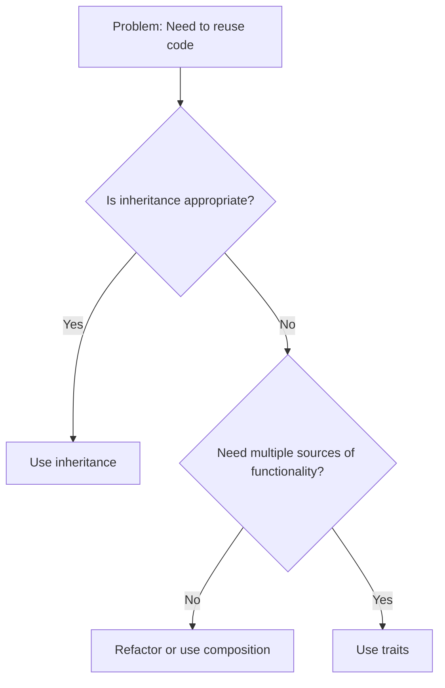

# PHP Traits

## Introduction

When building applications using Object-Oriented Programming (OOP) in PHP, you'll often want to reuse code across different classes. While inheritance is a common approach, PHP only supports single inheritance, meaning a class can only extend one parent class. This limitation can be restrictive when you need functionality from multiple sources.

**PHP Traits** solve this problem by providing a mechanism to reuse code across classes without using inheritance. Introduced in PHP 5.4, traits allow you to create reusable code blocks that can be "mixed in" to different classes, regardless of their inheritance hierarchy.

In this tutorial, you'll learn:
- What traits are and why they're useful
- How to create and use traits
- Best practices for working with traits
- Real-world applications of traits

## What Are Traits?

A trait is a group of methods that you want to include within other classes. A trait, like an abstract class, cannot be instantiated on its own. It's a mechanism that allows you to reuse code in single inheritance languages such as PHP.

Think of traits as "copy and paste" at a language level. When you use a trait in a class, it's as if you copied the trait's methods directly into your class.

## Creating and Using Traits

### Defining a Trait

You define a trait using the `trait` keyword, similar to how you define a class:

```php
trait Logger {
    public function log($message) {
        echo date('Y-m-d H:i:s') . ' - ' . $message . '<br>';
    }
    
    public function logError($message) {
        $this->log('ERROR: ' . $message);
    }
}
```

In this example, we've created a `Logger` trait with two methods: `log()` and `logError()`.

### Using a Trait in a Class

To use a trait in a class, you use the `use` keyword inside the class definition:

```php
class User {
    use Logger;
    
    private $name;
    
    public function __construct($name) {
        $this->name = $name;
        $this->log("User {$name} was created");
    }
    
    public function getName() {
        return $this->name;
    }
}

// Usage example
$user = new User("John Doe");
$user->logError("Failed to send welcome email");
```

**Output:**
```
2023-08-15 14:30:45 - User John Doe was created
2023-08-15 14:30:45 - ERROR: Failed to send welcome email
```

In this example, the `User` class uses the `Logger` trait, which gives the class access to the `log()` and `logError()` methods as if they were defined directly within the class.

### Using Multiple Traits

One of the main advantages of traits is that a class can use multiple traits:

```php
trait Logger {
    public function log($message) {
        echo date('Y-m-d H:i:s') . ' - ' . $message . '<br>';
    }
}

trait FileSystem {
    public function saveToFile($filename, $content) {
        file_put_contents($filename, $content);
        return true;
    }
}

class Report {
    use Logger, FileSystem;
    
    public function generateReport($data) {
        $this->log("Generating report");
        $content = "Report data: " . json_encode($data);
        $this->saveToFile('report.txt', $content);
        $this->log("Report saved to file");
    }
}

// Usage
$report = new Report();
$report->generateReport(['sales' => 1500, 'month' => 'August']);
```

**Output:**
```
2023-08-15 14:35:20 - Generating report
2023-08-15 14:35:20 - Report saved to file
```

In this example, the `Report` class uses both the `Logger` and `FileSystem` traits, giving it access to methods from both.

## Handling Method Conflicts

When using multiple traits that contain methods with the same name, PHP will raise a fatal error unless you explicitly resolve the conflict.

### Resolving Conflicts with insteadof and as

PHP provides two keywords to resolve trait method conflicts:
- `insteadof`: Chooses which trait's method to use
- `as`: Creates an alias for a method, allowing you to use both conflicting methods

```php
trait Logger {
    public function log($message) {
        echo "Logger: $message<br>";
    }
}

trait FileLogger {
    public function log($message) {
        echo "FileLogger: Writing '$message' to log file<br>";
    }
}

class App {
    use Logger, FileLogger {
        // Use Logger's log method instead of FileLogger's
        Logger::log insteadof FileLogger;
        
        // Create an alias for FileLogger's log method
        FileLogger::log as fileLog;
    }
    
    public function doSomething() {
        $this->log("Operation started");  // Uses Logger::log
        $this->fileLog("Operation details");  // Uses FileLogger::log
    }
}

// Usage
$app = new App();
$app->doSomething();
```

**Output:**
```
Logger: Operation started
FileLogger: Writing 'Operation details' to log file
```

## Trait Properties

Traits can define properties as well as methods:

```php
trait HasTimestamps {
    private $createdAt;
    private $updatedAt;
    
    public function setCreatedAt() {
        $this->createdAt = time();
    }
    
    public function setUpdatedAt() {
        $this->updatedAt = time();
    }
    
    public function getCreatedAt() {
        return date('Y-m-d H:i:s', $this->createdAt);
    }
    
    public function getUpdatedAt() {
        return date('Y-m-d H:i:s', $this->updatedAt);
    }
}

class Article {
    use HasTimestamps;
    
    private $title;
    private $content;
    
    public function __construct($title, $content) {
        $this->title = $title;
        $this->content = $content;
        $this->setCreatedAt();
        $this->setUpdatedAt();
    }
    
    public function update($content) {
        $this->content = $content;
        $this->setUpdatedAt();
    }
}

// Usage
$article = new Article("PHP Traits", "Traits are awesome!");
echo "Article created at: " . $article->getCreatedAt() . "<br>";

// Wait 2 seconds and update
sleep(2);
$article->update("Traits are really awesome!");
echo "Article updated at: " . $article->getUpdatedAt() . "<br>";
```

**Output:**
```
Article created at: 2023-08-15 14:45:30
Article updated at: 2023-08-15 14:45:32
```

## Trait Composition

Traits can also use other traits, creating a composition:

```php
trait Logger {
    public function log($message) {
        echo date('Y-m-d H:i:s') . " - $message<br>";
    }
}

trait ErrorHandler {
    use Logger;
    
    public function handleError($error) {
        $this->log("ERROR: $error");
        // Additional error handling logic
    }
}

class Service {
    use ErrorHandler;
    
    public function doOperation() {
        try {
            // Simulate an error
            throw new Exception("Connection failed");
        } catch (Exception $e) {
            $this->handleError($e->getMessage());
        }
    }
}

// Usage
$service = new Service();
$service->doOperation();
```

**Output:**
```
2023-08-15 14:50:20 - ERROR: Connection failed
```

In this example, the `ErrorHandler` trait uses the `Logger` trait, and the `Service` class uses the `ErrorHandler` trait, giving it access to both traits' methods.

## Abstract and Static Methods in Traits

Traits can contain abstract methods, which must be implemented by the class using the trait:

```php
trait Notifiable {
    abstract public function getEmail();
    
    public function sendNotification($message) {
        $email = $this->getEmail();
        echo "Sending notification to $email: $message<br>";
    }
}

class User {
    use Notifiable;
    
    private $email;
    
    public function __construct($email) {
        $this->email = $email;
    }
    
    public function getEmail() {
        return $this->email;
    }
}

// Usage
$user = new User("john@example.com");
$user->sendNotification("Your account has been activated");
```

**Output:**
```
Sending notification to john@example.com: Your account has been activated
```

Traits can also contain static methods and properties:

```php
trait Counter {
    private static $count = 0;
    
    public static function incrementCount() {
        self::$count++;
    }
    
    public static function getCount() {
        return self::$count;
    }
}

class Product {
    use Counter;
    
    private $name;
    
    public function __construct($name) {
        $this->name = $name;
        self::incrementCount();
    }
}

// Usage
$product1 = new Product("Laptop");
$product2 = new Product("Phone");
$product3 = new Product("Tablet");

echo "Total products created: " . Product::getCount();
```

**Output:**
```
Total products created: 3
```

## Visibility Modification

You can change the visibility of methods imported from a trait:

```php
trait Helper {
    public function helperMethod() {
        return "Helper method called";
    }
}

class MyClass {
    use Helper {
        // Change the visibility to protected
        helperMethod as protected;
    }
    
    public function callHelper() {
        return $this->helperMethod();
    }
}

// Usage
$obj = new MyClass();
echo $obj->callHelper() . "<br>";
// The line below would cause an error since helperMethod is now protected
// echo $obj->helperMethod();
```

**Output:**
```
Helper method called
```

## Real-World Example: Creating a Reusable CRUD System

Let's look at a practical example of how traits can be used to create a reusable CRUD (Create, Read, Update, Delete) system for database operations:

```php
trait DatabaseConnection {
    protected $conn;
    
    public function connect() {
        // In a real application, you would use proper database connection
        $this->conn = new PDO('mysql:host=localhost;dbname=myapp', 'username', 'password');
        $this->conn->setAttribute(PDO::ATTR_ERRMODE, PDO::ERRMODE_EXCEPTION);
        return $this->conn;
    }
}

trait CrudOperations {
    use DatabaseConnection;
    
    abstract public function getTableName();
    
    public function create($data) {
        $table = $this->getTableName();
        $fields = implode(', ', array_keys($data));
        $placeholders = ':' . implode(', :', array_keys($data));
        
        $sql = "INSERT INTO {$table} ({$fields}) VALUES ({$placeholders})";
        $stmt = $this->connect()->prepare($sql);
        
        foreach ($data as $key => $value) {
            $stmt->bindValue(":{$key}", $value);
        }
        
        return $stmt->execute();
    }
    
    public function read($id) {
        $table = $this->getTableName();
        $sql = "SELECT * FROM {$table} WHERE id = :id";
        $stmt = $this->connect()->prepare($sql);
        $stmt->bindValue(':id', $id);
        $stmt->execute();
        
        return $stmt->fetch(PDO::FETCH_ASSOC);
    }
    
    public function update($id, $data) {
        $table = $this->getTableName();
        $fields = '';
        
        foreach (array_keys($data) as $key) {
            $fields .= "{$key} = :{$key}, ";
        }
        
        $fields = rtrim($fields, ', ');
        
        $sql = "UPDATE {$table} SET {$fields} WHERE id = :id";
        $stmt = $this->connect()->prepare($sql);
        $stmt->bindValue(':id', $id);
        
        foreach ($data as $key => $value) {
            $stmt->bindValue(":{$key}", $value);
        }
        
        return $stmt->execute();
    }
    
    public function delete($id) {
        $table = $this->getTableName();
        $sql = "DELETE FROM {$table} WHERE id = :id";
        $stmt = $this->connect()->prepare($sql);
        $stmt->bindValue(':id', $id);
        
        return $stmt->execute();
    }
}

class User {
    use CrudOperations;
    
    public function getTableName() {
        return 'users';
    }
}

class Product {
    use CrudOperations;
    
    public function getTableName() {
        return 'products';
    }
}

// Usage example (not executed, just for demonstration)
// $user = new User();
// $user->create([
//     'name' => 'John Doe',
//     'email' => 'john@example.com',
//     'password' => password_hash('secret', PASSWORD_DEFAULT)
// ]);
// 
// $product = new Product();
// $product->create([
//     'name' => 'Smartphone',
//     'price' => 499.99,
//     'stock' => 100
// ]);
```

In this example:
1. We have a `DatabaseConnection` trait that handles connecting to the database
2. We have a `CrudOperations` trait that provides methods for creating, reading, updating, and deleting records
3. The `User` and `Product` classes use the `CrudOperations` trait, which gives them all the CRUD functionality
4. Each class only needs to implement the `getTableName()` method to specify which table it works with

This approach allows us to reuse the CRUD code across multiple models without duplicating code.

## When to Use Traits

Traits are most useful in the following scenarios:

1. **Horizontal Reuse**: When you need to share functionality across unrelated classes
2. **Multiple Inheritance Simulation**: When you need functionality from multiple sources
3. **Code Organization**: To keep your classes focused and avoid large, complex classes



## Best Practices for Using Traits

1. **Keep Traits Focused**: A trait should have a single responsibility
2. **Use Traits for Behavior, Not State**: Traits work best for methods, not for storing data
3. **Document Trait Usage**: Make it clear which traits a class uses and why
4. **Be Cautious with Trait Conflicts**: Conflicts can make code hard to understand
5. **Prefer Composition Over Traits** when appropriate: Sometimes a composed class is clearer than a trait

## Summary

PHP Traits provide a powerful mechanism for code reuse in object-oriented PHP applications. They allow you to:

- Share methods across unrelated classes
- Mix in functionality from multiple sources
- Overcome the limitations of single inheritance
- Create more modular and maintainable code

By understanding when and how to use traits effectively, you can write cleaner, more maintainable PHP code and avoid duplication across your application.

## Exercises

1. Create a `Timestampable` trait that adds created and updated timestamps to any class
2. Implement a `Validatable` trait that can be used to validate object properties
3. Create multiple traits that might have method conflicts, then resolve those conflicts
4. Build a small application that uses traits for logging, validation, and database operations

## Additional Resources

- [PHP Manual: Traits](https://www.php.net/manual/en/language.oop5.traits.php)
- [PHP: The Right Way - Traits](https://phptherightway.com/#programming_paradigms)
- [PHP Design Patterns](https://refactoring.guru/design-patterns/php) - Learn when to use traits vs. other design patterns