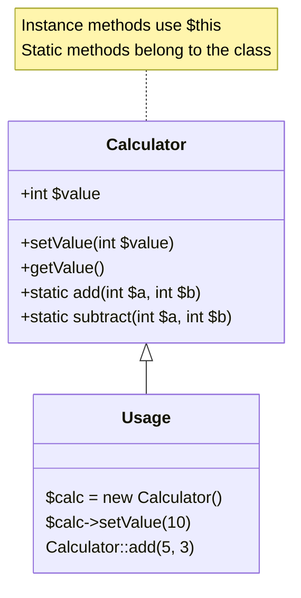

# PHP Static Methods

## Introduction

In PHP Object-Oriented Programming (OOP), static methods are a special type of class method that can be called without creating an instance of the class. They belong to the class itself rather than to any specific object created from that class. This makes static methods particularly useful for functionality that doesn't depend on instance-specific data.

Static methods are declared using the `static` keyword and are accessed using the scope resolution operator (`::`). Let's explore how static methods work in PHP and when you should use them.

## Understanding Static Methods

### What Are Static Methods?

Static methods differ from regular (instance) methods in several ways:

1. They are called on the class itself, not on an object instance
2. They cannot access instance properties (non-static properties)
3. They cannot use the `$this` keyword (since there is no object instance)
4. They are available as soon as the class is loaded

Here's a simple diagram showing the difference between static and instance methods:



## Basic Syntax

Here's the basic syntax for defining and calling static methods:

```php
class ClassName {
    public static function methodName() {
        // Method code here
    }
}

// Calling a static method
ClassName::methodName();
```

Let's look at a concrete example:

```php
<?php
class MathHelper {
    public static function add($a, $b) {
        return $a + $b;
    }
    
    public static function subtract($a, $b) {
        return $a - $b;
    }
}

// Using the static methods
echo MathHelper::add(5, 3);      // Output: 8
echo MathHelper::subtract(10, 4); // Output: 6
?>
```

## Why Use Static Methods?

Static methods are beneficial in several scenarios:

1. **Utility Functions**: For methods that perform operations not dependent on object state
2. **Factory Methods**: To create and return new instances of a class
3. **Singleton Pattern**: To ensure only one instance of a class exists
4. **Namespacing Functions**: To organize related functions under a class name

## Important Limitations

Before diving deeper, it's important to understand the limitations of static methods:

1. They can't access instance properties (non-static properties)
2. They can't use the `$this` keyword
3. They can make your code harder to test (due to tight coupling)
4. They can't be overridden in the same way as instance methods

## Accessing Static Methods

There are three main ways to access static methods:

### 1. Using the Class Name

The most common way to call a static method is using the class name with the scope resolution operator:

```php
<?php
class Logger {
    public static function log($message) {
        echo "LOG: $message
";
    }
}

// Calling the static method
Logger::log("This is a log message");
// Output: LOG: This is a log message
?>
```

### 2. Using the Self Keyword

Within a class, you can use the `self` keyword to call static methods defined in the same class:

```php
<?php
class StringUtils {
    public static function capitalize($string) {
        return ucfirst($string);
    }
    
    public static function formatName($firstName, $lastName) {
        return self::capitalize($firstName) . ' ' . self::capitalize($lastName);
    }
}

echo StringUtils::formatName("john", "doe");
// Output: John Doe
?>
```

### 3. Using a Variable Containing the Class Name

You can also call static methods using a variable that contains the name of the class:

```php
<?php
class Formatter {
    public static function formatCurrency($amount) {
        return '$' . number_format($amount, 2);
    }
}

$className = 'Formatter';
echo $className::formatCurrency(1234.56);
// Output: $1,234.56
?>
```

## Static Methods vs. Instance Methods

Let's compare static methods with instance methods to understand when to use each:

```php
<?php
class Calculator {
    // Instance property
    private $value;
    
    // Constructor
    public function __construct($initialValue = 0) {
        $this->value = $initialValue;
    }
    
    // Instance methods (need an object)
    public function add($number) {
        $this->value += $number;
        return $this->value;
    }
    
    public function getValue() {
        return $this->value;
    }
    
    // Static method (no object needed)
    public static function sum($a, $b) {
        return $a + $b;
    }
}

// Using instance methods
$calc = new Calculator(10);
echo $calc->add(5); // Output: 15
echo $calc->getValue(); // Output: 15

// Using static method
echo Calculator::sum(10, 5); // Output: 15

// This would cause an error
// Calculator::add(5); // Error: Non-static method cannot be called statically
?>
```

## Static Methods and Properties Together

Static methods are often used with static properties:

```php
<?php
class Counter {
    // Static property
    private static $count = 0;
    
    // Static method to increment counter
    public static function increment() {
        self::$count++;
    }
    
    // Static method to get current count
    public static function getCount() {
        return self::$count;
    }
}

Counter::increment();
Counter::increment();
echo Counter::getCount(); // Output: 2

// Create a new counter
Counter::increment();
echo Counter::getCount(); // Output: 3 (not 1, because the static property is shared)
?>
```

## Practical Examples

Let's explore some practical examples of static methods:

### Example 1: Configuration Manager

```php
<?php
class Config {
    private static $settings = [];
    
    public static function set($key, $value) {
        self::$settings[$key] = $value;
    }
    
    public static function get($key, $default = null) {
        return self::$settings[$key] ?? $default;
    }
    
    public static function has($key) {
        return isset(self::$settings[$key]);
    }
}

// Using the Config class
Config::set('db_host', 'localhost');
Config::set('db_user', 'root');

echo Config::get('db_host'); // Output: localhost
echo Config::has('db_name') ? 'Yes' : 'No'; // Output: No
?>
```

### Example 2: Date Utility

```php
<?php
class DateUtils {
    public static function formatDate($date, $format = 'Y-m-d') {
        return date($format, strtotime($date));
    }
    
    public static function isWeekend($date) {
        $day = date('N', strtotime($date));
        return ($day >= 6);
    }
    
    public static function getDaysBetween($start, $end) {
        $startDate = new DateTime($start);
        $endDate = new DateTime($end);
        $interval = $startDate->diff($endDate);
        return $interval->days;
    }
}

echo DateUtils::formatDate('2023-05-15', 'd/m/Y'); // Output: 15/05/2023
echo DateUtils::isWeekend('2023-05-20') ? 'Yes' : 'No'; // Output: Yes (Saturday)
echo DateUtils::getDaysBetween('2023-05-01', '2023-05-10'); // Output: 9
?>
```

### Example 3: Factory Pattern

```php
<?php
class Database {
    private $connection;
    private $host;
    private $username;
    private $password;
    private $database;
    
    public function __construct($host, $username, $password, $database) {
        $this->host = $host;
        $this->username = $username;
        $this->password = $password;
        $this->database = $database;
        $this->connect();
    }
    
    private function connect() {
        // Simulate connection
        $this->connection = "Connected to $this->database at $this->host";
    }
    
    public function getConnection() {
        return $this->connection;
    }
    
    // Static factory method
    public static function create($config) {
        return new self(
            $config['host'] ?? 'localhost',
            $config['username'] ?? 'root',
            $config['password'] ?? '',
            $config['database'] ?? 'test'
        );
    }
}

// Using the factory method
$db = Database::create([
    'host' => 'db.example.com',
    'database' => 'myapp'
]);

echo $db->getConnection(); 
// Output: Connected to myapp at db.example.com
?>
```

## Static Methods in Inheritance

Static methods can be inherited, but there are some important nuances:

```php
<?php
class ParentClass {
    public static function whoAmI() {
        return "I am " . static::class;
    }
    
    public static function sayHello() {
        echo static::whoAmI() . " says hello!
";
    }
}

class ChildClass extends ParentClass {
    public static function whoAmI() {
        return "Child class " . static::class;
    }
}

echo ParentClass::whoAmI(); // Output: I am ParentClass
echo ChildClass::whoAmI();  // Output: Child class ChildClass

ParentClass::sayHello(); // Output: I am ParentClass says hello!
ChildClass::sayHello();  // Output: Child class ChildClass says hello!
?>
```

Note the use of `static::class` and `static::whoAmI()` instead of `self::class` and `self::whoAmI()`. This is called the "late static binding" feature in PHP, which allows static methods to be overridden in child classes.

## Best Practices

Here are some best practices to follow when using static methods:

1. **Use static methods for utility functions** that don't depend on object state
2. **Avoid using static methods for core business logic**, as they make testing harder
3. **Consider using dependency injection** instead of static methods for better testability
4. **Use static methods for factory patterns** when appropriate
5. **Be careful with state in static properties**, as they persist throughout the application

## Common Mistakes

### Mistake 1: Using $this in a Static Method

```php
<?php
class User {
    private $name;
    
    public function setName($name) {
        $this->name = $name;
    }
    
    public static function greet() {
        // This will cause an error
        return "Hello, " . $this->name;
    }
}
?>
```

This will generate an error because `$this` is not available in static methods.

### Mistake 2: Calling Non-Static Methods Statically

```php
<?php
class Helper {
    public function formatText($text) {
        return strtoupper($text);
    }
}

// This will cause an error or warning
Helper::formatText("hello");
?>
```

This will cause an error or warning because you're trying to call a non-static method statically.

## Performance Considerations

Static methods can offer slight performance advantages since they don't require object instantiation. However, this benefit is usually negligible in most applications. The decision to use static methods should primarily be based on architectural concerns rather than performance.

## Summary

Static methods in PHP provide a way to define functionality that belongs to the class as a whole rather than to specific instances. They're useful for utility functions, factory methods, and operations that don't depend on instance-specific data.

Key points to remember:
- Static methods are declared using the `static` keyword
- They are called using the scope resolution operator (`::`), not the object operator (`->`)
- They cannot access instance properties or use `$this`
- They can access static properties using `self::`
- They are available without creating an object instance
- They can make code harder to test if overused

While static methods have their place in PHP programming, they should be used judiciously. Many experienced developers recommend favoring instance methods and dependency injection for better maintainability and testability in large applications.

## Exercises

1. Create a `StringHelper` class with static methods to perform common string operations like `slugify()`, `truncate()`, and `countWords()`.
2. Implement a `Logger` class with static methods that log messages to different destinations (console, file, etc.).
3. Create a `ShoppingCart` class with static methods to manage a shopping cart, and discuss the limitations of this approach.
4. Refactor the `Config` example to add validation and support for configuration sections.
5. Implement a static factory for creating different types of user accounts.

## Additional Resources

- [PHP Official Documentation on Static Methods](https://www.php.net/manual/en/language.oop5.static.php)
- [Late Static Bindings in PHP](https://www.php.net/manual/en/language.oop5.late-static-bindings.php)
- [When to Use Static Methods in PHP](https://phptherightway.com)
- [Design Patterns in PHP: Factory Pattern](https://refactoring.guru/design-patterns/factory-method/php)