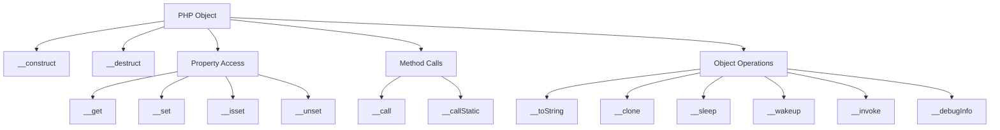

# PHP Magic Methods

## Introduction

PHP Magic Methods are special methods that start with a double underscore (`__`) and allow you to add "magical" functionality to your classes. These methods are automatically called when specific events occur in your code, enabling you to create more dynamic and flexible classes without explicitly calling these methods.

Magic methods are a powerful feature in PHP's Object-Oriented Programming (OOP) system that allows your objects to react to different situations automatically. They can make your code more elegant, reduce repetition, and provide intuitive interfaces for your classes.

In this tutorial, we'll explore the most commonly used magic methods in PHP, understand when they're called, and see practical examples of how they can improve your code.

## Common PHP Magic Methods

### Constructor - `__construct()`

The constructor is perhaps the most widely used magic method. It's automatically called when you create a new instance of a class using the `new` keyword.

```php
class User {
    public $name;
    public $email;
    
    // Constructor magic method
    public function __construct($name, $email) {
        $this->name = $name;
        $this->email = $email;
        echo "New User object created!";
    }
}

// Using the constructor
$user = new User("John Doe", "john@example.com");
// Output: New User object created!

echo $user->name; // Output: John Doe
echo $user->email; // Output: john@example.com
```

The constructor allows you to initialize object properties and perform setup tasks when an object is created.

### Destructor - `__destruct()`

The destructor is called when an object is no longer referenced or when the script finishes execution.

```php
class Database {
    private $connection;
    
    public function __construct() {
        $this->connection = "DB connected";
        echo "Database connection established.
";
    }
    
    public function __destruct() {
        $this->connection = null;
        echo "Database connection closed.
";
    }
}

// Begin scope
{
    $db = new Database(); // Output: Database connection established.
    // Do some operations with $db
} // $db goes out of scope here, destructor called

echo "Script continues executing.
";
// Output: Database connection closed.
// Output: Script continues executing.
```

The destructor is useful for cleaning up resources like database connections, file handles, or temporary files.

### Getter - `__get()`

The `__get()` method is triggered when you try to access a property that is inaccessible (private/protected) or doesn't exist.

```php
class Product {
    private $data = [
        'name' => 'Smartphone',
        'price' => 599.99,
        'stock' => 25
    ];
    
    public function __get($property) {
        if (array_key_exists($property, $this->data)) {
            return $this->data[$property];
        }
        return "Property {$property} does not exist";
    }
}

$product = new Product();
echo $product->name;  // Output: Smartphone
echo $product->price; // Output: 599.99
echo $product->color; // Output: Property color does not exist
```

### Setter - `__set()`

The `__set()` method is triggered when you try to set a value to an inaccessible or non-existent property.

```php
class UserProfile {
    private $data = [];
    private $allowedFields = ['username', 'email', 'bio'];
    
    public function __set($property, $value) {
        if (in_array($property, $this->allowedFields)) {
            $this->data[$property] = $value;
        } else {
            echo "Cannot set {$property}. Field not allowed.
";
        }
    }
    
    public function displayProfile() {
        foreach ($this->data as $key => $value) {
            echo "{$key}: {$value}
";
        }
    }
}

$profile = new UserProfile();
$profile->username = "johndoe";    // Allowed
$profile->email = "john@example.com"; // Allowed
$profile->password = "secret";     // Output: Cannot set password. Field not allowed.

$profile->displayProfile();
// Output:
// username: johndoe
// email: john@example.com
```

### Property Checker - `__isset()`

The `__isset()` method is triggered when `isset()` or `empty()` is called on inaccessible or non-existent properties.

```php
class Cart {
    private $items = [];
    
    public function addItem($name, $qty) {
        $this->items[$name] = $qty;
    }
    
    public function __isset($name) {
        return array_key_exists($name, $this->items);
    }
}

$cart = new Cart();
$cart->addItem('laptop', 1);

echo isset($cart->laptop) ? "Laptop is in cart
" : "No laptop in cart
";
// Output: Laptop is in cart

echo isset($cart->headphones) ? "Headphones are in cart
" : "No headphones in cart
";
// Output: No headphones in cart
```

### Property Unsetter - `__unset()`

The `__unset()` method is triggered when `unset()` is called on inaccessible or non-existent properties.

```php
class ShoppingCart {
    private $items = [];
    
    public function addItem($name) {
        $this->items[$name] = true;
        echo "{$name} added to cart.
";
    }
    
    public function __unset($name) {
        if (array_key_exists($name, $this->items)) {
            unset($this->items[$name]);
            echo "{$name} removed from cart.
";
        } else {
            echo "{$name} is not in cart.
";
        }
    }
    
    public function showItems() {
        return array_keys($this->items);
    }
}

$cart = new ShoppingCart();
$cart->addItem('laptop');   // Output: laptop added to cart.
$cart->addItem('mouse');    // Output: mouse added to cart.

unset($cart->laptop);       // Output: laptop removed from cart.
unset($cart->keyboard);     // Output: keyboard is not in cart.

print_r($cart->showItems()); // Output: Array ( [0] => mouse )
```

### Method Caller - `__call()`

The `__call()` method is triggered when invoking inaccessible or non-existent methods in an object context.

```php
class API {
    private $endpoints = [
        'getUsers' => 'https://api.example.com/users',
        'getProducts' => 'https://api.example.com/products'
    ];
    
    public function __call($name, $arguments) {
        if (array_key_exists($name, $this->endpoints)) {
            echo "Making API request to: {$this->endpoints[$name]}
";
            if (!empty($arguments)) {
                echo "With parameters: " . implode(', ', $arguments) . "
";
            }
        } else {
            echo "Endpoint {$name} does not exist.
";
        }
    }
}

$api = new API();
$api->getUsers();    // Output: Making API request to: https://api.example.com/users
$api->getProducts('category=electronics');  // Output: Making API request to: https://api.example.com/products
                                            // With parameters: category=electronics
$api->getOrders();   // Output: Endpoint getOrders does not exist.
```

### Static Method Caller - `__callStatic()`

The `__callStatic()` method is triggered when invoking inaccessible or non-existent methods in a static context.

```php
class Logger {
    private static $logLevels = ['INFO', 'WARNING', 'ERROR', 'DEBUG'];
    
    public static function __callStatic($name, $arguments) {
        $level = strtoupper($name);
        
        if (in_array($level, self::$logLevels)) {
            echo "[{$level}] " . implode(' ', $arguments) . "
";
        } else {
            echo "Unknown log level: {$level}
";
        }
    }
}

Logger::info("User logged in successfully");  // Output: [INFO] User logged in successfully
Logger::error("Database connection failed");  // Output: [ERROR] Database connection failed
Logger::critical("System crash");             // Output: Unknown log level: CRITICAL
```

### String Representation - `__toString()`

The `__toString()` method is triggered when an object is treated as a string.

```php
class Person {
    private $name;
    private $age;
    
    public function __construct($name, $age) {
        $this->name = $name;
        $this->age = $age;
    }
    
    public function __toString() {
        return "Person: {$this->name}, {$this->age} years old";
    }
}

$person = new Person("Alice", 28);
echo $person;  // Output: Person: Alice, 28 years old
```

### Serialization - `__sleep()` and `__wakeup()`

The `__sleep()` method is called when an object is serialized with `serialize()`, and `__wakeup()` is called when an object is unserialized with `unserialize()`.

```php
class Connection {
    private $link;
    private $server;
    private $username;
    private $password;
    
    public function __construct($server, $username, $password) {
        $this->server = $server;
        $this->username = $username;
        $this->password = $password;
        $this->connect();
    }
    
    private function connect() {
        $this->link = "Connected to {$this->server} as {$this->username}";
        echo "Connection established.
";
    }
    
    public function __sleep() {
        echo "Object is being serialized...
";
        // Only serialize the settings, not the connection
        return ['server', 'username', 'password'];
    }
    
    public function __wakeup() {
        echo "Object is being unserialized...
";
        // Reestablish the connection
        $this->connect();
    }
    
    public function getStatus() {
        return $this->link;
    }
}

$conn = new Connection('db.example.com', 'admin', 'pass123');
// Output: Connection established.

$serialized = serialize($conn);
// Output: Object is being serialized...

echo "Stored connection state: " . $serialized . "
";

$newConn = unserialize($serialized);
// Output: Object is being unserialized...
// Output: Connection established.

echo $newConn->getStatus() . "
";
// Output: Connected to db.example.com as admin
```

### Object Cloning - `__clone()`

The `__clone()` method is triggered when an object is cloned with the `clone` keyword.

```php
class Document {
    public $title;
    public $content;
    private $id;
    
    public function __construct($title, $content) {
        $this->title = $title;
        $this->content = $content;
        $this->id = uniqid();
        echo "Document created with ID: {$this->id}
";
    }
    
    public function __clone() {
        $this->id = uniqid();
        $this->title = "Copy of " . $this->title;
        echo "Document cloned with new ID: {$this->id}
";
    }
    
    public function getId() {
        return $this->id;
    }
}

$doc = new Document("PHP Tutorial", "PHP is a powerful scripting language.");
// Output: Document created with ID: 60a7e9f8b5cd3

$copy = clone $doc;
// Output: Document cloned with new ID: 60a7e9f8b7e21

echo "Original document ID: " . $doc->getId() . "
";
echo "Original document title: " . $doc->title . "
";
echo "Copy document ID: " . $copy->getId() . "
";
echo "Copy document title: " . $copy->title . "
";

// Output:
// Original document ID: 60a7e9f8b5cd3
// Original document title: PHP Tutorial
// Copy document ID: 60a7e9f8b7e21
// Copy document title: Copy of PHP Tutorial
```

## Real-World Example: Active Record Pattern

Let's see how magic methods can be used to implement a simple Active Record pattern for database operations:

```php
class Model {
    protected $attributes = [];
    protected $table;
    
    public function __construct($attributes = []) {
        $this->attributes = $attributes;
    }
    
    public function __get($name) {
        if (array_key_exists($name, $this->attributes)) {
            return $this->attributes[$name];
        }
        return null;
    }
    
    public function __set($name, $value) {
        $this->attributes[$name] = $value;
    }
    
    public function __call($name, $arguments) {
        // Implement dynamic finders like findByEmail, findById, etc.
        if (strpos($name, 'findBy') === 0) {
            $field = strtolower(substr($name, 6)); // Remove 'findBy'
            $value = $arguments[0];
            
            echo "SELECT * FROM {$this->table} WHERE {$field} = '{$value}';
";
            // In a real implementation, this would execute a database query
            return "Record with {$field} = {$value}";
        }
    }
    
    public function save() {
        if (isset($this->attributes['id'])) {
            // Update existing record
            $fields = [];
            foreach ($this->attributes as $key => $value) {
                if ($key !== 'id') {
                    $fields[] = "{$key} = '{$value}'";
                }
            }
            $fieldsStr = implode(', ', $fields);
            echo "UPDATE {$this->table} SET {$fieldsStr} WHERE id = {$this->attributes['id']};
";
        } else {
            // Insert new record
            $columns = implode(', ', array_keys($this->attributes));
            $values = implode("', '", array_values($this->attributes));
            echo "INSERT INTO {$this->table} ({$columns}) VALUES ('{$values}');
";
        }
    }
}

class User extends Model {
    protected $table = 'users';
}

// Using the active record model
$user = new User(['name' => 'John Doe', 'email' => 'john@example.com']);
echo $user->name;  // Output: John Doe

$user->age = 30;   // Using __set

$user->save();
// Output: INSERT INTO users (name, email, age) VALUES ('John Doe', 'john@example.com', '30');

// Using dynamic finder
$result = $user->findByEmail('jane@example.com');
// Output: SELECT * FROM users WHERE email = 'jane@example.com';
```

## Magic Methods Visualization



## Best Practices for Using Magic Methods

While magic methods are powerful, they should be used carefully:

1. **Performance Considerations**: Magic methods can be slower than direct property access or method calls, so use them when the flexibility outweighs the performance impact.

2. **Keep It Simple**: Avoid making your magic methods too complex, as this can lead to code that's hard to understand and debug.

3. **Documentation is Critical**: Since magic methods introduce implicit behavior, make sure to document how they work in your classes.

4. **Consistent Behavior**: Keep the behavior of your magic methods consistent with what users would expect.

5. **Visibility Control**: Use them to enforce access control patterns, not to circumvent them.

## Summary

PHP Magic Methods provide a powerful way to enhance your classes with dynamic behavior and respond to various events in an object's lifecycle. They can make your code more flexible and intuitive, but should be used judiciously.

We've covered:
- What magic methods are and how they work
- The most common magic methods in PHP and their uses
- Real-world applications of magic methods
- Best practices for implementing magic methods in your code

By understanding and properly using magic methods, you can create more dynamic, flexible, and intuitive classes in your PHP applications.

## Additional Resources

- [PHP Documentation on Magic Methods](https://www.php.net/manual/en/language.oop5.magic.php)
- [PHP Object-Oriented Programming](https://www.php.net/manual/en/language.oop5.php)
- [Design Patterns in PHP](https://refactoring.guru/design-patterns/php)

## Exercises

1. Create a `Calculator` class that uses the `__call` magic method to dynamically handle operations like `add`, `subtract`, `multiply`, and `divide`.

2. Implement a `Config` class that stores configuration values and uses `__get` and `__set` to access them with validation.

3. Build a simple ORM (Object-Relational Mapping) class that uses magic methods to perform database operations like `find`, `save`, `update`, and `delete`.

4. Create a `FileLogger` class with a `__destruct` method that ensures all log entries are properly written to disk when the object is destroyed.

5. Implement a `Cache` class that uses `__sleep` and `__wakeup` to properly serialize and unserialize cached data while maintaining connections to the cache storage.