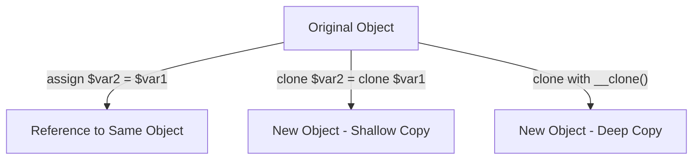

# PHP Object Cloning

## Introduction

When working with objects in PHP, you'll often need to create copies of existing objects. However, simply assigning an object to a new variable doesn't create a new copy - it only creates another reference to the same object. This is where **object cloning** comes into play.

In this tutorial, we'll explore how PHP handles object cloning, understand the difference between shallow and deep copies, and learn how to customize the cloning process using PHP's magic methods.

## Understanding Object References vs Cloning

Let's start by understanding the difference between object references and actual copies:

```php
<?php
// Define a simple class
class User {
    public $name;
    public $email;
    
    public function __construct($name, $email) {
        $this->name = $name;
        $this->email = $email;
    }
}

// Create a User object
$user1 = new User("John", "john@example.com");

// Create a reference (NOT a copy)
$user2 = $user1;

// Modify the name in $user2
$user2->name = "Jane";

// Output both objects
echo "User1: " . $user1->name . " - " . $user1->email . "
";
echo "User2: " . $user2->name . " - " . $user2->email . "
";
?>
```

**Output:**
```
User1: Jane - john@example.com
User2: Jane - john@example.com
```

Notice how changing the `name` property in `$user2` also affected `$user1`. This happens because both variables point to the same object in memory. They are references to the same object, not separate copies.

## Basic Object Cloning with `clone`

PHP provides the `clone` keyword to create a copy of an object:

```php
<?php
// Define a simple class
class User {
    public $name;
    public $email;
    
    public function __construct($name, $email) {
        $this->name = $name;
        $this->email = $email;
    }
}

// Create a User object
$user1 = new User("John", "john@example.com");

// Create a clone (a copy)
$user2 = clone $user1;

// Modify the name in $user2
$user2->name = "Jane";

// Output both objects
echo "User1: " . $user1->name . " - " . $user1->email . "
";
echo "User2: " . $user2->name . " - " . $user2->email . "
";
?>
```

**Output:**
```
User1: John - john@example.com
User2: Jane - john@example.com
```

Now we see that modifying `$user2` doesn't affect `$user1` because they are separate objects in memory.

## Shallow vs Deep Copying

By default, PHP performs a **shallow copy** when cloning objects. This means that primitive property values (like strings, integers) are copied, but objects within objects are still referenced, not copied.

Let's see this in action:

```php
<?php
// Define an Address class
class Address {
    public $street;
    public $city;
    
    public function __construct($street, $city) {
        $this->street = $street;
        $this->city = $city;
    }
}

// Define a User class with an Address object
class User {
    public $name;
    public $address; // This is an object
    
    public function __construct($name, Address $address) {
        $this->name = $name;
        $this->address = $address;
    }
}

// Create objects
$address = new Address("123 Main St", "Springfield");
$user1 = new User("John", $address);

// Clone the user
$user2 = clone $user1;
$user2->name = "Jane";
$user2->address->street = "456 Oak Ave"; // Change the street

// Output both objects
echo "User1: " . $user1->name . ", " . $user1->address->street . ", " . $user1->address->city . "
";
echo "User2: " . $user2->name . ", " . $user2->address->street . ", " . $user2->address->city . "
";
?>
```

**Output:**
```
User1: John, 456 Oak Ave, Springfield
User2: Jane, 456 Oak Ave, Springfield
```

Notice that changing the street address in `$user2` also changed it in `$user1`. This happens because the `address` property is an object reference, and the default cloning only creates a shallow copy.

## Customizing Cloning with the `__clone()` Magic Method

PHP allows you to customize the cloning process by defining a special `__clone()` magic method in your class. This method is automatically called after an object has been cloned.

Let's modify our previous example to create a deep copy of the `Address` object:

```php
<?php
class Address {
    public $street;
    public $city;
    
    public function __construct($street, $city) {
        $this->street = $street;
        $this->city = $city;
    }
}

class User {
    public $name;
    public $address;
    
    public function __construct($name, Address $address) {
        $this->name = $name;
        $this->address = $address;
    }
    
    // This method is called automatically when the object is cloned
    public function __clone() {
        // Create a deep copy of the Address object
        $this->address = clone $this->address;
    }
}

// Create objects
$address = new Address("123 Main St", "Springfield");
$user1 = new User("John", $address);

// Clone the user (now with deep copy)
$user2 = clone $user1;
$user2->name = "Jane";
$user2->address->street = "456 Oak Ave";

// Output both objects
echo "User1: " . $user1->name . ", " . $user1->address->street . ", " . $user1->address->city . "
";
echo "User2: " . $user2->name . ", " . $user2->address->street . ", " . $user2->address->city . "
";
?>
```

**Output:**
```
User1: John, 123 Main St, Springfield
User2: Jane, 456 Oak Ave, Springfield
```

Now we see that changing the address in `$user2` doesn't affect `$user1` because we've implemented a deep copy using the `__clone()` method.

## The Cloning Process Visualized

Here's a diagram showing how the cloning process works:



## Practical Example: Cloning a Shopping Cart

Let's look at a practical example of when object cloning might be useful - creating template shopping carts:

```php
<?php
class Product {
    public $id;
    public $name;
    public $price;
    
    public function __construct($id, $name, $price) {
        $this->id = $id;
        $this->name = $name;
        $this->price = $price;
    }
}

class ShoppingCart {
    public $items = [];
    public $customer;
    private $itemCount = 0;
    
    public function addItem(Product $product, $quantity = 1) {
        $this->items[] = [
            'product' => $product,
            'quantity' => $quantity
        ];
        $this->itemCount += $quantity;
    }
    
    public function getItemCount() {
        return $this->itemCount;
    }
    
    public function setCustomer($name) {
        $this->customer = $name;
    }
    
    // Custom clone method
    public function __clone() {
        // Create deep copies of all items in the cart
        foreach ($this->items as $key => $item) {
            $this->items[$key]['product'] = clone $item['product'];
        }
    }
}

// Create products
$laptop = new Product(1, "Laptop", 999.99);
$mouse = new Product(2, "Wireless Mouse", 29.99);

// Create a template cart with common items
$templateCart = new ShoppingCart();
$templateCart->addItem($laptop);
$templateCart->addItem($mouse);

// Clone the template for customer John
$johnCart = clone $templateCart;
$johnCart->setCustomer("John");

// Modify John's laptop price (special discount)
$johnCart->items[0]['product']->price = 899.99;

// Clone the template for customer Alice too
$aliceCart = clone $templateCart;
$aliceCart->setCustomer("Alice");
$aliceCart->items[0]['quantity'] = 2; // Alice wants 2 laptops

// Output the carts
echo "Template Cart - Laptop Price: $" . $templateCart->items[0]['product']->price . "
";
echo "John's Cart - Laptop Price: $" . $johnCart->items[0]['product']->price . "
";
echo "Alice's Cart - Laptop Quantity: " . $aliceCart->items[0]['quantity'] . "
";
echo "Alice's Cart - Laptop Price: $" . $aliceCart->items[0]['product']->price . "
";
?>
```

**Output:**
```
Template Cart - Laptop Price: $999.99
John's Cart - Laptop Price: $899.99
Alice's Cart - Laptop Quantity: 2
Alice's Cart - Laptop Price: $999.99
```

In this example, we create a template shopping cart and then clone it for different customers. Thanks to our `__clone()` method, each customer gets their own deep copy of the products, so modifications to one customer's products don't affect others.

## When to Use Object Cloning

Object cloning is useful in several scenarios:

1. **Creating templates**: As shown in the shopping cart example
2. **Prototyping**: When you need to create many similar objects with minor differences
3. **State preservation**: Saving the state of an object before making changes
4. **Object pooling**: When reusing objects is more efficient than creating new ones

## Performance Considerations

Cloning objects can be memory-intensive, especially with deep copies of complex objects. Consider these tips:

- Only clone objects when necessary
- Be mindful of deep hierarchies of nested objects
- Consider implementing a factory method instead of cloning if appropriate
- For very large objects, custom serialization might be more efficient

## Summary

In this tutorial, we've learned:

- The difference between object references and clones
- How to use the `clone` keyword to create copies of objects
- The distinction between shallow and deep copying
- How to customize the cloning process with the `__clone()` magic method
- Practical applications of object cloning
- Performance considerations when working with clones

Object cloning is a powerful feature in PHP OOP that helps you create independent copies of objects, avoiding unintended side effects when modifying complex data structures.

## Additional Resources and Exercises

### Exercises

1. Create a class `Calendar` with an array of `Event` objects. Implement cloning so that when a `Calendar` is cloned, all its `Event` objects are deeply copied.

2. Implement a `DocumentTemplate` class with properties for title, content, and an array of `Section` objects. Add appropriate cloning behavior so that templates can be reused without affecting the original.

3. Create a `DatabaseConnection` class that shouldn't be cloned (database connections typically shouldn't be duplicated). Implement appropriate behavior when someone tries to clone it.

### Additional Resources

- [PHP Official Documentation on Object Cloning](https://www.php.net/manual/en/language.oop5.cloning.php)
- [PHP Magic Methods](https://www.php.net/manual/en/language.oop5.magic.php)
- [PHP Object Serialization](https://www.php.net/manual/en/language.oop5.serialization.php) - An alternative approach for creating object copies