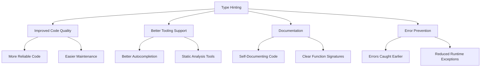

# PHP Type Hinting

## Introduction

Type hinting is one of PHP's most powerful features for creating robust, maintainable object-oriented code. It allows developers to specify what types of data can be passed to functions, methods, and, in newer PHP versions, properties. By explicitly declaring the expected data types, you can catch errors earlier, improve code readability, and enable better IDE support.

In this tutorial, we'll explore PHP type hinting in depth, including:
- What type hinting is and why it's important
- Basic type hinting for functions and methods
- Class and interface type hinting
- Return type declarations
- Nullable types
- Union types (PHP 8+)
- Property type declarations

## What is Type Hinting?

Type hinting (also known as type declarations) allows you to specify the expected data type for:
- Function and method parameters
- Function and method return values 
- Class properties (PHP 7.4+)

This helps catch type-related errors at compile time rather than runtime, making your code more predictable and easier to debug.

## Basic Type Hinting

Let's start with the basics. Here's how you can use type hinting for simple data types:

```php
<?php
// Without type hinting
function add($a, $b) {
    return $a + $b;
}

// With type hinting
function addWithTypes(int $a, int $b): int {
    return $a + $b;
}

// Example usage
echo add(5, 10);        // Output: 15
echo add("5", "10");    // Output: 15 (strings converted to integers)
echo add("5", "hello"); // Error: "hello" is not numeric

echo addWithTypes(5, 10);        // Output: 15
// echo addWithTypes("5", "10"); // Error: This would fail with type error
?>
```

In the example above, the `addWithTypes()` function only accepts integer values, providing stronger guarantees about what data can be processed.

## Available Type Hints

PHP supports several built-in type hints:

| Type | Available Since | Description |
|------|----------------|-------------|
| `int` | PHP 7.0 | Integer values |
| `float` | PHP 7.0 | Floating-point numbers |
| `string` | PHP 7.0 | String values |
| `bool` | PHP 7.0 | Boolean values |
| `array` | PHP 5.1 | Array values |
| `callable` | PHP 5.4 | Functions and other callable entities |
| `iterable` | PHP 7.1 | Arrays or objects implementing Traversable |
| `object` | PHP 7.2 | Any object |
| `mixed` | PHP 8.0 | Any type |
| Class/interface names | PHP 5.0 | Objects of the specified class/interface |
| `self`/`parent` | PHP 5.0 | Objects of the current/parent class |

## Class and Interface Type Hinting

One of the most powerful uses of type hinting is specifying classes or interfaces as parameter types:

```php
<?php
class User {
    public string $name;
    
    public function __construct(string $name) {
        $this->name = $name;
    }
}

class UserManager {
    public function greetUser(User $user): string {
        return "Hello, " . $user->name . "!";
    }
}

// Usage example
$user = new User("John");
$manager = new UserManager();

echo $manager->greetUser($user);  // Output: Hello, John!
// echo $manager->greetUser("John");  // Error: Argument 1 must be of type User
?>
```

This ensures that only `User` objects can be passed to the `greetUser()` method.

## Return Type Declarations

PHP 7.0 introduced return type declarations, allowing you to specify what type a function or method should return:

```php
<?php
function getUserName(int $userId): string {
    // Database lookup logic here...
    return "John Doe"; // Must return a string
}

// This would cause an error
function getBadUserName(int $userId): string {
    return $userId; // Error: Return value must be of type string, int returned
}
?>
```

## Nullable Types

Sometimes you need to accept NULL as a valid value. PHP 7.1 introduced nullable types using the question mark (`?`) syntax:

```php
<?php
function findUser(int $userId): ?User {
    // Database lookup logic
    $found = /* database logic */;
    
    if ($found) {
        return new User("John");
    } else {
        return null; // This is valid with the ?User return type
    }
}

function processUser(?User $user): string {
    if ($user === null) {
        return "No user provided";
    }
    return "Processing user: " . $user->name;
}
?>
```

## Union Types (PHP 8+)

PHP 8.0 introduced union types, allowing you to specify multiple possible types for a single parameter or return value:

```php
<?php
function handleValue(string|int $value): string|int {
    if (is_string($value)) {
        return "You provided the string: " . $value;
    } else {
        return $value * 2;
    }
}

echo handleValue("hello"); // Output: You provided the string: hello
echo handleValue(5);       // Output: 10
?>
```

## Property Type Declarations

PHP 7.4 introduced typed properties, allowing you to declare types for class properties:

```php
<?php
class Product {
    public string $name;
    public float $price;
    public ?string $description;
    public array $categories = [];
    
    public function __construct(string $name, float $price, ?string $description = null) {
        $this->name = $name;
        $this->price = $price;
        $this->description = $description;
    }
}

$product = new Product("Laptop", 999.99, "A powerful laptop");
echo $product->name; // Output: Laptop

// These would all cause errors:
// $product->name = 123;      // Error: Must be string
// $product->price = "cheap"; // Error: Must be float
// $product->categories = "Tech"; // Error: Must be array
?>
```

## Strict Types

By default, PHP performs type coercion (automatic conversion of types). You can enable strict typing by adding `declare(strict_types=1);` at the top of your file:

```php
<?php
declare(strict_types=1);

function multiply(int $a, int $b): int {
    return $a * $b;
}

echo multiply(5, 3);    // Output: 15
// echo multiply("5", 3);  // Error: Argument 1 must be of type int, string given
?>
```

Without `strict_types`, PHP would convert the string "5" to an integer automatically.

## Practical Example: Building a Simple Shopping Cart

Let's see type hinting in action with a more complete example:

```php
<?php
declare(strict_types=1);

interface Purchasable {
    public function getPrice(): float;
    public function getName(): string;
}

class Product implements Purchasable {
    private string $name;
    private float $price;
    
    public function __construct(string $name, float $price) {
        $this->name = $name;
        $this->price = $price;
    }
    
    public function getPrice(): float {
        return $this->price;
    }
    
    public function getName(): string {
        return $this->name;
    }
}

class DigitalProduct extends Product {
    private string $downloadLink;
    
    public function __construct(string $name, float $price, string $downloadLink) {
        parent::__construct($name, $price);
        $this->downloadLink = $downloadLink;
    }
    
    public function getDownloadLink(): string {
        return $this->downloadLink;
    }
}

class ShoppingCart {
    private array $items = [];
    
    public function addItem(Purchasable $item, int $quantity = 1): void {
        $this->items[] = [
            'item' => $item,
            'quantity' => $quantity
        ];
    }
    
    public function getTotal(): float {
        $total = 0;
        foreach ($this->items as $itemData) {
            $total += $itemData['item']->getPrice() * $itemData['quantity'];
        }
        return $total;
    }
    
    public function getItemCount(): int {
        return count($this->items);
    }
    
    public function displayCart(): string {
        $output = "Shopping Cart:
";
        foreach ($this->items as $itemData) {
            $item = $itemData['item'];
            $quantity = $itemData['quantity'];
            $output .= "- {$item->getName()} x {$quantity}: $" . 
                       number_format($item->getPrice() * $quantity, 2) . "
";
        }
        $output .= "Total: $" . number_format($this->getTotal(), 2);
        return $output;
    }
}

// Usage example
$laptop = new Product("Laptop", 999.99);
$phone = new Product("Smartphone", 499.50);
$ebook = new DigitalProduct("PHP Guide", 19.99, "https://example.com/download");

$cart = new ShoppingCart();
$cart->addItem($laptop);
$cart->addItem($phone, 2);
$cart->addItem($ebook, 1);

echo $cart->displayCart();
/* Output:
Shopping Cart:
- Laptop x 1: $999.99
- Smartphone x 2: $999.00
- PHP Guide x 1: $19.99
Total: $2,018.98
*/
?>
```

In this example:
- We use the `Purchasable` interface to ensure all items can provide a price and name
- The `ShoppingCart::addItem()` method only accepts objects implementing `Purchasable`
- Type hints ensure correct data is passed throughout the application
- Return type declarations ensure methods return the expected data types

## Benefits of Type Hinting

Let's visualize the benefits of using type hinting:



## When to Use Type Hinting

Type hinting should generally be used:
- For public methods in libraries and frameworks
- In larger codebases where multiple developers work together
- When creating code that needs to be maintained long-term
- When you want to ensure data consistency throughout your application

## Summary

PHP type hinting is a powerful feature that helps create more robust and maintainable code. By explicitly declaring the expected data types for parameters, return values, and properties, you can catch errors earlier, improve code readability, and enable better IDE support.

Key points to remember:
- Type hinting helps prevent bugs by catching type errors early
- PHP supports primitive types, class/interface types, and special types
- Using strict types prevents automatic type conversion
- PHP 7.4+ allows type declarations for class properties
- PHP 8.0+ supports union types for more flexibility

## Exercises

1. Create a `Logger` class with typed methods for different log levels (info, warning, error)
2. Implement a `UserRepository` class with methods that use type hinting for parameters and return types
3. Create an interface called `Serializable` with methods for serializing and deserializing objects, then implement it in a class
4. Build a simple validation system that uses type hinting to verify input data
5. Refactor an existing function to use union types (PHP 8+)

## Additional Resources

- [PHP Manual: Type Declarations](https://www.php.net/manual/en/language.types.declarations.php)
- [PHP 8 Union Types](https://www.php.net/manual/en/language.types.declarations.php#language.types.declarations.union)
- [PHP 7.4 Property Type Declarations](https://www.php.net/manual/en/language.oop5.properties.php#language.oop5.properties.typed-properties)
- [PHP Strict Types](https://www.php.net/manual/en/functions.arguments.php#functions.arguments.type-declaration.strict)