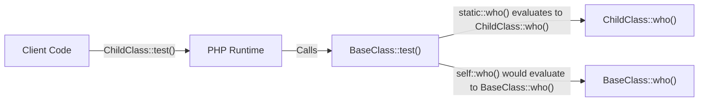

# PHP Late Static Binding

## Introduction

When working with object-oriented PHP, you'll eventually encounter situations where inheritance and static methods interact in ways that might surprise you. **Late Static Binding** was introduced in PHP 5.3 to solve a specific problem with static method inheritance - the inability to reference the class that was actually called at runtime.

In this tutorial, we'll explore what Late Static Binding is, why it's needed, and how to use it effectively in your PHP applications.

## Understanding the Problem

Before we dive into Late Static Binding, let's understand the problem it solves. Consider the following example:

```php
class BaseClass {
    public static function who() {
        echo __CLASS__;
    }
    
    public static function test() {
        self::who();
    }
}

class ChildClass extends BaseClass {
    public static function who() {
        echo __CLASS__;
    }
}

// Output: BaseClass
ChildClass::test();
```

Expected output:
```
BaseClass
```

Wait, that's not what we wanted! Even though we called `test()` on `ChildClass`, the output is `BaseClass`. Why?

The reason is that `self::` always refers to the class in which it is used - in this case, `BaseClass`. This means that `self::who()` will always call `BaseClass::who()`, regardless of which class is being used to call the method.

## Enter Late Static Binding

Late Static Binding was introduced to solve this exact problem. It allows us to reference the class that was initially called at runtime, rather than the class where the method is defined.

The key feature is the `static::` keyword, which provides this "late binding" functionality.

Let's modify our example:

```php
class BaseClass {
    public static function who() {
        echo __CLASS__;
    }
    
    public static function test() {
        static::who(); // Using static:: instead of self::
    }
}

class ChildClass extends BaseClass {
    public static function who() {
        echo __CLASS__;
    }
}

// Output: ChildClass
ChildClass::test();
```

Expected output:
```
ChildClass
```

Now we get the expected output! When we call `ChildClass::test()`, `static::who()` refers to `ChildClass::who()`, not `BaseClass::who()`.

## How Late Static Binding Works

To understand Late Static Binding better, let's look at how it works:

1. When you use `static::`, PHP doesn't resolve the class name at compile time.
2. Instead, it waits until runtime (hence "late binding") to determine which class should be used.
3. The resolution is based on the class that was initially called in the execution chain.

Let's visualize this with a diagram:



## Key Differences: `self::` vs `static::` vs `parent::`

Let's clarify the difference between these keywords:

- `self::` - Refers to the current class where the method is defined
- `static::` - Refers to the class that was called at runtime (Late Static Binding)
- `parent::` - Refers to the parent class

Here's an example showing all three in action:

```php
class GrandparentClass {
    public static function who() {
        echo "I am GrandparentClass";
    }
}

class ParentClass extends GrandparentClass {
    public static function who() {
        echo "I am ParentClass";
    }
    
    public static function test() {
        // Refers to ParentClass
        echo "self: ";
        self::who();
        
        echo "
parent: ";
        // Refers to GrandparentClass
        parent::who();
        
        echo "
static: ";
        // Refers to the class that called this method
        static::who();
    }
}

class ChildClass extends ParentClass {
    public static function who() {
        echo "I am ChildClass";
    }
}

// Call test() on ChildClass
ChildClass::test();
```

Expected output:
```
self: I am ParentClass
parent: I am GrandparentClass
static: I am ChildClass
```

## Practical Applications

### 1. Creating Flexible Factory Methods

Late Static Binding is commonly used in factory patterns to create instances of the calling class:

```php
class Model {
    protected static $tableName = 'base_table';
    
    public static function getTableName() {
        return static::$tableName;
    }
    
    public static function findAll() {
        $tableName = static::getTableName();
        echo "SELECT * FROM {$tableName}";
        // In a real application, this would query the database
    }
}

class User extends Model {
    protected static $tableName = 'users';
}

class Product extends Model {
    protected static $tableName = 'products';
}

User::findAll(); // Outputs: SELECT * FROM users
Product::findAll(); // Outputs: SELECT * FROM products
```

### 2. Implementing Chainable Static Methods

Late Static Binding enables chainable static methods that work with inheritance:

```php
class QueryBuilder {
    protected static $query = [];
    
    public static function select($fields) {
        static::$query['select'] = $fields;
        return new static();
    }
    
    public static function from($table) {
        static::$query['from'] = $table;
        return new static();
    }
    
    public static function where($condition) {
        static::$query['where'] = $condition;
        return new static();
    }
    
    public function execute() {
        $query = "SELECT " . static::$query['select'] . 
                 " FROM " . static::$query['from'];
                 
        if (isset(static::$query['where'])) {
            $query .= " WHERE " . static::$query['where'];
        }
        
        echo $query;
        static::$query = []; // Reset for the next query
    }
}

class UserQuery extends QueryBuilder {
    public static function getActiveUsers() {
        return static::select("*")->from("users")->where("status = 'active'");
    }
}

UserQuery::getActiveUsers()->execute();
// Outputs: SELECT * FROM users WHERE status = 'active'
```

## Limitations and Considerations

While Late Static Binding is powerful, it has some limitations:

1. **Only works with static contexts**: Late Static Binding only applies to static methods and properties.

2. **Cannot be used for dynamic properties**: It doesn't work with dynamic properties that aren't declared as static.

3. **May lead to unexpected behavior** if not used carefully in complex inheritance hierarchies.

Let's look at an example that demonstrates a limitation:

```php
class A {
    public static function who() {
        echo __CLASS__;
    }
    
    public function test() {
        // This won't work as expected in non-static context
        static::who();
    }
}

class B extends A {
    public static function who() {
        echo __CLASS__;
    }
}

$b = new B();
$b->test(); // Outputs: B (works)

$a = new A();
$a->test(); // Outputs: A (works)

// But what if we try to use it in a more complex way?
$test = [$b, 'test'];
$test(); // Still outputs: B (works)

// However, be careful with variable functions and method references
// as they might not always behave as expected
```

## Summary

Late Static Binding in PHP provides a way to reference the called class in the context of static inheritance. By using the `static::` keyword instead of `self::`, you can create more flexible and powerful class hierarchies that properly respect inheritance when using static methods and properties.

Key points to remember:

- `self::` always refers to the class in which it is used (early binding)
- `static::` refers to the class that was called at runtime (late binding)
- Use Late Static Binding for factory methods, chainable static methods, and other patterns where runtime class resolution is needed
- Be aware of the limitations, especially when mixing static and non-static contexts

## Exercises

To solidify your understanding, try these exercises:

1. Create a base `Logger` class with static methods that use Late Static Binding, and then extend it with specialized loggers like `FileLogger` and `DatabaseLogger`.

2. Implement a simple Active Record pattern using Late Static Binding for database operations.

3. Modify the QueryBuilder example to add more methods like `orderBy()`, `limit()`, and `join()`.

## Additional Resources

- [PHP Documentation on Late Static Binding](https://www.php.net/manual/en/language.oop5.late-static-bindings.php)
- [PHP Static Keyword Documentation](https://www.php.net/manual/en/language.oop5.static.php)
- [PHP OOP Inheritance Documentation](https://www.php.net/manual/en/language.oop5.inheritance.php)