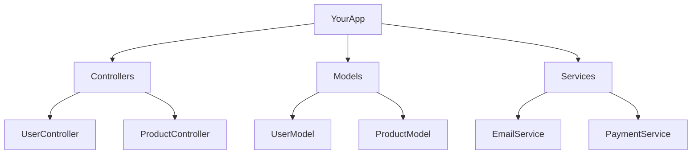

# PHP Namespaces

## Introduction

Have you ever worked on a large PHP project or used multiple libraries that happened to have functions or classes with the same names? If so, you've likely encountered naming conflicts. PHP namespaces solve this problem by providing a way to organize and group related classes, interfaces, functions, and constants.

Introduced in PHP 5.3, namespaces help you create a more organized codebase, avoid naming collisions, and make your code more maintainable. Think of namespaces as folders on your computer that help organize files - they work similarly for your PHP code!

## Understanding PHP Namespaces

### Why Use Namespaces?

Before namespaces were introduced, PHP developers faced several challenges:

1. **Name Conflicts**: Two classes couldn't share the same name in a single project
2. **Code Organization**: Organizing large projects was difficult
3. **Reusability**: Using multiple third-party libraries often led to naming conflicts

Namespaces solve these problems by creating separate "containers" for your code elements.

### Basic Namespace Syntax

To declare a namespace, you use the `namespace` keyword at the top of your PHP file:

```php
<?php
namespace MyProject;

class User {
    // Class code here
}
```

In this example, the `User` class belongs to the `MyProject` namespace. This means you can have another `User` class in a different namespace without conflicts.

## Creating and Using Namespaces

### Defining a Namespace

When creating a namespace, follow these rules:

1. The `namespace` declaration must be the first statement in the file (except for the `<?php` opening tag)
2. Only classes, functions, constants, and interfaces can be placed in a namespace
3. Namespace names are case-insensitive
4. Namespace names can contain alphanumeric characters and underscores

Let's create a simple example:

```php
<?php
namespace MyProject;

class User {
    public function __construct() {
        echo "User created in MyProject namespace";
    }
}

$user = new User(); // Creates an instance of MyProject\User
```

**Output:**
```
User created in MyProject namespace
```

### Nested Namespaces

You can create nested namespaces to further organize your code, similar to subfolders:

```php
<?php
namespace MyProject\UserManagement;

class User {
    public function __construct() {
        echo "User created in MyProject\\UserManagement namespace";
    }
}

$user = new User(); // Creates an instance of MyProject\UserManagement\User
```

**Output:**
```
User created in MyProject\UserManagement namespace
```

## Accessing Namespaced Elements

### Fully Qualified Names

When you want to use a class from a namespace, you can use its fully qualified name:

```php
<?php
namespace MyProject;

class User {
    public function sayHello() {
        echo "Hello from MyProject\\User";
    }
}

// In another file or later in the same file
$user = new \MyProject\User(); // Using fully qualified name with leading backslash
$user->sayHello();
```

**Output:**
```
Hello from MyProject\User
```

Note the leading backslash `\` in `\MyProject\User`. This indicates that we're using an absolute namespace path.

### Importing Namespaces with `use`

Having to write fully qualified names can become tedious. PHP provides the `use` keyword to import namespaces:

```php
<?php
// Imagine this is a different file
namespace App;

// Import the User class from MyProject namespace
use MyProject\User;

// Now we can use User directly
$user = new User();
$user->sayHello();
```

**Output:**
```
Hello from MyProject\User
```

### Aliasing with `as`

You can also create aliases for imported namespaces or classes:

```php
<?php
namespace App;

// Import with an alias
use MyProject\User as ProjectUser;

// Now we use the alias
$user = new ProjectUser();
$user->sayHello();
```

**Output:**
```
Hello from MyProject\User
```

This is especially useful when you need to use classes with the same name from different namespaces.

## Namespace Best Practices

Here are some best practices for using namespaces effectively:

### PSR-4 Autoloading Standard

The PHP community has developed a standard called PSR-4 for autoloading classes using namespaces. Following this standard makes your code more compatible with tools like Composer.

The basic idea is to map your namespace structure to your directory structure:

```
src/
  MyProject/
    UserManagement/
      User.php  // Contains namespace MyProject\UserManagement
    Database/
      Connection.php  // Contains namespace MyProject\Database
```

### Organizing Real-World Applications

Here's how you might organize a real-world application:



Each box would represent a namespace, creating a clean hierarchy:

```php
<?php
// src/Controllers/UserController.php
namespace YourApp\Controllers;

use YourApp\Models\UserModel;
use YourApp\Services\EmailService;

class UserController {
    public function register() {
        $user = new UserModel();
        $emailService = new EmailService();
        // Implementation here
    }
}
```

## Practical Examples

### Example 1: Working with Multiple Libraries

Let's say you're working with two different libraries that both have a `Logger` class:

```php
<?php
// First library
namespace LibraryOne;

class Logger {
    public function log($message) {
        echo "LibraryOne logging: $message<br>";
    }
}

// Second library
namespace LibraryTwo;

class Logger {
    public function log($message) {
        echo "LibraryTwo logging: $message<br>";
    }
}

// Using both in your code
namespace MyApplication;

use LibraryOne\Logger as Logger1;
use LibraryTwo\Logger as Logger2;

$logger1 = new Logger1();
$logger2 = new Logger2();

$logger1->log("Test message");
$logger2->log("Test message");
```

**Output:**
```
LibraryOne logging: Test message
LibraryTwo logging: Test message
```

Without namespaces, this would be impossible!

### Example 2: Creating a Simple Autoloader

Here's how you might implement a simple autoloader using namespaces:

```php
<?php
// Autoloader function
spl_autoload_register(function ($class) {
    // Convert namespace to file path
    $file = str_replace('\\', DIRECTORY_SEPARATOR, $class) . '.php';
    $file = 'src' . DIRECTORY_SEPARATOR . $file;
    
    if (file_exists($file)) {
        require $file;
        return true;
    }
    return false;
});

// Now we can use classes without manually including files
$user = new \MyProject\UserManagement\User();
```

This autoloader converts the namespace path into a file path, making it easy to organize and load your code.

## Global Namespace

When you don't specify any namespace, your code belongs to the global namespace. You can access elements from the global namespace using a leading backslash:

```php
<?php
namespace MyProject;

function strlen($str) {
    return "Custom strlen: " . \strlen($str); // Calls the global PHP strlen function
}

echo strlen("test"); // Calls our custom function
echo \strlen("test"); // Calls PHP's built-in strlen function
```

**Output:**
```
Custom strlen: 4
4
```

## Common Mistakes and Pitfalls

### Forgetting to Import Classes

One common mistake is forgetting to import classes with `use`:

```php
<?php
namespace App;

// Forgot to import User class
$user = new User(); // Error: Class 'App\User' not found

// Fix by adding: use MyProject\User;
// Or by using the fully qualified name: $user = new \MyProject\User();
```

### Namespace Declaration Placement

Remember that namespace declarations must be at the top of the file:

```php
<?php
// This will cause an error
echo "Hello";

namespace MyProject; // Error: Namespace declaration statement has to be the very first statement
```

## Summary

PHP namespaces provide a powerful way to organize your code, prevent naming conflicts, and improve the structure of your applications. By using namespaces effectively, you can:

- Avoid name collisions between classes, functions, and constants
- Organize your code in a logical hierarchy
- Use multiple libraries without worrying about conflicts
- Make your code more maintainable and professional

As your PHP projects grow in size and complexity, namespaces become increasingly important. They're a key aspect of modern PHP development and are essential for building large, maintainable applications.

## Additional Resources

To deepen your understanding of PHP namespaces, check out these resources:

1. [PHP Official Documentation on Namespaces](https://www.php.net/manual/en/language.namespaces.php)
2. [PSR-4 Autoloading Standard](https://www.php-fig.org/psr/psr-4/)
3. [Composer Dependency Manager](https://getcomposer.org/) (uses namespaces extensively)

## Exercises

1. Create a simple project with at least two namespaces and classes that interact with each other.
2. Try implementing a basic autoloader that works with your namespaced classes.
3. Take an existing non-namespaced project and refactor it to use namespaces.
4. Create a class that extends another class from a different namespace.