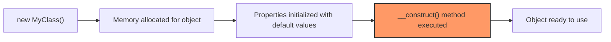

# PHP Constructors

## Introduction

When working with Object-Oriented Programming (OOP) in PHP, you'll often need to initialize objects with specific values when they're created. This is where **constructors** come into play. A constructor is a special method that automatically runs whenever you create a new instance of a class.

Think of a constructor as a welcome committee for your new objects - it's there to make sure everything is properly set up from the moment an object comes into existence.

## What Are Constructors?

A constructor in PHP is a special method with the name `__construct()` (with two underscores). This method is automatically called when you create a new object using the `new` keyword. Constructors allow you to:

1. Initialize properties of an object
2. Perform necessary setup tasks
3. Accept initial values for the object's properties
4. Ensure an object starts in a valid state

## Basic Constructor Syntax

Here's the basic syntax of a PHP constructor:

```php
class MyClass {
    // Properties
    private $property1;
    private $property2;
    
    // Constructor
    public function __construct($value1, $value2) {
        $this->property1 = $value1;
        $this->property2 = $value2;
    }
}

// Creating an object with the constructor
$object = new MyClass("Hello", 42);
```

## Simple Constructor Example

Let's look at a practical example with a `Person` class:

```php
<?php
class Person {
    // Properties
    private $name;
    private $age;
    
    // Constructor
    public function __construct($name, $age) {
        $this->name = $name;
        $this->age = $age;
    }
    
    // Method to display person information
    public function displayInfo() {
        echo "Name: " . $this->name . ", Age: " . $this->age;
    }
}

// Creating a Person object
$person1 = new Person("John Doe", 30);

// Display the person's information
$person1->displayInfo();
?>
```

**Output:**
```
Name: John Doe, Age: 30
```

In this example:
1. We define a `Person` class with two properties: `$name` and `$age`
2. The constructor accepts two parameters and assigns them to the properties
3. When we create a new `Person` object, we pass the name and age values to the constructor
4. The constructor sets up the initial state of our object

## Constructor Parameter Types

Just like regular methods, constructors can use type declarations for parameters:

```php
<?php
class Rectangle {
    private $width;
    private $height;
    
    // Constructor with type declarations
    public function __construct(float $width, float $height) {
        $this->width = $width;
        $this->height = $height;
    }
    
    public function getArea(): float {
        return $this->width * $this->height;
    }
}

// Creating a Rectangle object
$rect = new Rectangle(5.5, 3.0);
echo "Area: " . $rect->getArea();
?>
```

**Output:**
```
Area: 16.5
```

## Default Values in Constructors

You can provide default values for constructor parameters, making them optional:

```php
<?php
class Configuration {
    private $host;
    private $username;
    private $password;
    private $database;
    
    // Constructor with default values
    public function __construct(
        string $host = "localhost",
        string $username = "root",
        string $password = "",
        string $database = "my_app"
    ) {
        $this->host = $host;
        $this->username = $username;
        $this->password = $password;
        $this->database = $database;
    }
    
    public function getConnectionString() {
        return "Host: {$this->host}, Database: {$this->database}, User: {$this->username}";
    }
}

// Using default values
$defaultConfig = new Configuration();
echo "Default configuration: " . $defaultConfig->getConnectionString();

echo "

";

// Overriding some default values
$customConfig = new Configuration("db.example.com", "admin", "secure123");
echo "Custom configuration: " . $customConfig->getConnectionString();
?>
```

**Output:**
```
Default configuration: Host: localhost, Database: my_app, User: root

Custom configuration: Host: db.example.com, Database: my_app, User: admin
```

## Constructor Property Promotion (PHP 8.0+)

With PHP 8.0 and above, you can use constructor property promotion to declare and initialize properties in one step:

```php
<?php
// PHP 8.0+ example
class User {
    // Constructor property promotion
    public function __construct(
        private string $username,
        private string $email,
        private int $loginCount = 0
    ) {}
    
    public function getProfile() {
        return "Username: {$this->username}, Email: {$this->email}, Logins: {$this->loginCount}";
    }
}

$user = new User("johndoe", "john@example.com");
echo $user->getProfile();
?>
```

**Output:**
```
Username: johndoe, Email: john@example.com, Logins: 0
```

This feature reduces boilerplate code by combining property declarations with constructor parameters.

## Constructor Inheritance

When a class extends another class, it's important to understand how constructors behave:

```php
<?php
class Vehicle {
    protected $brand;
    
    public function __construct($brand) {
        $this->brand = $brand;
        echo "Vehicle constructor called
";
    }
}

class Car extends Vehicle {
    private $model;
    
    public function __construct($brand, $model) {
        // Call parent constructor
        parent::__construct($brand);
        
        $this->model = $model;
        echo "Car constructor called
";
    }
    
    public function getInfo() {
        return "{$this->brand} {$this->model}";
    }
}

$car = new Car("Toyota", "Corolla");
echo "Car: " . $car->getInfo();
?>
```

**Output:**
```
Vehicle constructor called
Car constructor called
Car: Toyota Corolla
```

Key points about constructor inheritance:

1. Child class constructors don't automatically call the parent constructor
2. You need to explicitly call `parent::__construct()` if you want to run the parent constructor
3. It's generally good practice to call the parent constructor when overriding it

## Constructor Lifecycle

Let's understand when and how constructors work using a visual representation:



## Real-World Example: Database Connection Class

Let's look at a practical example of using constructors for a database connection class:

```php
<?php
class DatabaseConnection {
    private $connection;
    private $host;
    private $username;
    private $password;
    private $database;
    private $port;
    
    public function __construct(
        string $host,
        string $username,
        string $password,
        string $database,
        int $port = 3306
    ) {
        $this->host = $host;
        $this->username = $username;
        $this->password = $password;
        $this->database = $database;
        $this->port = $port;
        
        // Connect to database when object is created
        $this->connect();
    }
    
    private function connect() {
        // In a real application, this would use mysqli or PDO
        $this->connection = "Connected to MySQL at {$this->host}:{$this->port}, database: {$this->database}";
        
        // For demonstration purposes
        echo "Database connection established
";
    }
    
    public function getConnection() {
        return $this->connection;
    }
    
    // Clean up when object is destroyed
    public function __destruct() {
        // Close connection when object is no longer needed
        echo "Database connection closed
";
    }
}

// Create a database connection
$db = new DatabaseConnection(
    "localhost",
    "app_user",
    "secret_password",
    "my_application"
);

echo $db->getConnection() . "
";

// When $db goes out of scope, the __destruct method will be called
?>
```

**Output:**
```
Database connection established
Connected to MySQL at localhost:3306, database: my_application
Database connection closed
```

This example shows how:
1. The constructor initializes all necessary properties
2. It performs setup actions (connecting to the database)
3. It ensures the object is ready to use immediately after creation

## Common Constructor Patterns

### Dependency Injection

Constructors are often used for dependency injection - a pattern where a class receives its dependencies rather than creating them:

```php
<?php
interface Logger {
    public function log($message);
}

class FileLogger implements Logger {
    public function log($message) {
        echo "Writing to log file: $message
";
    }
}

class UserService {
    private $logger;
    
    // The Logger dependency is injected through the constructor
    public function __construct(Logger $logger) {
        $this->logger = $logger;
    }
    
    public function createUser($username) {
        // Business logic
        $this->logger->log("User created: $username");
    }
}

// Create the dependencies
$logger = new FileLogger();

// Inject the dependencies through the constructor
$userService = new UserService($logger);

// Use the service
$userService->createUser("john_doe");
?>
```

**Output:**
```
Writing to log file: User created: john_doe
```

### Factory Method Pattern

Sometimes, you might want to have multiple ways to create an object. A common pattern is to combine constructors with static factory methods:

```php
<?php
class Product {
    private $id;
    private $name;
    private $price;
    
    // Private constructor prevents direct instantiation
    private function __construct($id, $name, $price) {
        $this->id = $id;
        $this->name = $name;
        $this->price = $price;
    }
    
    // Factory method for creating a basic product
    public static function createBasic($name, $price) {
        return new self(uniqid(), $name, $price);
    }
    
    // Factory method for creating from database record
    public static function createFromDatabase($id, $name, $price) {
        return new self($id, $name, $price);
    }
    
    public function getDetails() {
        return "Product #{$this->id}: {$this->name}, Price: \${$this->price}";
    }
}

// Using factory methods instead of constructor directly
$basicProduct = Product::createBasic("Simple Widget", 19.99);
echo $basicProduct->getDetails() . "
";

$dbProduct = Product::createFromDatabase("DB-1001", "Database Widget", 29.99);
echo $dbProduct->getDetails();
?>
```

**Output:**
```
Product #6420e7a09c1b9: Simple Widget, Price: $19.99
Product #DB-1001: Database Widget, Price: $29.99
```

## Best Practices

When working with constructors in PHP, follow these best practices:

1. **Keep constructors focused**: A constructor should only initialize the object. Avoid complex logic or operations that might fail.

2. **Use parameter type declarations**: Specify the expected types for constructor parameters to catch errors early.

3. **Provide sensible defaults**: When appropriate, give default values to make your classes easier to use.

4. **Call parent constructors**: When extending a class, call the parent constructor if needed.

5. **Use dependency injection**: Pass dependencies through the constructor rather than creating them inside.

6. **Validate input**: Check that the provided values make sense before using them.

7. **Consider constructor overloading alternatives**: PHP doesn't support true constructor overloading, but you can use factory methods or optional parameters instead.

## Summary

PHP constructors are a fundamental part of object-oriented programming that allow you to:

- Initialize object properties when creating new instances
- Ensure objects start in a valid state
- Accept initial configuration parameters
- Set up resources needed by the object

Understanding constructors is essential for writing clean, maintainable object-oriented PHP code. They provide a clear entry point for object initialization and help encapsulate the setup logic required for your classes.

## Exercises

1. Create a `BankAccount` class with a constructor that accepts an account holder name and an initial balance.

2. Build a `ShoppingCart` class with a constructor that initializes an empty items array and accepts a tax rate parameter.

3. Implement a `Logger` class hierarchy with different logger types (File, Database, Email) and use constructor inheritance.

4. Design a `Configuration` class that reads settings from a file in its constructor and provides methods to access those settings.

5. Create a class with PHP 8's constructor property promotion and compare it with the traditional approach.

## Additional Resources

- [PHP Constructor Documentation](https://www.php.net/manual/en/language.oop5.decon.php)
- [PHP 8 Constructor Property Promotion](https://www.php.net/manual/en/language.oop5.decon.php#language.oop5.decon.constructor.promotion)
- [PHP Object-Oriented Programming](https://www.php.net/manual/en/language.oop5.php)