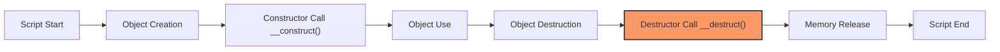

# PHP Destructors

## Introduction

In PHP Object-Oriented Programming, a **destructor** is a special method that gets called automatically when an object is destroyed or goes out of scope. Destructors provide a way to perform cleanup tasks before an object is removed from memory, such as closing database connections, file handles, or freeing resources.

Unlike constructors which initialize objects, destructors handle the final actions when an object's lifecycle ends. Understanding destructors is essential for proper resource management and preventing memory leaks in your PHP applications.

## Syntax and Basic Usage

In PHP, a destructor is defined using the magic method `__destruct()`. This method doesn't accept any parameters and is called automatically without any explicit invocation when an object is no longer needed.

```php
class MyClass {
    // Constructor
    public function __construct() {
        echo "Object created.
";
    }
    
    // Destructor
    public function __destruct() {
        echo "Object destroyed.
";
    }
}

// Create a new object
$obj = new MyClass();  // Outputs: Object created.

// When the script ends or when $obj is unset, the destructor is called
unset($obj);  // Outputs: Object destroyed.
```

## When Are Destructors Called?

Destructors are called automatically in the following situations:

1. When the script ends and all objects are cleaned up
2. When the object variable is explicitly set to `null` or unset using `unset()`
3. When an object goes out of scope (e.g., a function ends and the object was created inside it)
4. When all references to the object are removed

Let's see a practical example demonstrating when destructors are called:

```php
class TestDestructor {
    private $name;
    
    public function __construct($name) {
        $this->name = $name;
        echo "{$this->name} created.
";
    }
    
    public function __destruct() {
        echo "{$this->name} destroyed.
";
    }
}

// Example 1: Object goes out of scope
function createTemporaryObject() {
    $temp = new TestDestructor("Temporary Object");
    // Function ends, object goes out of scope
}

// Example 2: Explicit unset
$obj1 = new TestDestructor("Object 1");
unset($obj1);

// Example 3: Setting to null
$obj2 = new TestDestructor("Object 2");
$obj2 = null;

// Example 4: Script end
$obj3 = new TestDestructor("Object 3");

createTemporaryObject();

// Output:
// Object 1 created.
// Object 1 destroyed.
// Object 2 created.
// Object 2 destroyed.
// Object 3 created.
// Temporary Object created.
// Temporary Object destroyed.
// Object 3 destroyed. (when script ends)
```

## Practical Applications of Destructors

### 1. Resource Cleanup

One of the most common uses of destructors is cleaning up resources that the object has acquired during its lifetime:

```php
class DatabaseConnection {
    private $connection;
    
    public function __construct($host, $username, $password, $database) {
        // Open a database connection
        $this->connection = mysqli_connect($host, $username, $password, $database);
        
        if (!$this->connection) {
            die("Connection failed: " . mysqli_connect_error());
        }
        
        echo "Database connection established.
";
    }
    
    public function query($sql) {
        // Execute query
        return mysqli_query($this->connection, $sql);
    }
    
    public function __destruct() {
        // Close the database connection when the object is destroyed
        if ($this->connection) {
            mysqli_close($this->connection);
            echo "Database connection closed.
";
        }
    }
}

// Usage
function getData() {
    $db = new DatabaseConnection("localhost", "username", "password", "database");
    $result = $db->query("SELECT * FROM users");
    // Process result...
    
    // When function ends, $db is destroyed and connection is closed automatically
}

getData();
// Output:
// Database connection established.
// Database connection closed.
```

### 2. File Handling

Destructors are useful for ensuring files are properly closed:

```php
class FileHandler {
    private $fileHandle;
    private $filename;
    
    public function __construct($filename, $mode = 'r') {
        $this->filename = $filename;
        $this->fileHandle = fopen($filename, $mode);
        
        if (!$this->fileHandle) {
            throw new Exception("Cannot open file: $filename");
        }
        
        echo "File {$filename} opened successfully.
";
    }
    
    public function readLine() {
        return fgets($this->fileHandle);
    }
    
    public function writeLine($text) {
        return fwrite($this->fileHandle, $text . PHP_EOL);
    }
    
    public function __destruct() {
        if ($this->fileHandle) {
            fclose($this->fileHandle);
            echo "File {$this->filename} closed.
";
        }
    }
}

// Usage example
try {
    $log = new FileHandler('app.log', 'a');
    $log->writeLine('Application started: ' . date('Y-m-d H:i:s'));
    // No need to explicitly close the file
} catch (Exception $e) {
    echo $e->getMessage();
}
// Output:
// File app.log opened successfully.
// File app.log closed.
```

### 3. Temporary Data Cleanup

Destructors can be used to clean up temporary files or data:

```php
class TempFileManager {
    private $tempFiles = [];
    
    public function createTempFile($content = '') {
        $filename = sys_get_temp_dir() . '/php_temp_' . uniqid();
        file_put_contents($filename, $content);
        $this->tempFiles[] = $filename;
        
        echo "Temporary file created: $filename
";
        return $filename;
    }
    
    public function __destruct() {
        foreach ($this->tempFiles as $file) {
            if (file_exists($file)) {
                unlink($file);
                echo "Temporary file removed: $file
";
            }
        }
    }
}

// Usage
$manager = new TempFileManager();
$file1 = $manager->createTempFile("Test content 1");
$file2 = $manager->createTempFile("Test content 2");

// Do something with the temporary files...

// At the end of the script, all temporary files are automatically deleted
```

## Object Lifecycle Visualization

Here's a diagram showing where destructors fit in the PHP object lifecycle:



## Best Practices and Common Pitfalls

### Best Practices

1. **Use destructors for resource cleanup only**: Destructors should primarily be used for cleaning up resources like file handles, database connections, and memory allocations.

2. **Keep destructors simple**: Avoid complex logic in destructors. They should focus on cleanup operations.

3. **Don't rely on destructors for critical operations**: Since PHP's garbage collection timing isn't guaranteed, don't rely on destructors for time-sensitive or critical operations.

4. **Handle exceptions in destructors**: Exceptions thrown in destructors can lead to fatal errors. Always use try-catch blocks in destructors.

```php
public function __destruct() {
    try {
        // Cleanup code that might throw exceptions
    } catch (Exception $e) {
        // Handle exception or log error
        error_log("Destructor error: " . $e->getMessage());
    }
}
```

### Common Pitfalls

1. **Circular References**:

```php
class A {
    public $b;
    
    public function __destruct() {
        echo "Class A destructor called.
";
    }
}

class B {
    public $a;
    
    public function __destruct() {
        echo "Class B destructor called.
";
    }
}

$a = new A();
$b = new B();

// Create circular reference
$a->b = $b;
$b->a = $a;

// Remove original references
unset($a);
unset($b);

// Prior to PHP 7.4, this could prevent destructors from being called
// as circular references were not properly handled by the garbage collector
```

2. **Relying on Destructor Order**:

The order in which destructors are called for multiple objects isn't guaranteed. Don't write code that depends on a specific order of destructor calls.

## Parent and Child Destructors

When working with inheritance, it's important to understand how destructors work in parent and child classes:

```php
class Parent_Class {
    public function __construct() {
        echo "Parent constructor called.
";
    }
    
    public function __destruct() {
        echo "Parent destructor called.
";
    }
}

class Child_Class extends Parent_Class {
    public function __construct() {
        parent::__construct();
        echo "Child constructor called.
";
    }
    
    public function __destruct() {
        echo "Child destructor called.
";
        parent::__destruct();
    }
}

$obj = new Child_Class();
unset($obj);

// Output:
// Parent constructor called.
// Child constructor called.
// Child destructor called.
// Parent destructor called.
```

Unlike constructors, parent destructors are not automatically called when a child destructor executes. If you want the parent destructor to be called, you must explicitly call it using `parent::__destruct()`.

## Summary

PHP destructors are special methods that allow you to perform cleanup operations when an object is destroyed. They play a crucial role in resource management and preventing memory leaks.

Key points to remember:
- Destructors are defined using the `__destruct()` magic method
- They are called automatically when an object is destroyed or goes out of scope
- Destructors are commonly used for resource cleanup, such as closing file handles and database connections
- Parent destructors must be explicitly called in child classes using `parent::__destruct()`
- Destructors should be kept simple and focused on cleanup operations

## Exercises

1. Create a class called `Logger` that opens a log file in the constructor and closes it in the destructor. The class should have a `log()` method to write messages to the log file.

2. Extend the `DatabaseConnection` class shown earlier to include a connection pool system. Make sure the destructor returns connections to the pool rather than closing them.

3. Create a class hierarchy with at least three levels. Implement destructors at each level and observe the order in which they are called.

## Additional Resources

- [PHP Official Documentation on Destructors](https://www.php.net/manual/en/language.oop5.decon.php)
- [PHP Garbage Collection](https://www.php.net/manual/en/features.gc.php)
- [PHP Object Lifecycles](https://www.php.net/manual/en/language.oop5.decon.php)