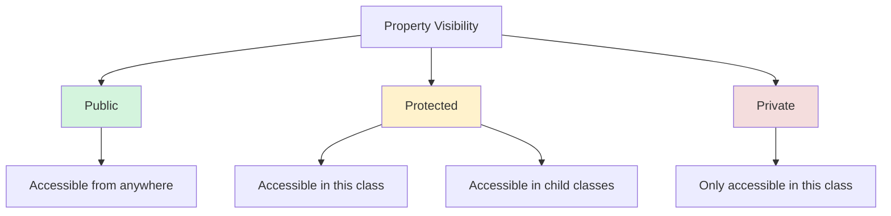

# PHP Properties

## Introduction

Properties are variables that belong to a class. They represent the characteristics or attributes that objects of that class will have. In object-oriented programming, properties define the state of an object, while methods define its behavior.

In this tutorial, we'll explore how to define and use properties in PHP classes, understand different visibility modifiers, and learn best practices for implementing properties in your PHP applications.

## Basic Property Definition

In PHP, properties are defined inside a class using visibility modifiers (public, protected, or private) followed by the variable name. Let's start with a simple example:

```php
<?php
class Person {
    public $name;
    public $age;
}

$person = new Person();
$person->name = "John";
$person->age = 25;

echo "Name: " . $person->name . "
";
echo "Age: " . $person->age . "
";
?>
```

**Output:**
```
Name: John
Age: 25
```

In this example, we defined a `Person` class with two properties: `$name` and `$age`. After creating a `Person` object, we set values for these properties and then accessed them using the object operator (`->`).

## Property Visibility Modifiers

PHP supports three visibility modifiers for properties:

1. **public** - Properties can be accessed from anywhere
2. **protected** - Properties can be accessed only within the class and its child classes
3. **private** - Properties can be accessed only within the class itself

Here's an example demonstrating all three visibility types:

```php
<?php
class User {
    public $username;       // Accessible from anywhere
    protected $email;       // Accessible within this class and child classes
    private $password;      // Accessible only within this class
    
    public function __construct($username, $email, $password) {
        $this->username = $username;
        $this->email = $email;
        $this->password = $password;
    }
    
    public function getEmail() {
        return $this->email;
    }
    
    public function getPasswordLength() {
        return strlen($this->password);
    }
}

$user = new User("john_doe", "john@example.com", "secret123");

// Public property can be accessed directly
echo "Username: " . $user->username . "
";

// Protected and private properties need accessor methods
echo "Email: " . $user->getEmail() . "
";
echo "Password Length: " . $user->getPasswordLength() . "
";

// This would cause an error - cannot access protected property
// echo $user->email;

// This would also cause an error - cannot access private property
// echo $user->password;
?>
```

**Output:**
```
Username: john_doe
Email: john@example.com
Password Length: 9
```

This visibility control helps in implementing encapsulation, one of the fundamental principles of object-oriented programming.

## Property Initialization

Properties can be initialized with default values when they're declared:

```php
<?php
class Counter {
    public $count = 0;
    public $name = "Default Counter";
    public $isActive = true;
}

$counter = new Counter();
echo "Initial count: " . $counter->count . "
";
echo "Counter name: " . $counter->name . "
";
echo "Is active: " . ($counter->isActive ? "Yes" : "No") . "
";
?>
```

**Output:**
```
Initial count: 0
Counter name: Default Counter
Is active: Yes
```

## Property Types (PHP 7.4+)

Starting from PHP 7.4, you can declare the type of a property. This helps ensure that only values of the specified type can be assigned to the property:

```php
<?php
class Product {
    public string $name;
    public float $price;
    public int $quantity;
    public bool $available;
    
    public function __construct(string $name, float $price, int $quantity, bool $available) {
        $this->name = $name;
        $this->price = $price;
        $this->quantity = $quantity;
        $this->available = $available;
    }
    
    public function getTotal(): float {
        return $this->price * $this->quantity;
    }
}

$product = new Product("Laptop", 999.99, 2, true);
echo "Product: " . $product->name . "
";
echo "Price: $" . $product->price . "
";
echo "Quantity: " . $product->quantity . "
";
echo "Available: " . ($product->available ? "Yes" : "No") . "
";
echo "Total: $" . $product->getTotal() . "
";

// This would cause a type error
// $product->price = "thousand";
?>
```

**Output:**
```
Product: Laptop
Price: $999.99
Quantity: 2
Available: Yes
Total: $1999.98
```

## Nullable Properties (PHP 7.4+)

You can define nullable properties using the `?` symbol before the type:

```php
<?php
class Customer {
    public string $name;
    public ?string $email;  // Can be a string or null
    
    public function __construct(string $name, ?string $email = null) {
        $this->name = $name;
        $this->email = $email;
    }
}

$customer1 = new Customer("Alice", "alice@example.com");
$customer2 = new Customer("Bob");  // No email provided, will be null

echo "Customer 1: " . $customer1->name . ", Email: " . ($customer1->email ?? "Not provided") . "
";
echo "Customer 2: " . $customer2->name . ", Email: " . ($customer2->email ?? "Not provided") . "
";
?>
```

**Output:**
```
Customer 1: Alice, Email: alice@example.com
Customer 2: Bob, Email: Not provided
```

## Static Properties

Static properties belong to the class itself rather than to objects of the class. They are shared among all instances of the class:

```php
<?php
class Configuration {
    public static $appName = "My PHP Application";
    public static $version = "1.0.0";
    public static $dbConnection = null;
    
    public static function getFullAppName() {
        return self::$appName . " v" . self::$version;
    }
}

// Accessing static properties without creating an object
echo "App: " . Configuration::$appName . "
";
echo "Version: " . Configuration::$version . "
";
echo "Full name: " . Configuration::getFullAppName() . "
";

// Changing a static property
Configuration::$version = "1.0.1";
echo "Updated full name: " . Configuration::getFullAppName() . "
";
?>
```

**Output:**
```
App: My PHP Application
Version: 1.0.0
Full name: My PHP Application v1.0.0
Updated full name: My PHP Application v1.0.1
```

Note that static properties are accessed using the scope resolution operator (`::`) rather than the object operator (`->`).

## Property Visibility Diagram

Here's a diagram showing the accessibility of properties with different visibility modifiers:



## Real-World Example: Blog Post Class

Let's create a more practical example of a `BlogPost` class that makes good use of properties:

```php
<?php
class BlogPost {
    private int $id;
    private string $title;
    private string $content;
    private ?string $summary;
    private array $tags;
    private string $author;
    private DateTime $publishDate;
    private bool $published = false;
    private static int $totalPosts = 0;
    
    public function __construct(
        string $title, 
        string $content, 
        string $author, 
        ?array $tags = []
    ) {
        $this->id = ++self::$totalPosts;
        $this->title = $title;
        $this->content = $content;
        $this->author = $author;
        $this->tags = $tags;
        $this->publishDate = new DateTime();
        $this->summary = null;
    }
    
    // Getters
    public function getId(): int {
        return $this->id;
    }
    
    public function getTitle(): string {
        return $this->title;
    }
    
    public function getContent(): string {
        return $this->content;
    }
    
    public function getSummary(): ?string {
        if ($this->summary === null) {
            // Auto-generate summary if not set
            return substr($this->content, 0, 150) . '...';
        }
        return $this->summary;
    }
    
    public function getAuthor(): string {
        return $this->author;
    }
    
    public function getTags(): array {
        return $this->tags;
    }
    
    public function getPublishDate(): DateTime {
        return $this->publishDate;
    }
    
    public function isPublished(): bool {
        return $this->published;
    }
    
    // Setters
    public function setTitle(string $title): void {
        $this->title = $title;
    }
    
    public function setContent(string $content): void {
        $this->content = $content;
        // Reset summary when content changes
        $this->summary = null;
    }
    
    public function setSummary(string $summary): void {
        $this->summary = $summary;
    }
    
    public function addTag(string $tag): void {
        if (!in_array($tag, $this->tags)) {
            $this->tags[] = $tag;
        }
    }
    
    public function removeTags(): void {
        $this->tags = [];
    }
    
    public function publish(): void {
        $this->published = true;
        $this->publishDate = new DateTime();
    }
    
    public function unpublish(): void {
        $this->published = false;
    }
    
    // Static method to get total post count
    public static function getTotalPosts(): int {
        return self::$totalPosts;
    }
    
    // Method to get formatted post info
    public function getFormattedInfo(): string {
        $status = $this->published ? 'Published' : 'Draft';
        $date = $this->publishDate->format('Y-m-d H:i:s');
        $tagList = empty($this->tags) ? 'None' : implode(', ', $this->tags);
        
        return "Post #{$this->id}: {$this->title} by {$this->author}
" .
               "Status: {$status} on {$date}
" .
               "
" .
               "Summary: {$this->getSummary()}
";
    }
}

// Usage example
$post1 = new BlogPost(
    "Getting Started with PHP OOP",
    "Object-oriented programming (OOP) is a programming paradigm based on the concept of objects, " .
    "which can contain data and code: data in the form of fields (often known as attributes or properties), " .
    "and code, in the form of procedures (often known as methods).",
    "Jane Doe",
    ["PHP", "OOP", "Programming"]
);

$post2 = new BlogPost(
    "PHP Properties Explained",
    "Properties are an essential part of PHP classes that store the state of objects. " .
    "Learning how to use them effectively will improve your OOP skills.",
    "John Smith"
);

$post1->publish();
$post2->addTag("PHP");
$post2->addTag("Properties");

echo $post1->getFormattedInfo();
echo "
";
echo $post2->getFormattedInfo();
echo "
";
echo "Total posts created: " . BlogPost::getTotalPosts() . "
";
?>
```

**Output:**
```
Post #1: Getting Started with PHP OOP by Jane Doe
Status: Published on 2023-07-10 15:30:45

Summary: Object-oriented programming (OOP) is a programming paradigm based on the concept of objects, which can contain data and code: data in the form of fields (often known as attrib...

Post #2: PHP Properties Explained by John Smith
Status: Draft on 2023-07-10 15:30:45

Summary: Properties are an essential part of PHP classes that store the state of objects. Learning how to use them effectively will improve your OOP skills....

Total posts created: 2
```

This example demonstrates a comprehensive use of properties in a real-world scenario, including:
- Private properties with public accessor methods (encapsulation)
- Type declarations for properties
- Default property values
- Nullable properties
- Static properties
- Property manipulation through methods

## Best Practices for PHP Properties

1. **Use appropriate visibility**: Make properties private or protected unless there's a good reason to make them public.

2. **Provide accessor methods**: Use getters and setters to control access to private properties.

3. **Use type declarations**: Specify the expected type for each property to prevent type-related errors.

4. **Initialize properties**: Set default values for properties to avoid undefined property notices.

5. **Document your properties**: Use PHPDoc comments to document your properties:

```php
class Example {
    /**
     * The maximum number of attempts allowed
     * 
     * @var int
     */
    private int $maxAttempts = 3;
}
```

6. **Consider property promotion** (PHP 8.0+): Use constructor property promotion for cleaner code:

```php
class Point {
    // Properties are automatically created from constructor parameters
    public function __construct(
        public float $x = 0.0,
        public float $y = 0.0,
        public float $z = 0.0,
    ) {}
}

$point = new Point(10.5, 20.3);
echo "X: {$point->x}, Y: {$point->y}, Z: {$point->z}";
// Output: X: 10.5, Y: 20.3, Z: 0
```

7. **Use readonly properties** (PHP 8.1+): For properties that shouldn't change after initialization:

```php
class User {
    public function __construct(
        public readonly string $id,
        public string $name
    ) {}
}

$user = new User("12345", "Alice");
echo $user->id;  // Works fine
// $user->id = "54321";  // Would cause an error
```

## Summary

Properties are fundamental building blocks in PHP object-oriented programming that allow you to define the state of your objects. In this tutorial, we've covered:

- Basic property definition and access
- Property visibility modifiers (public, protected, private)
- Property initialization with default values
- Type declarations for properties
- Nullable properties
- Static properties
- Real-world application of properties
- Best practices for using properties

Understanding how to properly use properties is essential for writing clean, maintainable, and robust PHP applications.

## Additional Resources

- [PHP Manual: Properties](https://www.php.net/manual/en/language.oop5.properties.php)
- [PHP Manual: Type Declarations](https://www.php.net/manual/en/language.types.declarations.php)
- [PHP Manual: Visibility](https://www.php.net/manual/en/language.oop5.visibility.php)

## Exercises

1. Create a `BankAccount` class with properties for account number, balance, and owner. Include methods to deposit and withdraw money.

2. Modify the `BlogPost` class from our example to include a property for comments, with methods to add and display comments.

3. Create a `Shape` class with properties for color and position. Then create subclasses for `Circle`, `Rectangle`, and `Triangle` with additional specific properties.

4. Create a class that uses static properties to track and limit the number of instances that can be created.

5. Create a class that uses readonly properties (PHP 8.1+) or properties that shouldn't change after initialization using private properties and getters (for earlier PHP versions).