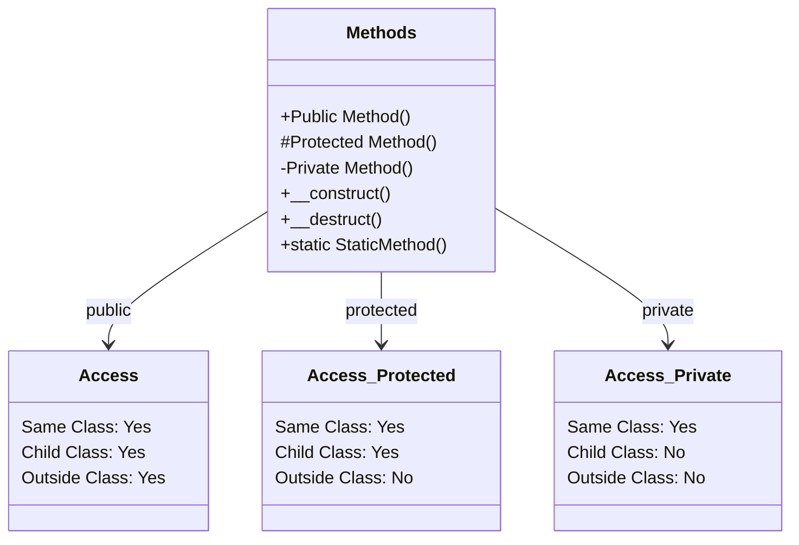

# PHP Methods

## Introduction

Methods are one of the fundamental building blocks of Object-Oriented Programming (OOP) in PHP. Simply put, methods are functions that belong to a class and define the behaviors of objects created from that class. They represent what objects can do, as opposed to properties, which represent what objects are.

In this tutorial, we'll explore PHP methods in depth, covering how to define them, access them, and use them effectively in your PHP applications. Whether you're just starting with OOP or looking to strengthen your understanding, this guide will provide you with the knowledge you need.

## What Are PHP Methods?

Methods in PHP are similar to functions, but they are defined within a class and typically operate on the data (properties) of that class. They encapsulate specific behaviors and operations that objects of the class can perform.

Here's a simple example to illustrate the concept:

```php
<?php
class Car {
    // Properties
    public $brand;
    public $color;
    
    // Method
    public function displayInfo() {
        return "This is a $this->color $this->brand car.";
    }
}

// Create an object
$myCar = new Car();
$myCar->brand = "Toyota";
$myCar->color = "blue";

// Call the method
echo $myCar->displayInfo();
// Output: This is a blue Toyota car.
?>
```

In this example, `displayInfo()` is a method of the `Car` class that displays information about a car object.

## Defining Methods in PHP

Methods are defined within class declarations using the same syntax as functions, but with access modifiers to control their visibility.

### Basic Method Syntax

```php
<?php
class ClassName {
    // Method declaration
    access_modifier function methodName(parameters) {
        // Method body
        // Code to be executed
    }
}
?>
```

### Access Modifiers

PHP provides three access modifiers for methods:

1. **public** - The method can be accessed from anywhere
2. **protected** - The method can be accessed only within the class itself and its child classes
3. **private** - The method can be accessed only within the class itself

Here's an example demonstrating all three:

```php
<?php
class User {
    private $name;
    private $email;
    
    public function setName($name) {
        $this->name = $this->sanitizeName($name);
    }
    
    protected function getEmailDomain() {
        $parts = explode('@', $this->email);
        return isset($parts[1]) ? $parts[1] : '';
    }
    
    private function sanitizeName($name) {
        return trim(htmlspecialchars($name));
    }
}
?>
```

In this example:
- `setName()` is a public method accessible from anywhere
- `getEmailDomain()` is a protected method accessible only within `User` and its child classes
- `sanitizeName()` is a private method accessible only within the `User` class

## The `$this` Keyword

Within a method, the `$this` keyword refers to the current object instance. It's used to access properties and other methods of the same class.

```php
<?php
class BankAccount {
    private $balance = 0;
    
    public function deposit($amount) {
        if ($amount > 0) {
            $this->balance += $amount;
            return true;
        }
        return false;
    }
    
    public function withdraw($amount) {
        if ($amount > 0 && $this->balance >= $amount) {
            $this->balance -= $amount;
            return true;
        }
        return false;
    }
    
    public function getBalance() {
        return $this->balance;
    }
}

// Usage
$account = new BankAccount();
$account->deposit(1000);
echo "Balance: $" . $account->getBalance() . "
"; // Output: Balance: $1000
$account->withdraw(250);
echo "Balance: $" . $account->getBalance(); // Output: Balance: $750
?>
```

## Types of Methods

### Constructor Method

The constructor is a special method that is automatically called when an object is created. In PHP, it's defined using the `__construct()` method.

```php
<?php
class Product {
    private $name;
    private $price;
    
    // Constructor
    public function __construct($name, $price) {
        $this->name = $name;
        $this->price = $price;
    }
    
    public function getInfo() {
        return "$this->name costs \$$this->price";
    }
}

// The constructor is called when we create an object
$laptop = new Product("Laptop", 999.99);
echo $laptop->getInfo(); // Output: Laptop costs $999.99
?>
```

### Destructor Method

The destructor is called when an object is no longer referenced or when the script terminates. It's defined using the `__destruct()` method.

```php
<?php
class FileHandler {
    private $file;
    private $handle;
    
    public function __construct($file) {
        $this->file = $file;
        $this->handle = fopen($file, 'w');
        echo "File opened successfully.
";
    }
    
    public function write($content) {
        fwrite($this->handle, $content);
    }
    
    public function __destruct() {
        fclose($this->handle);
        echo "File closed successfully.";
    }
}

// Usage
$handler = new FileHandler("test.txt");
$handler->write("Hello, World!");
// When the script ends, the destructor will automatically close the file
?>
```

### Static Methods

Static methods belong to the class itself rather than to instances of the class. They are called directly on the class, without creating an object.

```php
<?php
class MathUtils {
    public static function add($a, $b) {
        return $a + $b;
    }
    
    public static function subtract($a, $b) {
        return $a - $b;
    }
}

// Calling static methods without creating an object
echo MathUtils::add(5, 3) . "
";      // Output: 8
echo MathUtils::subtract(10, 4);       // Output: 6
?>
```

To call a static method, use the class name followed by the scope resolution operator (`::`) and the method name.

## Method Chaining

Method chaining is a technique that allows you to call multiple methods in sequence on the same object. To enable method chaining, each method should return the object instance (`$this`).

```php
<?php
class QueryBuilder {
    private $table;
    private $where = [];
    private $orderBy;
    
    public function table($table) {
        $this->table = $table;
        return $this;
    }
    
    public function where($column, $value) {
        $this->where[] = "$column = '$value'";
        return $this;
    }
    
    public function orderBy($column, $direction = 'ASC') {
        $this->orderBy = "$column $direction";
        return $this;
    }
    
    public function get() {
        $query = "SELECT * FROM $this->table";
        
        if (!empty($this->where)) {
            $query .= " WHERE " . implode(' AND ', $this->where);
        }
        
        if ($this->orderBy) {
            $query .= " ORDER BY $this->orderBy";
        }
        
        return $query;
    }
}

// Using method chaining
$query = (new QueryBuilder())
    ->table('users')
    ->where('age', 30)
    ->where('status', 'active')
    ->orderBy('created_at', 'DESC')
    ->get();

echo $query;
// Output: SELECT * FROM users WHERE age = '30' AND status = 'active' ORDER BY created_at DESC
?>
```

## Method Overriding

Method overriding is an OOP feature that allows a child class to provide a specific implementation of a method that is already defined in its parent class.

```php
<?php
class Animal {
    public function makeSound() {
        return "Some generic animal sound";
    }
}

class Dog extends Animal {
    // Override the parent's method
    public function makeSound() {
        return "Woof! Woof!";
    }
}

class Cat extends Animal {
    // Override the parent's method
    public function makeSound() {
        return "Meow!";
    }
}

// Usage
$animal = new Animal();
$dog = new Dog();
$cat = new Cat();

echo $animal->makeSound() . "
"; // Output: Some generic animal sound
echo $dog->makeSound() . "
";    // Output: Woof! Woof!
echo $cat->makeSound();           // Output: Meow!
?>
```

To access the parent class's overridden method, you can use the `parent::` keyword:

```php
<?php
class Bird extends Animal {
    public function makeSound() {
        // Call the parent's method first
        $parentSound = parent::makeSound();
        return "$parentSound, then Tweet!";
    }
}

$bird = new Bird();
echo $bird->makeSound(); // Output: Some generic animal sound, then Tweet!
?>
```

## Abstract Methods

Abstract methods are declared in abstract classes but don't contain implementation. Classes that extend an abstract class must implement all of its abstract methods.

```php
<?php
abstract class Shape {
    // Abstract method (no implementation)
    abstract public function calculateArea();
    
    // Regular method
    public function getDescription() {
        return "This is a shape.";
    }
}

class Circle extends Shape {
    private $radius;
    
    public function __construct($radius) {
        $this->radius = $radius;
    }
    
    // Implementation of the abstract method
    public function calculateArea() {
        return pi() * $this->radius * $this->radius;
    }
}

class Rectangle extends Shape {
    private $width;
    private $height;
    
    public function __construct($width, $height) {
        $this->width = $width;
        $this->height = $height;
    }
    
    // Implementation of the abstract method
    public function calculateArea() {
        return $this->width * $this->height;
    }
}

// Usage
$circle = new Circle(5);
echo "Circle area: " . $circle->calculateArea() . "
"; // Output: Circle area: 78.539816339745

$rectangle = new Rectangle(4, 6);
echo "Rectangle area: " . $rectangle->calculateArea(); // Output: Rectangle area: 24
?>
```

## Real-World Example: Building a Shopping Cart

Let's create a more comprehensive example that demonstrates various method types in a real-world scenario:

```php
<?php
class CartItem {
    private $id;
    private $name;
    private $price;
    private $quantity;
    
    public function __construct($id, $name, $price, $quantity = 1) {
        $this->id = $id;
        $this->name = $name;
        $this->price = $price;
        $this->quantity = $quantity;
    }
    
    public function getSubtotal() {
        return $this->price * $this->quantity;
    }
    
    public function updateQuantity($quantity) {
        if ($quantity > 0) {
            $this->quantity = $quantity;
            return true;
        }
        return false;
    }
    
    public function getName() {
        return $this->name;
    }
    
    public function getPrice() {
        return $this->price;
    }
    
    public function getQuantity() {
        return $this->quantity;
    }
}

class ShoppingCart {
    private $items = [];
    private static $taxRate = 0.07; // 7% tax
    
    public function addItem(CartItem $item) {
        $this->items[] = $item;
        return $this;
    }
    
    public function removeItem($index) {
        if (isset($this->items[$index])) {
            unset($this->items[$index]);
            $this->items = array_values($this->items); // Reindex array
            return true;
        }
        return false;
    }
    
    public function getItems() {
        return $this->items;
    }
    
    public function getSubtotal() {
        $subtotal = 0;
        foreach ($this->items as $item) {
            $subtotal += $item->getSubtotal();
        }
        return $subtotal;
    }
    
    public function getTax() {
        return $this->getSubtotal() * self::$taxRate;
    }
    
    public function getTotal() {
        return $this->getSubtotal() + $this->getTax();
    }
    
    public static function setTaxRate($rate) {
        if ($rate >= 0 && $rate <= 1) {
            self::$taxRate = $rate;
            return true;
        }
        return false;
    }
    
    public function checkout() {
        // In a real app, this would process the payment
        $receipt = "===== RECEIPT =====
";
        
        foreach ($this->items as $index => $item) {
            $receipt .= ($index + 1) . ". " . $item->getName() . 
                      " (x" . $item->getQuantity() . ") - $" . 
                      number_format($item->getSubtotal(), 2) . "
";
        }
        
        $receipt .= "----------------
";
        $receipt .= "Subtotal: $" . number_format($this->getSubtotal(), 2) . "
";
        $receipt .= "Tax: $" . number_format($this->getTax(), 2) . "
";
        $receipt .= "TOTAL: $" . number_format($this->getTotal(), 2) . "
";
        $receipt .= "=================";
        
        return $receipt;
    }
}

// Usage demonstration
// Set tax rate (static method)
ShoppingCart::setTaxRate(0.06); // 6% tax

// Create cart and add items (using method chaining)
$cart = (new ShoppingCart())
    ->addItem(new CartItem(1, "Laptop", 999.99))
    ->addItem(new CartItem(2, "Mouse", 24.99, 2))
    ->addItem(new CartItem(3, "Keyboard", 59.99));

// Display cart contents
echo "Shopping Cart Contents:
";
foreach ($cart->getItems() as $index => $item) {
    echo ($index + 1) . ". " . $item->getName() . 
         " - $" . $item->getPrice() . 
         " x " . $item->getQuantity() . "
";
}

echo "
";
echo "Subtotal: $" . number_format($cart->getSubtotal(), 2) . "
";
echo "Tax: $" . number_format($cart->getTax(), 2) . "
";
echo "Total: $" . number_format($cart->getTotal(), 2) . "

";

// Update quantity of an item
$cart->getItems()[1]->updateQuantity(3);
echo "Updated mouse quantity to 3

";

// Generate receipt
echo $cart->checkout();
?>
```

This example demonstrates:
- Public, private, and static methods
- Method chaining
- The `$this` keyword
- Constructors
- Type hinting
- Static properties and methods

### Output:

```
Shopping Cart Contents:
1. Laptop - $999.99 x 1
2. Mouse - $24.99 x 2
3. Keyboard - $59.99 x 1

Subtotal: $1,109.96
Tax: $66.60
Total: $1,176.56

Updated mouse quantity to 3

===== RECEIPT =====
1. Laptop (x1) - $999.99
2. Mouse (x3) - $74.97
3. Keyboard (x1) - $59.99
----------------
Subtotal: $1,134.95
Tax: $68.10
TOTAL: $1,203.05
=================
```

## Method Visualization

Here's a visual representation of the different types of methods and their access levels:



## Best Practices for PHP Methods

1. **Keep methods focused**: Each method should do one thing and do it well (Single Responsibility Principle).

2. **Use descriptive names**: Method names should clearly describe what they do (e.g., `calculateTotal()`, not `calc()`).

3. **Validate parameters**: Check that inputs are valid before processing them.

4. **Document your methods**: Use PHPDoc comments to describe what methods do, their parameters, and return values.

```php
/**
 * Calculates the total price including tax
 *
 * @param float $price The base price
 * @param float $taxRate The tax rate (0-1)
 * @return float The total price with tax
 */
public function calculateTotalWithTax($price, $taxRate) {
    return $price * (1 + $taxRate);
}
```

5. **Return consistent values**: Be consistent with return types and use type declarations when possible (PHP 7+).

```php
public function getFirstName(): string {
    return $this->firstName;
}
```

6. **Use proper access modifiers**: Make methods private unless they need to be accessed from outside the class.

7. **Keep methods short**: Aim for methods that are under 20 lines of code when possible.

## Summary

Methods are essential components of object-oriented programming in PHP. They define the behaviors of objects and encapsulate functionality within classes. In this tutorial, we've explored:

- Basic method definition and syntax
- Access modifiers (public, protected, private)
- The `$this` keyword for accessing the current object
- Special methods like constructors and destructors
- Static methods that belong to the class rather than instances
- Method chaining for fluent interfaces
- Method overriding in inheritance
- Abstract methods in abstract classes
- Real-world application of methods in a shopping cart example

By understanding and effectively using methods, you can create well-organized, maintainable PHP applications that follow object-oriented principles.

## Additional Resources

- [PHP Manual: Classes and Objects](https://www.php.net/manual/en/language.oop5.php)
- [PHP: The Right Way](https://phptherightway.com/)
- [PHP Classes and Objects](https://www.w3schools.com/php/php_oop_classes_objects.asp)

## Exercises

1. Create a `Calculator` class with methods for basic operations (add, subtract, multiply, divide).

2. Extend the ShoppingCart example to include a discount system with different types of discounts (percentage, fixed amount, buy-one-get-one).

3. Create a `User` class with methods to validate email, password, and user information.

4. Implement a method chaining example for building SQL queries with methods like `select()`, `where()`, `orderBy()`, and `limit()`.

5. Create an abstract `Payment` class and implement different payment methods (CreditCard, PayPal, BankTransfer) by extending it.