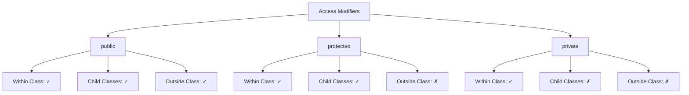

# PHP Access Modifiers

## Introduction

Access modifiers are a fundamental concept in Object-Oriented Programming (OOP) that control the visibility and accessibility of properties and methods within your PHP classes. They are essential for implementing **encapsulation** - one of the four pillars of OOP - which is the practice of hiding the internal state and functionality of an object and only allowing access through a public API.

In PHP, there are three main access modifiers:

- **public** - accessible from anywhere
- **protected** - accessible within the class and its child classes
- **private** - accessible only within the class itself

Understanding access modifiers helps you design more secure and maintainable code by restricting how your class members can be accessed and modified.

## Basic Syntax

Access modifiers are specified before the property or method declaration:

```php
class MyClass {
    public $publicProperty;      // Accessible from anywhere
    protected $protectedProperty; // Accessible within this class and child classes
    private $privateProperty;    // Accessible only within this class
    
    public function publicMethod() {
        // Accessible from anywhere
    }
    
    protected function protectedMethod() {
        // Accessible within this class and child classes
    }
    
    private function privateMethod() {
        // Accessible only within this class
    }
}
```

## Public Access Modifier

The `public` access modifier makes properties and methods accessible from anywhere - inside the class, in child classes, and outside the class.

### Example

```php
<?php
class User {
    public $username;
    
    public function displayUsername() {
        return "Username: " . $this->username;
    }
}

// Create a new user
$user = new User();

// Access public property directly
$user->username = "john_doe";

// Call public method
echo $user->displayUsername();
?>
```

**Output:**
```
Username: john_doe
```

In this example, both the `$username` property and the `displayUsername()` method are public, making them accessible from outside the class.

## Protected Access Modifier

The `protected` access modifier makes properties and methods accessible only within the class itself and any child classes (subclasses) that extend it.

### Example

```php
<?php
class User {
    protected $id;
    
    public function __construct($id) {
        $this->id = $id;
    }
    
    protected function generateSecretCode() {
        return hash('sha256', $this->id . time());
    }
    
    public function getAccessToken() {
        return $this->generateSecretCode();
    }
}

class Admin extends User {
    public function displayAdminSecret() {
        // Can access protected property from parent class
        return "Admin ID: " . $this->id . ", Secret: " . $this->generateSecretCode();
    }
}

// Create a new user
$user = new User(1001);

// This would cause an error - protected property
// echo $user->id;

// This would cause an error - protected method
// echo $user->generateSecretCode();

// This works - public method that uses protected method internally
echo "User token: " . $user->getAccessToken() . "
";

// Create an admin
$admin = new Admin(5001);
echo $admin->displayAdminSecret();
?>
```

**Output:**
```
User token: 3a5d8f24c8bf8976f3db309a5d9cc6f7e42d0d8a4c7982e3f9f5e0a15eb88f1a
Admin ID: 5001, Secret: 7b1e9a3f8c2d6e5b4a7c8d9e0f1a2b3c4d5e6f7a8b9c0d1e2f3a4b5c6d7e8f9
```

In this example:
- The `$id` property and `generateSecretCode()` method are protected
- They cannot be accessed directly from outside the class
- But they can be accessed within the class and in the child `Admin` class

## Private Access Modifier

The `private` access modifier makes properties and methods accessible only within the class in which they are defined. They cannot be accessed from child classes or from outside the class.

### Example

```php
<?php
class BankAccount {
    private $balance;
    private $accountNumber;
    
    public function __construct($accountNumber, $initialBalance) {
        $this->accountNumber = $accountNumber;
        $this->balance = $initialBalance;
    }
    
    private function validateTransaction($amount) {
        return $amount > 0 && $amount <= $this->balance;
    }
    
    public function withdraw($amount) {
        if ($this->validateTransaction($amount)) {
            $this->balance -= $amount;
            return "Withdrew $" . $amount . ". New balance: $" . $this->balance;
        }
        return "Transaction failed: Insufficient funds or invalid amount";
    }
    
    public function getBalance() {
        return "Account #" . substr($this->accountNumber, -4) . ": $" . $this->balance;
    }
}

class SavingsAccount extends BankAccount {
    public function applyInterest($rate) {
        // This would cause an error - cannot access private property from parent
        // $this->balance += $this->balance * $rate;
        
        // Instead, we need to use public methods
        $currentBalance = parent::getBalance();
        return "Cannot directly modify balance. Current " . $currentBalance;
    }
}

// Create a bank account
$account = new BankAccount("1234567890", 1000);

// This would cause an error - private property
// echo $account->balance;

// This would cause an error - private method
// $account->validateTransaction(50);

// These work - public methods
echo $account->getBalance() . "
";
echo $account->withdraw(250) . "
";

// Create a savings account
$savings = new SavingsAccount("0987654321", 5000);
echo $savings->applyInterest(0.05);
?>
```

**Output:**
```
Account #7890: $1000
Withdrew $250. New balance: $750
Cannot directly modify balance. Current Account #4321: $5000
```

In this example:
- The `$balance` and `$accountNumber` properties are private
- The `validateTransaction()` method is private
- None of these can be accessed from outside the class or from child classes
- Even the `SavingsAccount` class cannot directly access the `$balance` property of its parent

## Visual Comparison of Access Modifiers

Here's a diagram showing the visibility scope of each access modifier:



## No Modifier (Default)

If you don't specify an access modifier, PHP will treat the property or method as `public` by default. However, it's considered good practice to always explicitly declare access modifiers for clarity.

```php
<?php
class MyClass {
    $property;       // Implicitly public (not recommended)
    function method() {
        // Implicitly public (not recommended)
    }
}
?>
```

## Practical Applications

### User Profile System

Here's a real-world example of how you might use access modifiers in a user profile system:

```php
<?php
class UserProfile {
    private $userId;
    private $email;
    protected $lastLogin;
    public $displayName;
    
    public function __construct($userId, $email, $displayName) {
        $this->userId = $userId;
        $this->email = $email;
        $this->displayName = $displayName;
        $this->lastLogin = date('Y-m-d H:i:s');
    }
    
    private function validateEmail($email) {
        return filter_var($email, FILTER_VALIDATE_EMAIL);
    }
    
    public function updateEmail($newEmail) {
        if ($this->validateEmail($newEmail)) {
            $this->email = $newEmail;
            return true;
        }
        return false;
    }
    
    public function getEmail() {
        // Return partially hidden email for security
        $parts = explode('@', $this->email);
        $name = substr($parts[0], 0, 2) . str_repeat('*', strlen($parts[0]) - 2);
        return $name . '@' . $parts[1];
    }
    
    protected function updateLastLogin() {
        $this->lastLogin = date('Y-m-d H:i:s');
    }
    
    public function getLastLoginInfo() {
        return "Last login: " . $this->lastLogin;
    }
}

class AdminProfile extends UserProfile {
    public function forceUpdateLogin() {
        // Can access protected method
        $this->updateLastLogin();
        return "Admin updated login time to: " . $this->lastLogin;
    }
    
    // Can't access private properties/methods of parent
    // public function getFullEmail() {
    //     return $this->email;  // This would cause an error
    // }
}

// Create a user profile
$user = new UserProfile(1, "john.doe@example.com", "John");

// Access public property
echo "Display name: " . $user->displayName . "
";

// Use public methods to interact with private property
echo "Email: " . $user->getEmail() . "
";
$user->updateEmail("john.doe.new@example.com");
echo "Updated email: " . $user->getEmail() . "
";

// Get info derived from protected property
echo $user->getLastLoginInfo() . "
";

// Create an admin profile
$admin = new AdminProfile(2, "admin@example.com", "Admin");
echo $admin->forceUpdateLogin();
?>
```

**Output:**
```
Display name: John
Email: jo**@example.com
Updated email: jo**@example.com
Last login: 2023-05-20 14:30:45
Admin updated login time to: 2023-05-20 14:30:45
```

In this example:
- Private properties (`$userId`, `$email`) and methods (`validateEmail()`) are only accessible within the `UserProfile` class
- Protected property (`$lastLogin`) and method (`updateLastLogin()`) are accessible in both `UserProfile` and `AdminProfile` classes
- Public property (`$displayName`) and methods are accessible everywhere

## Benefits of Using Access Modifiers

1. **Encapsulation**: Hide implementation details and expose only what's necessary
2. **Data Protection**: Prevent accidental modification of critical data
3. **Maintainability**: Change internal implementation without affecting external code
4. **Controlled Access**: Provide specific interfaces for interacting with your objects
5. **Flexibility**: Allow child classes to extend functionality without exposing all details

## Common Practices and Patterns

1. **Make properties private or protected**: Always restrict direct access to properties and provide public getter and setter methods when needed.

2. **Use the principle of least privilege**: Start with the most restrictive access modifier (`private`) and only widen access when necessary.

3. **"Getter" and "Setter" pattern**: Use public methods to access and modify private properties.
   
   ```php
   private $name;
   
   public function getName() {
       return $this->name;
   }
   
   public function setName($name) {
       // Validate before setting
       $this->name = trim($name);
   }
   ```

4. **Protected for inheritance**: Use protected when you want child classes to have access.

## Summary

Access modifiers in PHP OOP are powerful tools for implementing encapsulation and controlling the visibility of your class members:

- **public**: Accessible from anywhere
- **protected**: Accessible within the class and its children
- **private**: Accessible only within the defining class

By properly using access modifiers, you can create more robust, maintainable, and secure code. They help you hide implementation details, protect sensitive data, and provide a clean interface for working with your objects.

## Exercises

1. Create a `Product` class with private properties for `price` and `stockLevel`, and public methods to check availability and display formatted price.

2. Extend the `BankAccount` example by creating a `CheckingAccount` class that extends it and implements a `transferTo` method.

3. Modify the `UserProfile` class to include additional private properties like `passwordHash` and `securityQuestion`, with appropriate public methods to update them securely.

## Additional Resources

- [PHP Documentation on Visibility](https://www.php.net/manual/en/language.oop5.visibility.php)
- [Object-Oriented PHP for Beginners](https://www.php.net/manual/en/language.oop5.php)
- [PHP The Right Way - Object-Oriented Programming](https://phptherightway.com/#object-oriented-programming)
- [SOLID Principles in PHP](https://www.digitalocean.com/community/tutorials/solid-principles-php)