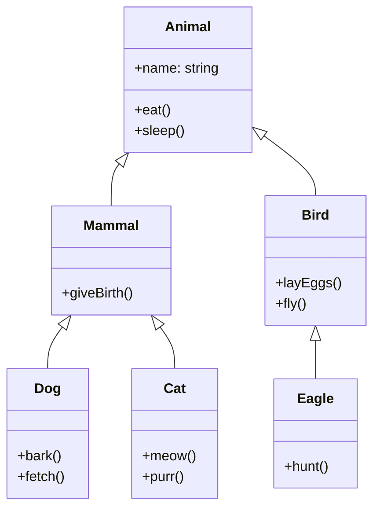

# PHP Inheritance

## Introduction

Inheritance is one of the fundamental concepts in Object-Oriented Programming (OOP) and is a key feature in PHP's OOP implementation. It allows a class (called a child class or subclass) to inherit properties and methods from another class (called a parent class or superclass). This powerful mechanism enables code reuse, promotes hierarchical organization, and helps implement the "is-a" relationship between objects.

In this tutorial, we'll explore PHP inheritance thoroughly, from basic concepts to practical applications, with plenty of examples to help you understand how it works and how to use it effectively in your projects.

## Basic Inheritance Concept

At its core, inheritance establishes a parent-child relationship between classes. When a class inherits from another, it automatically receives all the accessible properties and methods of the parent class.

Let's look at a simple example:

```php
// Parent class
class Animal {
    // Properties
    public $name;
    protected $age;
    
    // Constructor
    public function __construct($name, $age) {
        $this->name = $name;
        $this->age = $age;
    }
    
    // Method
    public function makeSound() {
        return "Some generic animal sound";
    }
    
    public function getInfo() {
        return "This animal is named " . $this->name . " and is " . $this->age . " years old.";
    }
}

// Child class that inherits from Animal
class Dog extends Animal {
    // Override the parent method
    public function makeSound() {
        return "Woof! Woof!";
    }
}

// Creating objects
$genericAnimal = new Animal("Generic Animal", 5);
$dog = new Dog("Buddy", 3);

// Output
echo $genericAnimal->getInfo() . "<br>";
echo "Sound: " . $genericAnimal->makeSound() . "<br><br>";

echo $dog->getInfo() . "<br>";  // This method is inherited from the parent
echo "Sound: " . $dog->makeSound() . "<br>";  // This method is overridden
```

**Output:**
```
This animal is named Generic Animal and is 5 years old.
Sound: Some generic animal sound

This animal is named Buddy and is 3 years old.
Sound: Woof! Woof!
```

In this example:
- We created a parent class `Animal` with properties and methods
- We created a child class `Dog` that inherits from `Animal` using the `extends` keyword
- The `Dog` class inherited the `getInfo()` method and properties from `Animal`
- The `Dog` class overrode the `makeSound()` method to provide its own implementation

## The `extends` Keyword

In PHP, inheritance is implemented using the `extends` keyword. The syntax is straightforward:

```php
class ChildClass extends ParentClass {
    // Child class code
}
```

When you use `extends`, the child class inherits all public and protected properties and methods from the parent class. Private members of the parent class are not accessible directly in the child class.

## Access Modifiers and Inheritance

Understanding access modifiers is crucial for working with inheritance:

1. **public** - Properties and methods are accessible from anywhere, including within the class, in child classes, and from outside the class.
2. **protected** - Properties and methods are accessible within the class and in all child classes, but not from outside.
3. **private** - Properties and methods are only accessible within the class they are defined in, not in child classes or from outside.

Let's see how this works:

```php
class ParentClass {
    public $publicVar = "I'm public";
    protected $protectedVar = "I'm protected";
    private $privateVar = "I'm private";
    
    public function showVars() {
        echo "From ParentClass:<br>";
        echo "Public: " . $this->publicVar . "<br>";
        echo "Protected: " . $this->protectedVar . "<br>";
        echo "Private: " . $this->privateVar . "<br>";
    }
}

class ChildClass extends ParentClass {
    public function accessParentVars() {
        echo "From ChildClass:<br>";
        echo "Public: " . $this->publicVar . "<br>";            // Works
        echo "Protected: " . $this->protectedVar . "<br>";      // Works
        // echo "Private: " . $this->privateVar . "<br>";       // Error! Private variable not accessible
    }
}

$child = new ChildClass();
$child->showVars();    // Inherited method
echo "<br>";
$child->accessParentVars();
```

**Output:**
```
From ParentClass:
Public: I'm public
Protected: I'm protected
Private: I'm private

From ChildClass:
Public: I'm public
Protected: I'm protected
```

## Overriding Methods

Method overriding allows a child class to provide a specific implementation of a method that's already defined in the parent class. To override a method, you simply redefine the method in the child class using the same name and signature.

```php
class Vehicle {
    public function startEngine() {
        return "Engine started generically.";
    }
    
    public function getDescription() {
        return "This is a generic vehicle.";
    }
}

class Car extends Vehicle {
    // Override the parent method
    public function startEngine() {
        return "Car engine started with key.";
    }
    
    // Override the description method
    public function getDescription() {
        return "This is a car, a type of vehicle.";
    }
}

class ElectricCar extends Car {
    // Override the method again
    public function startEngine() {
        return "Electric car started silently with button.";
    }
}

// Create objects
$vehicle = new Vehicle();
$car = new Car();
$electricCar = new ElectricCar();

// Test method overriding
echo $vehicle->startEngine() . "<br>";
echo $car->startEngine() . "<br>";
echo $electricCar->startEngine() . "<br><br>";

echo $vehicle->getDescription() . "<br>";
echo $car->getDescription() . "<br>";
echo $electricCar->getDescription() . "<br>";  // Inherits from Car
```

**Output:**
```
Engine started generically.
Car engine started with key.
Electric car started silently with button.

This is a generic vehicle.
This is a car, a type of vehicle.
This is a car, a type of vehicle.
```

## The `parent::` Keyword

The `parent::` keyword allows you to call the parent class's methods even when you've overridden them. This is useful when you want to extend functionality rather than completely replace it.

```php
class Shape {
    protected $name;
    
    public function __construct($name) {
        $this->name = $name;
    }
    
    public function getArea() {
        return 0; // Default implementation
    }
    
    public function getDescription() {
        return "I am a " . $this->name . " with area: " . $this->getArea();
    }
}

class Circle extends Shape {
    private $radius;
    
    public function __construct($radius) {
        // Call parent constructor
        parent::__construct("Circle");
        $this->radius = $radius;
    }
    
    public function getArea() {
        return pi() * $this->radius * $this->radius;
    }
    
    public function getDescription() {
        // Extend parent method rather than completely replacing it
        return parent::getDescription() . " and radius: " . $this->radius;
    }
}

$circle = new Circle(5);
echo $circle->getDescription();
```

**Output:**
```
I am a Circle with area: 78.539816339745 and radius: 5
```

In this example, the `getDescription()` method in the `Circle` class calls the parent's `getDescription()` method and then adds its own information.

## Inheritance Hierarchies

PHP supports multi-level inheritance, which means a class can extend another class that itself extends a third class, creating an inheritance hierarchy.

Here's a visualization of a simple inheritance hierarchy:



Let's implement this hierarchy:

```php
class Animal {
    protected $name;
    
    public function __construct($name) {
        $this->name = $name;
    }
    
    public function eat() {
        return $this->name . " is eating.";
    }
    
    public function sleep() {
        return $this->name . " is sleeping.";
    }
}

class Mammal extends Animal {
    public function giveBirth() {
        return $this->name . " can give birth to live young.";
    }
}

class Bird extends Animal {
    public function layEggs() {
        return $this->name . " can lay eggs.";
    }
    
    public function fly() {
        return $this->name . " is flying.";
    }
}

class Dog extends Mammal {
    public function bark() {
        return $this->name . " says: Woof!";
    }
    
    public function fetch() {
        return $this->name . " is fetching.";
    }
}

class Cat extends Mammal {
    public function meow() {
        return $this->name . " says: Meow!";
    }
    
    public function purr() {
        return $this->name . " is purring.";
    }
}

class Eagle extends Bird {
    public function hunt() {
        return $this->name . " is hunting from the sky.";
    }
}

// Testing our hierarchy
$dog = new Dog("Rex");
$cat = new Cat("Whiskers");
$eagle = new Eagle("Freedom");

echo $dog->eat() . "<br>";           // From Animal
echo $dog->giveBirth() . "<br>";     // From Mammal
echo $dog->bark() . "<br><br>";      // From Dog

echo $cat->sleep() . "<br>";         // From Animal
echo $cat->giveBirth() . "<br>";     // From Mammal
echo $cat->meow() . "<br><br>";      // From Cat

echo $eagle->eat() . "<br>";         // From Animal
echo $eagle->layEggs() . "<br>";     // From Bird
echo $eagle->fly() . "<br>";         // From Bird
echo $eagle->hunt() . "<br>";        // From Eagle
```

**Output:**
```
Rex is eating.
Rex can give birth to live young.
Rex says: Woof!

Whiskers is sleeping.
Whiskers can give birth to live young.
Whiskers says: Meow!

Freedom is eating.
Freedom can lay eggs.
Freedom is flying.
Freedom is hunting from the sky.
```

This example shows how a class can inherit behaviors from multiple levels in the hierarchy.

## Preventing Inheritance and Method Overriding

Sometimes, you may want to prevent a class from being extended or a method from being overridden. PHP provides two keywords for this purpose: `final` class and `final` method.

### Final Classes

A `final` class cannot be extended:

```php
final class FinalClass {
    public function someMethod() {
        return "This is a method in a final class.";
    }
}

// This would cause an error
// class ChildOfFinalClass extends FinalClass {
//     // Some code
// }
```

### Final Methods

A `final` method cannot be overridden in child classes:

```php
class BaseClass {
    final public function finalMethod() {
        return "This method cannot be overridden.";
    }
    
    public function regularMethod() {
        return "This method can be overridden.";
    }
}

class ChildClass extends BaseClass {
    // This would cause an error
    // public function finalMethod() {
    //     return "Trying to override final method.";
    // }
    
    // This is fine
    public function regularMethod() {
        return "Overridden method.";
    }
}

$child = new ChildClass();
echo $child->finalMethod() . "<br>";
echo $child->regularMethod() . "<br>";
```

**Output:**
```
This method cannot be overridden.
Overridden method.
```

## Practical Example: Building a Product System

Let's apply inheritance to build a practical example of a simple e-commerce product system:

```php
class Product {
    protected $id;
    protected $name;
    protected $price;
    protected $description;
    
    public function __construct($id, $name, $price, $description) {
        $this->id = $id;
        $this->name = $name;
        $this->price = $price;
        $this->description = $description;
    }
    
    public function getDetails() {
        return [
            'id' => $this->id,
            'name' => $this->name,
            'price' => $this->price,
            'description' => $this->description
        ];
    }
    
    public function displaySummary() {
        return "Product: {$this->name}, Price: \${$this->price}";
    }
    
    public function calculateTax($rate = 0.1) {
        return $this->price * $rate;
    }
}

class PhysicalProduct extends Product {
    protected $weight;
    protected $dimensions;
    
    public function __construct($id, $name, $price, $description, $weight, $dimensions) {
        parent::__construct($id, $name, $price, $description);
        $this->weight = $weight;
        $this->dimensions = $dimensions;
    }
    
    public function getDetails() {
        $details = parent::getDetails();
        $details['weight'] = $this->weight;
        $details['dimensions'] = $this->dimensions;
        return $details;
    }
    
    public function calculateShipping($distance) {
        // Basic shipping calculation based on weight and distance
        return $this->weight * 0.1 * $distance;
    }
}

class DigitalProduct extends Product {
    protected $downloadSize;
    protected $format;
    
    public function __construct($id, $name, $price, $description, $downloadSize, $format) {
        parent::__construct($id, $name, $price, $description);
        $this->downloadSize = $downloadSize;
        $this->format = $format;
    }
    
    public function getDetails() {
        $details = parent::getDetails();
        $details['downloadSize'] = $this->downloadSize;
        $details['format'] = $this->format;
        return $details;
    }
    
    public function calculateTax($rate = 0.05) {
        // Many regions have lower tax rates for digital products
        return parent::calculateTax($rate);
    }
    
    public function generateDownloadLink() {
        return "https://example.com/downloads/{$this->id}.{$this->format}";
    }
}

// Create some products
$physicalProduct = new PhysicalProduct(
    101,
    "Wireless Headphones",
    129.99,
    "High-quality wireless headphones with noise cancellation",
    0.3, // kg
    "18 x 15 x 5 cm"
);

$digitalProduct = new DigitalProduct(
    201,
    "Photoshop Tutorial",
    19.99,
    "Complete guide to mastering Photoshop",
    1.2, // GB
    "pdf"
);

// Test our products
echo "<h3>Physical Product</h3>";
echo $physicalProduct->displaySummary() . "<br>";
echo "Tax: $" . number_format($physicalProduct->calculateTax(), 2) . "<br>";
echo "Shipping cost for 100 miles: $" . number_format($physicalProduct->calculateShipping(100), 2) . "<br>";

echo "<h3>Digital Product</h3>";
echo $digitalProduct->displaySummary() . "<br>";
echo "Tax: $" . number_format($digitalProduct->calculateTax(), 2) . "<br>";
echo "Download Link: " . $digitalProduct->generateDownloadLink() . "<br>";

// Displaying full details
echo "<h3>Product Details</h3>";
echo "<pre>";
print_r($physicalProduct->getDetails());
echo "<br>";
print_r($digitalProduct->getDetails());
echo "</pre>";
```

**Output:**
```
Physical Product
Product: Wireless Headphones, Price: $129.99
Tax: $13.00
Shipping cost for 100 miles: $3.00

Digital Product
Product: Photoshop Tutorial, Price: $19.99
Tax: $1.00
Download Link: https://example.com/downloads/201.pdf

Product Details
Array
(
    [id] => 101
    [name] => Wireless Headphones
    [price] => 129.99
    [description] => High-quality wireless headphones with noise cancellation
    [weight] => 0.3
    [dimensions] => 18 x 15 x 5 cm
)

Array
(
    [id] => 201
    [name] => Photoshop Tutorial
    [price] => 19.99
    [description] => Complete guide to mastering Photoshop
    [downloadSize] => 1.2
    [format] => pdf
)
```

This example demonstrates how inheritance allows us to:
- Share common functionality (in the `Product` class)
- Specialize behavior for different product types
- Override methods when needed (like `calculateTax` for digital products)
- Extend parent methods using `parent::` (as in `getDetails`)

## Best Practices for PHP Inheritance

To use inheritance effectively, follow these best practices:

1. **Keep the hierarchy simple**: Deep inheritance hierarchies can be difficult to understand and maintain. Try to limit your inheritance to 2-3 levels when possible.

2. **Use the "is-a" relationship**: A child class should be a specialized version of the parent class. For example, a `Dog` is an `Animal`, a `Car` is a `Vehicle`.

3. **Favor composition over inheritance** when appropriate: Sometimes it's better to use composition (having objects as properties) rather than inheritance.

4. **Don't override methods to do something completely different**: When overriding methods, the new method should fulfill the same contract as the parent method.

5. **Be careful with access modifiers**: Use `protected` instead of `private` for members that might be needed in child classes.

6. **Document your inheritance hierarchy**: Good documentation helps other developers understand your class relationships.

7. **Use `type hints` to enforce inheritance**: You can use type hints to ensure that a function receives objects of a specific class or its subclasses.

```php
function processAnimal(Animal $animal) {
    echo $animal->eat();
}

// This works for any Animal or child of Animal
processAnimal(new Dog("Rover"));
processAnimal(new Cat("Mittens"));
```

## Summary

Inheritance is a powerful mechanism in PHP OOP that enables:
- Code reuse by inheriting properties and methods from parent classes
- Method overriding to provide specialized behavior in child classes
- Creating hierarchical relationships between classes
- Building extensible and maintainable code

In this tutorial, we've covered:
- Basic inheritance concepts and syntax using the `extends` keyword
- Access modifiers and their effect on inheritance
- Method overriding and the `parent::` keyword
- Multi-level inheritance hierarchies
- Final classes and methods to prevent inheritance
- A practical example of inheritance in a product system
- Best practices for using inheritance effectively

## Exercises

To practice your understanding of PHP inheritance, try these exercises:

1. Create a `Person` class with basic attributes like name, age, and address. Then create `Student` and `Teacher` classes that inherit from `Person` and add specific attributes and methods.

2. Implement a `Shape` hierarchy with a base `Shape` class and derived classes like `Rectangle`, `Circle`, and `Triangle`. Each shape should have methods for calculating area and perimeter.

3. Build a banking system with a base `BankAccount` class and specialized accounts like `SavingsAccount` and `CheckingAccount` with different interest calculations and fees.

4. Create a `Vehicle` hierarchy for a transportation app, with classes for different vehicle types that inherit common properties but have specialized behaviors.

5. Extend the product system from our practical example to include additional product types and functionalities.

## Additional Resources

To further enhance your understanding of PHP inheritance, check out these resources:

1. [PHP Official Documentation on Inheritance](https://www.php.net/manual/en/language.oop5.inheritance.php)
2. [PHP Object-Oriented Programming Concepts](https://www.phptutorial.net/php-oop/)
3. [Design Patterns in PHP](https://refactoring.guru/design-patterns/php)
4. [SOLID Principles in PHP](https://www.digitalocean.com/community/tutorials/solid-principles-in-php-examples)

Remember that inheritance is just one aspect of OOP. To become proficient in PHP OOP, also study other concepts like encapsulation, polymorphism, interfaces, and traits.